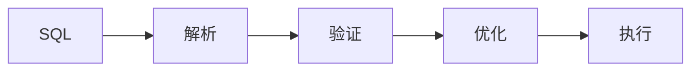

# SQL/Table API 2.4 演进 特性跟踪

> 所属阶段: Flink/api-evolution | 前置依赖: [Table API][^1] | 形式化等级: L3

## 1. 概念定义 (Definitions)

### Def-F-SQL24-01: SQL Statement
SQL语句：
$$
\text{SQL} : \text{Table} \to \text{Table}'
$$

### Def-F-SQL24-02: Table Function
表函数：
$$
\text{TableFunc} : \text{Row} \to \text{Table}
$$

## 2. 属性推导 (Properties)

### Prop-F-SQL24-01: SQL Equivalence
SQL等价性：
$$
\text{FlinkSQL} \subseteq \text{ANSI SQL:2023}
$$

## 3. 关系建立 (Relations)

### SQL 2.4改进

| 特性 | 描述 | 状态 |
|------|------|------|
| MATCH_RECOGNIZE | 模式匹配 | GA |
| JSON函数 | JSON处理 | GA |
| 窗口函数 | 增强 | GA |
| 时态表 | 系统版本 | GA |

## 4. 论证过程 (Argumentation)

### 4.1 SQL优化

```sql
-- MATCH_RECOGNIZE示例
SELECT *
FROM orders
MATCH_RECOGNIZE (
    PARTITION BY user_id
    ORDER BY order_time
    MEASURES
        A.order_id AS start_order,
        LAST(B.order_id) AS end_order
    PATTERN (A B+)
    DEFINE
        A AS A.amount > 100,
        B AS B.amount > A.amount
);
```

## 5. 形式证明 / 工程论证

### 5.1 JSON函数

```sql
SELECT 
    JSON_VALUE(data, '$.user.name') AS user_name,
    JSON_QUERY(data, '$.items[*]') AS items,
    JSON_OBJECT('id' VALUE id, 'name' VALUE name) AS json_output
FROM events;
```

## 6. 实例验证 (Examples)

### 6.1 时态表JOIN

```sql
SELECT o.order_id, o.amount, c.currency_rate
FROM orders AS o
JOIN currency_rates FOR SYSTEM_TIME AS OF o.order_time AS c
ON o.currency = c.currency;
```

## 7. 可视化 (Visualizations)



## 8. 引用参考 (References)

[^1]: Flink Table API Documentation

---

## 跟踪信息

| 属性 | 值 |
|------|-----|
| 目标版本 | Flink 2.4 |
| 当前状态 | GA |
