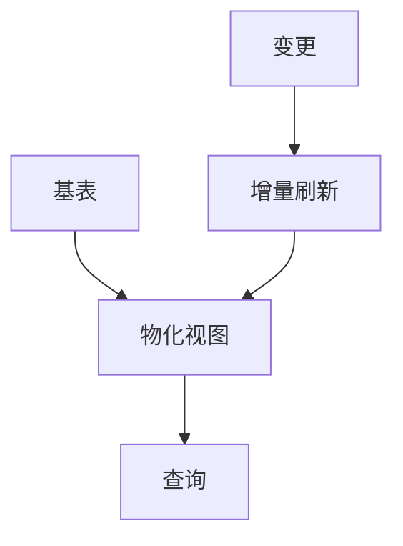

# SQL/Table API 2.5 演进 特性跟踪

> 所属阶段: Flink/api-evolution | 前置依赖: [SQL 2.4][^1] | 形式化等级: L3

## 1. 概念定义 (Definitions)

### Def-F-SQL25-01: Adaptive SQL
自适应SQL：
$$
\text{AdaptiveSQL} : \text{Query} \times \text{Stats} \to \text{OptimalPlan}
$$

### Def-F-SQL25-02: Materialized View
物化视图：
$$
\text{MatView} = \text{Query}_{\text{definition}} + \text{Result}_{\text{materialized}}
$$

## 2. 属性推导 (Properties)

### Prop-F-SQL25-01: View Freshness
视图新鲜度：
$$
\text{Freshness} = t_{\text{now}} - t_{\text{last_update}}
$$

## 3. 关系建立 (Relations)

### SQL 2.5改进

| 特性 | 描述 | 状态 |
|------|------|------|
| 物化视图 | 增量刷新 | GA |
| 自适应查询 | 运行时优化 | GA |
| 增强Hint | 优化器提示 | GA |
| 多语句事务 | BEGIN/COMMIT | GA |

## 4. 论证过程 (Argumentation)

### 4.1 物化视图

```sql
CREATE MATERIALIZED VIEW daily_sales AS
SELECT 
    DATE(order_time) AS order_date,
    SUM(amount) AS total_sales
FROM orders
GROUP BY DATE(order_time);

-- 自动增量刷新
ALTER MATERIALIZED VIEW daily_sales 
REFRESH WITH WATERMARK;
```

## 5. 形式证明 / 工程论证

### 5.1 自适应查询

```sql
-- 自适应查询优化
SET 'sql.optimizer.adaptive' = 'true';

SELECT * FROM large_table
JOIN small_table ON ...;
-- 自动选择Broadcast Join
```

## 6. 实例验证 (Examples)

### 6.1 物化视图刷新

```sql
-- 创建物化视图
CREATE MATERIALIZED VIEW mv_orders AS
SELECT user_id, COUNT(*) AS order_count
FROM orders
GROUP BY user_id;

-- 查询物化视图
SELECT * FROM mv_orders WHERE order_count > 10;
```

## 7. 可视化 (Visualizations)



## 8. 引用参考 (References)

[^1]: Flink Table API Documentation

---

## 跟踪信息

| 属性 | 值 |
|------|-----|
| 目标版本 | Flink 2.5 |
| 当前状态 | GA |
