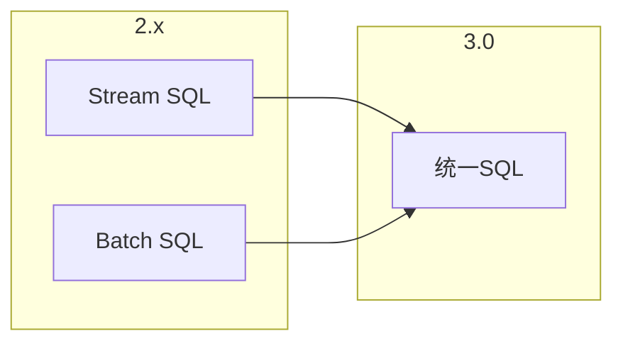

# SQL/Table API 3.0 演进 特性跟踪

> 所属阶段: Flink/api-evolution | 前置依赖: [SQL 2.5][^1] | 形式化等级: L4

## 1. 概念定义 (Definitions)

### Def-F-SQL30-01: Unified SQL
统一SQL：
$$
\text{UnifiedSQL} : \text{SameSyntax}_{\text{stream}} = \text{SameSyntax}_{\text{batch}}
$$

### Def-F-SQL30-02: Streaming SQL Extension
流式SQL扩展：
$$
\text{StreamingExt} = \{\text{EMIT}, \text{WATERMARK}, \text{INCLUDE}\}
$$

## 2. 属性推导 (Properties)

### Prop-F-SQL30-01: Semantic Compatibility
语义兼容性：
$$
\text{SQL}_{3.0} \supseteq \text{SQL}_{2.x}
$$

## 3. 关系建立 (Relations)

### SQL 3.0变革

| 特性 | 2.5 | 3.0 | 变更 |
|------|-----|-----|------|
| 流批语法 | 差异 | 统一 | 重构 |
| 扩展SQL | 部分 | 完整 | 增强 |
| 存储过程 | 无 | 支持 | 新增 |
| AI集成 | 外部 | 内置 | 新增 |

## 4. 论证过程 (Argumentation)

### 4.1 统一SQL语法

```sql
-- 3.0统一语法
SELECT user_id, COUNT(*) AS cnt
FROM orders
GROUP BY user_id
EMIT WITH WATERMARK;  -- 流式语义

-- 批处理模式自动推断
SELECT user_id, COUNT(*) AS cnt
FROM orders  -- 有界输入
GROUP BY user_id;  -- 批处理执行
```

## 5. 形式证明 / 工程论证

### 5.1 流批统一

```java
// 3.0统一编译器
public class UnifiedSQLCompiler {
    
    public ExecutionPlan compile(String sql, TableEnvironment env) {
        SqlNode ast = parser.parse(sql);
        
        // 检测输入边界
        Boundedness boundedness = analyzeBoundedness(ast, env);
        
        // 统一优化
        RelNode logicalPlan = optimizer.optimize(ast);
        
        // 根据边界选择物理计划
        if (boundedness == Boundedness.BOUNDED) {
            return batchPlanner.convert(logicalPlan);
        } else {
            return streamPlanner.convert(logicalPlan);
        }
    }
}
```

## 6. 实例验证 (Examples)

### 6.1 AI增强SQL

```sql
-- AI预测查询
SELECT 
    user_id,
    amount,
    AI_PREDICT('fraud-model', features) AS fraud_score
FROM transactions
WHERE fraud_score > 0.8;
```

## 7. 可视化 (Visualizations)



## 8. 引用参考 (References)

[^1]: Flink Table API Documentation

---

## 跟踪信息

| 属性 | 值 |
|------|-----|
| 目标版本 | Flink 3.0 |
| 当前状态 | 设计中 |
