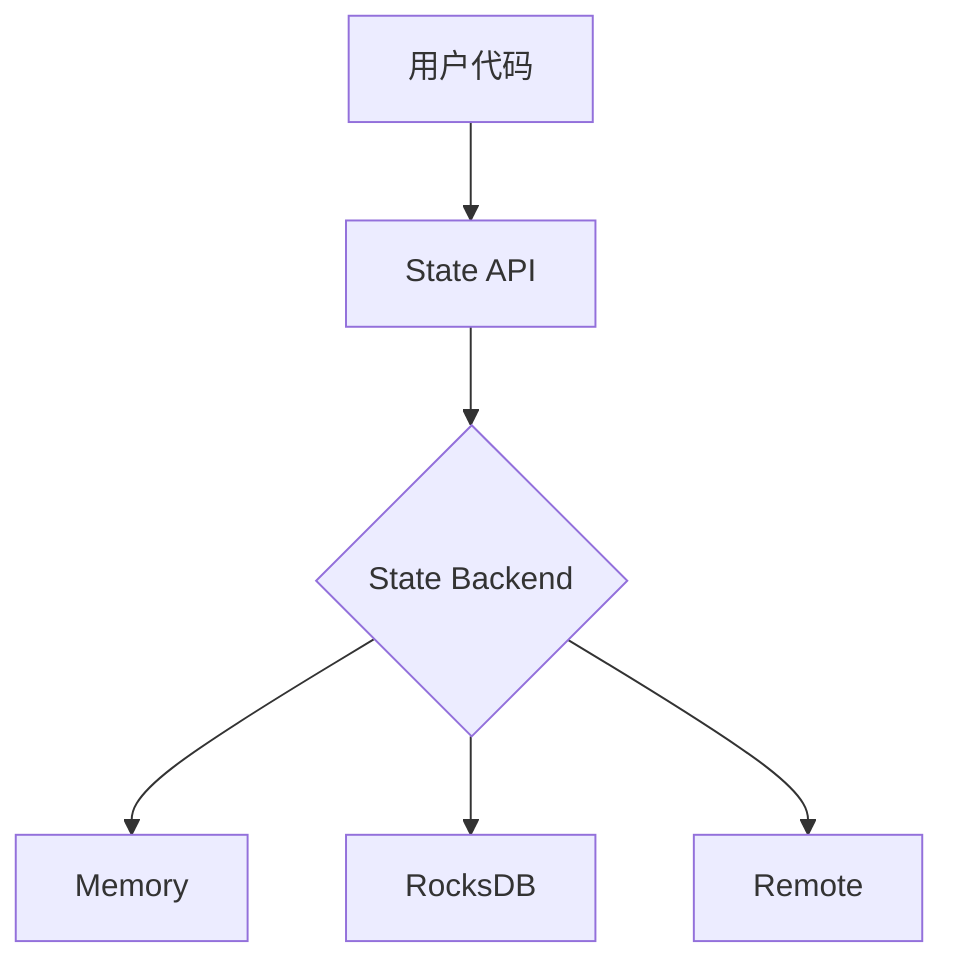

# State API 演进 特性跟踪

> 所属阶段: Flink/api-evolution | 前置依赖: [State API][^1] | 形式化等级: L3

## 1. 概念定义 (Definitions)

### Def-F-State-01: State Types
状态类型集合：
$$
\text{StateTypes} = \{\text{Value}, \text{List}, \text{Map}, \text{Reducing}, \text{Aggregating}\}
$$

### Def-F-State-02: State TTL
状态生存时间：
$$
\text{TTL} : \text{State} \times \text{Duration} \to \text{Expired} | \text{Valid}
$$

## 2. 属性推导 (Properties)

### Prop-F-State-01: State Consistency
状态一致性：
$$
\text{Checkpoint} \implies \text{ExactlyOnce}(\text{State})
$$

## 3. 关系建立 (Relations)

### State API演进

| 版本 | 特性 | 状态 |
|------|------|------|
| 2.3 | 基础State | GA |
| 2.4 | TTL增强 | GA |
| 2.5 | 异步State | GA |
| 3.0 | State服务 | 设计中 |

## 4. 论证过程 (Argumentation)

### 4.1 State层次

```
┌─────────────────────────────────────────┐
│            User State API               │
├─────────────────────────────────────────┤
│       State Backend Abstraction         │
├─────────────────────────────────────────┤
│    RocksDB / Memory / Remote Storage    │
└─────────────────────────────────────────┘
```

## 5. 形式证明 / 工程论证

### 5.1 异步State访问

```java
public class AsyncStateAccess {
    
    public CompletableFuture<ValueState<T>> getStateAsync(StateDescriptor<T> descriptor) {
        return stateBackend.getStateAsync(descriptor);
    }
}
```

## 6. 实例验证 (Examples)

### 6.1 TTL配置

```java
StateTtlConfig ttlConfig = StateTtlConfig
    .newBuilder(Time.hours(24))
    .setUpdateType(OnCreateAndWrite)
    .cleanupIncrementally(10, true)
    .build();
```

## 7. 可视化 (Visualizations)



## 8. 引用参考 (References)

[^1]: Flink State API Documentation

---

## 跟踪信息

| 属性 | 值 |
|------|-----|
| 版本 | 2.4-3.0 |
| 当前状态 | 演进中 |
