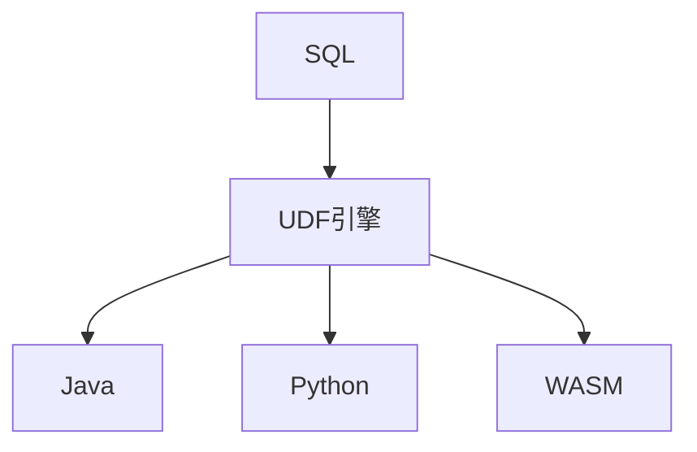

# UDF SQL 演进 特性跟踪

> 所属阶段: Flink/api-evolution | 前置依赖: [User-Defined Functions][^1] | 形式化等级: L3

## 1. 概念定义 (Definitions)

### Def-F-UDF-01: UDF Types
UDF类型：
$$
\text{UDFs} = \{\text{Scalar}, \text{Table}, \text{Aggregate}, \text{Async}\}
$$

### Def-F-UDF-02: WASM UDF
WASM UDF：
$$
\text{WASM-UDF} : \text{Input} \xrightarrow{\text{WASM}} \text{Output}
$$

## 2. 属性推导 (Properties)

### Prop-F-UDF-01: Execution Isolation
执行隔离：
$$
\text{UDF}_i \perp \text{UDF}_j
$$

## 3. 关系建立 (Relations)

### UDF演进

| 版本 | 特性 | 状态 |
|------|------|------|
| 2.4 | Java/Scala UDF | GA |
| 2.4 | Python UDF | GA |
| 2.5 | WASM UDF | GA |
| 3.0 | 多语言原生 | 设计中 |

## 4. 论证过程 (Argumentation)

### 4.1 UDF类型

| 类型 | 描述 |
|------|------|
| Scalar | 标量函数，1:1映射 |
| Table | 表函数，1:N映射 |
| Aggregate | 聚合函数，N:1映射 |
| Async | 异步函数 |

## 5. 形式证明 / 工程论证

### 5.1 WASM UDF

```sql
CREATE FUNCTION my_upper AS 'wasm'
USING 'file:///udf.wasm'
WITH ('function' = 'to_upper');

SELECT my_upper(name) FROM users;
```

## 6. 实例验证 (Examples)

### 6.1 Java UDF

```java
public class MyUdf extends ScalarFunction {
    public String eval(String input) {
        return input.toUpperCase();
    }
}

// 注册
env.createTemporaryFunction("my_upper", MyUdf.class);
```

## 7. 可视化 (Visualizations)



## 8. 引用参考 (References)

[^1]: Flink UDF Documentation

---

## 跟踪信息

| 属性 | 值 |
|------|-----|
| 版本 | 2.4-3.0 |
| 当前状态 | 演进中 |
