# Window API 演进 特性跟踪

> 所属阶段: Flink/api-evolution | 前置依赖: [Window API][^1] | 形式化等级: L3

## 1. 概念定义 (Definitions)

### Def-F-Win-01: Window Types

窗口类型：
$$
\text{Windows} = \{\text{Tumbling}, \text{Sliding}, \text{Session}, \text{Global}, \text{Custom}\}
$$

### Def-F-Win-02: Window Trigger

窗口触发器：
$$
\text{Trigger} : \text{Event} \to \{\text{FIRE}, \text{CONTINUE}, \text{PURGE}\}
$$

## 2. 属性推导 (Properties)

### Prop-F-Win-01: Window Completeness

窗口完整性：
$$
\forall w \in \text{Windows} : \text{Watermark} > \text{End}(w) \implies \text{Fired}(w)
$$

## 3. 关系建立 (Relations)

### Window API演进

| 版本 | 特性 | 状态 |
|------|------|------|
| 2.3 | 基础窗口 | GA |
| 2.4 | 增量聚合 | GA |
| 2.5 | 窗口优化 | GA |
| 3.0 | 动态窗口 | 设计中 |

## 4. 论证过程 (Argumentation)

### 4.1 窗口类型选择

| 场景 | 推荐窗口 |
|------|----------|
| 固定统计 | Tumbling |
| 重叠统计 | Sliding |
| 活动检测 | Session |
| 全局统计 | Global |

## 5. 形式证明 / 工程论证

### 5.1 增量聚合

```java
window
    .aggregate(
        new AggregateFunction<..., Acc, Result>() {
            public Acc createAccumulator() { ... }
            public Acc add(Event value, Acc accumulator) { ... }
            public Result getResult(Acc accumulator) { ... }
            public Acc merge(Acc a, Acc b) { ... }
        }
    );
```

## 6. 实例验证 (Examples)

### 6.1 Session窗口

```java
stream
    .keyBy(Event::getUserId)
    .window(EventTimeSessionWindows.withDynamicGap(
        (Event element) -> Time.minutes(element.getActivityDuration())
    ))
    .aggregate(new CountAggregate());
```

## 7. 可视化 (Visualizations)

```mermaid
gantt
    title 窗口类型时间线
    dateFormat X
    axisFormat %s

    section Tumbling
    Window1 : 0, 5
    Window2 : 5, 10
    Window3 : 10, 15

    section Sliding
    Window1 : 0, 5
    Window2 : 2, 7
    Window3 : 4, 9
```



## 8. 引用参考 (References)

[^1]: Flink Window Documentation

---

## 跟踪信息

| 属性 | 值 |
|------|-----|
| 版本 | 2.4-3.0 |
| 当前状态 | 演进中 |
