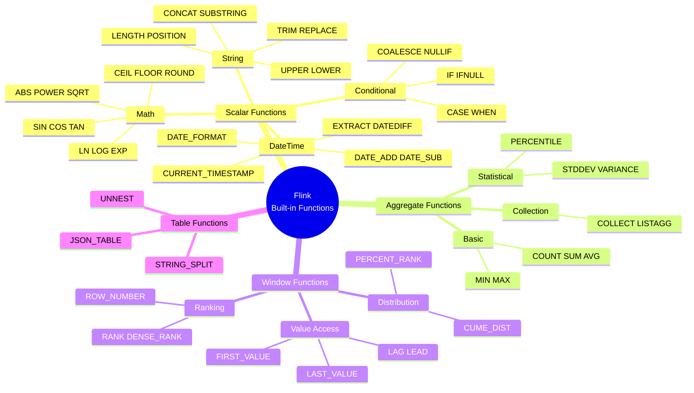
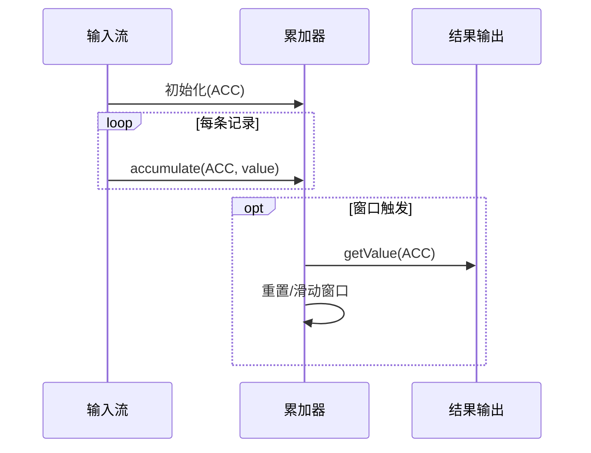

# Flink Built-in Functions 完整参考

> 所属阶段: Flink | 前置依赖: [data-types-complete-reference.md](./data-types-complete-reference.md) | 形式化等级: L4

---

## 1. 概念定义 (Definitions)

### Def-F-Func-01: 内置函数体系

**定义**: Flink SQL 内置函数体系是 SQL 标准函数在流计算环境下的形式化实现：

$$
\mathcal{F} = (F_{scalar}, F_{agg}, F_{window}, F_{table}, \Sigma, \Delta)
$$

其中：

- $F_{scalar}$: 标量函数集合（1:1 行转换）
- $F_{agg}$: 聚合函数集合（N:1 行聚合）
- $F_{window}$: 窗口函数集合（窗口内计算）
- $F_{table}$: 表函数集合（1:N 行展开）
- $\Sigma$: 函数签名 $\sigma: f \mapsto (domain, codomain)$
- $\Delta$: 确定性标记（确定性/非确定性）

### Def-F-Func-02: 标量函数

**定义**: 标量函数将单行输入映射为单行输出：

$$
\forall f \in F_{scalar}: f: Row \rightarrow Value
$$

**分类**：

| 类别 | 数量 | 示例 |
|------|------|------|
| 数学函数 | 25+ | ABS, POWER, LN, LOG, EXP, SIN, COS |
| 字符串函数 | 30+ | CONCAT, SUBSTRING, TRIM, REPLACE, UPPER |
| 日期时间函数 | 20+ | CURRENT_DATE, DATE_FORMAT, EXTRACT, DATEDIFF |
| 条件函数 | 10+ | COALESCE, NULLIF, CASE, IF |
| 类型转换函数 | 15+ | CAST, TRY_CAST, TYPEOF |

### Def-F-Func-03: 聚合函数

**定义**: 聚合函数将多行输入聚合为单一值：

$$
\forall g \in F_{agg}: g: \{Row\} \rightarrow Value
$$

**核心聚合函数**：

| 函数 | 语义 | 是否支持增量计算 |
|------|------|------------------|
| COUNT(*) | 计数 | ✅ 是 |
| SUM(expr) | 求和 | ✅ 是 |
| AVG(expr) | 平均值 | ✅ 是 |
| MIN/MAX(expr) | 最值 | ⚠️ 部分支持 |
| STDDEV(expr) | 标准差 | ❌ 否 |
| COLLECT(expr) | 收集为数组 | ❌ 否 |

### Def-F-Func-04: 窗口函数

**定义**: 窗口函数在窗口分区上执行计算，不改变行数：

$$
\forall w \in F_{window}: w: (Row, Window) \rightarrow Value
$$

**窗口函数分类**：

| 类别 | 函数 | 语义 |
|------|------|------|
| 排序函数 | ROW_NUMBER() | 当前行在分区内的唯一序号 |
| 排序函数 | RANK() | 考虑并列的排序排名 |
| 排序函数 | DENSE_RANK() | 无间隔的密集排名 |
| 分布函数 | PERCENT_RANK() | 当前行的相对排名百分比 |
| 分布函数 | CUME_DIST() | 累积分布 |
| 取值函数 | FIRST_VALUE(expr) | 窗口内第一个值 |
| 取值函数 | LAST_VALUE(expr) | 窗口内最后一个值 |
| 取值函数 | LAG(expr, n) | 向前偏移 n 行的值 |
| 取值函数 | LEAD(expr, n) | 向后偏移 n 行的值 |

---

## 2. 属性推导 (Properties)

### Lemma-F-Func-01: 函数确定性分类

**引理**: 内置函数按确定性分为三类：

$$
\Delta(f) = \begin{cases}
\text{DETERMINISTIC} & \text{if } f(x) = f(x) \text{ 恒成立} \\
\text{NON-DETERMINISTIC} & \text{if } f(x) \text{ 可能变化} \\
\text{DYNAMIC} & \text{if } f(x) \text{ 依赖上下文}
\end{cases}
$$

**分类示例**：

| 确定性 | 函数示例 | 说明 |
|--------|----------|------|
| 确定性 | ABS, UPPER, CONCAT | 相同输入必产生相同输出 |
| 非确定性 | RAND(), CURRENT_TIMESTAMP | 每次调用可能产生不同结果 |
| 动态 | SESSION_USER, CURRENT_DATABASE | 依赖执行上下文 |

### Lemma-F-Func-02: 空值传播规则

**引理**: 大多数内置函数遵循 **NULL 输入 → NULL 输出** 原则：

$$
f(\text{NULL}) = \text{NULL}, \quad \forall f \in F_{scalar} \setminus F_{null\_handling}
$$

**例外函数**（显式处理 NULL）：

- `COALESCE(a, b, ...)` - 返回第一个非 NULL 值
- `NULLIF(a, b)` - 若 a=b 返回 NULL，否则返回 a
- `IFNULL(a, b)` - 若 a 为 NULL 返回 b
- `IS NULL` / `IS NOT NULL` - NULL 判断

### Prop-F-Func-01: 类型推导完备性

**命题**: 类型系统可推导出任意合法函数表达式的结果类型。

```
输入类型 → 类型检查 → 隐式转换 → 函数执行 → 输出类型
    ↑___________________________|
          (类型兼容性验证)
```

---

## 3. 关系建立 (Relations)

### 3.1 SQL 标准兼容性

| 标准来源 | 覆盖度 | 说明 |
|---------|-------|------|
| ANSI SQL-92 | 95% | 核心函数完全兼容 |
| ANSI SQL:2016 | 80% | JSON 函数部分兼容 |
| Apache Calcite | 100% | 基于 Calcite SQL 解析 |
| 扩展函数 | - | Flink 特有函数 |

### 3.2 函数依赖与优化

```mermaid
graph TB
    A[SQL 查询] --> B[函数解析]
    B --> C[类型检查]
    C --> D[函数选择]
    D --> E[标量函数]
    D --> F[聚合函数]
    D --> G[窗口函数]
    E --> H[Codegen 优化]
    F --> I[聚合状态管理]
    G --> J[窗口状态管理]
    H --> K[执行引擎]
    I --> K
    J --> K
```



### 3.3 流批函数语义一致性

| 函数 | 流模式语义 | 批模式语义 | 一致性 |
|------|-----------|-----------|--------|
| COUNT | 持续累加 | 全局计数 | ✅ 一致 |
| SUM | 增量更新 | 全局求和 | ✅ 一致 |
| RANK | 窗口内排名 | 全局排名 | ⚠️ 需窗口限定 |
| LAG | 流内前序 | 排序后前序 | ✅ 一致 |

---

## 4. 论证过程 (Argumentation)

### 4.1 TRY_CAST 设计决策

**问题**: 为什么需要 `TRY_CAST`？

**论证**:

- **问题**: `CAST` 在转换失败时抛出异常，中断查询执行
- **方案**: `TRY_CAST` 返回 NULL 而非异常
- **权衡**: 性能略低（需要异常捕获），但提升容错性

**使用场景对比**：

```sql
-- 严格模式:失败即报错
SELECT CAST('invalid' AS INT);  -- 抛出异常

-- 容错模式:失败返回 NULL
SELECT TRY_CAST('invalid' AS INT);  -- 返回 NULL
```

### 4.2 窗口函数 vs 分组聚合

| 特性 | 分组聚合 | 窗口函数 |
|------|----------|----------|
| 输出行数 | ≤ 输入行数 | = 输入行数 |
| 语义 | 数据压缩 | 附加计算列 |
| 使用位置 | SELECT + GROUP BY | SELECT 子句 |
| 典型应用 | 统计汇总 | 排名、趋势分析 |

---

## 5. 形式证明 / 工程论证 (Proof / Engineering Argument)

### Thm-F-Func-01: 聚合函数增量计算正确性

**定理**: 支持增量计算的聚合函数在流处理中的结果与批处理一致。

**证明**（以 SUM 为例）：

1. **批处理**: $SUM_{batch} = \sum_{i=1}^{n} x_i$
2. **流处理增量**: $SUM_{stream} = \sum_{k} \Delta_k$，其中 $\Delta_k$ 是微批次增量
3. **等价性**: $\sum_{i=1}^{n} x_i = \sum_{k} \sum_{i \in batch_k} x_i$

### Thm-F-Func-02: 窗口函数计算复杂度

**定理**: 排序类窗口函数的时间复杂度为 $O(n \log n)$，取值类为 $O(n)$。

**工程优化策略**：

- **排序类**: 使用高效排序算法，维护分区有序结构
- **取值类**: 使用环形缓冲区维护窗口边界
- **增量更新**: 窗口滑动时复用计算结果

---

## 6. 实例验证 (Examples)

### 6.1 数学函数示例

```sql
-- 数学函数使用
SELECT
    order_id,
    amount,
    ABS(amount) AS abs_amount,
    ROUND(amount, 2) AS rounded,
    POWER(amount, 2) AS squared,
    SQRT(ABS(amount)) AS root,
    LN(amount + 1) AS log_natural,
    MOD(order_id, 100) AS bucket
FROM orders;
```

### 6.2 字符串函数示例

```sql
-- 字符串处理
SELECT
    email,
    UPPER(email) AS email_upper,
    LOWER(SUBSTRING(email, 1, POSITION('@' IN email) - 1)) AS username,
    TRIM(BOTH ' ' FROM email) AS trimmed,
    REPLACE(email, '@', '[at]') AS obfuscated,
    CONCAT(first_name, ' ', last_name) AS full_name,
    LENGTH(email) AS email_length
FROM users;
```

### 6.3 日期时间函数示例

```sql
-- 日期时间处理
SELECT
    event_time,
    CURRENT_DATE AS today,
    DATE_FORMAT(event_time, 'yyyy-MM-dd HH:mm:ss') AS formatted,
    EXTRACT(YEAR FROM event_time) AS year,
    EXTRACT(MONTH FROM event_time) AS month,
    DATEDIFF(CURRENT_DATE, DATE(event_time)) AS days_ago,
    DATE_ADD(DATE(event_time), 7) AS next_week,
    TIMESTAMPADD(HOUR, 8, event_time) AS beijing_time
FROM events;
```

### 6.4 聚合函数示例

```sql
-- 聚合分析
SELECT
    category,
    COUNT(*) AS total_orders,
    COUNT(DISTINCT user_id) AS unique_users,
    SUM(amount) AS total_amount,
    AVG(amount) AS avg_amount,
    MIN(amount) AS min_amount,
    MAX(amount) AS max_amount,
    STDDEV(amount) AS std_amount,
    PERCENTILE(amount, 0.95) AS p95_amount
FROM orders
GROUP BY category;
```

### 6.5 窗口函数示例

```sql
-- 窗口分析
SELECT
    user_id,
    order_time,
    amount,

    -- 排序函数
    ROW_NUMBER() OVER (ORDER BY amount DESC) AS row_num,
    RANK() OVER (ORDER BY amount DESC) AS rank_num,
    DENSE_RANK() OVER (ORDER BY amount DESC) AS dense_rank,

    -- 分区排序
    ROW_NUMBER() OVER (PARTITION BY user_id ORDER BY order_time) AS user_order_seq,

    -- 取值函数
    FIRST_VALUE(amount) OVER (PARTITION BY user_id ORDER BY order_time) AS first_order,
    LAST_VALUE(amount) OVER (PARTITION BY user_id ORDER BY order_time) AS last_order,
    LAG(amount, 1, 0) OVER (PARTITION BY user_id ORDER BY order_time) AS prev_order,
    LEAD(amount, 1, 0) OVER (PARTITION BY user_id ORDER BY order_time) AS next_order,

    -- 分布函数
    PERCENT_RANK() OVER (ORDER BY amount) AS pct_rank,
    CUME_DIST() OVER (ORDER BY amount) AS cum_dist
FROM orders;
```

### 6.6 条件与空值处理

```sql
-- 条件表达式
SELECT
    user_id,
    amount,

    -- CASE 表达式
    CASE
        WHEN amount < 100 THEN 'small'
        WHEN amount < 1000 THEN 'medium'
        ELSE 'large'
    END AS order_size,

    -- 简化条件
    IF(amount > 1000, 'VIP', 'Regular') AS customer_type,

    -- 空值处理
    COALESCE(phone, email, 'N/A') AS contact,
    NULLIF(status, 'deleted') AS active_status,
    IFNULL(discount, 0) AS final_discount
FROM orders;
```

---

## 7. 可视化 (Visualizations)

### 7.1 函数分类层次图



### 7.2 聚合计算流程



---

## 8. 引用参考 (References)
