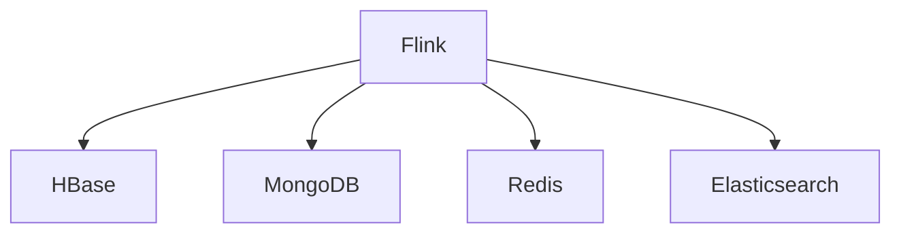

# NoSQL连接器演进 特性跟踪

> 所属阶段: Flink/connectors/evolution | 前置依赖: [NoSQL Connectors][^1] | 形式化等级: L3

## 1. 概念定义 (Definitions)

### Def-F-Conn-NoSQL-01: Key-Value Store
键值存储：
$$
\text{KVStore} : \text{Key} \to \text{Value}
$$

### Def-F-Conn-NoSQL-02: Document Store
文档存储：
$$
\text{DocStore} : \text{ID} \to \text{Document}
$$

## 2. 属性推导 (Properties)

### Prop-F-Conn-NoSQL-01: Lookup Join
Lookup Join：
$$
\text{Stream} \bowtie_{\text{key}} \text{NoSQL} \to \text{Enriched}
$$

## 3. 关系建立 (Relations)

### NoSQL演进

| 版本 | 特性 | 状态 |
|------|------|------|
| 2.3 | HBase | GA |
| 2.4 | MongoDB CDC | GA |
| 2.4 | Redis | GA |
| 2.5 | Cassandra增强 | GA |
| 3.0 | 统一NoSQL API | 设计中 |

## 4. 论证过程 (Argumentation)

### 4.1 支持的数据库

| 数据库 | Source | Sink | Lookup |
|--------|--------|------|--------|
| HBase | ✅ | ✅ | ✅ |
| MongoDB | ✅(CDC) | ✅ | ✅ |
| Redis | - | ✅ | ✅ |
| Cassandra | ✅ | ✅ | ✅ |
| Elasticsearch | ✅ | ✅ | ✅ |

## 5. 形式证明 / 工程论证

### 5.1 HBase Sink

```java
HBaseSinkFunction<Row> sink = new HBaseSinkFunction<>(
    "table-name",
    HBaseConfiguration.create(),
    new RowMutationConverter(),
    1000 // batch size
);
```

## 6. 实例验证 (Examples)

### 6.1 MongoDB CDC

```java
MongoDBSource<String> source = MongoDBSource.<String>builder()
    .setUri("mongodb://localhost:27017")
    .setDatabase("inventory")
    .setCollection("products")
    .setDeserializationSchema(new JsonDeserializationSchema())
    .build();
```

## 7. 可视化 (Visualizations)



## 8. 引用参考 (References)

[^1]: Flink NoSQL Connector Documentation

---

## 跟踪信息

| 属性 | 值 |
|------|-----|
| 版本 | 2.4-3.0 |
| 当前状态 | 演进中 |
