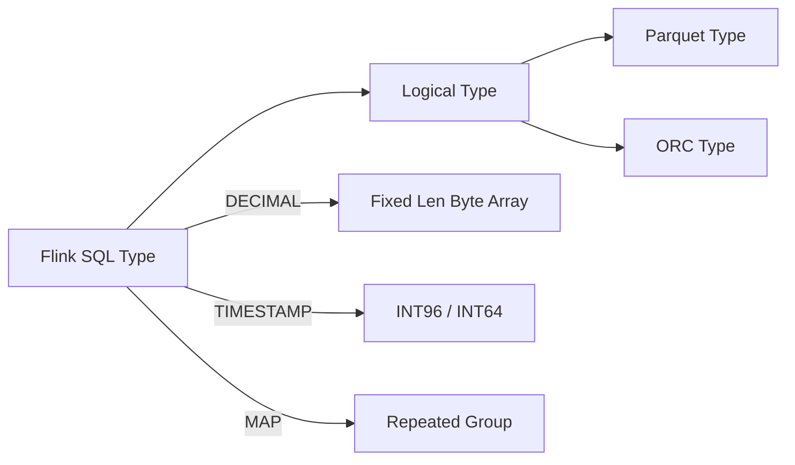
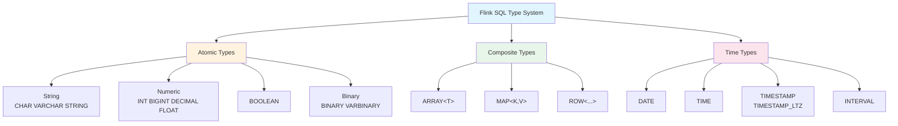
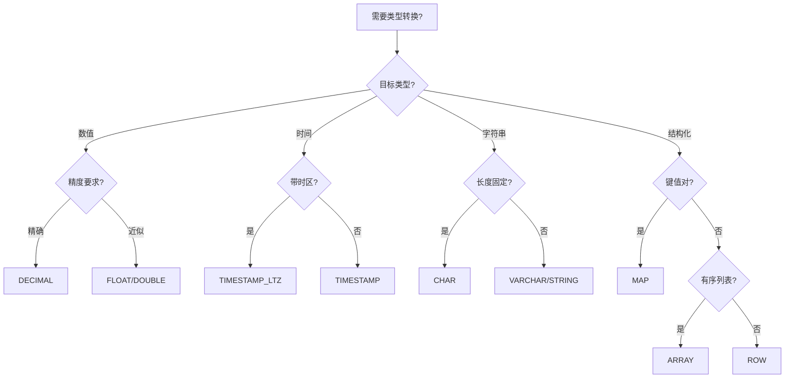

# Flink Data Types 完整参考

> 所属阶段: Flink | 前置依赖: [Flink/00-QUICK-START.md](00-meta/00-QUICK-START.md) | 形式化等级: L4

---

## 1. 概念定义 (Definitions)

### Def-F-DataType-01: 数据类型系统

**定义**: Flink SQL 数据类型系统是类型理论在流计算领域的工程实现，定义为五元组：

$$
\mathcal{T}_{Flink} = (T_{atomic}, T_{composite}, T_{time}, \prec, \Sigma)
$$

其中：

- $T_{atomic}$: 原子类型集合（不可再分的基础类型）
- $T_{composite}$: 复合类型集合（可嵌套的结构化类型）
- $T_{time}$: 时间类型集合（流计算特化的时间相关类型）
- $\prec$: 类型偏序关系（隐式转换方向）
- $\Sigma$: 类型签名映射（操作符到类型约束的映射）

### Def-F-DataType-02: 原子类型

**定义**: 原子类型是不可再分的数据类型，其值在语义上被视为单一单元：

$$
T_{atomic} = \{STRING, BOOLEAN, NUMERIC, BINARY\}
$$

| 类别 | 类型 | 存储范围 | 物理表示 |
|------|------|----------|----------|
| 字符串 | CHAR(n), VARCHAR(n), STRING | 1~2³¹-1 字节 | UTF-8 编码 |
| 布尔 | BOOLEAN | {true, false} | 1 字节 |
| 数值 | TINYINT, SMALLINT, INT, BIGINT | 有符号整数 | 1/2/4/8 字节 |
| 数值 | DECIMAL(p,s), FLOAT, DOUBLE | 浮点/定点数 | 变长/4/8 字节 |
| 二进制 | BINARY(n), VARBINARY(n), BYTES | 原始字节序列 | 定长/变长 |

### Def-F-DataType-03: 复合类型

**定义**: 复合类型是由其他类型组合而成的结构化类型：

$$
\begin{aligned}
ARRAY\langle T \rangle &= \{ [e_1, e_2, ..., e_n] \mid e_i \in T \} \\
MAP\langle K, V \rangle &= \{ (k_i, v_i) \mid k_i \in K \land v_i \in V \} \\
ROW\langle f_1:T_1, ..., f_n:T_n \rangle &= \{ (f_1:v_1, ..., f_n:v_n) \mid v_i \in T_i \}
\end{aligned}
$$

### Def-F-DataType-04: 时间类型

**定义**: Flink 时间类型是流计算场景特化的时间表示：

$$
T_{time} = \{ DATE, TIME, TIMESTAMP, TIMESTAMP_LTZ, INTERVAL \}
$$

**语义区分**：

| 类型 | 语义 | 时区处理 | 典型应用场景 |
|------|------|----------|--------------|
| TIMESTAMP | 本地时间戳 | 无时区信息 | 业务事件发生时间 |
| TIMESTAMP_LTZ | 带时区时间戳 | UTC 内部存储 | 跨时区数据同步 |
| DATE | 日历日期 | 无时区 | 日级别分区 |
| TIME | 日内时间 | 无时区 | 时段分析 |
| INTERVAL | 时间跨度 | - | 窗口计算 |

---

## 2. 属性推导 (Properties)

### Lemma-F-DataType-01: 类型完备性

**引理**: Flink SQL 类型系统对标准 SQL 数据模型是类型完备的。

**证明要点**:

1. **原子类型覆盖**: 所有标准 SQL 原子类型均有对应实现
2. **复合类型封闭性**: 复合类型可递归嵌套，形成代数数据类型
3. **空值处理**: 所有类型均支持 NULL 值，满足三值逻辑

### Lemma-F-DataType-02: 类型转换单调性

**引理**: 类型转换关系 $\prec$ 构成偏序集，满足：

$$
\forall T_1, T_2, T_3 \in \mathcal{T}: T_1 \prec T_2 \land T_2 \prec T_3 \Rightarrow T_1 \prec T_3
$$

**隐式转换链**:

```
TINYINT → SMALLINT → INT → BIGINT → DECIMAL → DOUBLE
CHAR → VARCHAR → STRING
DATE → TIMESTAMP → TIMESTAMP_LTZ
```

### Prop-F-DataType-01: 类型安全保证

**命题**: 在编译期可检测所有类型不匹配错误。

$$
\forall Q \in SQL: \text{TypeCheck}(Q) = \bot \Rightarrow \nexists E: \text{Execute}(Q, E) \neq \text{Error}
$$

---

## 3. 关系建立 (Relations)

### 3.1 SQL 标准类型映射

| ANSI SQL 类型 | Flink SQL 类型 | 兼容性 |
|---------------|----------------|--------|
| CHARACTER(n) | CHAR(n) | ✅ 完全兼容 |
| CHARACTER VARYING(n) | VARCHAR(n) | ✅ 完全兼容 |
| INTEGER | INT | ✅ 完全兼容 |
| DECIMAL(p,s) | DECIMAL(p,s) | ✅ 完全兼容 |
| TIMESTAMP WITH TIME ZONE | TIMESTAMP_LTZ | ⚠️ 语义等价，名称不同 |

### 3.2 Java/Scala 物理类型映射

| Flink SQL 类型 | Java 类型 | Scala 类型 | 序列化器 |
|----------------|-----------|------------|----------|
| STRING | java.lang.String | String | StringSerializer |
| INT | java.lang.Integer | Int | IntSerializer |
| BIGINT | java.lang.Long | Long | LongSerializer |
| DECIMAL(p,s) | java.math.BigDecimal | BigDecimal | BigDecSerializer |
| TIMESTAMP(3) | java.time.LocalDateTime | LocalDateTime | LocalDateTimeSerializer |

### 3.3 Parquet/ORC 格式映射



---

## 4. 论证过程 (Argumentation)

### 4.1 DECIMAL 精度设计决策

**问题**: 为什么选择 DECIMAL 而非 FLOAT 作为精确数值计算类型？

**论证**:

- **浮点误差**: FLOAT/DOUBLE 采用 IEEE 754 表示，存在精度损失
- **金融场景**: 货币计算要求精确到分，DECIMAL(19,4) 可满足
- **性能权衡**: DECIMAL 计算慢于 FLOAT，但正确性优先

### 4.2 TIMESTAMP vs TIMESTAMP_LTZ 选择

**决策矩阵**:

| 场景 | 推荐类型 | 理由 |
|------|----------|------|
| 单时区应用 | TIMESTAMP | 简单直观，无时区概念负担 |
| 多时区应用 | TIMESTAMP_LTZ | 统一 UTC 存储，前端本地化显示 |
| 与 Kafka 集成 | TIMESTAMP_LTZ | Kafka 使用 UTC epoch millis |

---

## 5. 形式证明 / 工程论证 (Proof / Engineering Argument)

### Thm-F-DataType-01: 类型一致性保证

**定理**: 在 Exactly-Once 语义下，Checkpoint 恢复后的类型状态与故障前一致。

**证明**:

1. **序列化一致性**: TypeSerializer 保证值到字节的映射是双射
2. **快照原子性**: Checkpoint 屏障确保类型状态的原子持久化
3. **恢复同构**: 反序列化是序列化的逆操作，类型信息完整保留

### Thm-F-DataType-02: 类型推断完备性

**定理**: 对于任意合法的 Flink SQL 查询，类型推断算法可计算出结果模式。

**工程论证**:

```
输入: 抽象语法树 AST(Q)
输出: 结果类型 Schema(Q)

1. 叶子节点类型 = 表元数据 || 字面量类型
2. 一元操作类型 = TypeRule(op, input_type)
3. 二元操作类型 = Coalesce(TypeRule(op, left, right))
4. 聚合类型 = Combine(partial_types)
5. 返回根节点类型
```

---

## 6. 实例验证 (Examples)

### 6.1 DDL 类型定义示例

```sql
-- 创建包含完整类型系统的表
CREATE TABLE user_events (
    -- 原子类型
    user_id BIGINT,
    username VARCHAR(128),
    is_active BOOLEAN,
    score DECIMAL(10, 2),
    avatar BINARY(1024),

    -- 时间类型
    birth_date DATE,
    login_time TIME,
    event_ts TIMESTAMP(3),
    event_ts_utc TIMESTAMP_LTZ(3),

    -- 复合类型
    tags ARRAY<STRING>,
    properties MAP<STRING, STRING>,
    address ROW<
        street STRING,
        city STRING,
        zipcode STRING,
        coordinates ROW<lat DOUBLE, lon DOUBLE>
    >,

    -- 水位线定义
    WATERMARK FOR event_ts AS event_ts - INTERVAL '5' SECOND
) WITH (
    'connector' = 'kafka',
    'topic' = 'user-events',
    'format' = 'json'
);
```

### 6.2 类型转换示例

```sql
-- 隐式转换（自动）
SELECT
    user_id + 1.5 AS user_id_double,  -- BIGINT → DOUBLE
    CONCAT('ID:', CAST(user_id AS STRING)) AS user_id_str
FROM user_events;

-- 显式转换（CAST）
SELECT
    CAST(event_ts AS DATE) AS event_date,
    CAST(score AS INT) AS score_int,  -- 截断小数
    TRY_CAST(username AS INT) AS username_maybe  -- 失败返回 NULL
FROM user_events;
```

### 6.3 Java API 类型使用

```java
import org.apache.flink.table.api.DataTypes;
import org.apache.flink.table.api.Schema;

// 编程方式定义 Schema
Schema schema = Schema.newBuilder()
    .column("user_id", DataTypes.BIGINT().notNull())
    .column("username", DataTypes.VARCHAR(128))
    .column("tags", DataTypes.ARRAY(DataTypes.STRING()))
    .column("address", DataTypes.ROW(
        DataTypes.FIELD("street", DataTypes.STRING()),
        DataTypes.FIELD("city", DataTypes.STRING())
    ))
    .columnByExpression("event_ts", "PROCTIME()")
    .build();
```

---

## 7. 可视化 (Visualizations)

### 7.1 类型系统层次图



### 7.2 类型转换决策树



---

## 8. 引用参考 (References)
