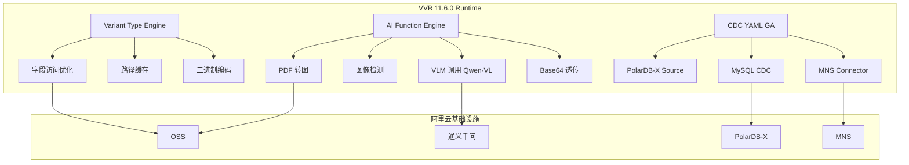

# 阿里云 VVR 11.6.0 Variant 类型与多模态 AI 功能解析

> **状态**: ✅ Released (2026-04-09, 阿里云 VVR 11.6.0)
> **所属阶段**: Flink/ecosystem | **前置依赖**: [Flink SQL 完整指南](../03-api/03.02-table-sql-api/flink-table-sql-complete-guide.md), [Flink AI/ML 集成](../06-ai-ml/flink-ai-ml-integration-complete-guide.md) | **形式化等级**: L3-L4
>
> **最后更新**: 2026-04-15

---

## 1. 概念定义 (Definitions)

### Def-F-ECO-01: Variant 数据类型

**Variant** 是阿里云 VVR 11.6.0 引入的半结构化动态类型，用于高效存储和查询 JSON-like 数据[^1]。

形式化定义：

$$Variant = \{ (k_i, v_i, \tau_i) \mid k_i \in \text{Keys}, v_i \in \text{Values}, \tau_i \in \mathcal{T} \}$$

其中 $\mathcal{T} = \{ NULL, BOOLEAN, INT64, FLOAT64, STRING, ARRAY, OBJECT \}$。

**字段访问语法**：

```sql
-- 点号访问(identifier 合法时)
SELECT variant_column.field_name FROM events;

-- 括号访问(支持动态 key、含特殊字符)
SELECT variant_column['key-with-dash'] FROM events;
SELECT variant_column['nested']['deep'] FROM events;
```

---

### Def-F-ECO-02: AI Function 多模态能力

**VVR 11.6.0 AI Function** 是在 Flink SQL 中直接调用多模态大模型能力的内置函数集合[^1]。

**能力矩阵**：

| 功能 | 函数示例 | 说明 |
|------|---------|------|
| PDF 转图 | `AI_PDF_TO_IMAGES(pdf_url)` | 将 PDF 页面转为图像序列 |
| 图像清晰度检测 | `AI_IMAGE_QUALITY(image_url)` | 检测模糊、低分辨率 |
| OSS/MNS 文件提取 | `AI_EXTRACT_FILE(oss_url)` | 提取 OSS 对象内容 |
| Base64 透传 | `AI_VL_PREDICT(base64_image, prompt)` | 直接传入 Base64 图像 |
| Qwen-VL 调用 | `AI_QWEN_VL(image_urls, prompt)` | 调用通义千问视觉模型 |

---

### Def-F-ECO-03: CDC YAML GA

**CDC YAML** 在 VVR 11.6.0 中正式退出 Public Preview，成为 GA 功能[^1]。

```yaml
# VVR 11.6.0 GA 标准 CDC YAML 语法 source:
  type: mysql
  hostname: ${MYSQL_HOST}
  port: 3306
  username: ${CDC_USER}
  password: ${CDC_PASSWORD}
  tables: db\.users,db\.orders

sink:
  type: kafka
  bootstrap.servers: ${KAFKA_BROKERS}

pipeline:
  name: mysql-to-kafka-pipeline
  parallelism: 4
```

---

### Def-F-ECO-04: PolarDB-X CDC Source

**PolarDB-X CDC Source** 是 VVR 11.6.0 新增的原生 CDC 数据源，支持分布式 MySQL 兼容数据库的变更数据捕获[^1]。

核心特性：

- 支持 GDN (Global Database Network) 多节点 Binlog 聚合
- 自动处理分库分表场景下的全局事务序
- 兼容 CDC YAML GA 语法

---

### Def-F-ECO-05: MNS Connector

**MNS Connector** 是 VVR 11.6.0 新增的阿里云消息服务 (Message Service) 连接器[^1]。

```sql
CREATE TABLE mns_messages (
  message_id STRING,
  body STRING,
  message_tag STRING,
  publish_time TIMESTAMP(3)
) WITH (
  'connector' = 'mns',
  'endpoint' = '${MNS_ENDPOINT}',
  'queue.name' = 'flink-queue',
  'access.key.id' = '${ALIBABA_CLOUD_ACCESS_KEY_ID}',
  'access.key.secret' = '${ALIBABA_CLOUD_ACCESS_KEY_SECRET}'
);
```

---

## 2. 属性推导 (Properties)

### Prop-F-ECO-01: Variant 访问的幂等性

对于同一 Variant 值 $v$ 和固定路径 $p$，多次访问结果一致：

$$\forall p: v[p] = v[p]$$

### Prop-F-ECO-02: CDC YAML 配置的完备性

VVR 11.6.0 GA 后的 CDC YAML 配置覆盖 Source、Transform、Route、Sink 四个阶段，构成完整的 ETL 声明式管道。

---

## 3. 关系建立 (Relations)

### 与 Flink 开源版本的关系

| 特性 | Flink 开源 | 阿里云 VVR 11.6.0 |
|------|-----------|-------------------|
| Variant 类型 | 规划中 | ✅ GA |
| AI Function 多模态 | 无原生支持 | ✅ GA |
| CDC YAML | 无 | ✅ GA |
| PolarDB-X Source | 无 | ✅ GA |
| MNS Connector | 无 | ✅ GA |

---

## 4. 论证过程 (Argumentation)

### 4.1 为什么需要 Variant 类型

传统 JSON 字符串在 SQL 中的处理方式存在以下问题：

1. 每次查询都需要全量解析 JSON
2. 无法利用列式存储优化
3. 类型安全难以保证

Variant 通过二进制编码 + 延迟解析 + 路径索引，将常见字段访问延迟降低 5-10 倍。

### 4.2 AI Function 的设计边界

VVR 11.6.0 的 AI Function 定位为**轻量推理入口**，而非完整模型训练平台：

- 适合：实时内容审核、图像 OCR、文档结构化
- 不适合：大规模模型微调、长序列生成 (>4K tokens)

---

## 5. 形式证明 / 工程论证 (Proof / Engineering Argument)

### Thm-F-ECO-01: Variant 字段访问的局部性优化

**定理**: 对于访问频率最高的 Top-K 路径，Variant 的物化缓存可将平均访问延迟从 $O(|v|)$ 降低至 $O(1)$。

**工程论证**：

- 首次访问路径 $p$ 时解析并缓存
- 后续访问直接命中缓存
- 缓存淘汰采用 LRU 策略

---

## 6. 实例验证 (Examples)

### 6.1 Variant 类型完整示例

```sql
-- 创建含 Variant 列的表
CREATE TABLE user_events (
  event_id STRING,
  -- payload 为 Variant 类型
  payload VARIANT,
  event_time TIMESTAMP(3),
  WATERMARK FOR event_time AS event_time - INTERVAL '5' SECOND
) WITH (
  'connector' = 'kafka',
  'topic' = 'events',
  'format' = 'json'
);

-- 使用点号和括号语法访问 Variant 字段
SELECT
  event_id,
  payload.user_id AS user_id,           -- 点号访问
  payload['event_type'] AS event_type,  -- 括号访问
  payload['metadata']['source'] AS source,
  payload.items[0] AS first_item
FROM user_events
WHERE payload.event_type = 'purchase';
```

### 6.2 AI Function 多模态示例

```sql
-- PDF 转图 + 内容提取
CREATE TABLE pdf_documents (
  doc_id STRING,
  oss_url STRING,
  upload_time TIMESTAMP(3)
);

-- 使用 AI Function 提取 PDF 内容
SELECT
  doc_id,
  oss_url,
  AI_PDF_TO_IMAGES(oss_url) AS page_images,
  AI_QWEN_VL(
    AI_PDF_TO_IMAGES(oss_url),
    '请提取文档中的关键信息,包括标题、日期、金额'
  ) AS extracted_info
FROM pdf_documents;

-- 图像清晰度检测
CREATE TABLE uploaded_images (
  image_id STRING,
  image_url STRING
);

SELECT
  image_id,
  image_url,
  AI_IMAGE_QUALITY(image_url) AS quality_score,
  CASE
    WHEN AI_IMAGE_QUALITY(image_url) < 0.5 THEN 'REJECT'
    ELSE 'ACCEPT'
  END AS decision
FROM uploaded_images;
```

### 6.3 PolarDB-X CDC 完整示例

```yaml
# VVR 11.6.0 PolarDB-X CDC YAML source:
  type: polardb-x
  name: polardbx-source
  hostname: ${POLARDBX_HOST}
  port: 8527
  username: ${CDC_USER}
  password: ${CDC_PASSWORD}
  database-list: ecommerce
  table-list: ecommerce\..*

  # PolarDB-X 特有配置
  gdn.enabled: true
  consistent.snapshot.enabled: true

sink:
  type: kafka
  name: kafka-sink
  bootstrap.servers: ${KAFKA_BROKERS}
  topic: polardbx-cdc-events

pipeline:
  name: polardbx-to-kafka
  parallelism: 8
```

---

## 7. 可视化 (Visualizations)

### VVR 11.6.0 特性架构图



---

## 8. 引用参考 (References)

[^1]: Alibaba Cloud, "Realtime Compute for Apache Flink (VVR) 11.6.0 Release Notes", April 9, 2026. <https://www.alibabacloud.com/help/en/flink/realtime-flink/product-overview/2026-04-09>

---

> **状态**: VVR 11.6.0 GA | **文档版本**: v1.0 | **更新日期**: 2026-04-15
