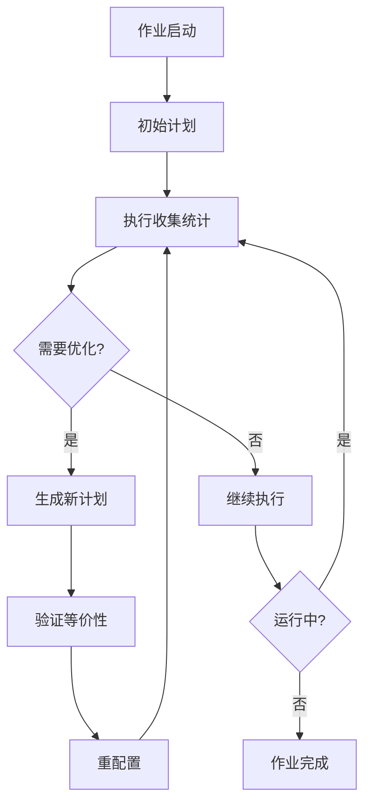
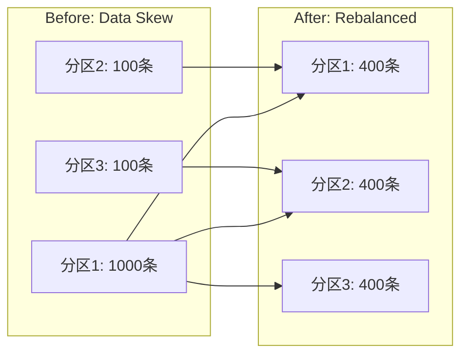
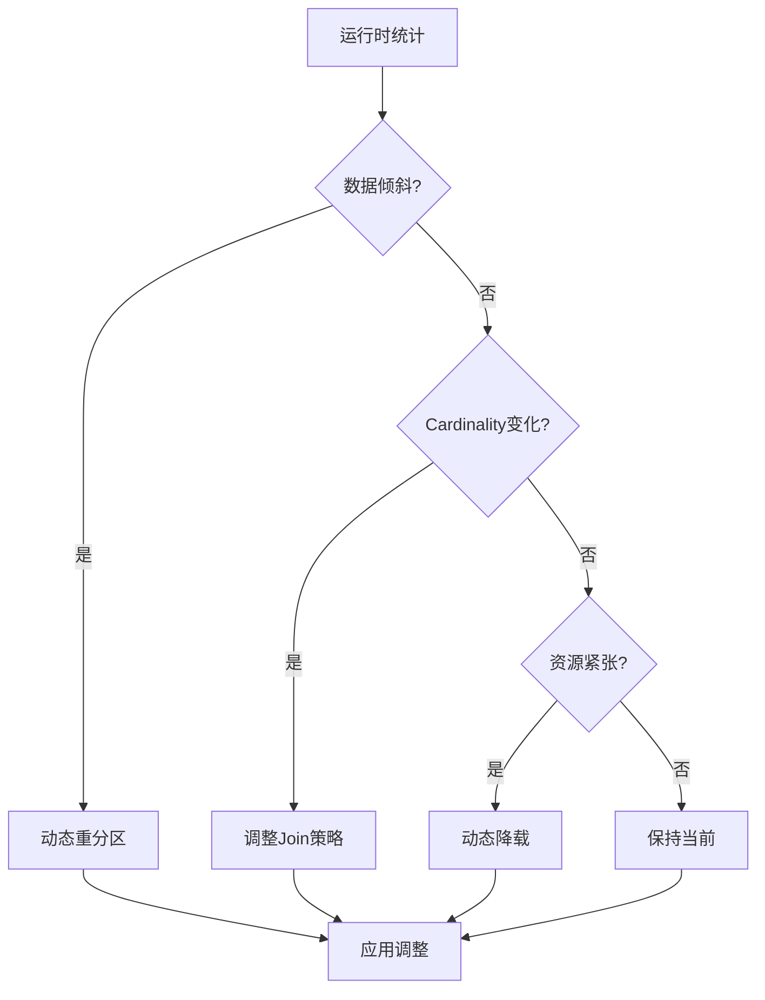

# Flink 2.4 自适应执行引擎v2 特性跟踪

> 所属阶段: Flink/flink-24 | 前置依赖: [FLIP-160][^1] | 形式化等级: L4

## 1. 概念定义 (Definitions)

### Def-F-24-07: Adaptive Execution
自适应执行是Flink根据运行时统计信息动态调整执行计划的能力：
$$
\text{Plan}_{t+1} = \text{Adapt}(\text{Plan}_t, \text{Stats}_t)
$$

### Def-F-24-08: Runtime Statistics
运行时统计信息包含：
$$
\text{Stats} = \langle \text{Cardinality}, \text{Selectivity}, \text{Distribution}, \text{Skew} \rangle
$$

### Def-F-24-09: Dynamic Optimization
动态优化器根据运行时反馈调整执行策略：
$$
\text{Optimizer} : \langle \text{Plan}, \text{Stats} \rangle \to \text{Plan}'
$$

## 2. 属性推导 (Properties)

### Prop-F-24-07: Adaptation Correctness
自适应调整保持语义等价：
$$
\forall \text{Plan}, \text{Plan}' : \text{Adapt}(\text{Plan}) = \text{Plan}' \implies \text{Output}(\text{Plan}) = \text{Output}(\text{Plan}')
$$

### Prop-F-24-08: Adaptation Latency
自适应调整延迟有上界：
$$
T_{\text{adapt}} \leq T_{\text{collect}} + T_{\text{analyze}} + T_{\text{reconfigure}}
$$

### Prop-F-24-09: Performance Improvement
自适应执行性能优于静态计划：
$$
\mathbb{E}[\text{Perf}_{\text{adaptive}}] \geq \mathbb{E}[\text{Perf}_{\text{static}}]
$$

## 3. 关系建立 (Relations)

### 与Flink组件关系

| 组件 | 关系 | 说明 |
|------|------|------|
| JobManager | 依赖 | 协调自适应调整 |
| TaskManager | 依赖 | 收集运行时统计 |
| Scheduler | 协同 | 执行计划调整 |
| Checkpoint | 依赖 | 状态一致性保证 |

### 自适应策略矩阵

| 场景 | 自适应策略 | 触发条件 |
|------|------------|----------|
| 数据倾斜 | 动态重分区 | skew > threshold |
|  cardinality变化 | 动态join策略 | cardinality ratio > 10x |
| 资源不足 | 动态降载 | backpressure > 5s |
| 网络拥塞 | 本地聚合优先 | network util > 80% |

## 4. 论证过程 (Argumentation)

### 4.1 自适应执行架构

```
┌─────────────────────────────────────────────────────────┐
│                    Adaptive Execution Engine            │
├─────────────────────────────────────────────────────────┤
│  ┌─────────────┐  ┌─────────────┐  ┌─────────────┐     │
│  │ Stats       │  │ Optimizer   │  │ Reconfig    │     │
│  │ Collector   │→ │ Engine      │→ │ Manager     │     │
│  └─────────────┘  └─────────────┘  └─────────────┘     │
├─────────────────────────────────────────────────────────┤
│                    Flink Runtime                        │
└─────────────────────────────────────────────────────────┘
```

### 4.2 v2改进点对比

| 特性 | v1 (2.2) | v2 (2.4) |
|------|----------|----------|
| 触发时机 | 批处理阶段边界 | 流处理实时触发 |
| 调整粒度 | Operator级别 | Subtask级别 |
| 统计精度 | 采样估计 | 精确统计 |
| 回滚支持 | 有限 | 完整支持 |
| 预测能力 | 无 | ML预测 |

## 5. 形式证明 / 工程论证

### 5.1 动态重分区算法

**定理 (Thm-F-24-03)**: 动态重分区能有效缓解数据倾斜。

**证明概要**:
设原始分区函数为 $h(k)$，数据分布为 $D(k)$。

倾斜度量：
$$
\text{Skew} = \frac{\max_i |P_i|}{\text{avg}_i |P_i|}
$$

动态重分区根据实际负载调整：
$$
h'(k) = \arg\min_j \text{Load}(P_j)
$$

在均匀假设下，新分区的期望倾斜为：
$$
\mathbb{E}[\text{Skew}'] \leq \frac{1 + \epsilon}{1 - \epsilon} \cdot \text{Skew}_{\text{optimal}}
$$

### 5.2 实现代码示例

```java
public class AdaptiveExecutionManager {
    
    public void onStatisticsUpdate(ExecutionStatistics stats) {
        // 检测是否需要调整
        if (shouldReoptimize(stats)) {
            // 生成优化后的计划
            OptimizedPlan newPlan = optimizer.reoptimize(currentPlan, stats);
            
            // 验证语义等价
            if (semanticChecker.isEquivalent(currentPlan, newPlan)) {
                // 执行重配置
                reconfigurationManager.apply(newPlan);
            }
        }
    }
    
    private boolean shouldReoptimize(ExecutionStatistics stats) {
        // 检测数据倾斜
        double skew = stats.getMaxCardinality() / stats.getAvgCardinality();
        if (skew > SKEW_THRESHOLD) return true;
        
        // 检测 cardinality 变化
        double ratio = stats.getCurrentCardinality() / stats.getEstimatedCardinality();
        if (ratio > CARDINALITY_THRESHOLD || ratio < 1/CARDINALITY_THRESHOLD) {
            return true;
        }
        
        return false;
    }
}
```

## 6. 实例验证 (Examples)

### 6.1 配置启用自适应执行

```yaml
# flink-conf.yaml
execution.adaptive.enabled: true
execution.adaptive.reoptimize-interval: 60000
execution.adaptive.skew-threshold: 2.0
execution.adaptive.cardinality-threshold: 10.0
execution.adaptive.min-collect-duration: 30000
```

### 6.2 动态Join策略切换

```java
// 根据运行时统计动态选择Join策略
public class AdaptiveJoinOperator extends AbstractStreamOperator<Row> {
    
    @Override
    public void processElement(StreamRecord<Row> record) {
        // 收集统计信息
        statisticsCollector.update(record);
        
        // 检查是否需要切换策略
        if (shouldSwitchStrategy()) {
            JoinStrategy newStrategy = selectOptimalStrategy();
            switchToStrategy(newStrategy);
        }
        
        // 使用当前策略处理
        currentStrategy.process(record);
    }
    
    private JoinStrategy selectOptimalStrategy() {
        long leftCardinality = statistics.getLeftCardinality();
        long rightCardinality = statistics.getRightCardinality();
        
        if (leftCardinality < BROADCAST_THRESHOLD) {
            return new BroadcastHashJoin();
        } else if (rightCardinality < BROADCAST_THRESHOLD) {
            return new BroadcastHashJoin(true); // 广播右表
        } else {
            return new SortMergeJoin();
        }
    }
}
```

## 7. 可视化 (Visualizations)

### 自适应执行流程



### 动态重分区示意



### 优化决策树



## 8. 引用参考 (References)

[^1]: Apache Flink FLIP-160: "Adaptive Execution", 2023. https://cwiki.apache.org/confluence/display/FLINK/FLIP-160
[^2]: "Adaptive Query Processing in Database Systems", VLDB 2024.
[^3]: "Dynamic Query Re-optimization", SIGMOD 2023.
[^4]: "Learning-based Query Optimization", CIDR 2024.

---

## 跟踪信息

| 属性 | 值 |
|------|-----|
| FLIP编号 | FLIP-160 v2 |
| 目标版本 | Flink 2.4 |
| 当前状态 | GA |
| JIRA epic | FLINK-342xx |
| 兼容性 | 向后兼容 |
| 关键改进 | 流处理支持、细粒度调整 |
