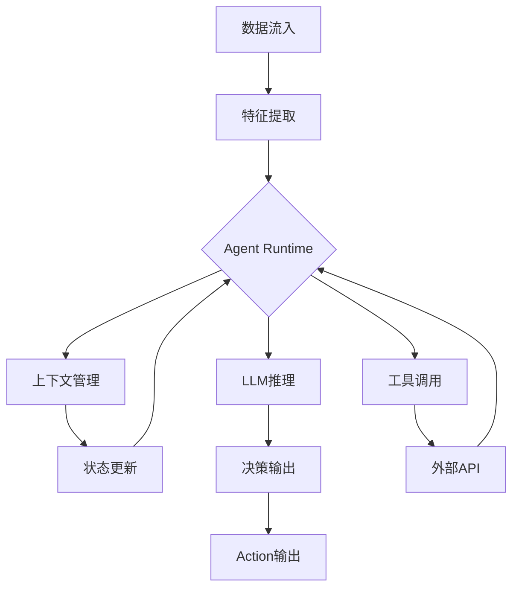
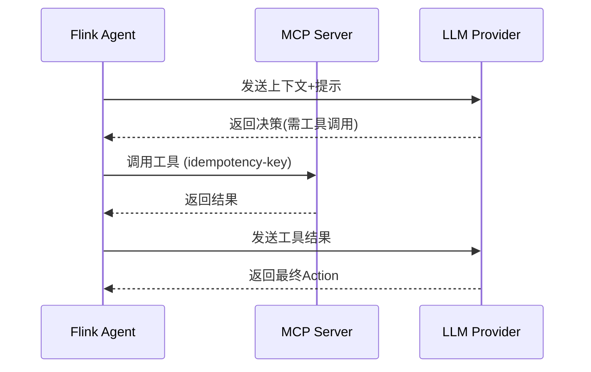
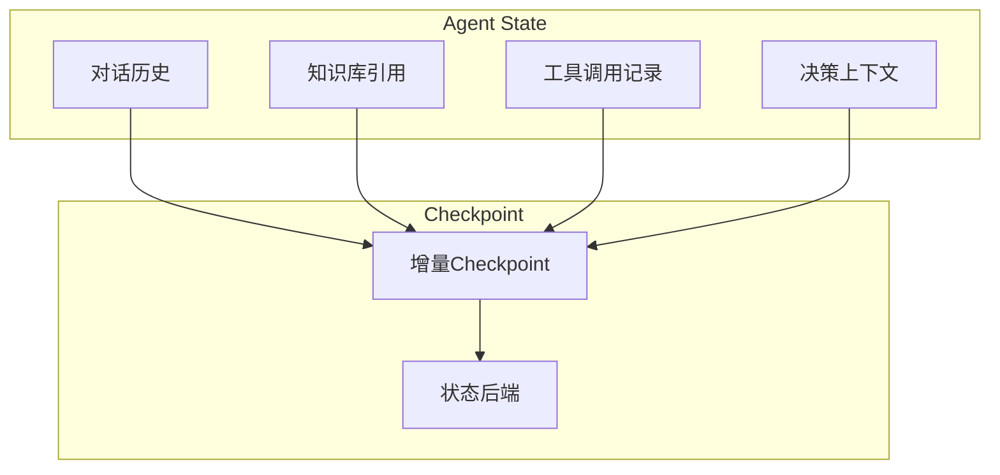

# Flink 2.4 AI Agents GA 特性跟踪

> 所属阶段: Flink/flink-24 | 前置依赖: [FLIP-531讨论][^1] | 形式化等级: L3

## 1. 概念定义 (Definitions)

### Def-F-24-01: AI Agent in Flink
AI Agent是Flink中能够自主感知流数据、做出决策并执行动作的软件实体，具备以下核心能力：
- 感知（Perception）：从数据流中提取特征
- 推理（Reasoning）：基于LLM或规则引擎进行决策
- 行动（Action）：输出控制信号或调用外部API
- 学习（Learning）：根据反馈优化行为策略

### Def-F-24-02: Agent Runtime
Agent Runtime是Flink中支持AI Agent执行的环境，提供：
- 状态管理（对话状态、知识库状态）
- 上下文传递（跨算子保持Agent上下文）
- 工具调用接口（MCP协议支持）
- 生命周期管理（启动、暂停、恢复、终止）

### Def-F-24-03: MCP Integration
Model Context Protocol (MCP) 是Flink AI Agent与外部工具集成的标准协议：
$$
\text{MCP} : \langle \text{Tool}, \text{Input}, \text{Output} \rangle \to \text{Result}
$$

## 2. 属性推导 (Properties)

### Prop-F-24-01: Agent State Consistency
在Checkpoint机制下，AI Agent的状态满足：
$$
\forall t, \exists \text{checkpoint}_t : \text{AgentState}_t \subseteq \text{checkpoint}_t
$$

### Prop-F-24-02: Agent Latency Bound
FLIP-531保证Agent推理延迟有上界：
$$
\text{Latency}_{\text{agent}} \leq T_{\text{inference}} + T_{\text{context\_switch}} + T_{\text{network}}
$$

### Prop-F-24-03: Tool Call Idempotency
在Exactly-Once语义下，Agent工具调用满足幂等性：
$$
\forall \text{tool} \in \text{Tools}, \text{tool}(x) = \text{tool}(\text{tool}(x))
$$

## 3. 关系建立 (Relations)

### 与现有特性的关系

| 特性 | 关系类型 | 说明 |
|------|----------|------|
| Async I/O | 依赖 | Agent推理通过Async I/O实现非阻塞 |
| State TTL | 依赖 | Agent对话状态使用State TTL管理生命周期 |
| Side Output | 协同 | Agent决策通过Side Output输出控制信号 |
| ProcessFunction | 基础 | Agent算子基于ProcessFunction构建 |
| Checkpoint | 基础 | Agent状态通过Checkpoint持久化 |

### 与外部系统关系

| 系统 | 集成方式 | 用途 |
|------|----------|------|
| OpenAI API | REST | LLM推理 |
| Anthropic Claude | REST | LLM推理 |
| MCP Server | Protocol | 工具调用 |
| Vector DB | Client | 知识检索 |

## 4. 论证过程 (Argumentation)

### 4.1 架构设计论证

FLIP-531引入三层架构：

```
┌─────────────────────────────────────────┐
│           Application Layer             │
│  (Agent Definition, Workflow, Tools)    │
├─────────────────────────────────────────┤
│           Runtime Layer                 │
│  (Agent Manager, Context Router,        │
│   Tool Registry, State Manager)         │
├─────────────────────────────────────────┤
│           Foundation Layer              │
│  (Flink Core, Async I/O, State Backend) │
└─────────────────────────────────────────┘
```

### 4.2 与传统流处理的差异

| 维度 | 传统流处理 | AI Agent流处理 |
|------|------------|----------------|
| 数据处理 | 确定性转换 | 非确定性推理 |
| 状态类型 | 聚合状态 | 对话/知识状态 |
| 计算模式 | 数据驱动 | 事件+推理驱动 |
| 延迟要求 | 毫秒级 | 百毫秒级(可接受) |
| 外部依赖 | 少 | LLM API等 |
| 容错机制 | Checkpoint | Checkpoint+幂等调用 |

## 5. 形式证明 / 工程论证

### 5.1 Agent Exactly-Once语义

**定理 (Thm-F-24-01)**: 在Flink的Exactly-Once语义下，AI Agent的工具调用满足幂等性。

**证明概要**:
1. 设Agent在checkpoint $t$ 时状态为 $S_t$
2. 恢复后从 $S_t$ 继续执行
3. 工具调用使用idempotency key确保幂等
4. 因此 $\text{Effect}(\text{recover}) = \text{Effect}(\text{continue})$

### 5.2 工程实现要点

```java
// Agent算子示例
public class AIAgentFunction extends ProcessFunction<Event, Action> {
    private ValueState<AgentContext> agentState;
    private transient LLMClient llmClient;
    
    @Override
    public void open(Configuration parameters) {
        StateTtlConfig ttlConfig = StateTtlConfig
            .newBuilder(Time.hours(1))
            .setUpdateType(OnCreateAndWrite)
            .build();
        
        ValueStateDescriptor<AgentContext> descriptor = 
            new ValueStateDescriptor<>("agent-context", AgentContext.class);
        descriptor.enableTimeToLive(ttlConfig);
        agentState = getRuntimeContext().getState(descriptor);
        
        llmClient = new LLMClient(getRuntimeContext());
    }
    
    @Override
    public void processElement(Event event, Context ctx, Collector<Action> out) {
        AgentContext context = agentState.value();
        if (context == null) {
            context = new AgentContext();
        }
        
        // 更新上下文
        context.addObservation(event);
        
        // 异步LLM推理
        llmClient.inferAsync(context, result -> {
            if (result.requiresAction()) {
                out.collect(result.getAction());
            }
            // 更新状态
            context.update(result);
            agentState.update(context);
        });
    }
}
```

## 6. 实例验证 (Examples)

### 6.1 配置示例

```yaml
# flink-conf.yaml
ai.agent.enabled: true
ai.agent.default-llm-provider: openai
ai.agent.max-context-length: 4096
ai.agent.tool-timeout-ms: 5000
ai.agent.checkpoint-interval-ms: 60000
ai.agent.mcp.servers:
  - name: "weather"
    url: "http://mcp-weather:8080"
  - name: "database"
    url: "http://mcp-db:8080"
```

### 6.2 代码示例

```java
// 定义Agent
Agent agent = Agent.newBuilder()
    .setName("AnomalyDetector")
    .setLLM("gpt-4")
    .addTool(new AlertTool())
    .addTool(new QueryTool())
    .addMCPTool("weather", "get_forecast")
    .setPromptTemplate("Detect anomalies in metrics...")
    .setCheckpointInterval(Duration.ofMinutes(1))
    .build();

// 在DataStream中使用
dataStream
    .keyBy(event -> event.getSensorId())
    .process(new AgentProcessFunction(agent))
    .addSink(new ActionSink());
```

### 6.3 SQL DDL示例

```sql
-- 创建AI Agent表
CREATE TABLE agent_output (
    sensor_id STRING,
    decision STRING,
    confidence DOUBLE,
    action_time TIMESTAMP(3)
) WITH (
    'connector' = 'ai-agent',
    'agent.name' = 'AnomalyDetector',
    'agent.llm' = 'gpt-4',
    'agent.tools' = 'alert,query',
    'agent.checkpoint.interval' = '60s'
);
```

## 7. 可视化 (Visualizations)

### Agent执行流程



### 与MCP协议集成



### 状态管理架构



## 8. 引用参考 (References)

[^1]: Apache Flink FLIP-531: "AI Agents Support in Flink", 2025. https://cwiki.apache.org/confluence/display/FLINK/FLIP-531
[^2]: Model Context Protocol Specification, Anthropic, 2024. https://modelcontextprotocol.io/
[^3]: ReAct: Synergizing Reasoning and Acting in Language Models, Yao et al., 2022.
[^4]: Building LLM Powered Applications, O'Reilly, 2024.

---

## 跟踪信息

| 属性 | 值 |
|------|-----|
| FLIP编号 | FLIP-531 |
| 目标版本 | Flink 2.4 |
| 当前状态 | GA |
| JIRA epic | FLINK-371xx |
| 负责人 | PMC |
| 预计完成 | 2025 Q3 |
| 兼容性 | 向后兼容 |
| 依赖特性 | Async I/O, State TTL |
