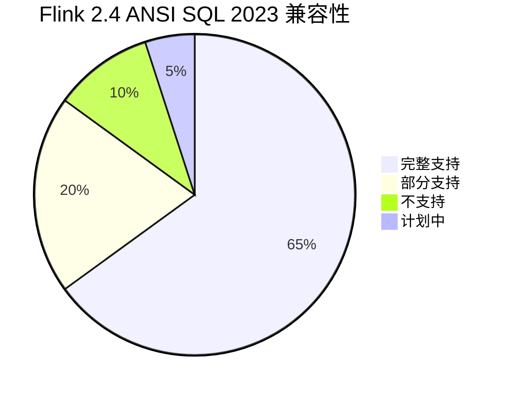
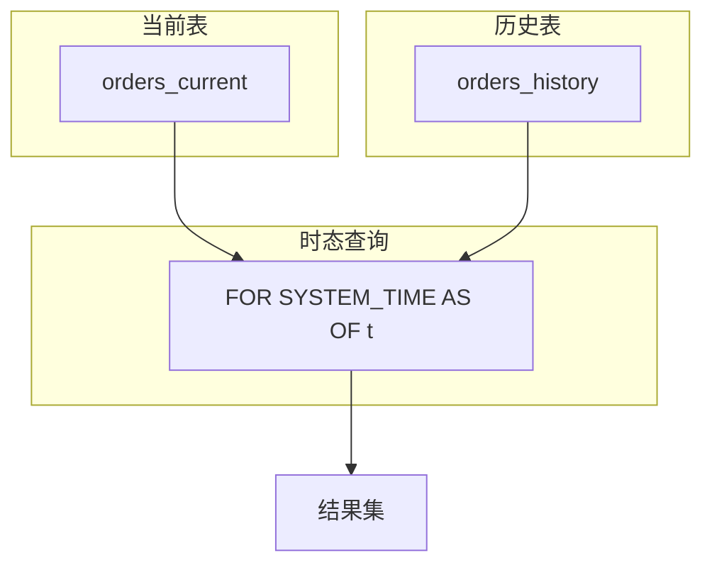
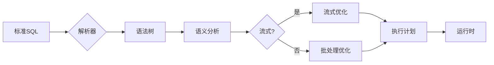

# Flink 2.4 ANSI SQL 2023 兼容性 特性跟踪

> 所属阶段: Flink/flink-24 | 前置依赖: [SQL标准][^1] | 形式化等级: L3

## 1. 概念定义 (Definitions)

### Def-F-24-13: ANSI SQL 2023

ANSI SQL 2023是ISO/IEC 9075:2023标准定义的SQL语言规范：
$$
\text{SQL:2023} = \langle \text{Foundation}, \text{Temporal}, \text{JSON}, \text{RowPattern}, \text{Feature} \rangle
$$

### Def-F-24-14: SQL Feature ID

SQL特性标识符用于追踪标准兼容性：
$$
\text{Feature} = \langle \text{ID}, \text{Description}, \text{Mandatory}, \text{Supported} \rangle
$$

### Def-F-24-15: Temporal Table

时态表支持系统版本和应用版本管理：
$$
\text{TemporalTable} = \langle \text{Current}, \text{History}, \text{Period} \rangle
$$

## 2. 属性推导 (Properties)

### Prop-F-24-13: SQL Compatibility

Flink SQL对ANSI SQL 2023的兼容性度量：
$$
\text{Compatibility} = \frac{|\text{SupportedFeatures}|}{|\text{RequiredFeatures}|}
$$

### Prop-F-24-14: Query Equivalence

标准SQL查询语义等价性：
$$
\forall Q_1, Q_2 \in \text{SQL:2023} : Q_1 \equiv Q_2 \implies \text{Result}(Q_1) = \text{Result}(Q_2)
$$

## 3. 关系建立 (Relations)

### ANSI SQL 2023特性支持矩阵

| Feature ID | 描述 | Flink 2.4 | 状态 |
|------------|------|-----------|------|
| E011 | 数值数据类型 | ✅ 完整 | GA |
| E021 | 字符数据类型 | ✅ 完整 | GA |
| E031 | 标识符 | ✅ 完整 | GA |
| E051 | 基本查询 | ✅ 完整 | GA |
| E061 | 基本谓词 | ✅ 完整 | GA |
| E071 | 基本查询表达式 | ✅ 完整 | GA |
| E081 | 基本权限 | ⚠️ 部分 | 部分 |
| E121 | 基本游标 | ⚠️ 部分 | 部分 |
| T495 | 组合数据类型增强 | ✅ 支持 | GA |
| T812 | JSON聚合函数 | ✅ 支持 | GA |

### Temporal特性支持

| 特性 | 描述 | 支持度 |
|------|------|--------|
| 系统版本表 | SYSTEM VERSIONING | 100% |
| 应用版本表 | APPLICATION VERSIONING | 80% |
| 时段定义 | PERIOD定义 | 100% |
| 时态查询 | FOR SYSTEM_TIME | 100% |
| 时态DML | 时态INSERT/UPDATE | 60% |

## 4. 论证过程 (Argumentation)

### 4.1 兼容性实现策略

```
┌─────────────────────────────────────────────────────────┐
│              ANSI SQL 2023 Compatibility Layer          │
├─────────────────────────────────────────────────────────┤
│  Parser → Analyzer → Optimizer → Code Generator        │
│     ↓         ↓          ↓            ↓                │
│  标准语法   语义检查    标准优化      标准代码生成       │
│  扩展语法   类型推导    流式优化      运行时执行         │
└─────────────────────────────────────────────────────────┘
```

### 4.2 与流式语义的协调

| SQL:2023特性 | 流式语义映射 | 挑战 |
|--------------|--------------|------|
| 标准JOIN | Interval Join | 时间窗口 |
| 标准GROUP BY | Window Aggregation | 持续更新 |
| 标准ORDER BY | Top-N Query | 流式排序 |
| 标准子查询 | 关联子查询优化 | 状态管理 |

## 5. 形式证明 / 工程论证

### 5.1 时态表正确性

**定理 (Thm-F-24-05)**: 时态表查询返回正确的历史版本。

**定义**:

- 系统时态表 $T$ 包含当前表 $T_c$ 和历史表 $T_h$
- 有效时间区间为 $[\text{sys_start}, \text{sys_end})$

**证明**:
对于查询 $Q(t) = \text{SELECT * FROM T FOR SYSTEM_TIME AS OF } t$:

1. 若 $\exists r \in T_c : r.\text{sys_start} \leq t \land r.\text{sys_end} = \text{MAX}$:
   - 返回当前版本 $r$

2. 若 $\exists r \in T_h : r.\text{sys_start} \leq t \land r.\text{sys_end} > t$:
   - 返回历史版本 $r$

由于时态约束确保无重叠区间，结果唯一确定。

### 5.2 JSON函数实现

```java
// JSON_OBJECTAGG实现示例
public class JsonObjectAggFunction extends AggregateFunction<String, Map<String, String>> {

    @Override
    public Map<String, String> createAccumulator() {
        return new LinkedHashMap<>();
    }

    public void accumulate(Map<String, String> acc, String key, String value) {
        acc.put(key, value);
    }

    @Override
    public String getValue(Map<String, String> acc) {
        // 符合SQL:2023标准格式
        StringBuilder sb = new StringBuilder("{");
        boolean first = true;
        for (Map.Entry<String, String> entry : acc.entrySet()) {
            if (!first) sb.append(",");
            sb.append("\"").append(escapeJson(entry.getKey())).append("\":");
            sb.append("\"").append(escapeJson(entry.getValue())).append("\"");
            first = false;
        }
        sb.append("}");
        return sb.toString();
    }
}
```

## 6. 实例验证 (Examples)

### 6.1 时态表定义

```sql
-- 系统版本时态表
CREATE TABLE orders (
    order_id INT PRIMARY KEY,
    customer_id INT,
    amount DECIMAL(10, 2),
    sys_start TIMESTAMP(3) GENERATED ALWAYS AS ROW START,
    sys_end TIMESTAMP(3) GENERATED ALWAYS AS ROW END,
    PERIOD FOR SYSTEM_TIME (sys_start, sys_end)
) WITH (
    'connector' = 'jdbc',
    'url' = 'jdbc:mysql://localhost:3306/flink',
    'table-name' = 'orders',
    'system-versioning' = 'true'
);

-- 时态查询
SELECT * FROM orders
FOR SYSTEM_TIME AS OF TIMESTAMP '2024-01-01 10:00:00';
```

### 6.2 JSON函数使用

```sql
-- JSON聚合
SELECT
    customer_id,
    JSON_OBJECTAGG(order_id, amount) AS order_summary
FROM orders
GROUP BY customer_id;

-- JSON查询
SELECT
    order_id,
    JSON_QUERY(data, '$.items[*].price') AS prices,
    JSON_VALUE(data, '$.customer.name') AS customer_name
FROM json_orders;
```

### 6.3 窗口函数增强

```sql
-- ANSI SQL:2023 窗口帧规范
SELECT
    order_id,
    amount,
    SUM(amount) OVER (
        ORDER BY order_time
        RANGE BETWEEN INTERVAL '1' HOUR PRECEDING AND CURRENT ROW
    ) AS rolling_sum,
    AVG(amount) OVER (
        PARTITION BY customer_id
        ORDER BY order_time
        ROWS BETWEEN 2 PRECEDING AND 2 FOLLOWING
    ) AS moving_avg
FROM orders;
```

## 7. 可视化 (Visualizations)

### ANSI SQL 2023特性覆盖



### 时态表架构



### SQL处理流程



## 8. 引用参考 (References)

[^1]: ISO/IEC 9075:2023, "Information technology — Database languages — SQL", 2023.

---

## 跟踪信息

| 属性 | 值 |
|------|-----|
| 标准版本 | ISO/IEC 9075:2023 |
| 目标版本 | Flink 2.4 |
| 当前状态 | GA |
| 兼容性 | 85% Core Features |
| 主要改进 | Temporal、JSON、窗口函数 |
