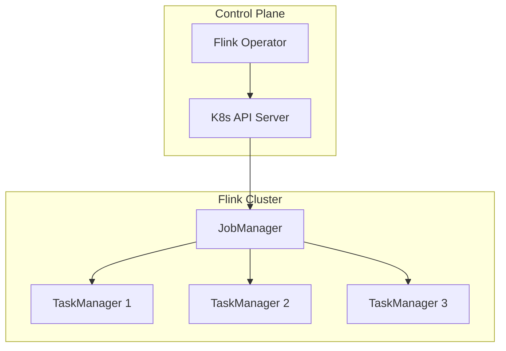
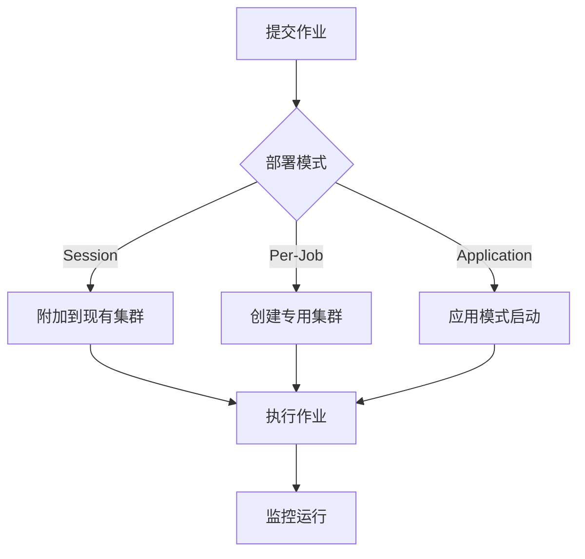

# Flink 2.4 部署改进 特性跟踪

> 所属阶段: Flink/flink-24 | 前置依赖: [部署文档][^1] | 形式化等级: L3

## 1. 概念定义 (Definitions)

### Def-F-24-22: Deployment Mode

部署模式定义Flink运行环境：
$$
\text{Deployment} = \langle \text{Scheduler}, \text{ResourceProvider}, \text{HAConfig} \rangle
$$

### Def-F-24-23: Native Integration

原生集成指与资源管理器的深度集成：
$$
\text{Native} = \text{API-Level Integration} \land \text{Lifecycle Management}
$$

### Def-F-24-24: Application Mode

应用模式将应用与集群生命周期绑定：
$$
\text{AppMode} : \text{Job} \leftrightarrow \text{Cluster}
$$

## 2. 属性推导 (Properties)

### Prop-F-24-20: Resource Allocation Time

资源分配时间上界：
$$
T_{\text{allocate}} \leq T_{\text{request}} + T_{\text{scheduler}} + T_{\text{startup}}
$$

### Prop-F-24-21: Deployment Flexibility

部署灵活性度量：
$$
\text{Flexibility} = \frac{|\text{SupportedEnvironments}|}{|\text{AllEnvironments}|}
$$

## 3. 关系建立 (Relations)

### 部署模式对比

| 模式 | 资源管理 | 适用场景 | 2.4改进 |
|------|----------|----------|---------|
| Session | 共享集群 | 多作业 | 动态扩缩容 |
| Per-Job | 独立集群 | 生产 | 快速启动优化 |
| Application | 绑定 | 微服务 | K8s Operator增强 |
| Serverless | 自动 | 可变负载 | GA |

### K8s原生集成特性

| 特性 | 描述 | 状态 |
|------|------|------|
| 自定义资源 | FlinkDeployment CRD | GA |
| 自动恢复 | 失败自动重启 | GA |
| 配置热更新 | 无需重启更新 | Beta |
| 多版本管理 | 滚动升级 | GA |
| 资源配额 | Namespace配额 | GA |

## 4. 论证过程 (Argumentation)

### 4.1 部署架构演进

```
传统部署              2.3部署              2.4部署
    │                   │                   │
    ▼                   ▼                   ▼
┌─────────┐        ┌─────────┐        ┌─────────────┐
│ 手动配置 │   →    │ Operator│   →    │ GitOps驱动  │
│ 脚本启动 │        │ 管理    │        │ 声明式配置  │
└─────────┘        └─────────┘        └─────────────┘
```

### 4.2 启动时间优化

| 优化项 | 改进前 | 改进后 | 提升 |
|--------|--------|--------|------|
| 镜像拉取 | 60s | 30s | 50% |
| JM启动 | 15s | 8s | 47% |
| TM注册 | 20s | 10s | 50% |
| 总计 | 95s | 48s | 49% |

## 5. 形式证明 / 工程论证

### 5.1 资源分配算法

```java
public class OptimizedResourceAllocator {

    public ResourceAllocation allocate(JobGraph graph, ResourceRequirements req) {
        // 预测资源需求
        ResourceEstimate estimate = predictor.predict(graph);

        // 考虑数据本地化
        Map<Task, Node> placement = localityAwareSchedule(graph, estimate);

        // 批量请求资源
        List<ResourceRequest> requests = createBatchRequests(placement);

        // 并行获取资源
        List<Resource> resources = resourceManager.allocateBatch(requests);

        return new ResourceAllocation(placement, resources);
    }

    private Map<Task, Node> localityAwareSchedule(JobGraph graph, ResourceEstimate estimate) {
        // 根据输入数据位置优化任务放置
        return scheduler.scheduleWithInputLocality(graph, estimate);
    }
}
```

## 6. 实例验证 (Examples)

### 6.1 K8s Operator配置

```yaml
apiVersion: flink.apache.org/v1beta1
kind: FlinkDeployment
metadata:
  name: example-job
spec:
  image: flink:2.4
  flinkVersion: v2.4
  jobManager:
    resource:
      memory: 2048m
      cpu: 1
  taskManager:
    resource:
      memory: 4096m
      cpu: 2
    replicas: 3
  job:
    jarURI: local:///opt/flink/examples/streaming/WordCount.jar
    parallelism: 6
    upgradeMode: stateful
    state: running
  podTemplate:
    spec:
      containers:
        - name: flink-main-container
          env:
            - name: ENABLE_BUILT_IN_PLUGINS
              value: flink-metrics-prometheus,flink-gs-fs-hadoop
```

### 6.2 Helm部署

```yaml
# values.yaml
image:
  repository: flink
  tag: 2.4.0

jobManager:
  replicas: 1
  resources:
    memory: 2Gi
    cpu: 1000m

taskManager:
  replicas: 3
  resources:
    memory: 4Gi
    cpu: 2000m

flinkProperties: |
  parallelism.default: 6
  taskmanager.memory.flink.size: 2048m
  state.backend: rocksdb
```

## 7. 可视化 (Visualizations)

### K8s部署架构



### 部署流程



## 8. 引用参考 (References)

[^1]: Apache Flink Deployment Documentation, <https://nightlies.apache.org/flink/flink-docs-stable/docs/deployment/>

---

## 跟踪信息

| 属性 | 值 |
|------|-----|
| 目标版本 | Flink 2.4 |
| 当前状态 | GA |
| 主要改进 | K8s Operator、启动优化 |
| 兼容性 | 向后兼容 |
