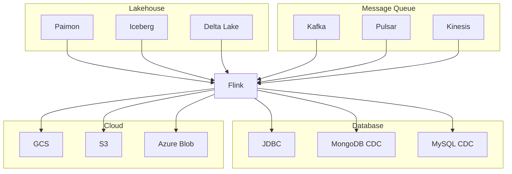
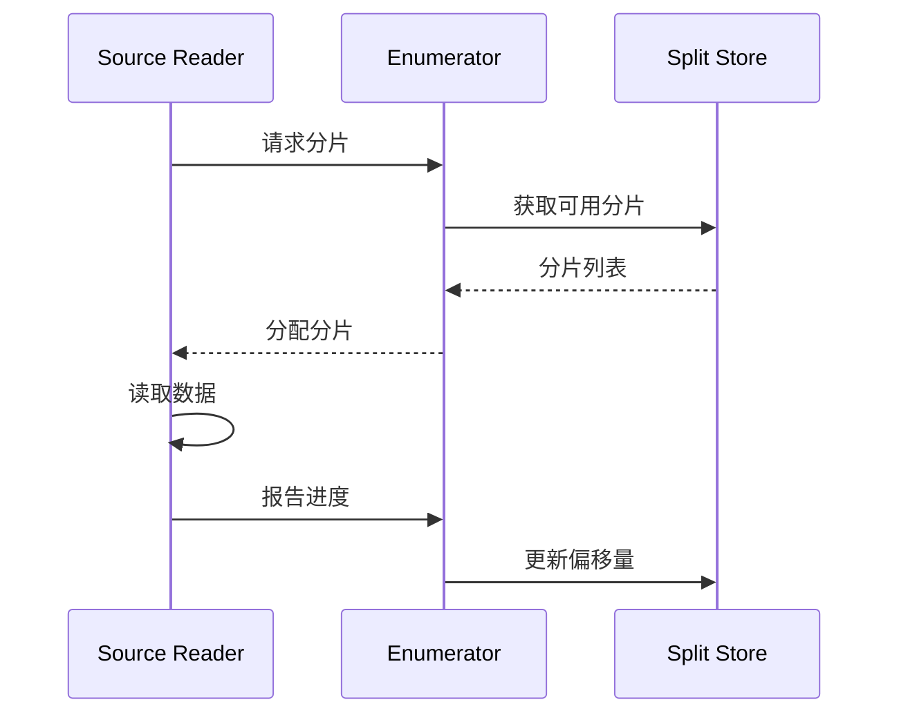
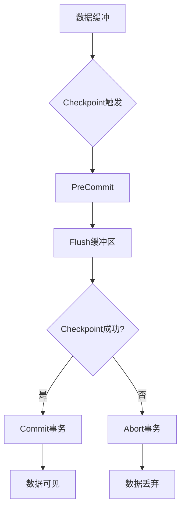

# Flink 2.4 新连接器 特性跟踪

> 所属阶段: Flink/flink-24 | 前置依赖: [连接器框架][^1] | 形式化等级: L3

## 1. 概念定义 (Definitions)

### Def-F-24-16: Connector Interface

连接器接口定义数据源和目标的标准契约：
$$
\text{Connector} = \langle \text{Source}, \text{Sink}, \text{Format}, \text{Config} \rangle
$$

### Def-F-24-17: Exactly-Once Sink

Exactly-Once Sink保证输出无副作用：
$$
\forall \text{commit} : \text{Idempotent}(\text{commit}) \lor \text{Transactional}(\text{commit})
$$

### Def-F-24-18: Source Split

数据源分片管理：
$$
\text{Split} = \langle \text{ID}, \text{Range}, \text{Offset}, \text{Watermark} \rangle
$$

## 2. 属性推导 (Properties)

### Prop-F-24-15: Source Parallelism

源连接器并行度约束：
$$
\text{Parallelism} \leq \min(|\text{Splits}|, \text{MaxParallelism})
$$

### Prop-F-24-16: Sink Throughput

Sink吞吐量上界：
$$
\text{Throughput} \leq \min(\text{NetworkBW}, \text{TargetIOPS}, \text{SerializerRate})
$$

## 3. 关系建立 (Relations)

### 2.4新增连接器矩阵

| 连接器 | 类型 | 模式 | Exactly-Once | 状态 |
|--------|------|------|--------------|------|
| Paimon 0.8 | Source/Sink | Stream/Batch | ✅ | GA |
| Iceberg 1.5 | Source/Sink | Batch | ✅ | GA |
| Delta Lake 3.1 | Sink | Batch | ✅ | Preview |
| Apache Pulsar 3.0 | Source/Sink | Stream | ✅ | GA |
| AWS Kinesis EFO | Source | Stream | ✅ | GA |
| Azure Event Hubs | Source/Sink | Stream | ✅ | GA |
| Google Pub/Sub | Source/Sink | Stream | ✅ | Beta |
| MongoDB CDC | Source | Stream | ✅ | GA |
| Oracle CDC | Source | Stream | ✅ | GA |

### 连接器依赖关系

| 连接器 | 依赖库 | 版本约束 |
|--------|--------|----------|
| Paimon | paimon-flink | 0.8.x |
| Iceberg | iceberg-flink | 1.5.x |
| Pulsar | pulsar-client | 3.0.x |
| MongoDB | mongodb-driver | 4.11+ |

## 4. 论证过程 (Argumentation)

### 4.1 连接器架构演进

```
Flink 1.x                Flink 2.x              Flink 2.4
    │                        │                      │
    ▼                        ▼                      ▼
┌───────────┐          ┌───────────┐          ┌─────────────┐
│ 旧Source  │    →     │ FLIP-27   │    →     │ 统一API GA  │
│ 接口       │          │ Source    │          │ + 新连接器  │
├───────────┤          ├───────────┤          ├─────────────┤
│ Sink V1   │    →     │ 新Sink API│    →     │ 两阶段提交  │
│           │          │           │          │ + 缓冲优化  │
└───────────┘          └───────────┘          └─────────────┘
```

### 4.2 Lakehouse连接器对比

| 特性 | Paimon | Iceberg | Delta Lake |
|------|--------|---------|------------|
| 实时写入 | ✅ | ⚠️ | ⚠️ |
| 批量读取 | ✅ | ✅ | ✅ |
| 时间旅行 | ✅ | ✅ | ✅ |
| 模式演进 | ✅ | ✅ | ✅ |
| 压缩 | ✅ | ✅ | ✅ |
| CDC集成 | ✅ | ❌ | ❌ |

## 5. 形式证明 / 工程论证

### 5.1 Exactly-Once语义保证

**定理 (Thm-F-24-06)**: 两阶段提交Sink保证Exactly-Once语义。

**证明概要**:
设 $T$ 为事务，$C$ 为检查点。

1. **预提交阶段**: 在checkpoint时，将缓冲数据封装为事务
   $$
   \text{PreCommit}(T_i) = \text{Flush}(\text{Buffer}_i)
   $$

2. **提交阶段**: checkpoint完成后，提交事务
   $$
   \text{Commit}(T_i) \iff \text{Checkpoint}_i \text{ completed}
   $$

3. **回滚**: checkpoint失败时，中止事务
   $$
   \text{Abort}(T_i) \iff \text{Checkpoint}_i \text{ failed}
   $$

由检查点协议的Exactly-Once保证，Sink输出也满足Exactly-Once。

### 5.2 Paimon连接器实现

```java
public class PaimonSink implements TwoPhaseCommitSinkFunction<RowData, PaimonTransaction, Void> {

    private transient TableWrite write;
    private transient TableCommit commit;

    @Override
    protected void invoke(PaimonTransaction transaction, RowData value, Context context) {
        // 写入数据到缓冲区
        transaction.write(value);
    }

    @Override
    protected PaimonTransaction beginTransaction() {
        // 开始新事务
        return new PaimonTransaction(write.newCommit());
    }

    @Override
    protected void preCommit(PaimonTransaction transaction) {
        // 预提交：准备但不确定
        transaction.prepareCommit();
    }

    @Override
    protected void commit(PaimonTransaction transaction) {
        // 实际提交
        transaction.commit();
    }

    @Override
    protected void abort(PaimonTransaction transaction) {
        // 回滚
        transaction.rollback();
    }
}
```

## 6. 实例验证 (Examples)

### 6.1 Paimon连接器配置

```sql
-- 创建Paimon表
CREATE TABLE paimon_table (
    id INT PRIMARY KEY NOT ENFORCED,
    data STRING,
    dt STRING
) WITH (
    'connector' = 'paimon',
    'path' = 'hdfs:///paimon/warehouse/db.db/paimon_table',
    'bucket' = '4',
    'bucket-key' = 'id',
    'changelog-producer' = 'input',
    'file.format' = 'parquet',
    'compaction.enabled' = 'true',
    'compaction.min.file-num' = '5'
);

-- 流式写入
INSERT INTO paimon_table
SELECT id, data, DATE_FORMAT(event_time, 'yyyy-MM-dd') as dt
FROM kafka_source;
```

### 6.2 CDC连接器配置

```sql
-- MongoDB CDC源
CREATE TABLE mongodb_cdc (
    _id STRING,
    name STRING,
    age INT,
    PRIMARY KEY (_id) NOT ENFORCED
) WITH (
    'connector' = 'mongodb-cdc',
    'hosts' = 'mongodb:27017',
    'username' = 'flink',
    'password' = 'flinkpwd',
    'database' = 'inventory',
    'collection' = 'products'
);

-- 捕获变更
SELECT * FROM mongodb_cdc WHERE age > 18;
```

### 6.3 云连接器配置

```java
// AWS Kinesis EFO Source
FlinkKinesisConsumer<Row> consumer = new FlinkKinesisConsumer<>(
    "stream-name",
    new RowDeserializationSchema(),
    KinesisConfigUtil.replaceDeprecatedKeys(properties)
);

// 启用EFO (Enhanced Fan-Out)
consumer.setConsumerType(ConsumerType.ENHANCED_FAN_OUT);
consumer.setSubscribeToShardTimeout(Duration.ofMinutes(1));

DataStream<Row> stream = env.addSource(consumer);
```

## 7. 可视化 (Visualizations)

### 连接器生态图



### Source分片管理



### 两阶段提交流程



## 8. 引用参考 (References)

[^1]: Apache Flink FLIP-27: "Refactor Source Interface", <https://cwiki.apache.org/confluence/display/FLINK/FLIP-27>

---

## 跟踪信息

| 属性 | 值 |
|------|-----|
| 目标版本 | Flink 2.4 |
| 当前状态 | GA |
| 新增连接器 | 9个 |
| 主要改进 | Lakehouse集成、CDC增强 |
| 兼容性 | 向后兼容 |
