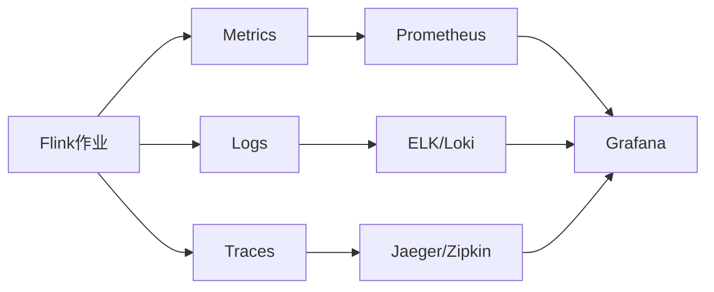
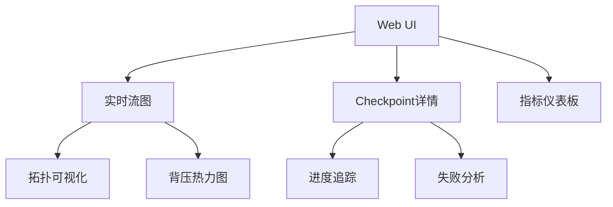

# Flink 2.4 可观测性增强 特性跟踪

> 所属阶段: Flink/flink-24 | 前置依赖: [可观测性指南][^1] | 形式化等级: L3

## 1. 概念定义 (Definitions)

### Def-F-24-25: Observability

可观测性通过外部输出理解系统内部状态：
$$
\text{Observability} = \langle \text{Metrics}, \text{Logs}, \text{Traces} \rangle
$$

### Def-F-24-26: Metric Cardinality

指标基数指唯一时间序列数量：
$$
\text{Cardinality} = |\{ \text{TS} \mid \text{TS} = \langle \text{Name}, \text{Labels} \rangle \}|
$$

### Def-F-24-27: Latency SLO

延迟服务级别目标：
$$
\text{SLO}_{\text{latency}} : P(\text{Latency} \leq T) \geq 0.99
$$

## 2. 属性推导 (Properties)

### Prop-F-24-22: Metric Accuracy

指标精度保证：
$$
|\text{Metric}_{\text{reported}} - \text{Metric}_{\text{actual}}| \leq \epsilon
$$

### Prop-F-24-23: Trace Completeness

追踪完整性：
$$
\text{Completeness} = \frac{|\text{Spans}_{\text{captured}}|}{|\text{Spans}_{\text{generated}}|}
$$

## 3. 关系建立 (Relations)

### 可观测性组件矩阵

| 组件 | 2.3状态 | 2.4改进 | 状态 |
|------|---------|---------|------|
| Metrics Reporter | 基础 | 高性能Reporter | GA |
| Web UI | 标准 | 实时流图 | GA |
| OpenTelemetry | 实验 | 完整集成 | GA |
| Structured Logging | 无 | JSON格式 | GA |
| Profiling | 外部 | 内置JFR | Beta |

### 指标分类

| 类别 | 示例 | 采集频率 |
|------|------|----------|
| 系统 | CPU、内存、GC | 10s |
| 作业 | 吞吐、延迟 | 5s |
| 算子 | 水位、积压 | 1s |
| Checkpoint | 时长、大小 | 每次 |

## 4. 论证过程 (Argumentation)

### 4.1 可观测性架构

```
┌─────────────────────────────────────────────────────────┐
│                  Observability Stack                   │
├─────────────────────────────────────────────────────────┤
│  Application → Runtime → JVM → OS                      │
│     ↓            ↓       ↓     ↓                       │
│  业务指标    作业指标   系统指标  硬件指标              │
│     ↓            ↓       ↓                             │
│  ┌─────────────────────────────────────────────────┐   │
│  │           Metrics/Logs/Traces Aggregation        │   │
│  └─────────────────────────────────────────────────┘   │
└─────────────────────────────────────────────────────────┘
```

## 5. 形式证明 / 工程论证

### 5.1 指标聚合算法

```java
public class EfficientMetricReporter implements MetricReporter {

    private final Map<String, AggregatedMetric> aggregates = new ConcurrentHashMap<>();

    @Override
    public void notifyOfAddedMetric(Metric metric, String name, MetricGroup group) {
        String key = buildKey(name, group);

        if (metric instanceof Counter) {
            aggregates.computeIfAbsent(key, k -> new CounterAggregate())
                     .add((Counter) metric);
        } else if (metric instanceof Gauge) {
            aggregates.computeIfAbsent(key, k -> new GaugeAggregate())
                     .add((Gauge<?>) metric);
        }
    }

    @Scheduled(fixedRate = 60000)
    public void report() {
        // 批量上报，减少网络开销
        List<MetricSnapshot> snapshots = aggregates.values().stream()
            .map(AggregatedMetric::snapshot)
            .collect(Collectors.toList());

        batchReporter.report(snapshots);
    }
}
```

## 6. 实例验证 (Examples)

### 6.1 Prometheus集成

```yaml
# flink-conf.yaml
metrics.reporters: prom
metrics.reporter.prom.class: org.apache.flink.metrics.prometheus.PrometheusReporter
metrics.reporter.prom.port: 9249
metrics.reporter.prom.filter.includes: "*.latency.*:*,*.throughput.*:*"
```

### 6.2 OpenTelemetry配置

```yaml
# 启用OpenTelemetry追踪
tracing.exporter: otlp
tracing.otlp.endpoint: http://otel-collector:4317
tracing.sampler: parentbased_traceidratio
tracing.sampler.ratio: 0.1
```

### 6.3 结构化日志

```xml
<!-- logback.xml -->
<appender name="JSON" class="ch.qos.logback.core.ConsoleAppender">
    <encoder class="net.logstash.logback.encoder.LogstashEncoder">
        <includeContext>true</includeContext>
        <includeMdc>true</includeMdc>
        <customFields>{"service":"flink","version":"2.4"}</customFields>
    </encoder>
</appender>
```

## 7. 可视化 (Visualizations)

### 可观测性数据流



### Web UI改进



## 8. 引用参考 (References)

[^1]: Apache Flink Observability Documentation, <https://nightlies.apache.org/flink/flink-docs-stable/docs/ops/monitoring/>

---

## 跟踪信息

| 属性 | 值 |
|------|-----|
| 目标版本 | Flink 2.4 |
| 当前状态 | GA |
| 主要改进 | OpenTelemetry、结构化日志 |
| 兼容性 | 向后兼容 |
