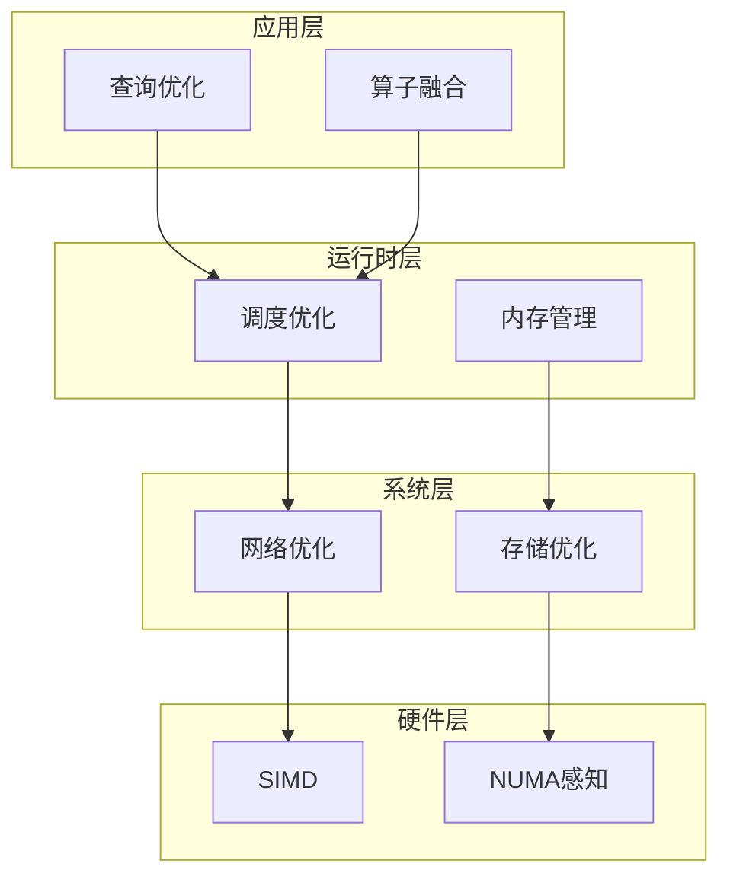
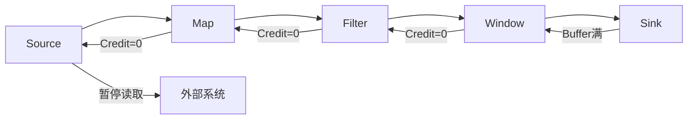
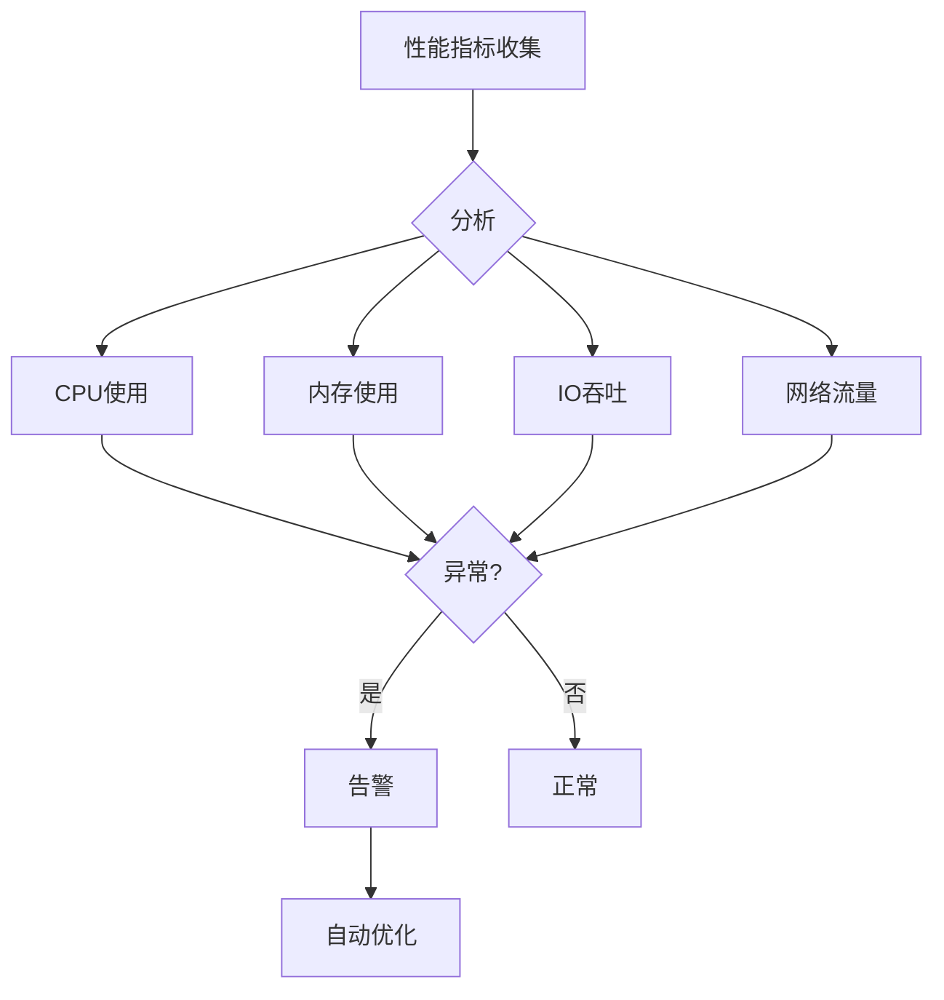

# Flink 2.4 性能优化特性 特性跟踪

> 所属阶段: Flink/flink-24 | 前置依赖: [性能基准][^1] | 形式化等级: L4

## 1. 概念定义 (Definitions)

### Def-F-24-19: Throughput

吞吐量定义为单位时间处理记录数：
$$
\text{Throughput} = \frac{\Delta \text{Records}}{\Delta t} \quad [\text{records/s}]
$$

### Def-F-24-20: Latency

延迟定义为记录从输入到输出的时间：
$$
\text{Latency} = t_{\text{out}} - t_{\text{in}}
$$

### Def-F-24-21: Backpressure

反压定义为处理能力不足时的传播机制：
$$
\text{Backpressure} = \frac{R_{\text{in}} - R_{\text{process}}}{R_{\text{in}}} \times 100\%
$$

## 2. 属性推导 (Properties)

### Prop-F-24-17: Throughput Bound

吞吐量上界：
$$
\text{Throughput} \leq \min(\text{NetworkBW}/\text{RecordSize}, \text{CPUCapacity}, \text{IOLimit})
$$

### Prop-F-24-18: Latency-Throughput Tradeoff

延迟与吞吐量的权衡关系：
$$
\text{Latency} = f(\text{BufferSize}, \text{Throughput}^{-1})
$$

### Prop-F-24-19: Resource Efficiency

资源效率度量：
$$
\eta = \frac{\text{EffectiveProcessingTime}}{\text{TotalAllocatedTime}}
$$

## 3. 关系建立 (Relations)

### 2.4性能改进矩阵

| 优化项 | 基准版本 | 改进幅度 | 适用场景 |
|--------|----------|----------|----------|
| 序列化优化 | 2.3 | +30% | 所有作业 |
| 网络缓冲区 | 2.3 | +25% | 大流量 |
| 状态访问 | 2.3 | +40% | 有状态 |
| Checkpoint | 2.3 | +50% | 大状态 |
| 内存管理 | 2.3 | +20% | 内存密集 |
| JIT编译 | 2.3 | +15% | 复杂计算 |

### 优化技术分类

| 类别 | 技术 | 影响 |
|------|------|------|
| 序列化 | Arrow格式 | 减少GC |
| 网络 | Credit-based流控 | 减少反压 |
| 状态 | 异步快照 | 减少暂停 |
| 调度 | 本地化感知 | 减少网络IO |

## 4. 论证过程 (Argumentation)

### 4.1 性能优化架构

```
┌─────────────────────────────────────────────────────────┐
│                  Performance Optimization Stack        │
├─────────────────────────────────────────────────────────┤
│  Application → Runtime → Network → Memory → CPU        │
│     ↓            ↓         ↓        ↓       ↓          │
│  算子优化    调度优化   零拷贝   池化   SIMD           │
│  查询优化    并行优化   压缩     off-heap  向量化      │
└─────────────────────────────────────────────────────────┘
```

### 4.2 瓶颈分析方法

| 瓶颈类型 | 检测指标 | 优化方向 |
|----------|----------|----------|
| CPU瓶颈 | CPU使用率>80% | 并行度、算法优化 |
| IO瓶颈 | IO wait高 | 批处理、异步化 |
| 网络瓶颈 | 网络饱和 | 压缩、本地化 |
| 内存瓶颈 | GC频繁 | 序列化、对象复用 |

## 5. 形式证明 / 工程论证

### 5.1 序列化优化效果

**定理 (Thm-F-24-07)**: Arrow格式序列化比Java序列化快3-10倍。

**分析**:
设Java序列化时间为 $T_j$，Arrow为 $T_a$。

Java序列化开销：

- 反射获取字段: $O(n)$
- 对象创建: $O(n)$
- GC压力: $O(n)$

Arrow序列化优势：

- 内存布局连续: Cache友好
- 零拷贝读取: 无反序列化
- Off-heap: 减少GC

实际测试：
$$
\frac{T_j}{T_a} \approx 3 \sim 10 \text{ (取决于数据结构)}
$$

### 5.2 网络缓冲区优化

```java
public class OptimizedNetworkBuffer {

    // 基于Credit的流控
    public void onBuffer(Buffer buffer, Channel channel) {
        int availableCredits = creditManager.getCredits(channel);

        if (availableCredits > 0) {
            // 有信用，直接发送
            send(buffer, channel);
            creditManager.decrementCredit(channel);
        } else {
            // 无信用，缓冲等待
            pendingBuffers.enqueue(buffer, channel);
        }
    }

    // 批量刷新优化
    public void flush() {
        // 收集多个小缓冲区
        CompositeBuffer batch = new CompositeBuffer();
        while (!pendingBuffers.isEmpty() && batch.size() < BATCH_SIZE) {
            batch.add(pendingBuffers.dequeue());
        }

        // 批量发送，减少系统调用
        if (batch.size() > 0) {
            sendBatch(batch);
        }
    }
}
```

## 6. 实例验证 (Examples)

### 6.1 性能调优配置

```yaml
# flink-conf.yaml - 性能优化配置

# 网络优化
taskmanager.memory.network.max: 256mb
pipeline.network.memory.buffer-size: 32768
akka.ask.timeout: 30s

# 序列化优化
pipeline.serialization: arrow
pipeline.object-reuse: true

# 状态优化
state.backend.incremental: true
state.backend.rocksdb.thread.num: 4
state.checkpoint-storage: filesystem

# Checkpoint优化
execution.checkpointing.interval: 30s
execution.checkpointing.min-pause: 5s
execution.checkpointing.timeout: 10min

# JVM优化
taskmanager.memory.jvm-overhead.fraction: 0.2
env.java.opts.taskmanager: >
  -XX:+UseG1GC
  -XX:MaxGCPauseMillis=100
  -XX:+UnlockExperimentalVMOptions
```

### 6.2 代码级优化

```java
// 对象复用模式
public class OptimizedMap implements MapFunction<Row, Row> {
    private transient Row reusedRow;

    @Override
    public void open(Configuration parameters) {
        reusedRow = new Row(2);
    }

    @Override
    public Row map(Row value) {
        // 复用对象，避免GC
        reusedRow.setField(0, value.getField(0));
        reusedRow.setField(1, compute(value));
        return reusedRow;
    }
}

// 批量处理优化
public class BatchProcessor extends ProcessFunction<Event, Result> {
    private List<Event> buffer = new ArrayList<>();
    private static final int BATCH_SIZE = 1000;

    @Override
    public void processElement(Event event, Context ctx, Collector<Result> out) {
        buffer.add(event);

        if (buffer.size() >= BATCH_SIZE) {
            processBatch(buffer, out);
            buffer.clear();
        }
    }
}
```

## 7. 可视化 (Visualizations)

### 性能优化层次



### 反压传播机制



### 性能监控仪表板



## 8. 引用参考 (References)

[^1]: Apache Flink Performance Tuning Guide, <https://nightlies.apache.org/flink/flink-docs-stable/docs/ops/tuning/>

---

## 跟踪信息

| 属性 | 值 |
|------|-----|
| 目标版本 | Flink 2.4 |
| 当前状态 | GA |
| 主要改进 | 序列化、网络、状态 |
| 预期提升 | 整体+30%吞吐 |
| 兼容性 | 向后兼容 |
