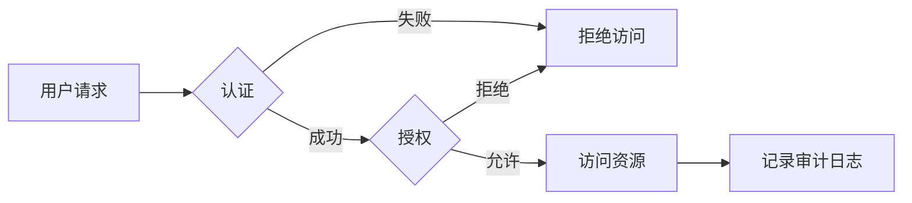
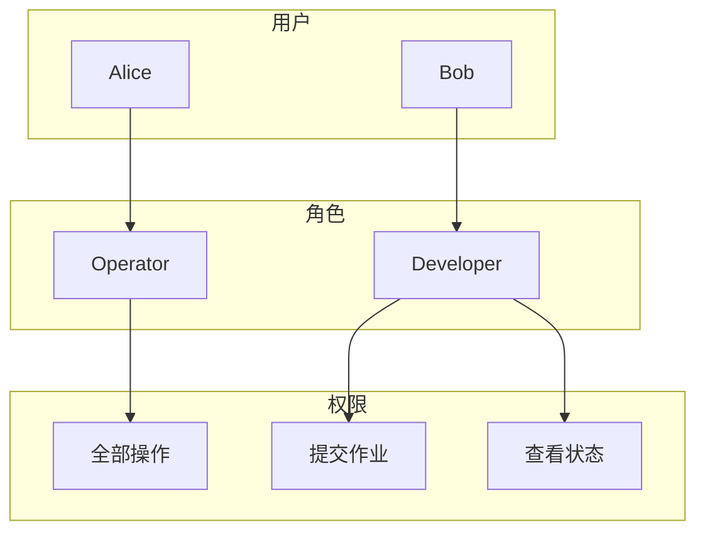

# Flink 2.4 安全增强 特性跟踪

> 所属阶段: Flink/flink-24 | 前置依赖: [安全文档][^1] | 形式化等级: L3

## 1. 概念定义 (Definitions)

### Def-F-24-28: Security Posture

安全态势定义系统整体安全状态：
$$
\text{Posture} = \langle \text{AuthN}, \text{AuthZ}, \text{Encryption}, \text{Audit} \rangle
$$

### Def-F-24-29: Authentication

身份验证确认主体身份：
$$
\text{AuthN} : \text{Credentials} \to \text{Identity} \cup \{\bot\}
$$

### Def-F-24-30: Authorization

授权决定主体访问权限：
$$
\text{AuthZ} : \langle \text{Identity}, \text{Resource}, \text{Action} \rangle \to \{\text{Allow}, \text{Deny}\}
$$

## 2. 属性推导 (Properties)

### Prop-F-24-24: Authentication Completeness

认证完整性：
$$
\forall r \in \text{Resources} : \text{Protected}(r) \implies \text{RequiresAuth}(r)
$$

### Prop-F-24-25: Least Privilege

最小权限原则：
$$
\text{Permissions}(\text{Role}) = \bigcap_{u \in \text{Users}(\text{Role})} \text{Required}(u)
$$

## 3. 关系建立 (Relations)

### 安全特性矩阵

| 特性 | 2.3 | 2.4 | 状态 |
|------|-----|-----|------|
| Kerberos认证 | ✅ | ✅ | GA |
| SSL/TLS加密 | ✅ | ✅ | GA |
| 基于角色的访问控制 | 部分 | 完整 | GA |
| 审计日志 | 基础 | 增强 | GA |
| 密钥管理集成 | 外部 | 内置 | Beta |
| 数据脱敏 | ❌ | ✅ | GA |

### 安全控制层次

| 层次 | 控制措施 | 实施方式 |
|------|----------|----------|
| 网络 | TLS、mTLS | 证书配置 |
| 认证 | Kerberos、OAuth | JAAS配置 |
| 授权 | RBAC | 策略配置 |
| 数据 | 加密、脱敏 | 连接器配置 |
| 审计 | 日志、追踪 | 日志收集 |

## 4. 论证过程 (Argumentation)

### 4.1 安全架构演进

```
┌─────────────────────────────────────────────────────────┐
│                    Security Layers                      │
├─────────────────────────────────────────────────────────┤
│  网络层 → 传输层 → 应用层 → 数据层                      │
│    ↓         ↓         ↓        ↓                       │
│  防火墙    TLS加密    RBAC      加密存储                │
│  VPC隔离   mTLS       OAuth     字段脱敏                │
└─────────────────────────────────────────────────────────┘
```

### 4.2 RBAC模型

| 角色 | 权限范围 | 适用场景 |
|------|----------|----------|
| Admin | 全部 | 集群管理 |
| Operator | 启停作业 | 运维人员 |
| Developer | 提交/查看 | 开发人员 |
| Viewer | 只读 | 监控人员 |

## 5. 形式证明 / 工程论证

### 5.1 授权决策引擎

```java
public class RBACAuthorizer implements Authorizer {

    private final PolicyEngine policyEngine;

    @Override
    public boolean authorize(Identity identity, Resource resource, Action action) {
        // 获取用户角色
        Set<Role> roles = identityResolver.resolveRoles(identity);

        // 检查角色权限
        for (Role role : roles) {
            Permission permission = new Permission(resource, action);
            if (policyEngine.checkPermission(role, permission)) {
                // 记录审计日志
                auditLog.record(identity, resource, action, Result.ALLOW);
                return true;
            }
        }

        auditLog.record(identity, resource, action, Result.DENY);
        return false;
    }
}
```

## 6. 实例验证 (Examples)

### 6.1 SSL配置

```yaml
# flink-conf.yaml
security.ssl.enabled: true
security.ssl.algorithms: TLSv1.2,TLSv1.3
security.ssl.rest.enabled: true
security.ssl.internal.enabled: true
security.ssl.rest.keystore: /path/to/keystore.jks
security.ssl.rest.keystore-password: ${KEYSTORE_PASSWORD}
security.ssl.rest.truststore: /path/to/truststore.jks
```

### 6.2 RBAC配置

```yaml
# security-config.yaml
roles:
  - name: flink-operator
    permissions:
      - resource: "*"
        actions: ["read", "write", "execute"]

  - name: flink-developer
    permissions:
      - resource: "job/*"
        actions: ["read", "submit"]
      - resource: "config/*"
        actions: ["read"]

users:
  - name: alice
    roles: ["flink-operator"]
  - name: bob
    roles: ["flink-developer"]
```

### 6.3 数据脱敏

```sql
-- 创建脱敏视图
CREATE VIEW safe_users AS
SELECT
    user_id,
    MASK(name) as name,           -- 掩码处理
    HASH(email) as email_hash,    -- 哈希处理
    TRUNCATE(age, 10) as age_range -- 取整处理
FROM users;
```

## 7. 可视化 (Visualizations)

### 安全控制流程



### RBAC权限模型



## 8. 引用参考 (References)

[^1]: Apache Flink Security Documentation, <https://nightlies.apache.org/flink/flink-docs-stable/docs/deployment/security/>

---

## 跟踪信息

| 属性 | 值 |
|------|-----|
| 目标版本 | Flink 2.4 |
| 当前状态 | GA |
| 主要改进 | RBAC完整实现、审计日志 |
| 兼容性 | 配置变更 |
