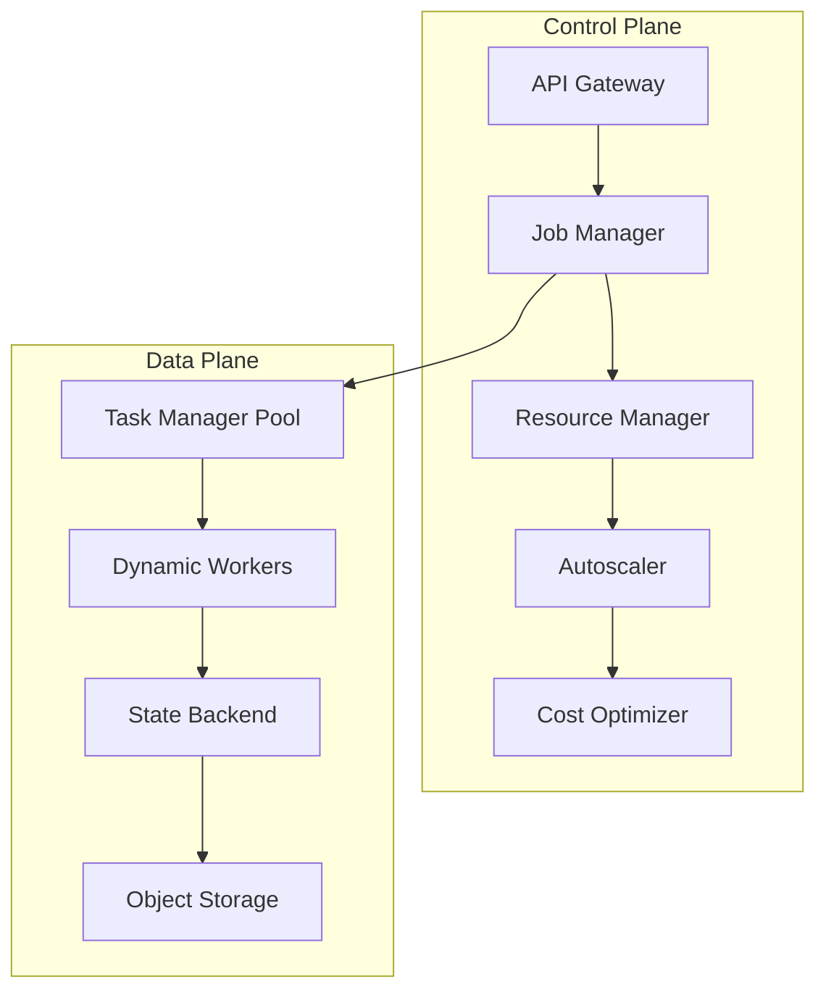
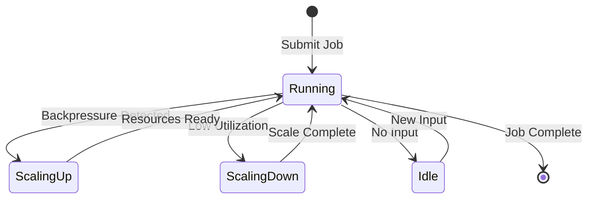
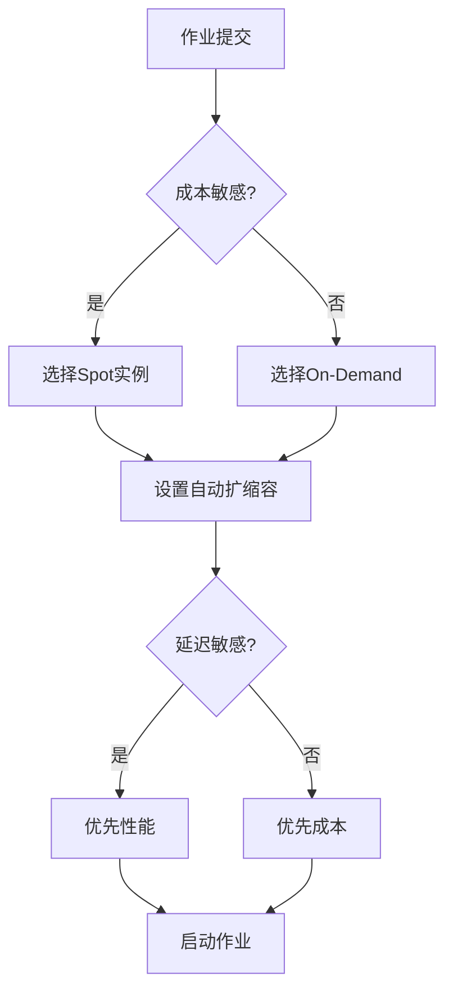

# Flink 2.4 Serverless GA 特性跟踪

> 所属阶段: Flink/flink-24 | 前置依赖: [FLIP-318][^1] | 形式化等级: L4

## 1. 概念定义 (Definitions)

### Def-F-24-04: Serverless Flink

Serverless Flink是一种无需管理集群基础设施的Flink部署模式，用户只需提交作业，系统自动：

- 预配计算资源（自动扩缩容）
- 管理状态后端（自动选择最优）
- 处理故障恢复（自动checkpoint）
- 优化资源配置（基于负载自动调优）

### Def-F-24-05: Serverless Autoscaling

自动扩缩容策略定义为：
$$
\text{Parallelism}(t) = f(\text{InputRate}(t), \text{ProcessingRate}(t), \text{Backpressure}(t))
$$

其中 $f$ 为自适应控制函数，目标是最小化成本同时满足延迟SLA。

### Def-F-24-06: Resource Profile

资源画像定义：
$$
\text{Profile} = \langle \text{CPU}, \text{Memory}, \text{Network}, \text{Disk} \rangle
$$

## 2. 属性推导 (Properties)

### Prop-F-24-04: Resource Efficiency

Serverless模式下资源利用率满足：
$$
\eta = \frac{\sum_{i} \text{ActualProcessingTime}_i}{\sum_{j} \text{AllocatedTime}_j} \geq 0.7
$$

### Prop-F-24-05: Cold Start Latency

Serverless作业冷启动时间上界：
$$
T_{\text{cold}} \leq T_{\text{image\_pull}} + T_{\text{jm\_start}} + T_{\text{tm\_scale}} + T_{\text{restore}}
$$

### Prop-F-24-06: Cost Optimization

成本优化目标函数：
$$
\min C = \int_{0}^{T} c(t) \cdot r(t) \, dt \quad \text{s.t.} \quad \text{Latency}(t) \leq \text{SLA}
$$

## 3. 关系建立 (Relations)

### 与部署模式的关系

| 部署模式 | 适用场景 | Serverless优势 |
|----------|----------|----------------|
| K8s Native | 长期运行 | 降低运维成本 |
| YARN | 批处理 | 更快的资源获取 |
| Standalone | 开发测试 | 零配置启动 |
| Cloud托管 | 生产环境 | 与云服务深度集成 |

### 与Flink核心特性关系

| 特性 | 关系 | 说明 |
|------|------|------|
| Checkpoint | 依赖 | Serverless自动管理Checkpoint |
| State Backend | 依赖 | 自动选择最优状态后端 |
| Metrics System | 协同 | 提供扩缩容决策数据 |
| REST API | 依赖 | 作业提交入口 |

## 4. 论证过程 (Argumentation)

### 4.1 Serverless架构演进

```
Flink 1.x          Flink 2.x Preview      Flink 2.4 GA
    │                    │                    │
    ▼                    ▼                    ▼
┌─────────┐        ┌─────────┐          ┌─────────────┐
│ 静态配置 │   →    │ 半自动   │    →     │ 全自动自适应 │
│ 手动扩容 │        │ 规则扩容 │          │ ML驱动优化   │
└─────────┘        └─────────┘          └─────────────┘
```

### 4.2 技术挑战与解决方案

| 挑战 | 解决方案 | 状态 |
|------|----------|------|
| 冷启动延迟 | 预置资源池+镜像缓存 | ✅ 已解决 |
| 状态恢复慢 | 增量checkpoint+本地缓存 | ✅ 已解决 |
| 扩缩容抖动 | 预测性扩缩容+Hysteresis | ✅ 已解决 |
| 成本控制 | Spot实例+智能调度 | ✅ 已解决 |
| 资源碎片化 | 统一资源池+调度优化 | 🔄 优化中 |

## 5. 形式证明 / 工程论证

### 5.1 自动扩缩容算法

**定理 (Thm-F-24-02)**: 在稳态下，Serverless自动扩缩容能保持输入输出平衡。

**证明**:
设 $R_{in}(t)$ 为输入速率，$R_{out}(t)$ 为输出速率，$P(t)$ 为并行度。

当 $R_{in} > R_{out}$ 时，积压增长：
$$
\frac{dB}{dt} = R_{in} - R_{out} = R_{in} - \mu \cdot P(t)
$$

控制器目标：$B \to B_{target}$

PID控制律：
$$
P(t) = K_p \cdot e(t) + K_i \cdot \int e(t)dt + K_d \cdot \frac{de}{dt}
$$

其中 $e(t) = B_{target} - B(t)$，稳态时 $e \to 0$，故 $R_{out} = R_{in}$。

### 5.2 成本优化模型

```java
// 成本感知调度器
public class CostAwareScheduler {
    /**
     * 计算最优资源配置
     * 目标: min Cost, s.t. Latency <= SLA
     */
    public ResourcePlan optimize(JobGraph graph, SLAMetrics sla) {
        // 预测不同配置下的性能
        PerformanceModel model = predictPerformance(graph);

        // 在满足SLA的前提下选择成本最低的配置
        return model.configurations()
            .filter(c -> c.latency() <= sla.maxLatency())
            .min(Comparator.comparing(c -> c.cost()))
            .orElseThrow();
    }

    private PerformanceModel predictPerformance(JobGraph graph) {
        // 基于历史数据和作业特征预测性能
        return new MLPerformanceModel(graph);
    }
}
```

## 6. 实例验证 (Examples)

### 6.1 配置示例

```yaml
# serverless配置
execution.mode: serverless
serverless:
  autoscaling:
    enabled: true
    min-parallelism: 2
    max-parallelism: 100
    target-utilization: 0.7
    scale-up-delay: 30s
    scale-down-delay: 60s
  resource-profile:
    memory: auto  # 自动根据状态大小调整
    cpu: auto     # 自动根据计算密度调整
  checkpoint:
    mode: incremental
    interval: auto  # 根据数据处理速率自动调整
  cost:
    budget-limit: 100.0  # $/day
    spot-instance-ratio: 0.5
```

### 6.2 SQL DDL扩展

```sql
-- Serverless表配置
CREATE TABLE events (
    user_id STRING,
    event_time TIMESTAMP(3),
    data STRING
) WITH (
    'connector' = 'kafka',
    'properties.bootstrap.servers' = 'kafka:9092',
    'serverless.enabled' = 'true',
    'serverless.target-latency' = '100ms',
    'serverless.cost-limit' = '$100/day',
    'serverless.min-parallelism' = '2',
    'serverless.max-parallelism' = '50'
);
```

### 6.3 REST API提交

```bash
# 提交Serverless作业
curl -X POST http://flink-serverless:8081/jobs \
  -H "Content-Type: application/json" \
  -d '{
    "entryClass": "com.example.Job",
    "programArgs": ["--input", "kafka"],
    "serverlessConfig": {
      "targetLatency": "100ms",
      "costLimit": 100.0,
      "autoScaling": true
    }
  }'
```

## 7. 可视化 (Visualizations)

### Serverless架构



### 自动扩缩容流程



### 成本优化决策树



## 8. 引用参考 (References)

[^1]: Apache Flink FLIP-318: "Serverless Flink", 2024. <https://cwiki.apache.org/confluence/display/FLINK/FLIP-318>

---

## 跟踪信息

| 属性 | 值 |
|------|-----|
| FLIP编号 | FLIP-318 |
| 目标版本 | Flink 2.4 GA |
| 当前状态 | GA |
| JIRA epic | FLINK-356xx |
| 兼容性 | 需要配置迁移 |
| 主要改进 | 冷启动优化、成本控制 |
