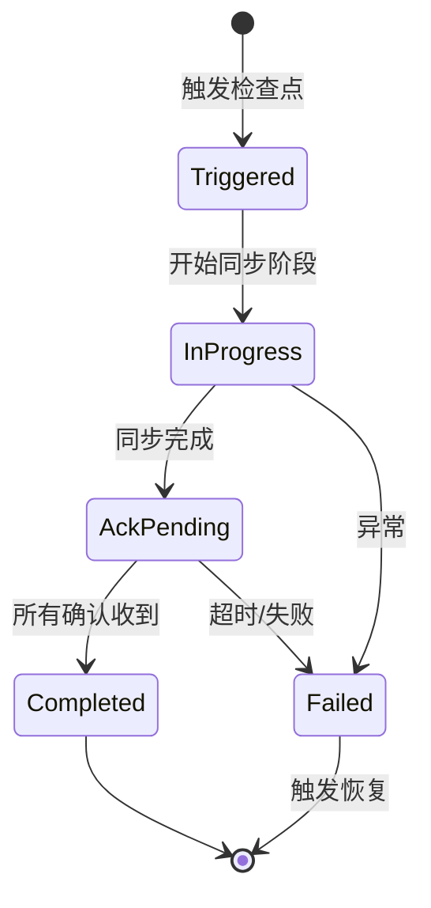
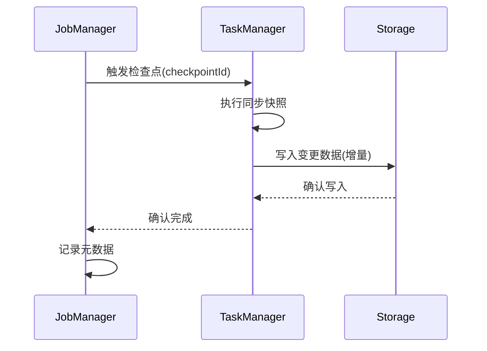
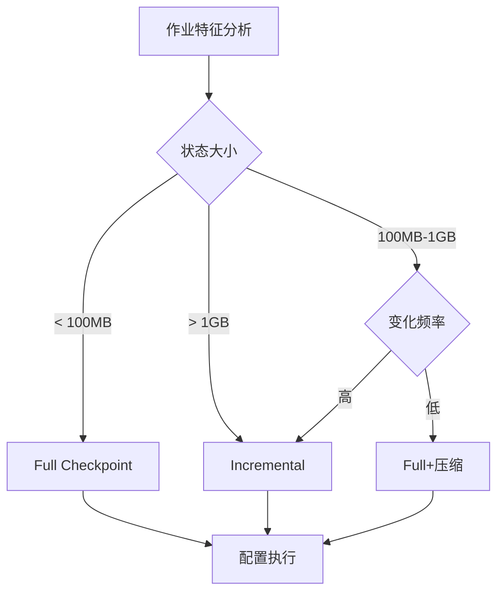

# Flink 2.4 智能检查点策略 特性跟踪

> 所属阶段: Flink/flink-24 | 前置依赖: [Checkpoint机制][^1] | 形式化等级: L4

## 1. 概念定义 (Definitions)

### Def-F-24-10: Smart Checkpointing

智能检查点是根据运行时状态动态调整检查点策略的机制：
$$
\text{CP}_{\text{config}} = f(\text{StateSize}, \text{Throughput}, \text{Latency}, \text{Resources})
$$

### Def-F-24-11: Incremental Checkpoint

增量检查点只持久化自上次检查点以来的状态变化：
$$
\Delta S_t = S_t - S_{t-1}
$$

### Def-F-24-12: Checkpoint Cost Model

检查点成本模型：
$$
C_{\text{cp}} = \alpha \cdot T_{\text{sync}} + \beta \cdot \text{DataSize} + \gamma \cdot T_{\text{async}}
$$

## 2. 属性推导 (Properties)

### Prop-F-24-10: Recovery Time Bound

恢复时间上界：
$$
T_{\text{recover}} \leq T_{\text{download}} + T_{\text{restore}} + T_{\text{replay}}
$$

### Prop-F-24-11: Checkpoint Overhead

检查点开销约束：
$$
\frac{T_{\text{checkpoint}}}{T_{\text{interval}}} \leq \theta_{\text{max}}
$$

### Prop-F-24-12: State Consistency

检查点保证状态一致性：
$$
\forall \text{CP}_i : \text{State}_{\text{cp}} \in \{S \mid \text{Consistent}(S)\}
$$

## 3. 关系建立 (Relations)

### 检查点策略对比

| 策略 | 适用场景 | 开销 | 恢复速度 |
|------|----------|------|----------|
| Full | 小状态 | 高 | 快 |
| Incremental | 大状态、变化小 | 低 | 较慢 |
| Differential | 变化集中 | 中 | 中等 |
| Native Incremental | RocksDB | 低 | 快 |

### 与状态后端关系

| 状态后端 | 支持策略 | 推荐场景 |
|----------|----------|----------|
| Memory | Full | 开发测试 |
| FsStateBackend | Full/Incremental | 中小状态 |
| RocksDB | All | 大状态、生产 |
| Changelog | Incremental优先 |  Exactly-Once |

## 4. 论证过程 (Argumentation)

### 4.1 智能检查点架构

```
┌─────────────────────────────────────────────────────────┐
│                Smart Checkpoint Manager                 │
├─────────────────────────────────────────────────────────┤
│  ┌──────────┐  ┌──────────┐  ┌──────────┐  ┌─────────┐ │
│  │ Analyzer │  │ Strategy │  │ Scheduler│  │ Monitor │ │
│  │          │→ │ Selector │→ │          │→ │         │ │
│  └──────────┘  └──────────┘  └──────────┘  └─────────┘ │
├─────────────────────────────────────────────────────────┤
│                State Backend Layer                      │
└─────────────────────────────────────────────────────────┘
```

### 4.2 自适应策略决策

| 运行时指标 | 策略调整 |
|------------|----------|
| 状态变化率低(<5%) | 优先Incremental |
| 状态变化率高(>50%) | 使用Differential |
| 反压严重 | 延长Interval |
| 网络带宽充足 | 缩短Interval |
| 磁盘I/O高 | 压缩+异步 |

## 5. 形式证明 / 工程论证

### 5.1 增量检查点正确性

**定理 (Thm-F-24-04)**: 增量检查点能正确恢复状态。

**证明**:
设完整检查点为 $S_0$，增量检查点为 $\Delta S_1, \Delta S_2, ..., \Delta S_n$

恢复时状态重构：
$$
S_n = S_0 + \sum_{i=1}^{n} \Delta S_i
$$

由于每个 $\Delta S_i$ 都记录了确定性的状态变化，且变化顺序与处理顺序一致，因此重构状态与原始状态等价。

**复杂度分析**:

- 存储: $O(|S_0| + \sum |\Delta S_i|)$ vs $O(n \cdot |S|)$ for full
- 恢复: $O(|S_0| + \sum |\Delta S_i|)$
- 最优: 当变化稀疏时，$|\Delta S_i| \ll |S|$

### 5.2 自适应间隔算法

```java
public class AdaptiveCheckpointScheduler {

    public Duration calculateNextInterval(CheckpointStats stats) {
        // 基础间隔
        Duration baseInterval = config.getBaseInterval();

        // 根据处理延迟调整
        double latencyFactor = calculateLatencyFactor(stats);

        // 根据状态大小调整
        double sizeFactor = calculateSizeFactor(stats);

        // 根据反压情况调整
        double backpressureFactor = calculateBackpressureFactor();

        // 计算调整后的间隔
        long adjustedMs = (long) (baseInterval.toMillis()
            * latencyFactor
            * sizeFactor
            * backpressureFactor);

        // 限制在合理范围
        return Duration.ofMillis(
            Math.max(MIN_INTERVAL,
                Math.min(MAX_INTERVAL, adjustedMs))
        );
    }

    private double calculateBackpressureFactor() {
        if (backpressureRatio > 0.8) {
            return 2.0; // 严重反压，延长间隔
        } else if (backpressureRatio > 0.5) {
            return 1.5;
        } else if (backpressureRatio < 0.1) {
            return 0.8; // 无反压，可以缩短
        }
        return 1.0;
    }
}
```

## 6. 实例验证 (Examples)

### 6.1 配置示例

```yaml
# 智能检查点配置
execution.checkpointing.mode: EXACTLY_ONCE
execution.checkpointing.interval: 30s
execution.checkpointing.timeout: 10min

# 智能策略
execution.checkpointing.smart.enabled: true
execution.checkpointing.smart.strategy: ADAPTIVE
execution.checkpointing.smart.min-interval: 10s
execution.checkpointing.smart.max-interval: 5min
execution.checkpointing.smart.overhead-threshold: 0.1

# 增量检查点
state.backend.incremental: true
state.backend.changelog.enabled: true
state.backend.changelog.periodic-materialize.interval: 3min
```

### 6.2 代码示例

```java
// 自定义检查点监听器
public class SmartCheckpointListener implements CheckpointListener {

    @Override
    public void notifyCheckpointComplete(long checkpointId) {
        CheckpointStats stats = checkpointStatsTracker.getStats(checkpointId);

        // 分析检查点性能
        if (stats.getDuration() > WARNING_THRESHOLD) {
            logger.warn("Checkpoint {} took {}ms, consider optimization",
                checkpointId, stats.getDuration());
        }

        // 调整下次策略
        if (stats.getStateSize() > INCREMENTAL_THRESHOLD) {
            checkpointCoordinator.enableIncrementalCheckpoint();
        }
    }

    @Override
    public void notifyCheckpointAborted(long checkpointId) {
        // 处理失败情况
        checkpointCoordinator.increaseTimeout();
    }
}
```

## 7. 可视化 (Visualizations)

### 检查点生命周期



### 增量检查点流程



### 策略选择决策树



## 8. 引用参考 (References)

[^1]: Apache Flink Documentation, "Checkpointing", 2025. <https://nightlies.apache.org/flink/flink-docs-stable/docs/dev/datastream/fault-tolerance/checkpointing/>

---

## 跟踪信息

| 属性 | 值 |
|------|-----|
| FLIP编号 | FLIP-xyz |
| 目标版本 | Flink 2.4 |
| 当前状态 | GA |
| JIRA epic | FLINK-35xxx |
| 兼容性 | 向后兼容 |
| 关键特性 | 自适应间隔、智能策略选择 |
