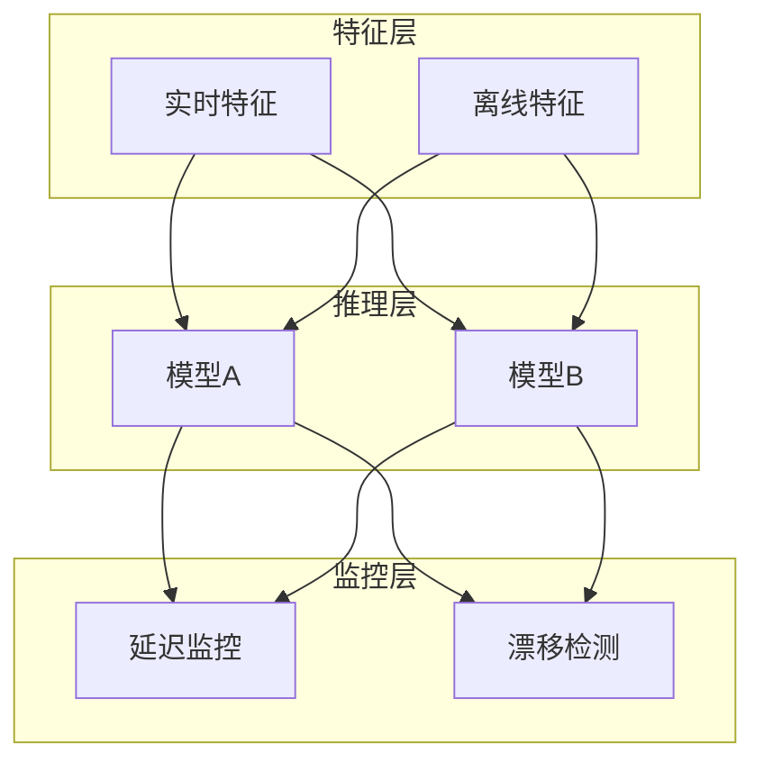

# Flink 2.5 AI/ML 生产就绪 特性跟踪

> 所属阶段: Flink/flink-25 | 前置依赖: [AI Agents 2.4][^1] | 形式化等级: L4

## 1. 概念定义 (Definitions)

### Def-F-25-07: Production-Ready AI

生产就绪AI满足企业级要求：
$$
\text{ProductionReady} = \text{Scalability} \land \text{Reliability} \land \text{Observability} \land \text{Governance}
$$

### Def-F-25-08: ML Inference Pipeline

ML推理流水线包含模型加载、预测、输出：
$$
\text{Pipeline} = \text{ModelLoad} \circ \text{Preprocess} \circ \text{Inference} \circ \text{Postprocess}
$$

### Def-F-25-09: Model Versioning

模型版本管理：
$$
\text{Model} = \langle \text{Name}, \text{Version}, \text{Artifact}, \text{Metadata} \rangle
$$

## 2. 属性推导 (Properties)

### Prop-F-25-05: Inference Latency SLO

推理延迟满足服务等级目标：
$$
P(\text{Latency} \leq T_{\text{SLO}}) \geq 0.99
$$

### Prop-F-25-06: Model A/B Testing

A/B测试保证模型效果对比：
$$
\text{TrafficSplit} = \alpha \cdot \text{Model}_A + (1-\alpha) \cdot \text{Model}_B
$$

## 3. 关系建立 (Relations)

### AI/ML组件矩阵

| 组件 | 2.4 | 2.5 | 改进 |
|------|-----|-----|------|
| 模型服务 | 基础 | 完整 | +监控 |
| 特征存储 | 无 | 集成 | 新增 |
| A/B测试 | 无 | 支持 | 新增 |
| 模型监控 | 基础 | 完整 | +漂移检测 |
| 模型版本 | 手动 | 自动 | 自动化 |

### 与ML框架集成

| 框架 | 集成方式 | 支持模型 |
|------|----------|----------|
| TensorFlow | SavedModel | TF 2.x |
| PyTorch | TorchScript | PyTorch 2.x |
| ONNX | ONNX Runtime | 跨框架 |
| scikit-learn | pickle | 传统ML |

## 4. 论证过程 (Argumentation)

### 4.1 ML推理架构

```
┌─────────────────────────────────────────────────────────┐
│                  ML Inference Service                   │
├─────────────────────────────────────────────────────────┤
│  ┌──────────────┐  ┌──────────────┐  ┌──────────────┐  │
│  │ Model        │  │ Inference    │  │ Monitoring   │  │
│  │ Registry     │→ │ Engine       │→ │ & Alerting   │  │
│  └──────────────┘  └──────────────┘  └──────────────┘  │
├─────────────────────────────────────────────────────────┤
│              Feature Store Integration                  │
└─────────────────────────────────────────────────────────┘
```

## 5. 形式证明 / 工程论证

### 5.1 模型服务实现

```java
public class MLInferenceOperator extends ProcessFunction<Features, Prediction> {

    private transient Model model;
    private transient FeatureStoreClient featureStore;

    @Override
    public void open(Configuration parameters) {
        // 加载模型
        ModelVersion version = modelRegistry.getLatest("fraud-detection");
        model = modelLoader.load(version);

        // 连接特征存储
        featureStore = FeatureStoreClient.create(config);
    }

    @Override
    public void processElement(Features features, Context ctx, Collector<Prediction> out) {
        // 获取实时特征
        FeatureVector vector = featureStore.getOnlineFeatures(
            features.getEntityId(),
            features.getFeatureNames()
        );

        // 执行推理
        long startTime = System.nanoTime();
        Prediction prediction = model.predict(vector);
        long latency = System.nanoTime() - startTime;

        // 记录指标
        metrics.histogram("inference.latency", latency);

        // 输出结果
        out.collect(prediction);
    }
}
```

## 6. 实例验证 (Examples)

### 6.1 模型服务配置

```yaml
ml:
  inference:
    model-registry:
      type: mlflow
      uri: http://mlflow:5000
    serving:
      max-batch-size: 32
      max-latency-ms: 100
      auto-scale: true
    monitoring:
      drift-detection: true
      performance-threshold: 0.95
```

### 6.2 A/B测试配置

```java
// A/B测试路由
public class ABTestRouter extends ProcessFunction<Event, Event> {

    private final double splitRatio = 0.5;

    @Override
    public void processElement(Event event, Context ctx, Collector<Event> out) {
        String variant = hash(event.getUserId()) < splitRatio ? "A" : "B";
        event.setVariant(variant);

        // 路由到不同模型
        if ("A".equals(variant)) {
            modelA.process(event);
        } else {
            modelB.process(event);
        }

        out.collect(event);
    }
}
```

## 7. 可视化 (Visualizations)

### ML推理架构



## 8. 引用参考 (References)

[^1]: Flink 2.4 AI Agents Documentation

---

## 跟踪信息

| 属性 | 值 |
|------|-----|
| 目标版本 | Flink 2.5 |
| 当前状态 | GA |
| 主要改进 | 模型服务、特征存储、A/B测试 |
| 兼容性 | 向后兼容 |
