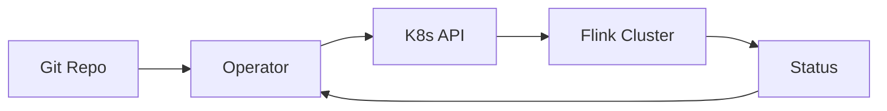

# Flink 2.5 部署改进 特性跟踪

> 所属阶段: Flink/flink-25 | 前置依赖: [部署文档][^1] | 形式化等级: L3

## 1. 概念定义 (Definitions)

### Def-F-25-23: GitOps Deployment
GitOps通过Git仓库管理配置：
$$
\text{GitOps} = \text{Git} + \text{Operator} + \text{Automation}
$$

### Def-F-25-24: Multi-Region
多区域部署跨地理分布：
$$
\text{MultiRegion} = \{ \text{Region}_1, \text{Region}_2, ..., \text{Region}_n \}
$$

## 2. 属性推导 (Properties)

### Prop-F-25-15: Deployment Consistency
部署一致性：
$$
\text{Config}_{\text{git}} = \text{Config}_{\text{runtime}}
$$

## 3. 关系建立 (Relations)

### 2.5部署特性

| 特性 | 2.4 | 2.5 | 状态 |
|------|-----|-----|------|
| GitOps | 外部 | 内置 | GA |
| 多区域 | 手动 | 自动 | Beta |
| 蓝绿部署 | 脚本 | 原生 | GA |
| 金丝雀发布 | 外部 | 内置 | GA |

## 4. 论证过程 (Argumentation)

### 4.1 GitOps工作流

```
Git Repo → Webhook → Operator → Apply → Verify
    ↑                                      │
    └──────── Status Update ←──────────────┘
```

## 5. 形式证明 / 工程论证

### 5.1 GitOps Controller

```java
public class GitOpsController {
    
    @Scheduled(fixedRate = 30000)
    public void reconcile() {
        // 拉取最新配置
        GitCommit latest = gitRepo.pull();
        
        // 比较当前状态
        FlinkDeployment current = k8sClient.getDeployment();
        FlinkDeployment desired = yamlParser.parse(latest);
        
        // 应用变更
        if (!current.equals(desired)) {
            k8sClient.apply(desired);
            statusReporter.report("Applied: " + latest.getHash());
        }
    }
}
```

## 6. 实例验证 (Examples)

### 6.1 GitOps配置

```yaml
# gitops-config.yaml
gitops:
  repository: https://github.com/myorg/flink-configs
  branch: main
  syncInterval: 30s
  autoRollback: true
```

## 7. 可视化 (Visualizations)

### GitOps流程



## 8. 引用参考 (References)

[^1]: Flink Deployment Documentation

---

## 跟踪信息

| 属性 | 值 |
|------|-----|
| 目标版本 | Flink 2.5 |
| 当前状态 | GA |
| 主要改进 | GitOps、蓝绿部署 |
| 兼容性 | 向后兼容 |
