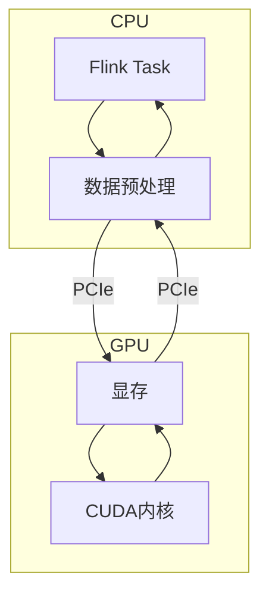

# Flink 2.5 GPU加速算子 特性跟踪

> 所属阶段: Flink/flink-25 | 前置依赖: [GPU支持][^1] | 形式化等级: L4

## 1. 概念定义 (Definitions)

### Def-F-25-10: GPU Acceleration
GPU加速利用GPU并行计算能力：
$$
\text{Speedup} = \frac{T_{\text{CPU}}}{T_{\text{GPU}}} = \frac{\text{Parallelism}_{\text{GPU}}}{\text{Parallelism}_{\text{CPU}}}
$$

### Def-F-25-11: CUDA Kernel
CUDA内核是GPU上执行的函数：
$$
\text{Kernel} : \langle \text{Grid}, \text{Block}, \text{Thread} \rangle \to \text{Computation}
$$

### Def-F-25-12: GPU Operator
GPU算子是Flink中利用GPU的算子：
$$
\text{GPUOp} = \text{FlinkOp} + \text{GPUKernel} + \text{DataTransfer}
$$

## 2. 属性推导 (Properties)

### Prop-F-25-07: GPU Speedup
GPU加速比下界：
$$
\text{Speedup} \geq \frac{n}{\log n} \text{ (for parallelizable workload)}
$$

### Prop-F-25-08: Memory Transfer Overhead
数据传输开销约束：
$$
T_{\text{transfer}} < 0.2 \times T_{\text{compute}}
$$

## 3. 关系建立 (Relations)

### GPU适用场景

| 场景 | CPU | GPU | 加速比 |
|------|-----|-----|--------|
| 矩阵运算 | 基准 | 10-100x | 高 |
| 向量计算 | 基准 | 5-20x | 中 |
| 图像处理 | 基准 | 10-50x | 高 |
| 简单过滤 | 基准 | 0.5-2x | 低/负 |

### 2.5 GPU特性

| 特性 | 描述 | 状态 |
|------|------|------|
| CUDA支持 | NVIDIA GPU | GA |
| ROCm支持 | AMD GPU | Beta |
| 自动卸载 | 自动检测GPU适用性 | GA |
| 显存管理 | 统一内存管理 | GA |

## 4. 论证过程 (Argumentation)

### 4.1 GPU加速架构

```
┌─────────────────────────────────────────────────────────┐
│                    Flink TaskManager                    │
├─────────────────────────────────────────────────────────┤
│  CPU Side                    GPU Side                   │
│  ┌──────────────┐           ┌──────────────┐           │
│  │ Flink Op     │←────────→│ GPU Kernel   │           │
│  │ (Control)    │  Transfer │ (Compute)    │           │
│  └──────────────┘           └──────────────┘           │
│         ↑                          ↑                   │
│  ┌──────────────┐           ┌──────────────┐           │
│  │ Host Memory  │←────────→│ Device Memory│           │
│  └──────────────┘   DMA     └──────────────┘           │
└─────────────────────────────────────────────────────────┘
```

## 5. 形式证明 / 工程论证

### 5.1 GPU算子实现

```java
public class GPUMatrixMultiply extends RichMapFunction<Matrix, Matrix> {
    
    private transient cublasHandle handle;
    private transient CUDAStream stream;
    
    @Override
    public void open(Configuration parameters) {
        // 初始化CUDA
        CUDA.checkCUDA(CUDA.cudaSetDevice(0));
        handle = new cublasHandle();
        cublasCreate(handle);
        stream = new CUDAStream();
    }
    
    @Override
    public Matrix map(Matrix input) {
        // 分配GPU内存
        CUdeviceptr d_input = new CUdeviceptr();
        CUdeviceptr d_output = new CUdeviceptr();
        
        CUDA.cudaMalloc(d_input, input.size() * Sizeof.FLOAT);
        CUDA.cudaMalloc(d_output, outputSize * Sizeof.FLOAT);
        
        // 数据传输 H2D
        CUDA.cudaMemcpyAsync(d_input, input.data(), 
            input.size() * Sizeof.FLOAT, 
            cudaMemcpyHostToDevice, stream);
        
        // 执行GPU内核
        launchKernel(d_input, d_output, input.rows(), input.cols());
        
        // 数据传输 D2H
        float[] output = new float[outputSize];
        CUDA.cudaMemcpyAsync(output, d_output, 
            outputSize * Sizeof.FLOAT,
            cudaMemcpyDeviceToHost, stream);
        
        // 同步
        stream.synchronize();
        
        // 释放资源
        CUDA.cudaFree(d_input);
        CUDA.cudaFree(d_output);
        
        return new Matrix(output);
    }
}
```

## 6. 实例验证 (Examples)

### 6.1 GPU资源配置

```yaml
# flink-conf.yaml
taskmanager.resource.gpu.enabled: true
taskmanager.resource.gpu.amount: 1
taskmanager.resource.gpu.type: nvidia

# GPU算子配置
operators.gpu.enabled: true
operators.gpu.auto-offload: true
operators.gpu.min-batch-size: 1000
```

### 6.2 使用GPU算子

```java
// 启用GPU加速的矩阵运算
DataStream<Matrix> matrices = ...;

DataStream<Matrix> results = matrices
    .map(new GPUMatrixMultiply())
    .setParallelism(2)  // 2个GPU
    .name("GPU-MatMul");
```

## 7. 可视化 (Visualizations)

### GPU加速架构



## 8. 引用参考 (References)

[^1]: NVIDIA CUDA Documentation, https://docs.nvidia.com/cuda/

---

## 跟踪信息

| 属性 | 值 |
|------|-----|
| 目标版本 | Flink 2.5 |
| 当前状态 | GA |
| 主要改进 | CUDA支持、自动卸载 |
| 兼容性 | 需要NVIDIA GPU |
