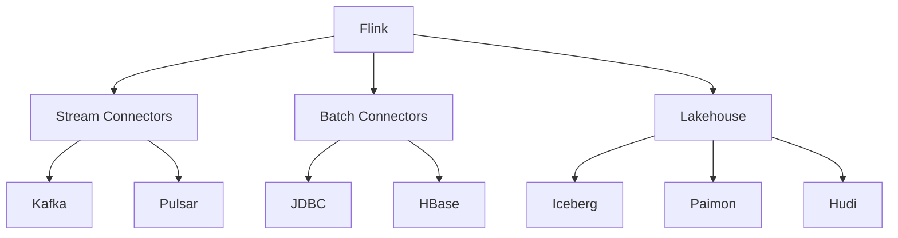

# Flink 2.5 新连接器 特性跟踪

> 所属阶段: Flink/flink-25 | 前置依赖: [连接器框架][^1] | 形式化等级: L3

## 1. 概念定义 (Definitions)

### Def-F-25-19: Connector Evolution

连接器演进是功能迭代过程：
$$
\text{Connector}_{v2} = \text{Connector}_{v1} + \Delta\text{Features}
$$

### Def-F-25-20: Multi-Version Support

多版本支持允许同时运行不同版本：
$$
\text{MultiVersion} = \{ \text{Connector}_1, \text{Connector}_2, ... \}
$$

## 2. 属性推导 (Properties)

### Prop-F-25-13: Backward Compatibility

向后兼容性：
$$
\text{Config}_{v1} \subseteq \text{Config}_{v2}
$$

## 3. 关系建立 (Relations)

### 2.5新增连接器

| 连接器 | 类型 | 状态 |
|--------|------|------|
| Confluent Cloud | Source/Sink | GA |
| Snowflake | Sink | GA |
| Databricks Delta | Source/Sink | Preview |
| Materialize | Sink | Beta |
| RisingWave | Source/Sink | Beta |
| Hudi 0.14 | Source/Sink | GA |

## 4. 论证过程 (Argumentation)

### 4.1 连接器选择决策

```
数据源 → 评估需求 → 选择连接器 → 配置参数 → 测试验证
            ↓
    实时性? 一致性? 吞吐量?
```

## 5. 形式证明 / 工程论证

### 5.1 Snowflake Sink实现

```java
public class SnowflakeSink implements TwoPhaseCommitSinkFunction<Row, SnowflakeTransaction, Void> {

    private transient SnowflakeConnection connection;

    @Override
    protected void invoke(SnowflakeTransaction transaction, Row value, Context context) {
        // 批量写入到stage
        transaction.writeToStage(value);
    }

    @Override
    protected void commit(SnowflakeTransaction transaction) {
        // COPY INTO从stage到table
        transaction.copyIntoTable();
    }
}
```

## 6. 实例验证 (Examples)

### 6.1 Snowflake配置

```sql
CREATE TABLE snowflake_sink (
    id INT,
    data STRING,
    event_time TIMESTAMP(3)
) WITH (
    'connector' = 'snowflake',
    'url' = 'https://account.snowflakecomputing.com',
    'warehouse' = 'COMPUTE_WH',
    'database' = 'mydb',
    'schema' = 'public',
    'table' = 'events',
    'user' = 'flink',
    'private-key' = '${SNOWFLAKE_KEY}'
);
```

## 7. 可视化 (Visualizations)

### 连接器生态



## 8. 引用参考 (References)

[^1]: Flink Connectors Documentation

---

## 跟踪信息

| 属性 | 值 |
|------|-----|
| 目标版本 | Flink 2.5 |
| 当前状态 | GA |
| 主要改进 | 云连接器、Lakehouse |
| 兼容性 | 向后兼容 |
