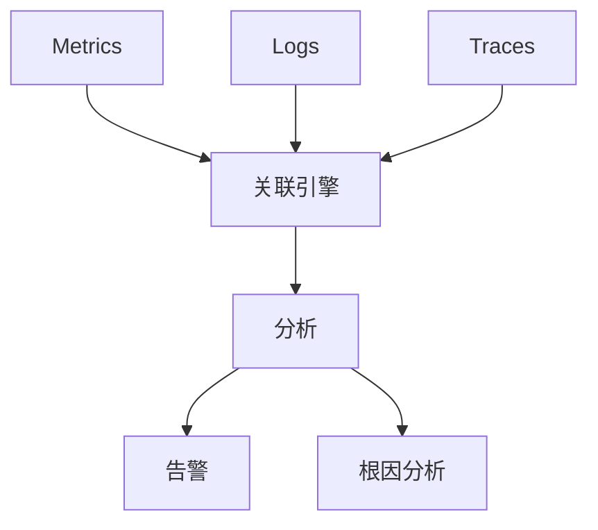

# Flink 2.5 可观测性 特性跟踪

> 所属阶段: Flink/flink-25 | 前置依赖: [可观测性基础][^1] | 形式化等级: L3

## 1. 概念定义 (Definitions)

### Def-F-25-25: Unified Observability
统一可观测性整合Metrics/Logs/Traces：
$$
\text{Unified} = \text{Metrics} \times \text{Logs} \times \text{Traces}
$$

### Def-F-25-26: Real-time Analytics
实时分析即时处理可观测性数据：
$$
\text{Analytics} : \text{ObsData} \xrightarrow{\text{stream}} \text{Insights}
$$

## 2. 属性推导 (Properties)

### Prop-F-25-16: Correlation Accuracy
关联准确性：
$$
P(\text{CorrectCorrelation}) \geq 0.95
$$

## 3. 关系建立 (Relations)

### 2.5可观测性特性

| 特性 | 2.4 | 2.5 | 状态 |
|------|-----|-----|------|
| 统一仪表板 | 部分 | 完整 | GA |
| 自动告警 | 规则 | AI驱动 | Beta |
| 根因分析 | 手动 | 自动 | Preview |
| 成本分析 | 无 | 内置 | GA |

## 4. 论证过程 (Argumentation)

### 4.1 统一可观测性平台

```
┌─────────────────────────────────────────────────────────┐
│                  Unified Observability                  │
├─────────────────────────────────────────────────────────┤
│  Metrics    Logs    Traces                              │
│     ↓         ↓        ↓                                │
│  ┌─────────────────────────────────────────────────┐   │
│  │         Correlation Engine                       │   │
│  └─────────────────────────────────────────────────┘   │
│     ↓                                                   │
│  ┌─────────────────────────────────────────────────┐   │
│  │         Analytics & Alerting                     │   │
│  └─────────────────────────────────────────────────┘   │
└─────────────────────────────────────────────────────────┘
```

## 5. 形式证明 / 工程论证

### 5.1 自动根因分析

```java
public class RootCauseAnalyzer {
    
    public RootCause analyze(AnomalyEvent event) {
        // 构建依赖图
        DependencyGraph graph = buildDependencyGraph(event.getJob());
        
        // 收集相关指标
        List<Metric> metrics = correlationEngine.findRelated(event, graph);
        
        // 异常检测
        List<Anomaly> anomalies = metrics.stream()
            .filter(m -> anomalyDetector.isAnomalous(m))
            .collect(Collectors.toList());
        
        // 排序找到根因
        return rankByImpact(anomalies);
    }
}
```

## 6. 实例验证 (Examples)

### 6.1 统一可观测性配置

```yaml
observability:
  unified:
    enabled: true
    correlation:
      trace-to-log: true
      metric-to-trace: true
  analytics:
    anomaly-detection: true
    root-cause-analysis: true
```

## 7. 可视化 (Visualizations)

### 统一可观测性



## 8. 引用参考 (References)

[^1]: Flink Observability Documentation

---

## 跟踪信息

| 属性 | 值 |
|------|-----|
| 目标版本 | Flink 2.5 |
| 当前状态 | GA |
| 主要改进 | 统一平台、自动分析 |
| 兼容性 | 向后兼容 |
