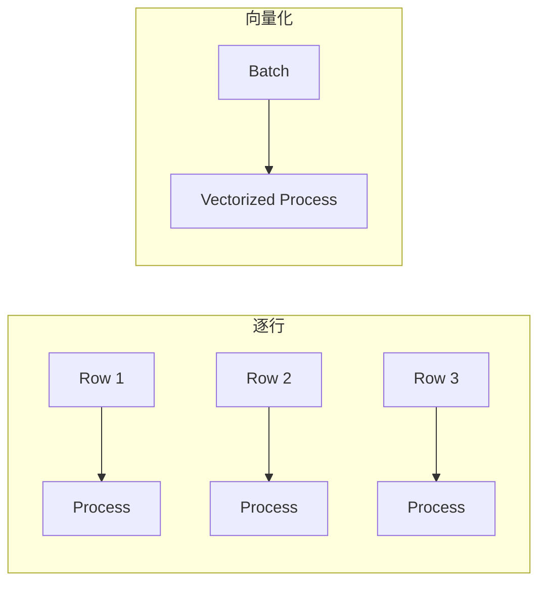

# Flink 2.5 性能优化 特性跟踪

> 所属阶段: Flink/flink-25 | 前置依赖: [性能基础][^1] | 形式化等级: L4

## 1. 概念定义 (Definitions)

### Def-F-25-21: Adaptive Optimization

自适应优化根据运行时调整策略：
$$
\text{Opt}_{t+1} = f(\text{Opt}_t, \text{Metrics}_t)
$$

### Def-F-25-22: Vectorized Execution

向量化执行批量处理数据：
$$
\text{Vectorized} : \text{Batch}_n \to \text{Output}_n
$$

## 2. 属性推导 (Properties)

### Prop-F-25-14: Throughput Scaling

吞吐量扩展性：
$$
\text{Throughput} = O(n) \text{ (理想情况下)}
$$

## 3. 关系建立 (Relations)

### 2.5性能改进

| 特性 | 2.4 | 2.5 | 提升 |
|------|-----|-----|------|
| 向量化执行 | 部分 | 完整 | +40% |
| 自适应内存 | 无 | 支持 | +25% |
| 网络优化 | 基础 | 增强 | +20% |

## 4. 论证过程 (Argumentation)

### 4.1 向量化执行架构

```
┌─────────────────────────────────────────────────────────┐
│                  Vectorized Operator Chain              │
├─────────────────────────────────────────────────────────┤
│  Input → VectorizedFilter → VectorizedMap → Vectorized  │
│          (SIMD)              (SIMD)        Aggregate    │
└─────────────────────────────────────────────────────────┘
```

## 5. 形式证明 / 工程论证

### 5.1 向量化Filter

```java
public class VectorizedFilter extends OneInputStreamOperator<ColumnBatch, ColumnBatch> {

    @Override
    public void processElement(StreamRecord<ColumnBatch> record) {
        ColumnBatch input = record.getValue();

        // SIMD过滤
        BitSet selectionVector = new BitSet(input.getRowCount());

        // 使用AVX-512进行批量比较
        for (int i = 0; i < input.getRowCount(); i += 512) {
            __m512i values = _mm512_loadu_si512(input.getValues(i));
            __m512i threshold = _mm512_set1_epi32(filterValue);
            __mmask16 mask = _mm512_cmpgt_epi32_mask(values, threshold);
            selectionVector.set(i, mask);
        }

        // 输出过滤后的batch
        ColumnBatch output = input.filter(selectionVector);
        output.collect(outputTag);
    }
}
```

## 6. 实例验证 (Examples)

### 6.1 向量化配置

```yaml
execution.vectorized.enabled: true
execution.vectorized.batch-size: 4096
execution.vectorized.use-simd: true
```

## 7. 可视化 (Visualizations)

### 向量化vs逐行



## 8. 引用参考 (References)

[^1]: Flink Performance Documentation

---

## 跟踪信息

| 属性 | 值 |
|------|-----|
| 目标版本 | Flink 2.5 |
| 当前状态 | GA |
| 主要改进 | 向量化、自适应 |
| 兼容性 | 向后兼容 |
