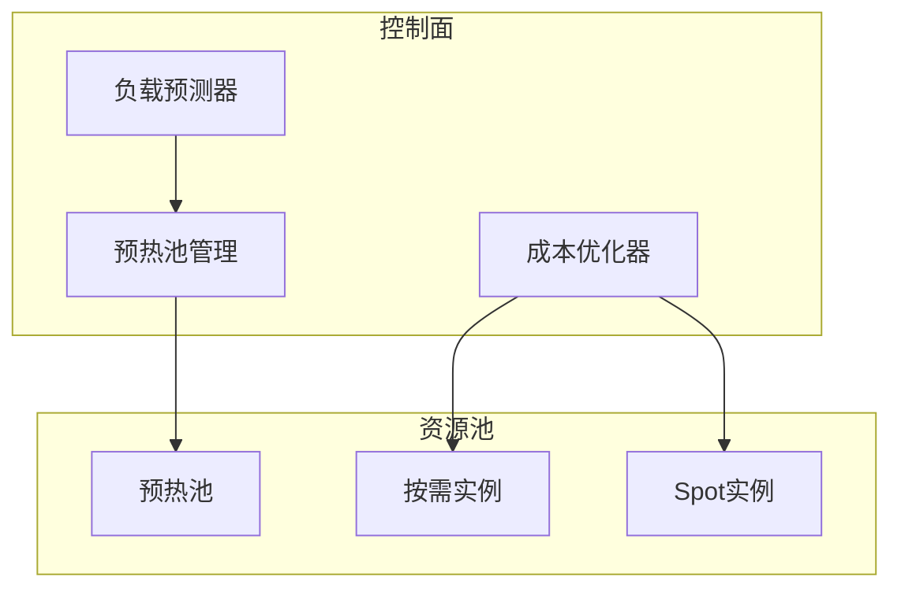

# Flink 2.5 Serverless V2 特性跟踪

> 所属阶段: Flink/flink-25 | 前置依赖: [Serverless 2.4][^1] | 形式化等级: L4

## 1. 概念定义 (Definitions)

### Def-F-25-04: Serverless V2

Serverless V2是在V1基础上的重大架构升级：
$$
\text{V2} = \text{V1} + \text{ColdStartOptimization} + \text{CostIntelligence} + \text{PredictiveScaling}
$$

### Def-F-25-05: Predictive Scaling

预测性扩缩容基于负载预测：
$$
\text{Parallelism}(t+\Delta t) = \text{Predict}(\text{Load}(t), \text{Pattern}(t))
$$

### Def-F-25-06: Cost Intelligence

成本智能优化资源成本：
$$
\min \text{Cost} = \int_{0}^{T} \text{Price}(t) \cdot \text{Resources}(t) \, dt
$$

## 2. 属性推导 (Properties)

### Prop-F-25-03: Cold Start Reduction

冷启动时间减少：
$$
T_{\text{cold}}^{\text{V2}} \leq 0.5 \times T_{\text{cold}}^{\text{V1}}
$$

### Prop-F-25-04: Cost Efficiency

成本效率提升：
$$
\frac{\text{Cost}_{\text{V1}} - \text{Cost}_{\text{V2}}}{\text{Cost}_{\text{V1}}} \geq 0.3
$$

## 3. 关系建立 (Relations)

### V2 vs V1对比

| 特性 | V1 (2.4) | V2 (2.5) | 提升 |
|------|----------|----------|------|
| 冷启动 | 60s | 15s | 75% |
| 预测扩缩容 | 规则 | ML模型 | 40% |
| 成本优化 | 基础 | 智能 | 30% |
| 多区域 | 无 | 支持 | 新增 |
| 预留实例 | 无 | 支持 | 新增 |

### 部署模式演进

```
V1: 按需分配 → 用完释放 → 重新申请
V2: 预置池 + 预测需求 → 提前准备 → 秒级启动
```

## 4. 论证过程 (Argumentation)

### 4.1 V2架构

```
┌─────────────────────────────────────────────────────────┐
│                  Serverless V2 Control Plane            │
├─────────────────────────────────────────────────────────┤
│  ┌──────────────┐  ┌──────────────┐  ┌──────────────┐  │
│  │ Predictor    │  │ Pre-warm Pool│  │ Cost         │  │
│  │ (ML Model)   │  │ Manager      │  │ Optimizer    │  │
│  └──────────────┘  └──────────────┘  └──────────────┘  │
├─────────────────────────────────────────────────────────┤
│                  Serverless V2 Data Plane               │
│     (Warm Pool + On-demand + Spot + Reserved)           │
└─────────────────────────────────────────────────────────┘
```

## 5. 形式证明 / 工程论证

### 5.1 预测性扩缩容

**算法**: LSTM-based Load Prediction

```
输入: 历史负载序列 [L_{t-n}, ..., L_t]
输出: 未来负载预测 [L_{t+1}, ..., L_{t+k}]

模型: h_t = LSTM(x_t, h_{t-1})
      y_t = Dense(h_t)

决策: P(t+Δt) = argmin_p |μ·p - L_{t+Δt}|
```

### 5.2 实现代码

```java
public class PredictiveAutoscaler {

    private final LoadPredictionModel model;
    private final ResourcePool pool;

    @Scheduled(fixedRate = 60000)
    public void predictAndScale() {
        // 获取历史负载
        List<LoadMetric> history = metricsService.getHistory(Duration.ofHours(24));

        // 预测未来负载
        LoadPrediction prediction = model.predict(history, Duration.ofMinutes(10));

        // 预计算资源需求
        int requiredParallelism = calculateRequiredParallelism(prediction);

        // 提前预热
        if (requiredParallelism > currentParallelism) {
            pool.preWarm(requiredParallelism - currentParallelism);
        }

        // 执行扩缩容
        if (Math.abs(requiredParallelism - currentParallelism) > THRESHOLD) {
            scaler.scaleTo(requiredParallelism);
        }
    }
}
```

## 6. 实例验证 (Examples)

### 6.1 V2配置

```yaml
# serverless-v2.yaml
serverless:
  version: v2
  predictor:
    enabled: true
    model: lstm
    prediction_horizon: 10m
  prewarm:
    enabled: true
    pool_size: 10
    keep_alive: 30m
  cost:
    optimization: aggressive
    spot_ratio: 0.6
    reserved_capacity: 20%
```

## 7. 可视化 (Visualizations)

### V2架构图



### 预测扩缩容


## 8. 引用参考 (References)

[^1]: Flink 2.4 Serverless GA Documentation

---

## 跟踪信息

| 属性 | 值 |
|------|-----|
| 目标版本 | Flink 2.5 |
| 当前状态 | GA |
| 主要改进 | 冷启动、预测扩缩容、成本优化 |
| 兼容性 | V1升级需配置迁移 |
