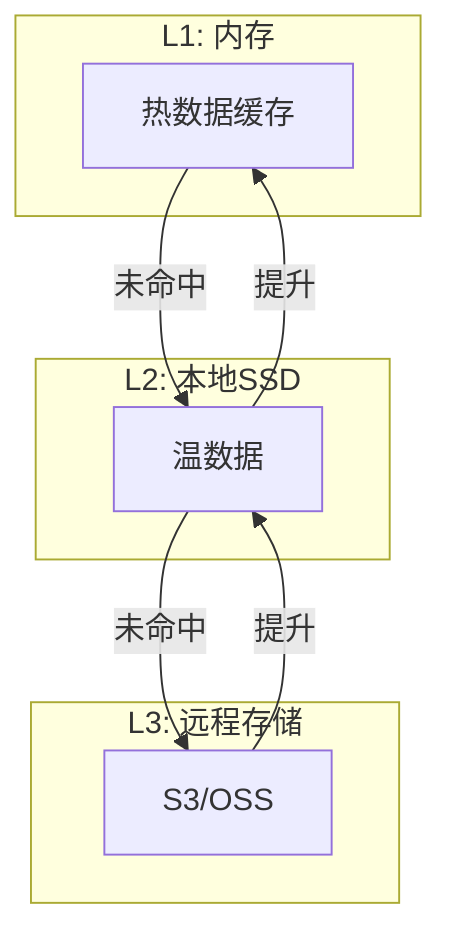
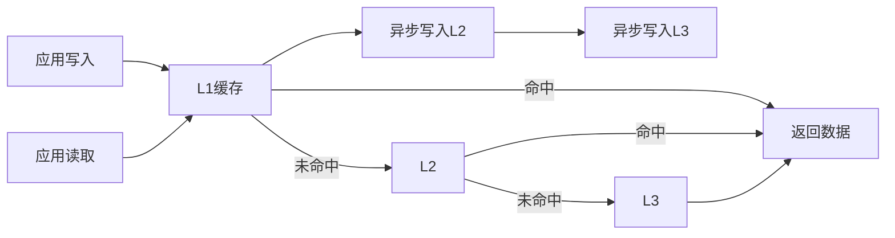

# Flink 2.5 新型存储后端 特性跟踪

> 所属阶段: Flink/flink-25 | 前置依赖: [状态后端][^1] | 形式化等级: L4

## 1. 概念定义 (Definitions)

### Def-F-25-16: State Backend
状态后端是Flink状态持久化机制：
$$
\text{Backend} = \langle \text{Storage}, \text{Serializer}, \text{Checkpoint} \rangle
$$

### Def-F-25-17: Tiered Storage
分层存储利用多级存储介质：
$$
\text{Tiered} = \langle \text{Memory}, \text{SSD}, \text{ObjectStorage} \rangle
$$

### Def-F-25-18: Remote State
远程状态将状态外置存储：
$$
\text{Remote} = \text{State}_{\text{local}} \xrightarrow{\text{Async}} \text{State}_{\text{remote}}
$$

## 2. 属性推导 (Properties)

### Prop-F-25-11: Access Latency Hierarchy
存储层级访问延迟：
$$
T_{\text{memory}} < T_{\text{ssd}} < T_{\text{network}} < T_{\text{object}}
$$

### Prop-F-25-12: Cost Efficiency
存储成本效率：
$$
\text{Cost}_{\text{tiered}} = \sum_{i} c_i \cdot s_i \quad \text{where } \sum s_i = S_{\text{total}}
$$

## 3. 关系建立 (Relations)

### 存储后端对比

| 后端 | 延迟 | 容量 | 成本 | 适用场景 |
|------|------|------|------|----------|
| Memory | 100ns | 小 | 高 | 小状态 |
| RocksDB | 10μs | 中 | 中 | 通用 |
| Tiered | 混合 | 大 | 低 | 大状态 |
| Remote | 1ms+ | 极大 | 极低 | 超大规模 |

### 2.5新特性

| 特性 | 描述 | 状态 |
|------|------|------|
| TieredStateBackend | 自动分层 | GA |
| RemoteStateBackend | 远程存储 | Preview |
| State Compression | 压缩算法优化 | GA |
| Async Snapshot | 异步快照 | GA |

## 4. 论证过程 (Argumentation)

### 4.1 分层存储架构

```
┌─────────────────────────────────────────────────────────┐
│                    Tiered State Backend                 │
├─────────────────────────────────────────────────────────┤
│  ┌──────────────┐  ┌──────────────┐  ┌──────────────┐  │
│  │ L1: Memory   │→ │ L2: Local    │→ │ L3: Remote   │  │
│  │ (Hot Data)   │  │ SSD          │  │ (Cold Data)  │  │
│  └──────────────┘  └──────────────┘  └──────────────┘  │
│         ↑                 ↑                 ↑           │
│    最频繁访问         频繁访问            偶尔访问       │
└─────────────────────────────────────────────────────────┘
```

## 5. 形式证明 / 工程论证

### 5.1 分层存储管理

```java
public class TieredStateBackend implements StateBackend {
    
    private final StateBackend l1Cache;    // Memory
    private final StateBackend l2Storage;  // Local SSD
    private final StateBackend l3Remote;   // Object Storage
    
    @Override
    public <K> ValueState<K> getValueState(ValueStateDescriptor<K> descriptor) {
        return new TieredValueState<>(descriptor, l1Cache, l2Storage, l3Remote);
    }
    
    private class TieredValueState<K> implements ValueState<K> {
        
        private volatile K cachedValue;  // L1 cache
        
        @Override
        public K value() {
            if (cachedValue != null) {
                return cachedValue;  // L1 hit
            }
            
            // Try L2
            K value = l2Storage.get(key);
            if (value != null) {
                cachedValue = value;  // Promote to L1
                return value;
            }
            
            // L3
            value = l3Remote.get(key);
            if (value != null) {
                l2Storage.put(key, value);  // Promote to L2
                cachedValue = value;         // Promote to L1
            }
            return value;
        }
        
        @Override
        public void update(K value) {
            cachedValue = value;
            l2Storage.putAsync(key, value);
            l3Remote.putAsync(key, value);
        }
    }
}
```

## 6. 实例验证 (Examples)

### 6.1 Tiered配置

```yaml
# flink-conf.yaml
state.backend: tiered
state.backend.tiered.l1: memory
state.backend.tiered.l1.size: 100mb
state.backend.tiered.l2: rocksdb
state.backend.tiered.l2.path: /data/flink/ssd
state.backend.tiered.l3: s3
state.backend.tiered.l3.bucket: flink-state-bucket
state.backend.tiered.promotion.threshold: 0.8
```

### 6.2 Remote State配置

```java
// Remote State Backend
Configuration config = new Configuration();
config.set(StateBackendOptions.STATE_BACKEND, "remote");
config.set(RemoteStateBackendOptions.REMOTE_STORAGE, "s3");
config.set(RemoteStateBackendOptions.S3_BUCKET, "flink-state");
config.set(RemoteStateBackendOptions.CACHE_SIZE, "1gb");

StreamExecutionEnvironment env = StreamExecutionEnvironment.getExecutionEnvironment();
env.configure(config);
```

## 7. 可视化 (Visualizations)

### 分层存储架构



### 数据流



## 8. 引用参考 (References)

[^1]: Apache Flink State Backend Documentation, https://nightlies.apache.org/flink/flink-docs-stable/docs/ops/state/state_backends/

---

## 跟踪信息

| 属性 | 值 |
|------|-----|
| 目标版本 | Flink 2.5 |
| 当前状态 | GA |
| 主要改进 | Tiered、Remote状态后端 |
| 兼容性 | 向后兼容 |
