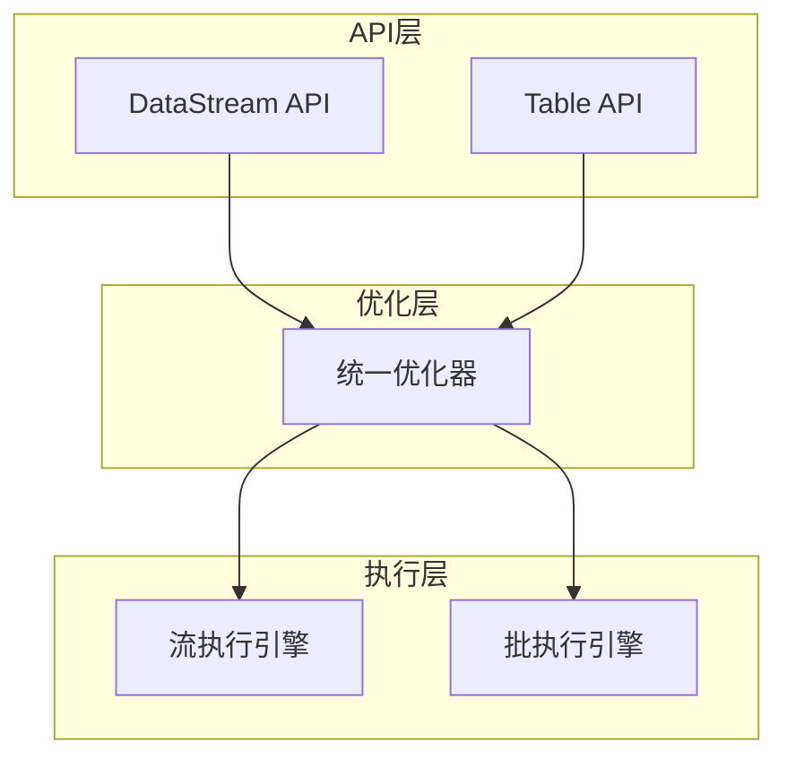
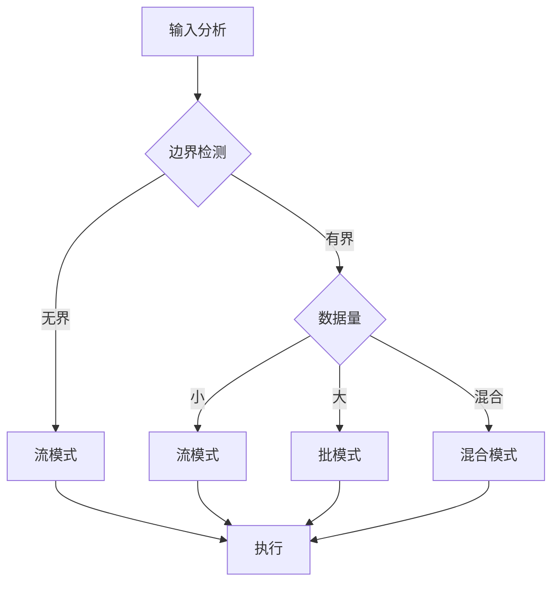

# Flink 2.5 流批一体深化 特性跟踪

> 所属阶段: Flink/flink-25 | 前置依赖: [流批一体基础][^1] | 形式化等级: L4

## 1. 概念定义 (Definitions)

### Def-F-25-01: Unified Execution
统一执行模型融合流处理和批处理语义：
$$
\text{Unified} = \text{Stream} \cup \text{Batch} : \text{SameAPI} \land \text{SameRuntime}
$$

### Def-F-25-02: Bounded Stream
有界流是批处理的流式抽象：
$$
\text{BoundedStream} = \langle \text{Source}, \text{Finite} \rangle
$$

### Def-F-25-03: Adaptive Mode
自适应模式自动选择执行策略：
$$
\text{Mode} = \begin{cases} \text{Streaming} & \text{if } \text{Unbounded} \\ \text{Batch} & \text{if } \text{Bounded} \land \text{Efficient} \\ \text{Hybrid} & \text{otherwise} \end{cases}
$$

## 2. 属性推导 (Properties)

### Prop-F-25-01: Semantic Equivalence
流批语义等价：
$$
\forall Q : \text{Result}_{\text{stream}}(Q) = \text{Result}_{\text{batch}}(Q)
$$

### Prop-F-25-02: Performance Optimization
批处理优化性能上界：
$$
\text{Perf}_{\text{batch}} \geq \text{Perf}_{\text{stream}} \text{ (for bounded input)}
$$

## 3. 关系建立 (Relations)

### 执行模式对比

| 维度 | Streaming | Batch | Unified |
|------|-----------|-------|---------|
| 延迟 | 低(ms) | 高(min) | 自适应 |
| 吞吐 | 高 | 极高 | 优化选择 |
| 容错 | Checkpoint | 重算 | 自适应 |
| 调度 | 持续 | 阶段 | 混合 |

### 2.5改进特性

| 特性 | 2.4 | 2.5 | 改进 |
|------|-----|-----|------|
| 自动模式选择 | 手动 | 自动 | 智能 |
| 混合执行 | 有限 | 完整 | 深度 |
| 资源复用 | 部分 | 完全 | 优化 |
| 状态共享 | 无 | 支持 | 新增 |

## 4. 论证过程 (Argumentation)

### 4.1 统一执行架构

```
┌─────────────────────────────────────────────────────────┐
│                     Unified API Layer                   │
│               (DataStream API / Table API)              │
├─────────────────────────────────────────────────────────┤
│                   Unified Optimizer                     │
│         (Stream Optimizer + Batch Optimizer)            │
├─────────────────────────────────────────────────────────┤
│                   Unified Runtime                       │
│    (Adaptive Scheduler + Unified State Backend)         │
└─────────────────────────────────────────────────────────┘
```

### 4.2 自适应选择策略

```
输入分析 → 边界检测 → 成本估算 → 模式选择 → 执行优化
    │          │          │          │          │
  数据源    有限/无限   资源/时间   Stream/   具体优化
  特性                 约束      Batch
```

## 5. 形式证明 / 工程论证

### 5.1 混合执行正确性

**定理 (Thm-F-25-01)**: 混合执行保持结果一致性。

**证明概要**:
设作业 $J$ 包含流部分 $J_s$ 和批部分 $J_b$。

1. 批部分执行产生确定结果 $R_b$
2. $R_b$ 作为 $J_s$ 的输入
3. $J_s$ 以流模式处理，产生增量结果

由于批部分满足幂等性，流部分满足Exactly-Once，整体结果一致。

### 5.2 实现代码

```java
public class UnifiedJobCompiler {
    
    public CompiledJob compile(JobGraph graph) {
        // 分析输入边界
        Map<Vertex, Boundedness> boundedness = analyzeBoundedness(graph);
        
        // 确定执行模式
        ExecutionMode mode = determineExecutionMode(boundedness);
        
        switch (mode) {
            case STREAMING:
                return compileStreaming(graph);
            case BATCH:
                return compileBatch(graph);
            case HYBRID:
                return compileHybrid(graph, boundedness);
        }
    }
    
    private ExecutionMode determineExecutionMode(Map<Vertex, Boundedness> boundedness) {
        boolean hasUnbounded = boundedness.values().contains(Boundedness.UNBOUNDED);
        boolean allBounded = boundedness.values().stream().allMatch(Boundedness.BOUNDED::equals);
        
        if (allBounded) return ExecutionMode.BATCH;
        if (hasUnbounded) return ExecutionMode.HYBRID;
        return ExecutionMode.STREAMING;
    }
}
```

## 6. 实例验证 (Examples)

### 6.1 自动模式配置

```yaml
# flink-conf.yaml
execution.mode: adaptive
execution.adaptive.strategy: COST_BASED
execution.batch-mode.max-parallelism: 100
execution.streaming-mode.min-parallelism: 2
```

### 6.2 混合作业示例

```java
// 混合执行示例
StreamExecutionEnvironment env = StreamExecutionEnvironment.getExecutionEnvironment();

// 批处理部分：历史数据加载
DataStream<Record> historical = env
    .fromSource(new BoundedFileSource("/data/history"), WatermarkStrategy.noWatermarks(), "history")
    .setParallelism(10)
    .name("Batch-Load");

// 流处理部分：实时数据
DataStream<Record> realtime = env
    .fromSource(new KafkaSource<>(), WatermarkStrategy.forBoundedOutOfOrderness(...), "kafka")
    .setParallelism(5)
    .name("Stream-Input");

// 统一处理
historical.union(realtime)
    .keyBy(Record::getKey)
    .process(new UnifiedProcessFunction())
    .addSink(new UnifiedSink());
```

## 7. 可视化 (Visualizations)

### 统一执行模型



### 自适应选择



## 8. 引用参考 (References)

[^1]: Apache Flink Unified Batch/Streaming Documentation, https://nightlies.apache.org/flink/flink-docs-stable/docs/concepts/overview/

---

## 跟踪信息

| 属性 | 值 |
|------|-----|
| 目标版本 | Flink 2.5 |
| 当前状态 | GA |
| 主要改进 | 自动模式选择、混合执行 |
| 兼容性 | 向后兼容 |
