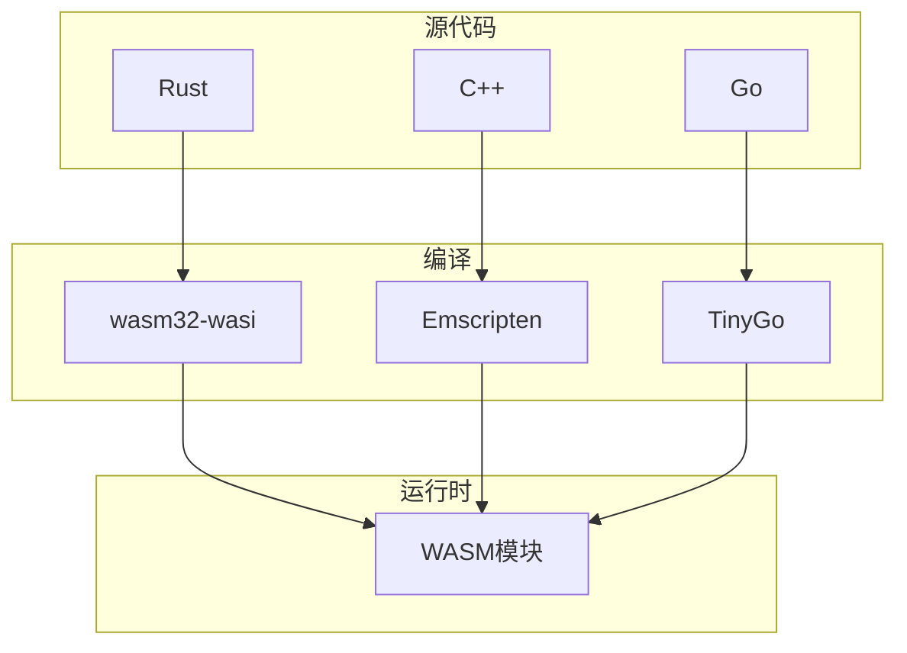

# Flink 2.5 WebAssembly UDF GA 特性跟踪

> 所属阶段: Flink/flink-25 | 前置依赖: [WASM预览][^1] | 形式化等级: L4

## 1. 概念定义 (Definitions)

### Def-F-25-13: WebAssembly UDF

WebAssembly UDF是用WASM字节码实现的自定义函数：
$$
\text{WASM-UDF} : \text{Input}^n \xrightarrow{\text{WASM}} \text{Output}^m
$$

### Def-F-25-14: WASM Runtime

WASM运行时执行WASM模块：
$$
\text{Runtime} = \langle \text{Engine}, \text{Store}, \text{Module}, \text{Instance} \rangle
$$

### Def-F-25-15: Sandboxed Execution

沙箱执行保证UDF隔离性：
$$
\forall \text{UDF} : \text{Isolated}(\text{UDF}) \land \text{ResourceConstrained}(\text{UDF})
$$

## 2. 属性推导 (Properties)

### Prop-F-25-09: Execution Isolation

UDF执行隔离性：
$$
\text{UDF}_i \perp \text{UDF}_j \implies \text{NoSharedState}(\text{UDF}_i, \text{UDF}_j)
$$

### Prop-F-25-10: Startup Latency

WASM启动延迟：
$$
T_{\text{startup}} < 10\text{ms}
$$

## 3. 关系建立 (Relations)

### UDF类型对比

| 类型 | 性能 | 安全 | 语言 | 启动 |
|------|------|------|------|------|
| Java | 高 | 中 | Java | 快 |
| Python | 中 | 中 | Python | 慢 |
| WASM | 高 | 高 | 多语言 | 快 |
| Native | 极高 | 低 | C++ | 快 |

### 支持语言

| 语言 | 编译器 | 状态 |
|------|--------|------|
| Rust | wasm32-wasi | GA |
| C/C++ | Emscripten | GA |
| Go | TinyGo | Beta |
| AssemblyScript | asc | GA |

## 4. 论证过程 (Argumentation)

### 4.1 WASM UDF架构

```
┌─────────────────────────────────────────────────────────┐
│                    Flink Runtime                        │
├─────────────────────────────────────────────────────────┤
│  ┌──────────────┐  ┌──────────────┐  ┌──────────────┐  │
│  │ UDF Manager  │→ │ WASM Runtime │→ │ Module Cache │  │
│  │              │  │ (Wasmer/     │  │              │  │
│  │              │  │  Wasmtime)   │  │              │  │
│  └──────────────┘  └──────────────┘  └──────────────┘  │
└─────────────────────────────────────────────────────────┘
```

## 5. 形式证明 / 工程论证

### 5.1 WASM UDF实现

```java
public class WasmScalarFunction extends ScalarFunction {

    private final String wasmModulePath;
    private transient Instance wasmInstance;

    @Override
    public void open(FunctionContext context) {
        // 加载WASM模块
        Engine engine = new Engine();
        Store store = new Store(engine);
        Module module = Module.fromFile(engine, wasmModulePath);

        // 创建WASI环境
        WasiOptions wasiOpts = new WasiOptions.Builder()
            .withStdout(System.out)
            .withStderr(System.err)
            .build();

        Wasi wasi = new Wasi(store, wasiOpts);

        // 实例化模块
        wasmInstance = new Instance(store, module, wasi.toImportObject());
    }

    public String eval(String input) {
        // 调用WASM函数
        Memory memory = wasmInstance.exports.getMemory("memory");
        Func processFunc = wasmInstance.exports.getFunction("process");

        // 写入输入到WASM内存
        int ptr = allocate(memory, input.getBytes(StandardCharsets.UTF_8));

        // 调用函数
        int resultPtr = (int) processFunc.apply(ptr, input.length());

        // 读取结果
        String result = readString(memory, resultPtr);

        return result;
    }
}
```

### 5.2 Rust UDF示例

```rust
// Rust UDF实现
#[no_mangle]
pub extern "C" fn process(ptr: i32, len: i32) -> i32 {
    // 从WASM内存读取输入
    let input = unsafe {
        let slice = std::slice::from_raw_parts(ptr as *const u8, len as usize);
        std::str::from_utf8_unchecked(slice)
    };

    // 执行处理
    let output = input.to_uppercase();

    // 写入结果到WASM内存
    allocate_and_write(&output)
}
```

## 6. 实例验证 (Examples)

### 6.1 注册WASM UDF

```sql
-- 注册WASM UDF
CREATE FUNCTION my_upper AS 'wasm'
USING 'file:///path/to/my_udf.wasm'
WITH (
    'function' = 'process',
    'language' = 'rust'
);

-- 使用UDF
SELECT my_upper(name) FROM users;
```

### 6.2 DataStream使用

```java
// 注册WASM函数
WasmFunction<String, String> wasmFunc = WasmFunction
    .builder()
    .modulePath("/path/to/udf.wasm")
    .functionName("process")
    .build();

// 在流中使用
dataStream
    .map(wasmFunc)
    .name("WASM-UDF");
```

## 7. 可视化 (Visualizations)

### WASM UDF执行流程


### 多语言支持



## 8. 引用参考 (References)

[^1]: WebAssembly Specification, <https://webassembly.github.io/spec/>

---

## 跟踪信息

| 属性 | 值 |
|------|-----|
| 目标版本 | Flink 2.5 |
| 当前状态 | GA |
| 主要改进 | 多语言支持、性能优化 |
| 兼容性 | 向后兼容 |
