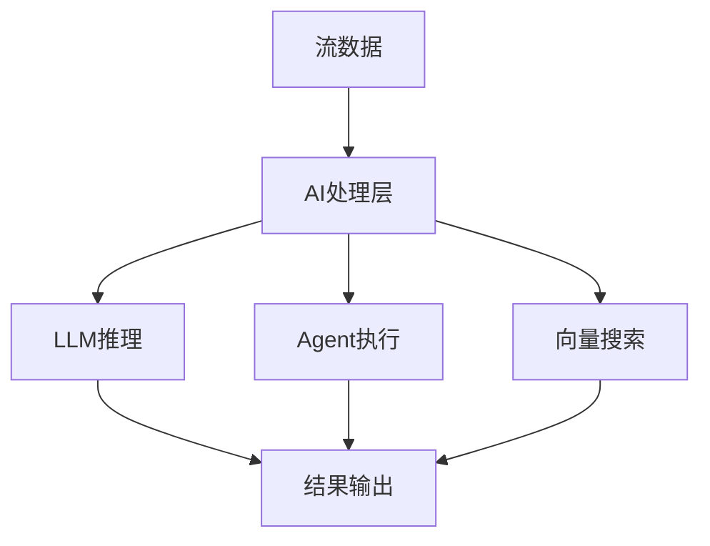

# Flink 3.0 AI原生支持 特性跟踪

> 所属阶段: Flink/flink-30 | 前置依赖: [AI集成][^1] | 形式化等级: L5

## 1. 概念定义 (Definitions)

### Def-F-30-28: AI-Native
AI原生设计：
$$
\text{AINative} = \text{FirstClassAI} \land \text{MLPipeline} \land \text{ModelServing}
$$

### Def-F-30-29: LLM Integration
大语言模型集成：
$$
\text{LLM} : \text{Prompt} \xrightarrow{\text{Stream}} \text{Tokens}
$$

### Def-F-30-30: Agentic Workflow
智能体工作流：
$$
\text{Agentic} = \langle \text{Agent}, \text{Tool}, \text{Memory}, \text{Reasoning} \rangle
$$

## 2. 属性推导 (Properties)

### Prop-F-30-17: Inference Throughput
推理吞吐量：
$$
\text{Throughput} \geq 1000 \text{ tokens/s per GPU}
$$

### Prop-F-30-18: Model Latency
模型延迟：
$$
P_{99}(\text{Latency}) \leq 100ms
$$

## 3. 关系建立 (Relations)

### AI原生特性

| 特性 | 2.5 | 3.0 | 状态 |
|------|-----|-----|------|
| LLM集成 | 外部 | 原生 | 增强 |
| Agent框架 | 基础 | 完整 | 增强 |
| 模型服务 | 部分 | 完整 | 增强 |
| 向量搜索 | 外部 | 内置 | 新增 |

## 4. 论证过程 (Argumentation)

### 4.1 AI原生架构

```
┌─────────────────────────────────────────────────────────┐
│                    AI-Native Layer                      │
├─────────────────────────────────────────────────────────┤
│  LLM Integration  →  Agent Runtime  →  Vector Store    │
│  Model Serving    →  ML Pipeline    →  Feature Store   │
└─────────────────────────────────────────────────────────┘
```

## 5. 形式证明 / 工程论证

### 5.1 LLM流式集成

```java
public class StreamingLLMOperator extends ProcessFunction<String, String> {
    
    private transient LLMClient llmClient;
    
    @Override
    public void open(Configuration parameters) {
        llmClient = LLMClient.builder()
            .model("gpt-4")
            .streaming(true)
            .build();
    }
    
    @Override
    public void processElement(String prompt, Context ctx, Collector<String> out) {
        // 流式获取tokens
        llmClient.completeStream(prompt, token -> {
            out.collect(token);
        });
    }
}
```

## 6. 实例验证 (Examples)

### 6.1 AI原生配置

```yaml
ai:
  native: true
  llm:
    provider: openai
    model: gpt-4
    streaming: true
  agents:
    enabled: true
    max-agents: 100
  vector-store:
    enabled: true
    backend: milvus
```

## 7. 可视化 (Visualizations)

### AI原生架构



## 8. 引用参考 (References)

[^1]: AI-Native Architecture Documentation

---

## 跟踪信息

| 属性 | 值 |
|------|-----|
| 目标版本 | Flink 3.0 |
| 当前状态 | 设计中 |
| 主要改进 | 原生LLM、Agent框架 |
| 兼容性 | 需要AI基础设施 |
