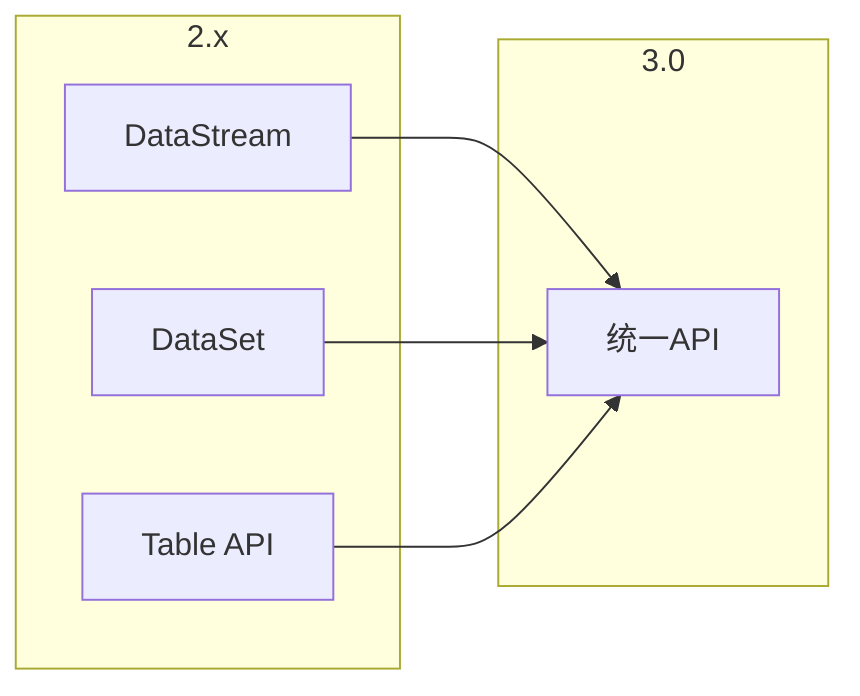
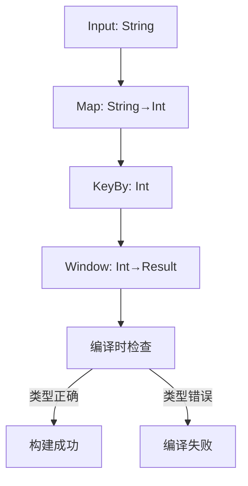

# Flink 3.0 API 重新设计 特性跟踪

> 所属阶段: Flink/flink-30 | 前置依赖: [Flink API][^1] | 形式化等级: L5

## 1. 概念定义 (Definitions)

### Def-F-30-04: Unified API
统一API融合流批处理：
$$
\text{UnifiedAPI} = \text{StreamAPI} \cap \text{BatchAPI}
$$

### Def-F-30-05: Type-Safe Builder
类型安全构建器编译时检查：
$$
\text{Builder} : \text{Config} \xrightarrow{\text{type-safe}} \text{Pipeline}
$$

### Def-F-30-06: Declarative Processing
声明式处理描述目标而非步骤：
$$
\text{Declarative} = \text{What} \gg \text{How}
$$

## 2. 属性推导 (Properties)

### Prop-F-30-03: API Completeness
API完整性：
$$
\text{API}_{3.0} \supseteq \text{API}_{2.x}^{\text{common}}
$$

### Prop-F-30-04: Migration Cost
迁移成本约束：
$$
\text{Effort}_{\text{migration}} \leq 20\% \times \text{Codebase}
$$

## 3. 关系建立 (Relations)

### API变更对比

| 特性 | 2.x | 3.0 | 状态 |
|------|-----|-----|------|
| DataStream | 独立 | 统一 | 重构 |
| DataSet | 独立 | 移除 | 废弃 |
| Table API | 独立 | 统一 | 增强 |
| SQL | 标准 | 扩展 | 增强 |
| Connectors | 多API | 统一 | 重构 |

### 新API层次

```
┌─────────────────────────────────────────────────────────┐
│                    Declarative Layer                    │
│                      (SQL / DSL)                        │
├─────────────────────────────────────────────────────────┤
│                    Unified API Layer                    │
│              (Stream/Table unified API)                 │
├─────────────────────────────────────────────────────────┤
│                    Runtime API Layer                    │
│              (Operator-level access)                    │
└─────────────────────────────────────────────────────────┘
```

## 4. 论证过程 (Argumentation)

### 4.1 API设计理念

| 原则 | 2.x | 3.0 |
|------|-----|-----|
| 简单性 | 中 | 高 |
| 一致性 | 中 | 高 |
| 表达力 | 中 | 高 |
| 可组合 | 部分 | 完整 |

## 5. 形式证明 / 工程论证

### 5.1 新API示例

```java
// 3.0统一API
Pipeline pipeline = FlinkPipeline.builder()
    .source(Source.kafka("topic"))
    .transform(Transform.map(r -> r.value()))
    .window(Window.tumbling(Duration.ofMinutes(5)))
    .aggregate(Aggregation.sum())
    .sink(Sink.jdbc("table"))
    .build();

// 自动检测流批模式
ExecutionResult result = pipeline.execute();
```

### 5.2 类型安全构建器

```java
public class TypedPipelineBuilder<I, O> {
    
    public <O2> TypedPipelineBuilder<I, O2> map(
            SerializableFunction<O, O2> mapper) {
        return new TypedPipelineBuilder<>(
            this.steps + new MapStep<>(mapper)
        );
    }
    
    public <K> TypedPipelineBuilder<I, KeyedStream<O, K>> keyBy(
            KeySelector<O, K> keySelector) {
        return new TypedPipelineBuilder<>(
            this.steps + new KeyByStep<>(keySelector)
        );
    }
    
    // 编译时保证类型安全
    public Pipeline<I, O> build() {
        return new CompiledPipeline<>(steps);
    }
}
```

## 6. 实例验证 (Examples)

### 6.1 SQL增强

```sql
-- 3.0扩展SQL
CREATE PIPELINE orders_pipeline AS
SOURCE kafka_orders
TRANSFORM 
    SELECT user_id, SUM(amount) as total
    FROM kafka_orders
    WINDOW TUMBLING (SIZE 5 MINUTES)
SINK jdbc_aggregation;

-- 执行管道
EXECUTE PIPELINE orders_pipeline;
```

### 6.2 声明式API

```java
// 声明式定义
@Pipeline(name = "order-processing")
public class OrderPipeline {
    
    @Source
    public KafkaSource<Order> orders() {
        return KafkaSource.<Order>builder()
            .setTopics("orders")
            .build();
    }
    
    @Transform
    public ProcessedOrder process(@Input Order order) {
        return new ProcessedOrder(order);
    }
    
    @Sink
    public JdbcSink<ProcessedOrder> results() {
        return JdbcSink.sink("processed_orders");
    }
}
```

## 7. 可视化 (Visualizations)

### API演进



### 类型安全



## 8. 引用参考 (References)

[^1]: Flink API Documentation

---

## 跟踪信息

| 属性 | 值 |
|------|-----|
| 目标版本 | Flink 3.0 |
| 当前状态 | 设计中 |
| 主要改进 | 统一API、声明式 |
| 兼容性 | 需迁移工具 |
