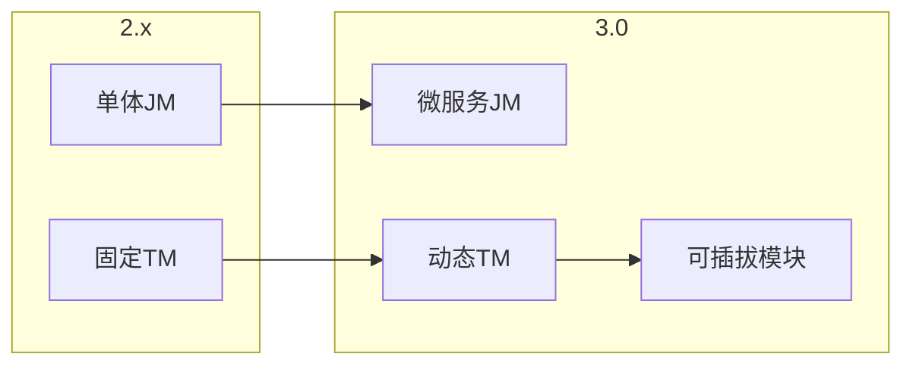
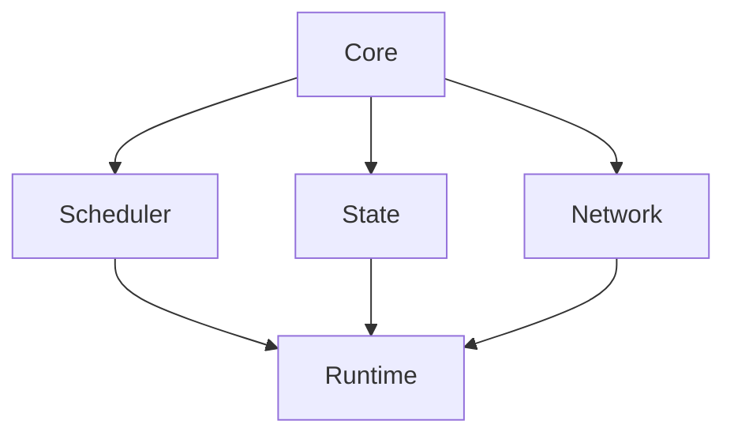

# Flink 3.0 架构重大变更 特性跟踪

> 所属阶段: Flink/flink-30 | 前置依赖: [Flink架构][^1] | 形式化等级: L5

## 1. 概念定义 (Definitions)

### Def-F-30-01: Next-Gen Architecture
下一代架构根本性重构：
$$
\text{Flink 3.0} = \text{Flink 2.x} \times \text{EvolutionFactor} >> \text{Flink 2.x}
$$

### Def-F-30-02: Modular Core
模块化核心将功能拆分为独立模块：
$$
\text{Core} = \sum_{i} \text{Module}_i \text{ with interfaces}
$$

### Def-F-30-03: Pluggable Scheduler
可插拔调度器支持多种调度策略：
$$
\text{Scheduler} \in \{\text{Streaming}, \text{Batch}, \text{Adaptive}, \text{Custom}\}
$$

## 2. 属性推导 (Properties)

### Prop-F-30-01: Backward Compatibility Limit
向后兼容性限制：
$$
\exists \text{API}_{2.x} : \text{API}_{2.x} \not\subseteq \text{API}_{3.0}
$$

### Prop-F-30-02: Performance Scaling
性能扩展性提升：
$$
\text{Perf}_{3.0} \geq 2 \times \text{Perf}_{2.x}
$$

## 3. 关系建立 (Relations)

### 架构变更对比

| 组件 | 2.x | 3.0 | 变更 |
|------|-----|-----|------|
| JobManager | 单体 | 微服务 | 重构 |
| TaskManager | 固定 | 动态 | 增强 |
| Scheduler | 内置 | 可插拔 | 扩展 |
| State Backend | 紧密耦合 | 接口化 | 解耦 |
| Network Stack | 自有 | 可替换 | 抽象 |

### 兼容性矩阵

| 特性 | 兼容 | 迁移方式 |
|------|------|----------|
| DataStream API | 80% | 代码迁移工具 |
| Table API | 90% | 自动兼容 |
| SQL | 95% | 完全兼容 |
| Connectors | 70% | 适配层 |
| State Backend | 60% | 状态迁移 |

## 4. 论证过程 (Argumentation)

### 4.1 新架构设计

```
┌─────────────────────────────────────────────────────────┐
│                   Flink 3.0 Architecture                │
├─────────────────────────────────────────────────────────┤
│  Control Plane         Data Plane        Storage Plane  │
│  ┌─────────────┐      ┌─────────────┐   ┌─────────────┐ │
│  │ Job         │      │ Task        │   │ State       │ │
│  │ Controller  │←────→│ Executor    │←─→│ Services    │ │
│  ├─────────────┤      ├─────────────┤   ├─────────────┤ │
│  │ Resource    │      │ Network     │   │ Checkpoints │ │
│  │ Manager     │      │ Stack       │   │ Archive     │ │
│  ├─────────────┤      ├─────────────┤   └─────────────┘ │
│  │ Scheduler   │      │ Metrics     │                   │
│  │ (Pluggable)│      │ Collector   │                   │ │
│  └─────────────┘      └─────────────┘                   │
└─────────────────────────────────────────────────────────┘
```

## 5. 形式证明 / 工程论证

### 5.1 模块化加载器

```java
public class ModularFlinkLoader {
    
    private final ModuleManager moduleManager;
    
    public FlinkRuntime load(Configuration config) {
        // 加载核心模块
        CoreModule core = moduleManager.load("flink-core", config);
        
        // 加载调度器模块
        SchedulerModule scheduler = moduleManager.load(
            config.getString("scheduler.type", "adaptive"), 
            config
        );
        
        // 加载状态模块
        StateModule state = moduleManager.load(
            config.getString("state.backend", "rocksdb"),
            config
        );
        
        // 组装运行时
        return FlinkRuntime.builder()
            .withCore(core)
            .withScheduler(scheduler)
            .withState(state)
            .build();
    }
}
```

## 6. 实例验证 (Examples)

### 6.1 模块配置

```yaml
# flink-3.0.yaml
flink:
  version: "3.0"
  modules:
    scheduler:
      type: adaptive
      config:
        strategy: cost-based
    state:
      type: tiered
      config:
        tiers: [memory, ssd, remote]
    network:
      type: netty
      config:
        buffer-size: 64kb
```

## 7. 可视化 (Visualizations)

### 架构演进



### 模块依赖



## 8. 引用参考 (References)

[^1]: Flink Architecture Documentation

---

## 跟踪信息

| 属性 | 值 |
|------|-----|
| 目标版本 | Flink 3.0 |
| 当前状态 | 设计中 |
| 主要改进 | 模块化、微服务 |
| 兼容性 | 需要迁移 |
