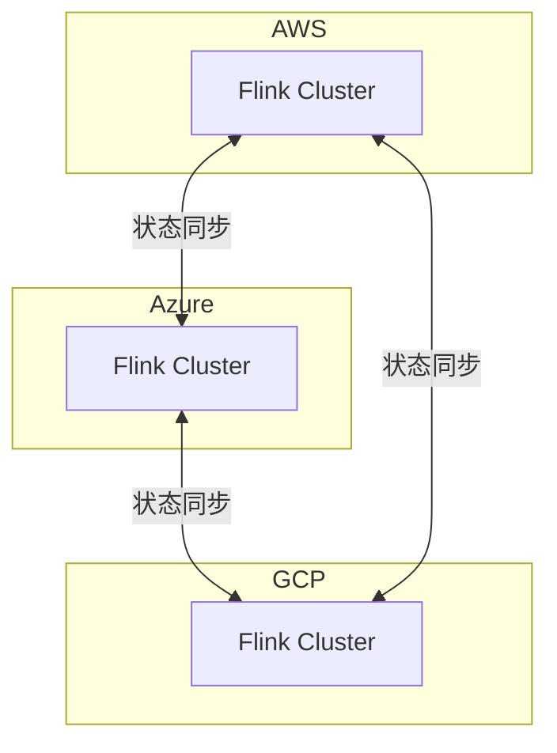

# Flink 3.0 云原生深化 特性跟踪

> 所属阶段: Flink/flink-30 | 前置依赖: [K8s部署][^1] | 形式化等级: L4

## 1. 概念定义 (Definitions)

### Def-F-30-16: Cloud Native
云原生设计充分利用云平台特性：
$$
\text{CloudNative} = \text{Containerized} \land \text{Dynamic} \land \text{Managed}
$$

### Def-F-30-17: Serverless Native
无服务器原生设计：
$$
\text{ServerlessNative} = \text{ScaleToZero} \land \text{PayPerUse} \land \text{EventDriven}
$$

### Def-F-30-18: Multi-Cloud
多云部署跨云平台：
$$
\text{MultiCloud} = \{ \text{AWS}, \text{Azure}, \text{GCP}, ... \}
$$

## 2. 属性推导 (Properties)

### Prop-F-30-09: Scale to Zero
缩容到零：
$$
\text{Resources}(\text{no load}) = 0
$$

### Prop-F-30-10: Cold Start SLA
冷启动SLA：
$$
T_{\text{cold start}} \leq 5s
$$

## 3. 关系建立 (Relations)

### 云原生特性

| 特性 | 2.5 | 3.0 | 状态 |
|------|-----|-----|------|
| Scale-to-Zero | 有限 | 完整 | 增强 |
| 多区域 | 手动 | 自动 | 增强 |
| 服务网格 | 外部 | 集成 | 新增 |
| 云厂商集成 | 部分 | 完整 | 增强 |

## 4. 论证过程 (Argumentation)

### 4.1 云原生架构

```
┌─────────────────────────────────────────────────────────┐
│                    Cloud Control Plane                  │
│  ┌─────────────┐  ┌─────────────┐  ┌─────────────┐     │
│  │ Auto Scaling│  │ Cost        │  │ Multi-Region│     │
│  │ Controller  │  │ Optimizer   │  │ Manager     │     │
│  └─────────────┘  └─────────────┘  └─────────────┘     │
├─────────────────────────────────────────────────────────┤
│                    Flink Runtime                        │
│         (Containerized, Serverless-Ready)               │
└─────────────────────────────────────────────────────────┘
```

## 5. 形式证明 / 工程论证

### 5.1 云原生控制器

```java
public class CloudNativeController {
    
    public void reconcile(CloudJobSpec spec) {
        // 检查负载
        LoadMetrics metrics = loadMonitor.getMetrics(spec.getJobId());
        
        // 自动扩缩容
        if (metrics.getLoad() < SCALE_DOWN_THRESHOLD) {
            if (metrics.getDuration() > SCALE_DOWN_DELAY) {
                scaler.scaleToZero(spec.getJobId());
            }
        } else if (metrics.getLoad() > SCALE_UP_THRESHOLD) {
            scaler.scaleFromZero(spec.getJobId());
        }
        
        // 成本优化
        costOptimizer.optimize(spec);
    }
    
    @Scheduled(fixedDelay = 60000)
    public void multiRegionSync() {
        // 跨区域状态同步
        for (Region region : cloudProvider.getRegions()) {
            syncStateToRegion(region);
        }
    }
}
```

## 6. 实例验证 (Examples)

### 6.1 云原生配置

```yaml
cloud:
  provider: aws
  serverless:
    enabled: true
    scale-to-zero: true
    idle-timeout: 5m
  multi-region:
    enabled: true
    regions: [us-east-1, eu-west-1, ap-southeast-1]
    replication: async
  cost:
    budget: 1000
    alerts: [50%, 80%, 100%]
```

## 7. 可视化 (Visualizations)

### 多云部署



## 8. 引用参考 (References)

[^1]: Cloud Native Computing Foundation Documentation

---

## 跟踪信息

| 属性 | 值 |
|------|-----|
| 目标版本 | Flink 3.0 |
| 当前状态 | 设计中 |
| 主要改进 | Scale-to-Zero、多云 |
| 兼容性 | 云平台特定 |
