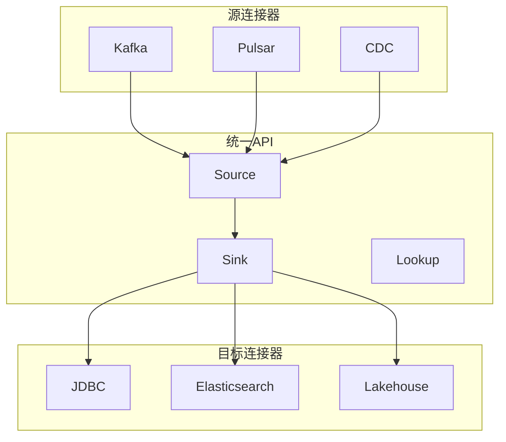

# Flink 3.0 连接器生态 特性跟踪

> 所属阶段: Flink/flink-30 | 前置依赖: [连接器框架][^1] | 形式化等级: L4

## 1. 概念定义 (Definitions)

### Def-F-30-13: Connector Ecosystem
连接器生态是完整的连接器集合：
$$
\text{Ecosystem} = \sum_{i} \text{Connector}_i \times \text{Quality}_i
$$

### Def-F-30-14: Unified Connector API
统一连接器API：
$$
\text{UnifiedAPI} = \text{SourceAPI} \cup \text{SinkAPI} \cup \text{LookupAPI}
$$

### Def-F-30-15: Auto-Configuration
自动配置智能推断参数：
$$
\text{AutoConfig} : \text{Environment} \to \text{OptimalConfig}
$$

## 2. 属性推导 (Properties)

### Prop-F-30-08: Connector Portability
连接器可移植性：
$$
\text{Connector}_{\text{written}} \to \text{Connector}_{\text{any-runtime}}
$$

## 3. 关系建立 (Relations)

### 3.0连接器特性

| 特性 | 2.5 | 3.0 | 改进 |
|------|-----|-----|------|
| 统一API | 部分 | 完整 | 重构 |
| 自动配置 | 无 | 完整 | 新增 |
| 健康检查 | 基础 | 完整 | 增强 |
| 动态发现 | 无 | 支持 | 新增 |

## 4. 论证过程 (Argumentation)

### 4.1 连接器架构

```
┌─────────────────────────────────────────────────────────┐
│                   Unified Connector API                 │
├─────────────────────────────────────────────────────────┤
│  ┌─────────────┐  ┌─────────────┐  ┌─────────────┐     │
│  │ Source      │  │ Sink        │  │ Lookup      │     │
│  │ Interface   │  │ Interface   │  │ Interface   │     │
│  └─────────────┘  └─────────────┘  └─────────────┘     │
├─────────────────────────────────────────────────────────┤
│                   Connector Factory                     │
└─────────────────────────────────────────────────────────┘
```

## 5. 形式证明 / 工程论证

### 5.1 统一连接器实现

```java
public interface UnifiedConnector<T> extends Source<T>, Sink<T>, LookupTableSource {
    
    // 统一配置接口
    ConnectorConfig configure(Environment env);
    
    // 自动健康检查
    HealthStatus checkHealth();
    
    // 动态发现
    List<TablePath> discoverTables();
}

public class AutoConfiguredKafkaConnector implements UnifiedConnector<Row> {
    
    @Override
    public ConnectorConfig configure(Environment env) {
        // 根据环境自动推断配置
        KafkaConfig config = new KafkaConfig();
        
        // 检测Kafka版本
        config.setVersion(detectKafkaVersion());
        
        // 自动分区发现
        config.setPartitions(autoDiscoverPartitions());
        
        // 性能调优
        config.setBufferMemory(optimalBufferSize(env));
        
        return config;
    }
}
```

## 6. 实例验证 (Examples)

### 6.1 自动配置连接

```sql
-- 自动发现配置
CREATE TABLE auto_kafka (
    id INT,
    data STRING
) WITH (
    'connector' = 'kafka',
    'topic' = 'events',
    'auto.configure' = 'true',
    'auto.optimization' = 'true'
);
```

## 7. 可视化 (Visualizations)

### 连接器生态



## 8. 引用参考 (References)

[^1]: Flink Connector Documentation

---

## 跟踪信息

| 属性 | 值 |
|------|-----|
| 目标版本 | Flink 3.0 |
| 当前状态 | 设计中 |
| 主要改进 | 统一API、自动配置 |
| 兼容性 | 适配器支持2.x |
