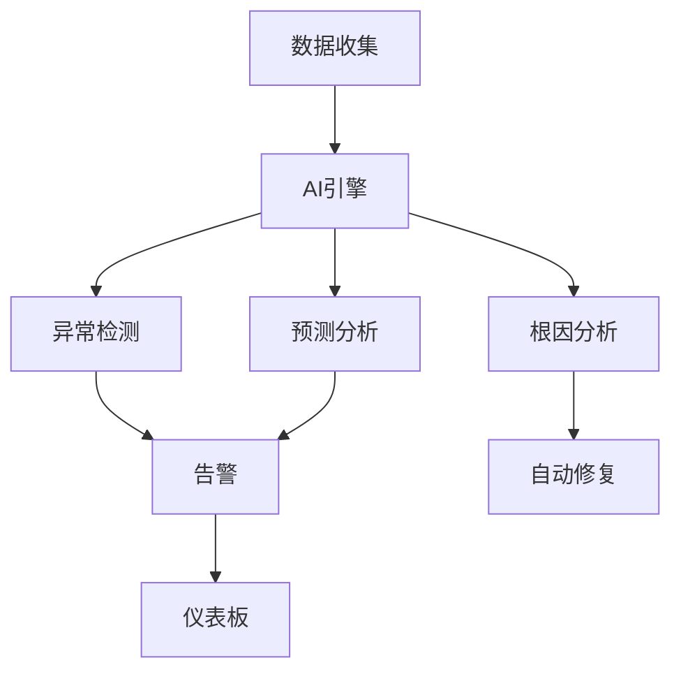

# Flink 3.0 可观测性重塑 特性跟踪

> 所属阶段: Flink/flink-30 | 前置依赖: [可观测性][^1] | 形式化等级: L4

## 1. 概念定义 (Definitions)

### Def-F-30-22: Observability 2.0

可观测性2.0是AI驱动的统一平台：
$$
\text{Obsv2} = \text{Metrics} \times \text{Logs} \times \text{Traces} \times \text{AI}
$$

### Def-F-30-23: Predictive Monitoring

预测性监控预见问题：
$$
\text{Prediction} : \text{History} \to \text{FutureAnomaly}
$$

### Def-F-30-24: Auto-Remediation

自动修复自愈系统：
$$
\text{Remediation} : \text{Anomaly} \to \text{Action} \to \text{Resolution}
$$

## 2. 属性推导 (Properties)

### Prop-F-30-13: Detection Time

检测时间：
$$
T_{\text{detect}} \leq 1s
$$

### Prop-F-30-14: MTTR

平均修复时间：
$$
\text{MTTR} \leq 5m \text{ (for known issues)}
$$

## 3. 关系建立 (Relations)

### 可观测性演进

| 特性 | 2.5 | 3.0 | 状态 |
|------|-----|-----|------|
| AI分析 | 基础 | 完整 | 增强 |
| 预测 | 无 | 支持 | 新增 |
| 自动修复 | 无 | 支持 | 新增 |
| 统一视图 | 部分 | 完整 | 增强 |

## 4. 论证过程 (Argumentation)

### 4.1 AI可观测性架构

```
┌─────────────────────────────────────────────────────────┐
│                    Observability 2.0                    │
├─────────────────────────────────────────────────────────┤
│  Data Collection → AI Engine → Insights → Actions      │
│     ↓              ↓           ↓          ↓             │
│  Metrics/Logs   ML Models   Dashboards  Auto-Fix      │
└─────────────────────────────────────────────────────────┘
```

## 5. 形式证明 / 工程论证

### 5.1 预测性监控

```java
public class PredictiveMonitor {

    private final LSTMModel model;

    public List<Prediction> predict(List<Metric> history) {
        // 准备序列数据
        Tensor input = prepareSequence(history);

        // LSTM预测
        Tensor output = model.predict(input, HORIZON);

        // 检测异常
        return detectAnomalies(output);
    }

    private List<Prediction> detectAnomalies(Tensor predictions) {
        List<Prediction> anomalies = new ArrayList<>();

        for (int i = 0; i < predictions.length(); i++) {
            if (predictions.get(i) > THRESHOLD) {
                anomalies.add(new Prediction(
                    predictions.getTimestamp(i),
                    predictions.getValue(i),
                    predictions.getConfidence(i)
                ));
            }
        }

        return anomalies;
    }
}
```

## 6. 实例验证 (Examples)

### 6.1 AI可观测性配置

```yaml
observability:
  version: "2.0"
  ai:
    enabled: true
    models:
      - anomaly-detection
      - prediction
      - root-cause
  auto-remediation:
    enabled: true
    policies:
      - condition: "high-memory"
        action: "scale-up"
      - condition: "backpressure"
        action: "scale-out"
```

## 7. 可视化 (Visualizations)

### AI可观测性



## 8. 引用参考 (References)

[^1]: AI Ops Documentation

---

## 跟踪信息

| 属性 | 值 |
|------|-----|
| 目标版本 | Flink 3.0 |
| 当前状态 | 设计中 |
| 主要改进 | AI驱动、自动修复 |
| 兼容性 | 向后兼容 |
