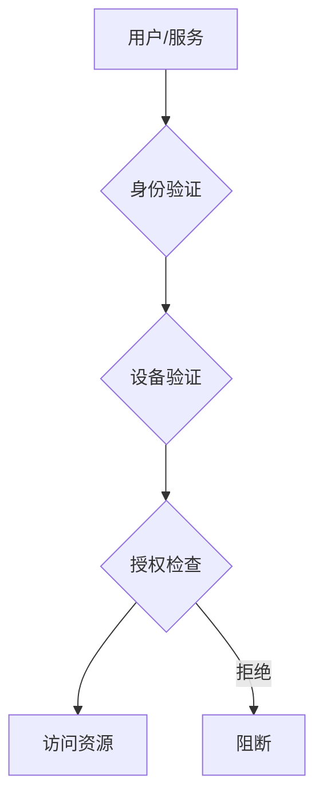

# Flink 3.0 安全架构 特性跟踪

> 所属阶段: Flink/flink-30 | 前置依赖: [安全文档][^1] | 形式化等级: L5

## 1. 概念定义 (Definitions)

### Def-F-30-25: Zero Trust
零信任安全模型：
$$
\text{ZeroTrust} = \forall x : \text{Verify}(x) \land \text{LeastPrivilege}(x)
$$

### Def-F-30-26: Confidential Computing
机密计算保护使用中数据：
$$
\text{Confidential} = \text{Encrypted} \land \text{TEE}\text{-}\text{Protected}
$$

### Def-F-30-27: Policy as Code
策略即代码：
$$
\text{Policy} \in \text{Code} \xrightarrow{\text{CI/CD}} \text{Runtime}
$$

## 2. 属性推导 (Properties)

### Prop-F-30-15: Encryption Coverage
加密覆盖：
$$
\forall \text{Data} : \text{Encrypted}_{\text{at rest}} \land \text{Encrypted}_{\text{in transit}} \land \text{Encrypted}_{\text{in use}}
$$

### Prop-F-30-16: Compliance Automation
合规自动化：
$$
\text{Compliance} = \text{ContinuouslyVerified}
$$

## 3. 关系建立 (Relations)

### 安全演进

| 特性 | 2.5 | 3.0 | 状态 |
|------|-----|-----|------|
| 零信任 | 部分 | 完整 | 增强 |
| 机密计算 | 无 | 支持 | 新增 |
| 策略即代码 | 外部 | 内置 | 新增 |
| 合规自动化 | 手动 | 自动 | 增强 |

## 4. 论证过程 (Argumentation)

### 4.1 零信任架构

```
┌─────────────────────────────────────────────────────────┐
│                    Zero Trust Network                   │
├─────────────────────────────────────────────────────────┤
│  Identity → Authentication → Authorization → Encryption │
│  Verify    Verify           Verify         Always       │
└─────────────────────────────────────────────────────────┘
```

## 5. 形式证明 / 工程论证

### 5.1 机密计算实现

```java
public class ConfidentialTaskManager {
    
    private final TEEContext teeContext;
    
    public void executeInTEE(Task task) {
        // 加载到TEE
        Enclave enclave = teeContext.createEnclave();
        
        // 加密数据传入
        byte[] encryptedData = encryptForTEE(task.getData());
        enclave.loadData(encryptedData);
        
        // 执行
        byte[] result = enclave.execute(task.getCode());
        
        // 解密结果
        return decryptFromTEE(result);
    }
}
```

## 6. 实例验证 (Examples)

### 6.1 零信任配置

```yaml
security:
  model: zero-trust
  authentication:
    mfa: required
    sso: enabled
  authorization:
    rbac: fine-grained
    abac: enabled
  encryption:
    at-rest: aes-256
    in-transit: tls-1.3
    in-use: enabled
  confidential-computing:
    enabled: true
    provider: intel-sgx
```

## 7. 可视化 (Visualizations)

### 零信任架构



## 8. 引用参考 (References)

[^1]: Zero Trust Architecture Documentation

---

## 跟踪信息

| 属性 | 值 |
|------|-----|
| 目标版本 | Flink 3.0 |
| 当前状态 | 设计中 |
| 主要改进 | 零信任、机密计算 |
| 兼容性 | 需要TEE支持 |
