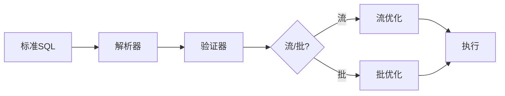

# Flink 3.0 SQL 标准完全兼容 特性跟踪

> 所属阶段: Flink/flink-30 | 前置依赖: [SQL 2023][^1] | 形式化等级: L4

## 1. 概念定义 (Definitions)

### Def-F-30-10: Full Standard Compliance
完全标准兼容：
$$
\text{Compliance} = \frac{|\text{SupportedMandatory}|}{|\text{AllMandatory}|} = 100\%
$$

### Def-F-30-11: Extended SQL
扩展SQL超越标准：
$$
\text{Extended} = \text{SQL:2023} + \text{StreamingExtensions} + \text{AIExtensions}
$$

### Def-F-30-12: Unified Dialect
统一方言跨模式一致：
$$
\forall \text{mode} \in \{\text{Stream}, \text{Batch}\} : \text{SQL}_{\text{stream}} = \text{SQL}_{\text{batch}}
$$

## 2. 属性推导 (Properties)

### Prop-F-30-07: Semantic Consistency
语义一致性：
$$
\forall Q : \text{Result}_{\text{Flink}}(Q) = \text{Result}_{\text{Standard}}(Q)
$$

## 3. 关系建立 (Relations)

### SQL标准支持

| 标准部分 | 2.5 | 3.0 | 目标 |
|----------|-----|-----|------|
| SQL/Foundation | 90% | 100% | 完整 |
| SQL/Temporal | 80% | 100% | 完整 |
| SQL/JSON | 85% | 100% | 完整 |
| SQL/PSM | 60% | 100% | 完整 |
| SQL/MED | 50% | 100% | 完整 |

## 4. 论证过程 (Argumentation)

### 4.1 SQL处理架构

```
┌─────────────────────────────────────────────────────────┐
│                   SQL Parser (Standard)                 │
├─────────────────────────────────────────────────────────┤
│                   Semantic Analyzer                     │
├─────────────────────────────────────────────────────────┤
│                   Unified Optimizer                     │
├─────────────────────────────────────────────────────────┤
│              Stream Codegen / Batch Codegen             │
└─────────────────────────────────────────────────────────┘
```

## 5. 形式证明 / 工程论证

### 5.1 标准SQL解析

```java
public class StandardSQLParser {
    
    public SqlNode parse(String sql) {
        // 使用标准SQL解析
        SqlParser.Config config = SqlParser.config()
            .withParserFactory(SqlDdlParserImpl.FACTORY)
            .withConformance(SqlConformanceEnum.LENIENT);
        
        SqlParser parser = SqlParser.create(sql, config);
        return parser.parseQuery();
    }
    
    public void validate(SqlNode node, SqlValidator validator) {
        // 标准语义验证
        SqlNode validated = validator.validate(node);
        
        // 流式语义检查
        if (isStreamingQuery(validated)) {
            validateStreamingSemantics(validated);
        }
    }
}
```

## 6. 实例验证 (Examples)

### 6.1 标准SQL示例

```sql
-- SQL:2023 递归CTE
WITH RECURSIVE hierarchy AS (
    SELECT id, name, parent_id, 0 AS level
    FROM categories
    WHERE parent_id IS NULL
    
    UNION ALL
    
    SELECT c.id, c.name, c.parent_id, h.level + 1
    FROM categories c
    JOIN hierarchy h ON c.parent_id = h.id
)
SELECT * FROM hierarchy;

-- SQL:2023 JSON聚合
SELECT 
    department,
    JSON_OBJECTAGG(name, salary) AS salaries,
    JSON_ARRAYAGG(name ORDER BY salary DESC) AS ranked_names
FROM employees
GROUP BY department;
```

## 7. 可视化 (Visualizations)

### SQL处理流程



## 8. 引用参考 (References)

[^1]: SQL:2023 Standard Documentation

---

## 跟踪信息

| 属性 | 值 |
|------|-----|
| 目标版本 | Flink 3.0 |
| 当前状态 | 设计中 |
| 主要改进 | 100%标准兼容 |
| 兼容性 | 向后兼容 |
