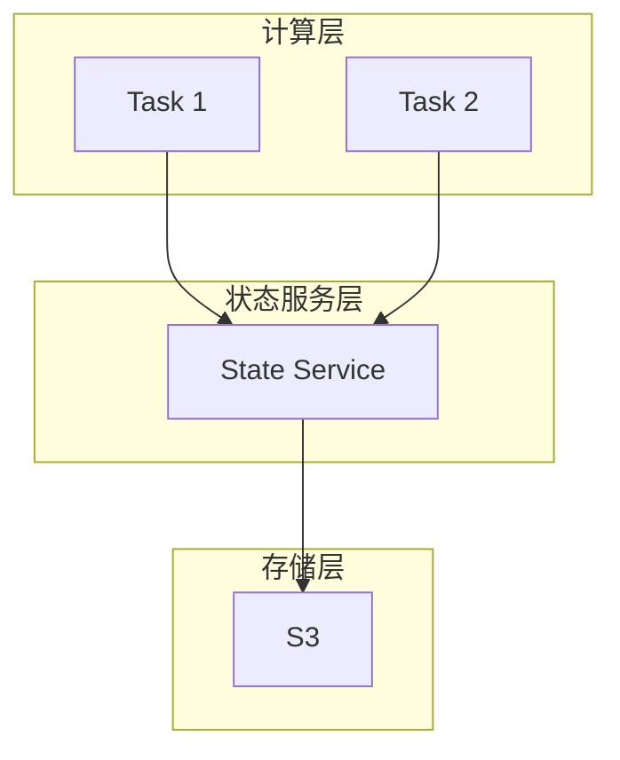

# Flink 3.0 状态管理重构 特性跟踪

> 所属阶段: Flink/flink-30 | 前置依赖: [状态管理][^1] | 形式化等级: L5

## 1. 概念定义 (Definitions)

### Def-F-30-07: State Service

状态服务是独立的状态管理微服务：
$$
\text{StateService} = \langle \text{Storage}, \text{API}, \text{Replication} \rangle
$$

### Def-F-30-08: Disaggregated State

分离状态将计算与存储分离：
$$
\text{Disaggregated} = \text{Compute} \perp \text{Storage}
$$

### Def-F-30-09: Global State View

全局状态视图跨算子可见：
$$
\text{GlobalView} = \bigcup_{i} \text{State}_i
$$

## 2. 属性推导 (Properties)

### Prop-F-30-05: State Access Latency

状态访问延迟：
$$
T_{\text{access}} \leq \begin{cases} 1\mu s & \text{local} \\ 10\mu s & \text{remote cache} \\ 1ms & \text{storage} \end{cases}
$$

### Prop-F-30-06: Recovery Time

恢复时间目标：
$$
T_{\text{recover}} \leq 10s \text{ (for any state size)}
$$

## 3. 关系建立 (Relations)

### 状态管理演进

| 特性 | 2.x | 3.0 | 改进 |
|------|-----|-----|------|
| 本地状态 | 主 | 缓存 | 架构变化 |
| 远程状态 | 无 | 主存储 | 新增 |
| 状态服务 | 无 | 独立服务 | 新增 |
| 全局查询 | 有限 | 完整 | 增强 |
| 增量快照 | 支持 | 原生 | 优化 |

### 状态访问层次

| 层级 | 延迟 | 容量 | 持久化 |
|------|------|------|--------|
| L1: 内存 | 100ns | 小 | 否 |
| L2: 本地SSD | 10μs | 中 | 是 |
| L3: 远程缓存 | 100μs | 大 | 是 |
| L4: 对象存储 | 10ms | 极大 | 是 |

## 4. 论证过程 (Argumentation)

### 4.1 分离状态架构

```
┌─────────────────────────────────────────────────────────┐
│                    Flink Compute Nodes                  │
│  ┌──────────┐  ┌──────────┐  ┌──────────┐              │
│  │ Task 1   │  │ Task 2   │  │ Task 3   │              │
│  │ (Cache)  │  │ (Cache)  │  │ (Cache)  │              │
│  └────┬─────┘  └────┬─────┘  └────┬─────┘              │
│       └─────────────┼─────────────┘                     │
│                     ↓                                   │
│            ┌────────────────┐                           │
│            │  State Service │                           │
│            │  (Distributed) │                           │
│            └───────┬────────┘                           │
│                    ↓                                    │
│         ┌─────────────────────┐                         │
│         │   Storage Backend   │                         │
│         │  (S3/GCS/OSS/...)  │                         │
│         └─────────────────────┘                         │
└─────────────────────────────────────────────────────────┘
```

## 5. 形式证明 / 工程论证

### 5.1 状态服务客户端

```java
public class StateServiceClient {

    private final StateServiceGrpc.StateServiceBlockingStub stub;
    private final LocalCache cache;

    public <T> T getValue(StateKey key) {
        // L1: 本地缓存
        T cached = cache.get(key);
        if (cached != null) return cached;

        // L2: 状态服务
        GetRequest request = GetRequest.newBuilder()
            .setKey(key.toProto())
            .build();
        GetResponse response = stub.get(request);

        T value = deserialize(response.getValue());
        cache.put(key, value);
        return value;
    }

    public <T> void putValue(StateKey key, T value) {
        // 写入状态服务
        PutRequest request = PutRequest.newBuilder()
            .setKey(key.toProto())
            .setValue(serialize(value))
            .build();
        stub.put(request);

        // 更新本地缓存
        cache.put(key, value);
    }
}
```

## 6. 实例验证 (Examples)

### 6.1 状态服务配置

```yaml
# flink-3.0-state.yaml
state:
  mode: disaggregated
  service:
    endpoints: ["state-1:50051", "state-2:50051"]
    replication: 3
  cache:
    size: 1gb
    policy: lru
  storage:
    type: s3
    bucket: flink-state-v3
```

## 7. 可视化 (Visualizations)

### 分离状态



## 8. 引用参考 (References)

[^1]: Flink State Management Documentation

---

## 跟踪信息

| 属性 | 值 |
|------|-----|
| 目标版本 | Flink 3.0 |
| 当前状态 | 设计中 |
| 主要改进 | 分离状态、状态服务 |
| 兼容性 | 状态需迁移 |
