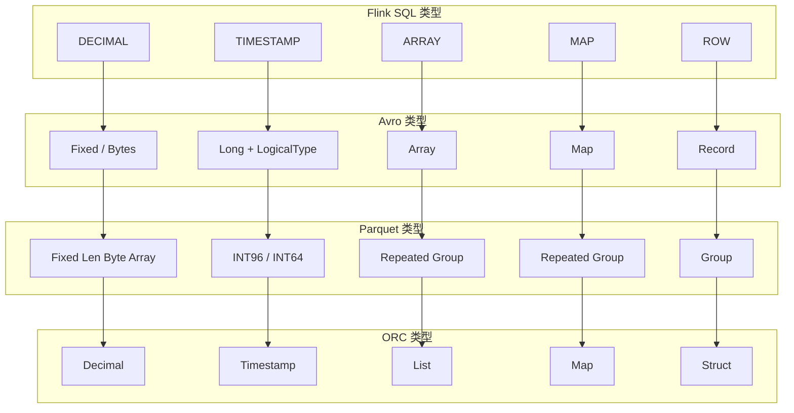
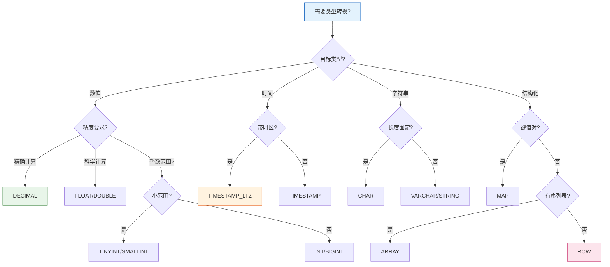
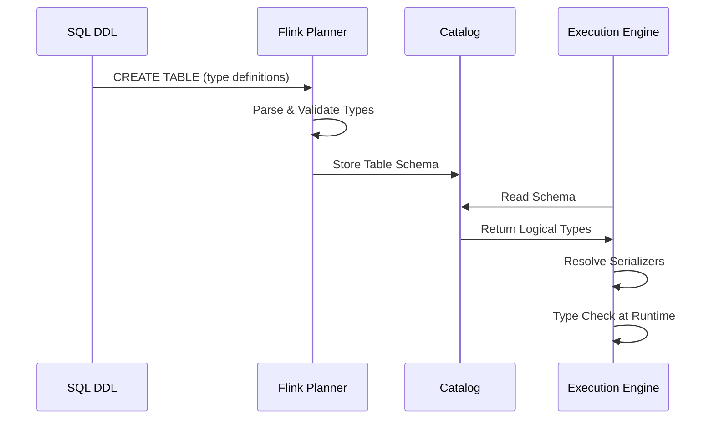

# Flink Data Types 完整参考

> 所属阶段: Flink | 前置依赖: [Flink/00-QUICK-START.md](00-meta/00-QUICK-START.md) | 形式化等级: L4

---

## 1. 概念定义 (Definitions)

### Def-F-01-01: 数据类型系统

**定义**: Flink SQL 数据类型系统是类型理论在流计算领域的工程实现，定义为五元组：

$$
\mathcal{T}_{Flink} = (T_{atomic}, T_{composite}, T_{structured}, T_{time}, \prec)
$$

其中：

- $T_{atomic}$: 原子类型集合（不可再分的基础类型）
- $T_{composite}$: 复合类型集合（可嵌套的结构化类型）
- $T_{structured}$: 结构化类型集合（ROW、ARRAY、MAP）
- $T_{time}$: 时间类型集合（流计算特化的时间相关类型）
- $\prec$: 类型偏序关系（隐式转换方向）

### Def-F-01-02: 原子类型 (Atomic Types)

**定义**: 原子类型是不可再分的数据类型，其值在语义上被视为单一单元：

$$
T_{atomic} = \{STRING, BOOLEAN, BYTES\} \cup T_{numeric}
$$

| 类别 | 类型 | 存储范围 | 物理表示 | 默认值 |
|------|------|----------|----------|--------|
| **字符串** | `CHAR(n)` | 1~255 字符 | UTF-8 编码，定长 | 空格填充 |
| | `VARCHAR(n)` | 1~2,147,483,647 字符 | UTF-8 编码，变长 | NULL |
| | `STRING` | 无限制 | UTF-8 编码 | NULL |
| **布尔** | `BOOLEAN` | {true, false} | 1 字节 | NULL |
| **二进制** | `BINARY(n)` | 定长字节序列 | 原始字节 | 0x00填充 |
| | `VARBINARY(n)` | 变长字节序列 | 原始字节 | NULL |
| | `BYTES` | 无限制 | 原始字节 | NULL |

### Def-F-01-03: 数值类型 (Numeric Types)

**定义**: 数值类型是有序的标量数值集合：

$$
T_{numeric} = T_{integral} \cup T_{fractional}
$$

**整数类型** ($T_{integral}$):

| 类型 | 范围 | 存储 | Java 类型 | 示例 |
|------|------|------|-----------|------|
| `TINYINT` | -128 ~ 127 | 1 字节 | `Byte` | 127 |
| `SMALLINT` | -32,768 ~ 32,767 | 2 字节 | `Short` | 1000 |
| `INT` / `INTEGER` | -2³¹ ~ 2³¹-1 | 4 字节 | `Integer` | 100000 |
| `BIGINT` | -2⁶³ ~ 2⁶³-1 | 8 字节 | `Long` | 10000000000 |

**浮点/定点类型** ($T_{fractional}$):

| 类型 | 精度 | 存储 | Java 类型 | 适用场景 |
|------|------|------|-----------|----------|
| `FLOAT` | IEEE 754 单精度 | 4 字节 | `Float` | 科学计算 |
| `DOUBLE` | IEEE 754 双精度 | 8 字节 | `Double` | 通用浮点 |
| `DECIMAL(p,s)` | p: 1~38, s: 0~p | 变长 | `BigDecimal` | 金融计算 |
| `NUMERIC(p,s)` | 同 DECIMAL | 变长 | `BigDecimal` | SQL标准兼容 |

### Def-F-01-04: 复合类型 (Composite Types)

**定义**: 复合类型是由其他类型组合而成的结构化类型：

$$
\begin{aligned}
ARRAY\langle T \rangle &= \{ [e_1, e_2, ..., e_n] \mid e_i \in T, n \geq 0 \} \\
MAP\langle K, V \rangle &= \{ (k_1,v_1), ..., (k_n,v_n) \} \text{ where } k_i \text{ unique}, k_i \in K, v_i \in V \\
ROW\langle f_1:T_1, ..., f_n:T_n \rangle &= \{ (f_1:v_1, ..., f_n:v_n) \mid v_i \in T_i \}
\end{aligned}
$$

**复合类型约束**:

| 类型 | 键类型约束 | 值类型约束 | 最大嵌套深度 |
|------|-----------|-----------|-------------|
| `ARRAY<T>` | - | 任意类型 | 100 |
| `MAP<K,V>` | 仅原子类型 | 任意类型 | 100 |
| `ROW<...>` | 字段名唯一 | 任意类型 | 100 |

### Def-F-01-05: 时间类型 (Temporal Types)

**定义**: Flink 时间类型是流计算场景特化的时间表示：

$$
T_{time} = \{ DATE, TIME, TIMESTAMP, TIMESTAMP_LTZ, INTERVAL \}
$$

| 类型 | 格式 | 精度 | 时区处理 | 典型应用 |
|------|------|------|----------|----------|
| `DATE` | `yyyy-MM-dd` | 日精度 | 无时区 | 生日、纪念日 |
| `TIME` | `HH:mm:ss[.fractional]` | 0~9 位 | 无时区 | 营业时间 |
| `TIME(p)` | 带精度时间 | p: 0~9 | 无时区 | 精确时间戳 |
| `TIMESTAMP(p)` | 日期+时间 | p: 0~9 | 无时区 | 事件发生时间 |
| `TIMESTAMP_LTZ(p)` | 带时区时间戳 | p: 0~9 | UTC 内部存储 | 跨时区同步 |
| `INTERVAL YEAR TO MONTH` | 年月间隔 | 月精度 | - | 年龄计算 |
| `INTERVAL DAY TO SECOND` | 日秒间隔 | 纳秒精度 | - | 持续时间 |

**时间类型语义区分**：

| 特性 | TIMESTAMP | TIMESTAMP_LTZ |
|------|-----------|---------------|
| 存储形式 | 本地时间 | UTC 时间 |
| 显示形式 | 写入值 | 转换为会话时区 |
| 适用场景 | 单时区应用 | 多时区/跨地域应用 |
| Kafka 集成 | 需时区转换 | 直接映射 |

### Def-F-01-06: 类型转换关系

**定义**: 类型转换关系 $\prec$ 定义类型间的隐式转换方向：

$$
\prec = \{ (T_1, T_2) \mid T_1 \text{ 可隐式转换为 } T_2 \}
$$

**隐式转换链**:

```
数值类型链:
TINYINT → SMALLINT → INT → BIGINT → DECIMAL → DOUBLE

字符串类型链:
CHAR(n) → VARCHAR(n) → STRING

时间类型链:
DATE → TIMESTAMP → TIMESTAMP_LTZ
```

---

## 2. 属性推导 (Properties)

### Lemma-F-01-01: 类型完备性

**引理**: Flink SQL 类型系统对标准 SQL:2016 数据模型是类型完备的。

**证明要点**:

1. **原子类型覆盖**: 所有标准 SQL 原子类型均有对应实现
2. **复合类型封闭性**: ARRAY/MAP/ROW 支持递归嵌套，形成代数数据类型
3. **空值处理**: 所有类型均支持 NULL 值，满足三值逻辑
4. **时间扩展**: 在 SQL 标准基础上扩展 TIMESTAMP_LTZ 适应流计算

### Lemma-F-01-02: 类型转换单调性

**引理**: 类型转换关系 $\prec$ 构成偏序集，满足传递性：

$$
\forall T_1, T_2, T_3 \in \mathcal{T}: T_1 \prec T_2 \land T_2 \prec T_3 \Rightarrow T_1 \prec T_3
$$

**证明**: 由转换链的定义直接可得，每对相邻类型间的转换都是单射函数，复合仍为单射。

### Prop-F-01-01: 类型安全保证

**命题**: 在编译期可检测所有类型不匹配错误。

$$
\forall Q \in SQL: \text{TypeCheck}(Q) = \bot \Rightarrow \nexists E: \text{Execute}(Q, E) \neq \text{Error}
$$

---

## 3. 关系建立 (Relations)

### 3.1 SQL 标准类型映射

| ANSI SQL:2016 | Flink SQL | 兼容性 | 备注 |
|---------------|-----------|--------|------|
| `CHARACTER(n)` | `CHAR(n)` | ✅ 完全兼容 | - |
| `CHARACTER VARYING(n)` | `VARCHAR(n)` | ✅ 完全兼容 | - |
| `INTEGER` | `INT` | ✅ 完全兼容 | - |
| `DECIMAL(p,s)` | `DECIMAL(p,s)` | ✅ 完全兼容 | p: 1~38 |
| `REAL` | `FLOAT` | ✅ 完全兼容 | - |
| `DOUBLE PRECISION` | `DOUBLE` | ✅ 完全兼容 | - |
| `TIMESTAMP WITH TIME ZONE` | `TIMESTAMP_LTZ` | ⚠️ 语义等价 | 名称不同 |
| `TIMESTAMP WITHOUT TIME ZONE` | `TIMESTAMP` | ✅ 完全兼容 | - |

### 3.2 Java/Scala 物理类型映射

| Flink SQL 类型 | Java 类型 | Scala 类型 | 序列化器 |
|----------------|-----------|------------|----------|
| `STRING` | `java.lang.String` | `String` | `StringSerializer` |
| `BOOLEAN` | `java.lang.Boolean` | `Boolean` | `BooleanSerializer` |
| `TINYINT` | `java.lang.Byte` | `Byte` | `ByteSerializer` |
| `SMALLINT` | `java.lang.Short` | `Short` | `ShortSerializer` |
| `INT` | `java.lang.Integer` | `Int` | `IntSerializer` |
| `BIGINT` | `java.lang.Long` | `Long` | `LongSerializer` |
| `FLOAT` | `java.lang.Float` | `Float` | `FloatSerializer` |
| `DOUBLE` | `java.lang.Double` | `Double` | `DoubleSerializer` |
| `DECIMAL(p,s)` | `java.math.BigDecimal` | `BigDecimal` | `BigDecimalSerializer` |
| `DATE` | `java.time.LocalDate` | `LocalDate` | `LocalDateSerializer` |
| `TIME(p)` | `java.time.LocalTime` | `LocalTime` | `LocalTimeSerializer` |
| `TIMESTAMP(p)` | `java.time.LocalDateTime` | `LocalDateTime` | `LocalDateTimeSerializer` |
| `TIMESTAMP_LTZ(p)` | `java.time.Instant` | `Instant` | `InstantSerializer` |
| `ARRAY<T>` | `T[]` / `ArrayList<T>` | `Array[T]` / `List[T]` | `ArraySerializer` |
| `MAP<K,V>` | `HashMap<K,V>` | `Map[K,V]` | `MapSerializer` |
| `ROW<...>` | `Row` | `Row` | `RowSerializer` |

### 3.3 Avro/Parquet/ORC 格式映射



---

## 4. 论证过程 (Argumentation)

### 4.1 DECIMAL vs FLOAT 选择决策

**问题**: 为什么选择 DECIMAL 而非 FLOAT 作为精确数值计算类型？

**论证**:

| 维度 | DECIMAL | FLOAT/DOUBLE |
|------|---------|--------------|
| 精度 | 精确表示，无舍入误差 | IEEE 754 近似表示 |
| 范围 | 有限（1~38位） | 极大（约10³⁰⁸） |
| 性能 | 较慢（软件实现） | 快（硬件加速） |
| 存储 | 变长，较大 | 固定 4/8 字节 |
| 适用 | 金融、货币计算 | 科学计算、近似分析 |

**决策**: 金融场景必须使用 DECIMAL(p,s)，推荐 DECIMAL(19,4) 满足大多数货币计算需求。

### 4.2 TIMESTAMP vs TIMESTAMP_LTZ 选择矩阵

| 应用场景 | 推荐类型 | 理由 |
|----------|----------|------|
| 单时区应用 | `TIMESTAMP` | 简单直观，无时区概念负担 |
| 多时区应用 | `TIMESTAMP_LTZ` | 统一 UTC 存储，前端本地化显示 |
| 与 Kafka 集成 | `TIMESTAMP_LTZ` | Kafka 使用 UTC epoch millis |
| 审计日志 | `TIMESTAMP_LTZ` | 保证全球时间一致性 |
| 业务事件时间 | `TIMESTAMP` | 业务语义通常为本地时间 |

---

## 5. 形式证明 / 工程论证 (Proof / Engineering Argument)

### Thm-F-01-01: 类型一致性保证

**定理**: 在 Exactly-Once 语义下，Checkpoint 恢复后的类型状态与故障前一致。

**证明**:

1. **序列化一致性**: TypeSerializer 保证值到字节的映射是双射
   $$\forall v \in T: Deserialize(Serialize(v)) = v$$

2. **快照原子性**: Checkpoint 屏障确保类型状态的原子持久化
   $$State_{checkpoint} = \{ (k, Serialize(v)) \mid (k,v) \in State_{runtime} \}$$

3. **恢复同构**: 反序列化是序列化的逆操作
   $$State_{recovered} = \{ (k, Deserialize(s)) \mid (k,s) \in State_{checkpoint} \} = State_{runtime}$$

### Thm-F-01-02: 类型推断完备性

**定理**: 对于任意合法的 Flink SQL 查询，类型推断算法可计算出结果模式。

**工程论证**:

```
算法: TypeInference(AST)
输入: 抽象语法树 AST(Q)
输出: 结果类型 Schema(Q)

1. 叶子节点类型 ← 表元数据 || 字面量类型
2. 一元操作类型 ← TypeRule(op, input_type)
3. 二元操作类型 ← Coalesce(TypeRule(op, left, right))
4. 聚合类型 ← Combine(partial_types)
5. 返回根节点类型
```

---

## 6. 实例验证 (Examples)

### 6.1 DDL 类型定义完整示例

```sql
-- 创建包含完整类型系统的表
CREATE TABLE user_events (
    -- 原子类型 - 标识与状态
    user_id BIGINT NOT NULL,
    username VARCHAR(128) NOT NULL,
    is_active BOOLEAN DEFAULT TRUE,
    user_type CHAR(1) DEFAULT 'R',  -- R: Regular, V: VIP

    -- 数值类型 - 业务指标
    score DECIMAL(10, 4),           -- 精确分数
    temperature FLOAT,              -- 传感器读数（近似）

    -- 二进制类型
    avatar_hash VARBINARY(64),
    raw_payload BYTES,

    -- 时间类型 - 流计算核心
    birth_date DATE,
    preferred_time TIME(3),
    event_ts TIMESTAMP(3),          -- 事件时间（本地）
    event_ts_utc TIMESTAMP_LTZ(3),  -- 事件时间（UTC）

    -- 复合类型 - 结构化数据
    tags ARRAY<VARCHAR(50)>,
    properties MAP<STRING, STRING>,
    address ROW<
        street STRING,
        city STRING,
        country STRING DEFAULT 'CN',
        coordinates ROW<
            lat DOUBLE,
            lon DOUBLE
        >
    >,

    -- 元数据列
    proc_time AS PROCTIME(),

    -- 水位线定义
    WATERMARK FOR event_ts AS event_ts - INTERVAL '5' SECOND
) WITH (
    'connector' = 'kafka',
    'topic' = 'user-events',
    'format' = 'json',
    'json.fail-on-missing-field' = 'false',
    'json.ignore-parse-errors' = 'true'
);
```

### 6.2 类型转换示例

```sql
-- 隐式转换（自动进行）
SELECT
    user_id + 1.5 AS user_id_double,           -- BIGINT → DOUBLE
    CONCAT('ID:', CAST(user_id AS STRING)) AS user_id_str
FROM user_events;

-- 显式转换（CAST）
SELECT
    CAST(event_ts AS DATE) AS event_date,
    CAST(event_ts AS STRING) AS ts_string,
    CAST(score AS INT) AS score_int,           -- 截断小数
    CAST(score AS BIGINT) AS score_bigint
FROM user_events;

-- 安全转换（TRY_CAST）
SELECT
    TRY_CAST(username AS INT) AS username_num, -- 失败返回 NULL
    TRY_CAST('2024-01-15' AS DATE) AS valid_date,
    TRY_CAST('invalid' AS DATE) AS null_date   -- 返回 NULL
FROM user_events;
```

### 6.3 Java API 类型编程

```java
import org.apache.flink.table.api.DataTypes;
import org.apache.flink.table.api.Schema;
import org.apache.flink.table.api.Table;
import org.apache.flink.table.api.TableDescriptor;

public class DataTypeExample {

    // 编程方式定义 Schema
    public Schema createUserSchema() {
        return Schema.newBuilder()
            .column("user_id", DataTypes.BIGINT().notNull())
            .column("username", DataTypes.VARCHAR(128))
            .column("is_active", DataTypes.BOOLEAN().defaultValue(true))
            .column("score", DataTypes.DECIMAL(10, 4))
            .column("tags", DataTypes.ARRAY(DataTypes.VARCHAR(50)))
            .column("properties", DataTypes.MAP(
                DataTypes.STRING(),
                DataTypes.STRING()
            ))
            .column("address", DataTypes.ROW(
                DataTypes.FIELD("street", DataTypes.STRING()),
                DataTypes.FIELD("city", DataTypes.STRING()),
                DataTypes.FIELD("zipcode", DataTypes.CHAR(6))
            ))
            .column("event_ts", DataTypes.TIMESTAMP(3))
            .columnByExpression("proc_time", "PROCTIME()")
            .watermark("event_ts", "SOURCE_WATERMARK()")
            .build();
    }

    // 使用 TableDescriptor 定义
    public TableDescriptor createKafkaDescriptor() {
        return TableDescriptor.forConnector("kafka")
            .schema(createUserSchema())
            .option("topic", "user-events")
            .option("properties.bootstrap.servers", "localhost:9092")
            .format("json")
            .build();
    }
}
```

### 6.4 Python Table API 类型使用

```python
from pyflink.table import DataTypes, Schema, TableDescriptor
from pyflink.table.table_environment import StreamTableEnvironment

# 定义 Schema
schema = Schema.new_builder() \
    .column("user_id", DataTypes.BIGINT().not_null()) \
    .column("username", DataTypes.STRING()) \
    .column("score", DataTypes.DECIMAL(10, 4)) \
    .column("tags", DataTypes.ARRAY(DataTypes.STRING())) \
    .column("metadata", DataTypes.MAP(
        DataTypes.STRING(),
        DataTypes.STRING()
    )) \
    .column("event_time", DataTypes.TIMESTAMP(3)) \
    .column_by_expression("proc_time", "PROCTIME()") \
    .watermark("event_time", "SOURCE_WATERMARK()") \
    .build()

# 创建表
descriptor = TableDescriptor.for_connector("kafka") \
    .schema(schema) \
    .option("topic", "events") \
    .option("properties.bootstrap.servers", "kafka:9092") \
    .format("json") \
    .build()
```

---

## 7. 可视化 (Visualizations)

### 7.1 类型系统层次图

```mermaid
graph TB
    Root[Flink SQL Type System]

    Root --> Atomic[Atomic Types]
    Root --> Composite[Composite Types]
    Root --> Time[Temporal Types]

    Atomic --> String[String<br/>CHAR VARCHAR STRING]
    Atomic --> Numeric[Numeric<br/>TINYINT SMALLINT INT BIGINT<br/>DECIMAL FLOAT DOUBLE]
    Atomic --> Boolean[BOOLEAN]
    Atomic --> Binary[Binary<br/>BINARY VARBINARY BYTES]

    Composite --> Array[ARRAY&lt;T&gt;]
    Composite --> Map[MAP&lt;K,V&gt;]
    Composite --> Row[ROW&lt;...&gt;]
    Composite --> Multiset[MULTISET&lt;T&gt;]

    Time --> Date[DATE]
    Time --> TimeOfDay[TIME<br/>TIME(p)]
    Time --> Timestamp[TIMESTAMP<br/>TIMESTAMP_LTZ]
    Time --> Interval[INTERVAL<br/>YEAR TO MONTH<br/>DAY TO SECOND]

    style Root fill:#e1f5fe,stroke:#01579b
    style Atomic fill:#fff3e0,stroke:#e65100
    style Composite fill:#e8f5e9,stroke:#2e7d32
    style Time fill:#fce4ec,stroke:#c2185b
```

### 7.2 类型转换决策树



### 7.3 物理类型映射流程



---

## 8. 引用参考 (References)
