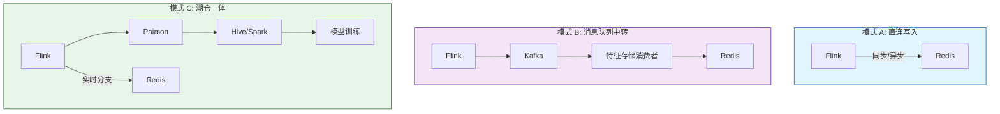
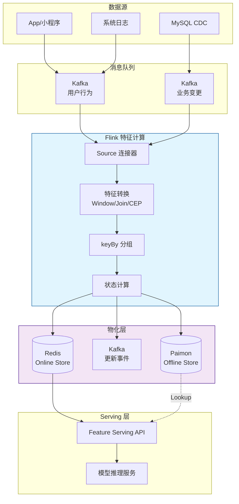
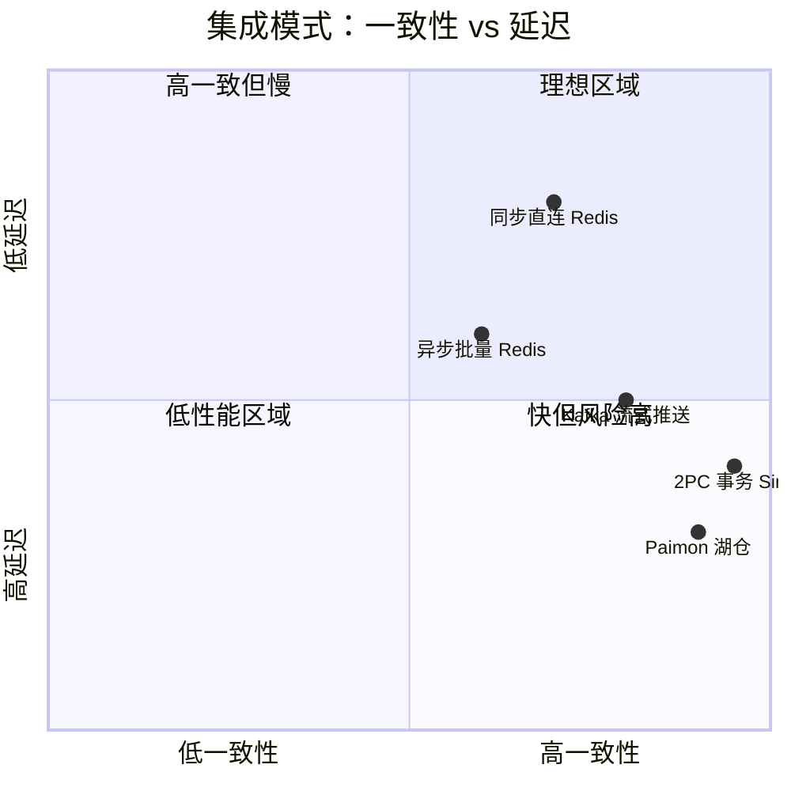

# Flink 与特征存储的集成实践

> **所属阶段**: Flink/ | **前置依赖**: [feature-store-architecture.md](../Knowledge/feature-store-architecture.md), [stream-feature-computation.md](../Knowledge/stream-feature-computation.md) | **形式化等级**: L4

---

## 1. 概念定义 (Definitions)

Apache Flink 作为流处理引擎，与特征存储（Feature Store）的集成构成了现代实时机器学习流水线的核心数据链路。Flink 负责特征的计算、转换和实时更新，而特征存储负责特征的持久化、版本管理和低延迟 Serving。

**Def-F-15-01 Flink-特征存储集成架构 (Flink-Feature Store Integration Architecture)**

Flink 与特征存储的集成架构 $\mathcal{I}_{FS}$ 是一个四元组：

$$
\mathcal{I}_{FS} = (\mathcal{S}_{source}, \mathcal{T}_{flink}, \mathcal{M}_{sink}, \mathcal{P}_{contract})
$$

其中：

- $\mathcal{S}_{source}$ 为数据源接入层，通常以 Kafka、Pulsar 或 CDC 连接器读取原始事件流
- $\mathcal{T}_{flink}$ 为 Flink 特征转换层，执行窗口聚合、双流 Join、CEP 模式匹配等特征工程算子
- $\mathcal{M}_{sink}$ 为特征物化层，将计算后的特征值写入 Online Store 或 Offline Store
- $\mathcal{P}_{contract}$ 为集成契约，定义数据格式、一致性级别、更新协议和错误处理语义

**Def-F-15-02 特征 Sink 契约 (Feature Sink Contract)**

特征 Sink 契约 $\Sigma_{sink}$ 规范了 Flink 与特征存储之间的写入接口：

$$
\Sigma_{sink} = (K, V, T, O, R)
$$

- $K$ 为特征键空间（Feature Key Space），通常由实体类型和实体 ID 组成，如 `user:{user_id}`
- $V$ 为特征值空间，支持标量、向量、列表和复杂嵌套结构
- $T$ 为特征时间戳，用于点时正确性查询和版本控制
- $O \in \{ \text{UPSERT}, \text{APPEND}, \text{DELETE} \}$ 为写入操作类型
- $R$ 为可靠性级别（Reliability Level），如 `BEST_EFFORT`、`AT_LEAST_ONCE`、`EXACTLY_ONCE`

**Def-F-15-03 特征更新协议 (Feature Update Protocol)**

特征更新协议 $\Pi_{update}$ 定义了 Flink 如何将特征增量发送到存储系统：

$$
\Pi_{update} \in \{ \Pi_{sync}, \Pi_{async\text{-}batch}, \Pi_{stream\text{-}push} \}
$

- $\Pi_{sync}$: 同步阻塞写入，每条特征计算完成后立即同步到存储
- $\Pi_{async\text{-}batch}$: 异步批量写入，Flink Sink 内部缓冲后按批次 flush
- $\Pi_{stream\text{-}push}$: 流式推送，通过消息队列（如 Kafka/Pulsar）中转，特征存储异步消费

**Def-F-15-04 特征 TTL 策略 (Feature TTL Policy)**

特征 TTL（Time-To-Live）策略 $\Gamma_{ttl}$ 控制特征值在存储中的生命周期：

$$
\Gamma_{ttl}(f, t_{create}) = t_{expire} = t_{create} + \Delta_{ttl}
$$

其中 $\Delta_{ttl}$ 为特征的存活周期。若 $\Delta_{ttl} = \infty$，则特征永久存储；若 $\Delta_{ttl}$ 为有限值，则过期后自动清理以释放存储空间。

**Def-F-15-05 特征一致性视图 (Feature Consistency View)**

对于分布式特征存储，一致性视图 $V_{consist}$ 定义了读取操作可见的最新特征状态的约束：

$$
V_{consist} \in \{ \text{STRONG}, \text{EVENTUAL}, \text{SESSION}, \text{BOUNDED_STALENESS} \}
$$

在线推理通常要求 `STRONG` 或 `BOUNDED_STALENESS` 一致性，以确保模型输入的时效性。

---

## 2. 属性推导 (Properties)

从 Flink 与特征存储集成的定义可直接推导若干关键工程性质。

**Lemma-F-15-01 Exactly-Once Sink 保证特征值无重复**

若 Flink Sink 实现端到端 Exactly-Once 语义（$R = \text{EXACTLY_ONCE}$），则对于任意特征键 $k$ 和事件 $e$，特征存储中不会因 Flink 故障恢复而出现重复写入。

*证明*: 由 Flink 的两阶段提交（2PC）Sink 机制，Flink 在 Checkpoint 完成后才将事务提交到外部存储。若发生故障，Flink 回滚到最近一次成功 Checkpoint 并重放数据，而已提交的事务不会被重复提交。故同一事件不会导致存储中特征值的重复更新。$\square$

**Lemma-F-15-02 异步批量 Sink 的吞吐-延迟权衡**

设同步 Sink 的吞吐量为 $TPS_{sync}$，延迟为 $L_{sync}$；异步批量 Sink 的吞吐量为 $TPS_{async}$，延迟为 $L_{async}$。若批量大小为 $B$，则：

$$
TPS_{async} \approx B \cdot TPS_{sync}, \quad L_{async} \approx L_{sync} + \frac{B}{2} \cdot t_{inter\text{-}arrival}
$$

*说明*: 批量写入将 $B$ 条记录的 I/O 开销摊销为一次外部存储调用，吞吐量随 $B$ 线性提升；但缓冲区等待引入了额外延迟。$\square$

**Lemma-F-15-03 特征 TTL 与存储成本的关系**

设特征生成速率为 $\lambda$（条/秒），每条特征平均大小为 $s$（字节），TTL 为 $\Delta_{ttl}$。则稳态存储容量需求为：

$$
C_{storage} \approx \lambda \cdot s \cdot \Delta_{ttl}
$$

*说明*: 该引理揭示了 TTL 设置对存储成本的直接影响。缩短 TTL 可降低存储成本，但可能牺牲历史特征的可查询性。$\square$

**Prop-F-15-01 流式推送协议的解耦优势**

采用流式推送协议（$\Pi_{stream\text{-}push}$）时，Flink 与特征存储之间的耦合度与存储系统类型无关。Flink 只需保证消息正确发送到消息队列，而特征存储的扩展、升级和故障恢复不影响 Flink 作业的稳定性。

---

## 3. 关系建立 (Relations)

### 3.1 Flink 连接器与特征存储类型的映射

| 特征存储类型 | 代表系统 | Flink 连接器 | 写入模式 | 一致性支持 | 适用特征 |
|-------------|---------|-------------|---------|-----------|---------|
| 内存 KV | Redis | `flink-connector-redis` | 同步/异步 | 最终一致 | 热特征、实时统计 |
| 增强 KV | Tair | 自定义 Sink | 同步/异步 | 强一致 | 复杂结构、序列特征 |
| 宽列存储 | HBase | `flink-connector-hbase` | 异步批量 | 强一致 | 冷特征、历史画像 |
| 向量数据库 | Milvus | 自定义 REST Sink | 异步批量 | 最终一致 | 向量 Embedding |
| 消息队列 | Kafka | `flink-connector-kafka` | 流式推送 | Exactly-Once | 特征更新事件流 |
| 数据湖 | Paimon/Iceberg | `flink-connector-paimon` | 异步批量 | 快照隔离 | 离线训练样本 |

### 3.2 集成架构模式对比



### 3.3 与 Flink Exactly-Once 语义的关联

Flink 的端到端 Exactly-Once 语义是特征存储集成中的关键保障：

- **Checkpoint 机制**: 定期对 Flink 状态（包括已写入但未提交的特征）做一致快照
- **两阶段提交 (2PC)**: JDBC、Kafka 等 Sink 支持 2PC，确保特征存储事务与 Flink Checkpoint 原子提交
- **幂等写入**: 对于不支持事务的存储（如 Redis），通过幂等键设计和幂等操作保证重放安全

---

## 4. 论证过程 (Argumentation)

### 4.1 为什么 Flink 是特征存储的理想计算引擎？

Flink 在实时特征工程场景中的核心优势体现在五个维度：

1. **毫秒级延迟**: 纯内存处理链路可将特征计算延迟控制在数十毫秒级别
2. **复杂状态管理**: 内置 Keyed State、List State、Map State，可高效维护用户级长周期特征
3. **事件时间语义**: Watermark 和 Allowed Lateness 机制保证乱序数据的正确聚合
4. **精确一次处理**: Checkpoint + 2PC 确保特征值不丢不重
5. **丰富算子生态**: Window、Interval Join、Async I/O、CEP 覆盖几乎所有特征工程模式

### 4.2 集成中的典型反模式

**反模式 1: 在 Flink UDF 中直接调用特征存储 API**

在 `map()` 或 `processElement()` 中直接同步调用 Redis/HBase 进行特征读写，会导致：
- 严重阻塞，吞吐骤降
- 外部系统故障直接拖垮 Flink 作业
- 难以实现 Exactly-Once

**正确做法**: 使用 Flink 的 `AsyncFunction` 进行异步 I/O，或将写操作集中到专门的 Sink 算子中。

**反模式 2: 忽略特征键的热键倾斜**

若特征键设计为 `user_id`，而某些头部用户的行为事件量远超平均值，则对应 Key Group 会成为瓶颈。

**正确做法**: 对热键进行 Salting 处理（如 `user_id#hash % N`），在 Sink 端再合并；或使用两阶段聚合降低单键压力。

**反模式 3: 无 TTL 管理导致存储无限膨胀**

实时特征持续写入但不设置过期时间，最终导致存储成本不可控、查询延迟恶化。

**正确做法**: 为每类特征配置合理的 TTL，并在 Flink Sink 中显式设置存储层的过期策略。

### 4.3 从 Lambda 到 Kappa 的集成演进

早期 Flink-Feature Store 集成常采用 Lambda 架构：
- **实时链路**: Flink Stream → Redis（用于在线 Serving）
- **离线链路**: Spark Batch → HDFS/Hive（用于训练样本生成）

这种架构的问题是训练与 Serving 特征可能来自不同代码路径，引入训练-推理不一致。

现代演进趋势是向 **Kappa 化统一链路** 发展：
- **统一转换逻辑**: 使用 Flink SQL 或 Table API 定义特征转换
- **统一数据源**: Kafka/Pulsar 作为唯一事实来源
- **分支输出**: 同一 Flink 作业同时写入 Online Store（Redis）和 Offline Store（Paimon/Iceberg）

---

## 5. 形式证明 / 工程论证 (Proof / Engineering Argument)

**Thm-F-15-01 两阶段提交 Sink 保证特征存储的端到端一致性**

设 Flink 作业使用两阶段提交 Sink 将特征写入外部存储系统 $\mathcal{E}$。若 Flink Checkpoint 协议正确执行，则对于任意特征键 $k$ 和特征值 $v$，在故障恢复后存储中不会出现重复写入或遗漏写入。

*证明*:

Flink 2PC Sink 的工作流程如下：
1. **预提交 (Pre-commit)**: 在每个 Checkpoint 边界，Sink 将当前事务中的数据 flush 到外部存储的预提交区（或临时事务），但暂不提交
2. **提交 (Commit)**: 当 Flink JobManager 确认 Checkpoint 全局完成后，通知所有 Sink 提交事务
3. **回滚 (Rollback)**: 若 Checkpoint 失败或作业从旧 Checkpoint 恢复，则回滚所有未提交的事务

设事件 $e$ 在 Checkpoint $c_k$ 期间被处理。若 $c_k$ 成功，则 $e$ 对应的特征值通过事务提交持久化到 $\mathcal{E}$。若 $c_k$ 失败，事务被回滚，$e$ 对应的特征值不会出现在 $\mathcal{E}$ 中。Flink 从 $c_{k-1}$ 恢复后会重放 $e$，并在新的成功 Checkpoint 中再次提交。由于事务的幂等性或唯一性约束，同一 $e$ 不会导致 $\mathcal{E}$ 中的重复记录。$\square$

---

**Thm-F-15-02 异步批量 Sink 的吞吐量最优性**

在相同的网络 I/O 带宽约束下，设同步 Sink 的最大吞吐量为 $TPS_{sync}^{max}$，异步批量 Sink（批量大小 $B$）的最大吞吐量为 $TPS_{async}^{max}$。若每次外部存储调用的固定开销为 $C_{fixed}$，单条记录处理开销为 $C_{unit}$，则：

$$
TPS_{async}^{max} = \frac{B}{C_{fixed} + B \cdot C_{unit}} \cdot TPS_{unit}
$$

当 $B \to \infty$ 时：

$$
\lim_{B \to \infty} TPS_{async}^{max} = \frac{1}{C_{unit}}
$$

而同步 Sink 的吞吐量为：

$$
TPS_{sync}^{max} = \frac{1}{C_{fixed} + C_{unit}}
$$

由于 $C_{fixed} > 0$，恒有 $TPS_{async}^{max} > TPS_{sync}^{max}$。

*证明*: 同步模式下每秒可完成的事务数受限于单次调用的总开销 $C_{fixed} + C_{unit}$。异步批量模式下，$B$ 条记录被合并为一次调用，总开销为 $C_{fixed} + B \cdot C_{unit}$，故每秒可处理 $\frac{B}{C_{fixed} + B \cdot C_{unit}}$ 批，即 $\frac{B}{C_{fixed} + B \cdot C_{unit}} \cdot B$ 条记录。化简并取极限即得结论。$\square$

---

**Thm-F-15-03 热键倾斜下的特征写入延迟边界**

设特征 Sink 的并行度为 $p$，总写入速率为 $\lambda$。若存在一个热键接收了比例为 $\alpha$（$0 < \alpha \leq 1$）的全部写入流量，则该热键所在并行实例的有效写入速率为 $\alpha \lambda$，其平均排队延迟（M/M/1 模型）为：

$$
L_{hot} = \frac{1}{\mu - \alpha \lambda / p}
$$

其中 $\mu$ 为单实例的服务速率。当 $\alpha \lambda / p \to \mu$ 时，$L_{hot} \to \infty$。

*证明*: 在 KeyBy 后，热键被路由到单一并行实例。该实例的到达率为 $\alpha \lambda$（假设均匀 hash 下其他键分散到 $p$ 个实例，热键独占一个实例的负载）。根据 M/M/1 排队论，稳态平均等待时间为 $1/(\mu - \lambda_{eff})$，其中 $\lambda_{eff} = \alpha \lambda$（若热键独占一个实例）或 $\alpha \lambda / p$（若考虑整体 $p$ 个实例分担）。工程上通常按实例分析，故采用 $\alpha \lambda / p$。$\square$

---

## 6. 实例验证 (Examples)

### 6.1 Flink + Redis 实时特征 Sink

以下是一个生产级的 Flink Redis Sink 实现，支持异步批量写入和 TTL 管理：

```java
/**
 * Flink 批量异步 Redis Feature Store Sink
 * 支持 Exactly-Once (通过 Flink Checkpoint + Redis Pipeline 事务)
 */
public class RedisFeatureStoreSink
    extends TwoPhaseCommitSinkFunction<UserFeature, JedisPipeline, Void> {

    private transient JedisPool jedisPool;
    private final int ttlSeconds;
    private final int batchSize;

    public RedisFeatureStoreSink(int ttlSeconds, int batchSize) {
        super(TypeInformation.of(UserFeature.class).createSerializer(
            new ExecutionConfig()), VoidSerializer.INSTANCE);
        this.ttlSeconds = ttlSeconds;
        this.batchSize = batchSize;
    }

    @Override
    protected void invoke(JedisPipeline pipeline, UserFeature value, Context context) {
        String key = String.format("fs:user:%s", value.getUserId());
        Map<String, String> fields = new HashMap<>();
        fields.put("click_5m", String.valueOf(value.getClickCount5m()));
        fields.put("click_1h", String.valueOf(value.getClickCount1h()));
        fields.put("cart_24h", String.valueOf(value.getCartCount24h()));
        fields.put("last_update", String.valueOf(value.getTimestamp()));

        pipeline.hset(key, fields);
        pipeline.expire(key, ttlSeconds);

        // 若达到批量大小，触发预提交 flush
        if (pipeline.size() >= batchSize * 2) { // hset + expire 各算一个
            pipeline.sync();
        }
    }

    @Override
    protected JedisPipeline beginTransaction() {
        Jedis jedis = jedisPool.getResource();
        return jedis.pipelined();
    }

    @Override
    protected void preCommit(JedisPipeline pipeline) {
        pipeline.sync(); // 预提交：将数据发送到 Redis 但未执行 EXEC
    }

    @Override
    protected void commit(JedisPipeline pipeline) {
        // 事务提交：Redis Pipeline 的 sync 已经确保数据到达
        // 若需要更强一致性，可改用 Redis MULTI/EXEC 事务
        try {
            pipeline.close();
        } catch (Exception e) {
            throw new RuntimeException("Commit failed", e);
        }
    }

    @Override
    protected void abort(JedisPipeline pipeline) {
        // 回滚：Pipeline 未执行的数据不会被持久化
        try {
            pipeline.close();
        } catch (Exception e) {
            throw new RuntimeException("Abort failed", e);
        }
    }

    @Override
    public void open(Configuration parameters) {
        jedisPool = new JedisPool("redis-feature-store", 6379);
    }

    @Override
    public void close() {
        if (jedisPool != null) {
            jedisPool.close();
        }
    }
}
```

### 6.2 Flink + Kafka 流式推送集成

当特征存储提供 Kafka Consumer 接口时，Flink 可直接将特征更新事件写入 Kafka Topic：

```java
public class KafkaFeatureStoreSink {
    public static SinkFunction<FeatureUpdateEvent> createSink() {
        return KafkaSink.<FeatureUpdateEvent>builder()
            .setBootstrapServers("kafka:9092")
            .setRecordSerializer(KafkaRecordSerializationSchema
                .<FeatureUpdateEvent>builder()
                .setTopic("feature-store-updates")
                .setValueSerializationSchema(new FeatureUpdateSerializer())
                .build())
            .setDeliveryGuarantee(DeliveryGuarantee.EXACTLY_ONCE)
            .setTransactionalIdPrefix("flink-feature-sink")
            .build();
    }
}
```

特征存储侧消费 `feature-store-updates` Topic，异步更新内部索引。该模式实现了 Flink 与特征存储的完全解耦。

### 6.3 Flink + Paimon 湖仓一体特征存储

对于需要同时支持离线训练和在线 Serving 的场景，Flink 可将特征写入 Apache Paimon（或 Iceberg）：

```java
// [伪代码片段 - 不可直接运行] 仅展示核心逻辑
// Flink SQL 方式写入 Paimon
String createTable = "CREATE TABLE user_features (" +
    "  user_id STRING," +
    "  click_count_1h BIGINT," +
    "  cart_count_24h BIGINT," +
    "  update_time TIMESTAMP(3)," +
    "  PRIMARY KEY (user_id) NOT ENFORCED" +
    ") WITH ('connector' = 'paimon', " +
    "  'path' = 's3://bucket/feature-store/user_features'," +
    "  'write-mode' = 'change-log'," +
    "  'changelog-producer' = 'input'" +
    ")";

String insertSql = "INSERT INTO user_features " +
    "SELECT user_id, " +
    "  COUNT(CASE WHEN event_type = 'click' THEN 1 END) as click_count_1h, " +
    "  COUNT(CASE WHEN event_type = 'cart_add' THEN 1 END) as cart_count_24h, " +
    "  TUMBLE_ROWTIME(event_time, INTERVAL '1' HOUR) as update_time " +
    "FROM user_behavior " +
    "GROUP BY user_id, TUMBLE(event_time, INTERVAL '1' HOUR)";

tableEnv.executeSql(createTable);
tableEnv.executeSql(insertSql);
```

Paimon 的 Change Log 特性使得同一份数据既可被 Spark 读取用于模型训练，也可通过 Lookup Join 被 Flink 在线查询。

---

## 7. 可视化 (Visualizations)

### 7.1 Flink-Feature Store 集成端到端架构



### 7.2 不同集成模式的一致性-延迟权衡矩阵



---

## 8. 引用参考 (References)

[^1]: Apache Flink Documentation, "Kafka Connector", 2025. https://nightlies.apache.org/flink/flink-docs-stable/docs/connectors/datastream/kafka/
[^2]: Apache Flink Documentation, "JDBC Connector", 2025. https://nightlies.apache.org/flink/flink-docs-stable/docs/connectors/datastream/jdbc/
[^3]: Apache Paimon Documentation, "Flink Integration", 2025. https://paimon.apache.org/docs/master/engines/flink/
[^4]: Redis Documentation, "Pipelining", 2025. https://redis.io/docs/manual/pipelining/
[^5]: Tecton Documentation, "Real-Time Feature Computation", 2024. https://docs.tecton.ai/
[^6]: OpenMLDB Documentation, "Flink Integration", 2025. https://openmldb.ai/docs/
[^7]: Akidau et al., "The Dataflow Model", PVLDB 8(12), 2015.
