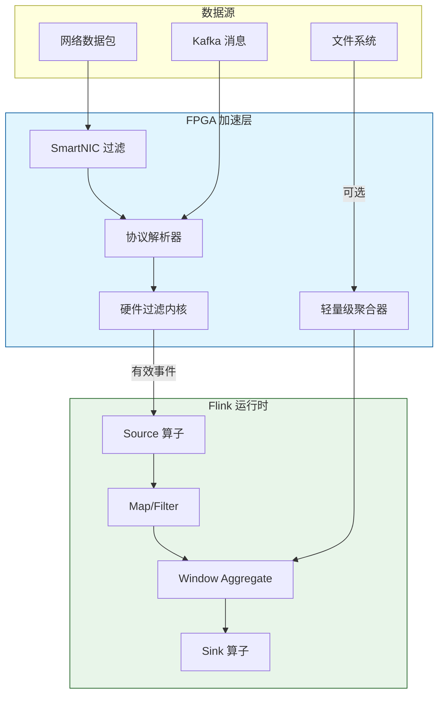
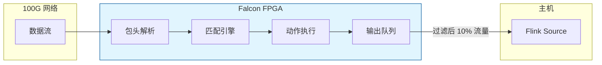
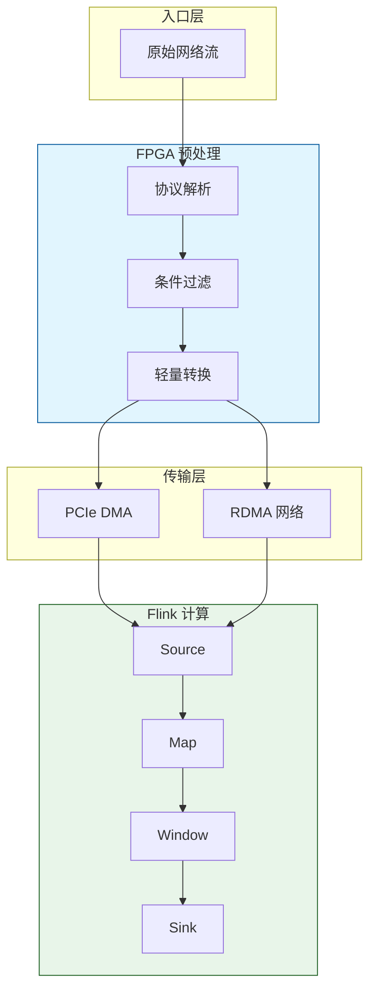
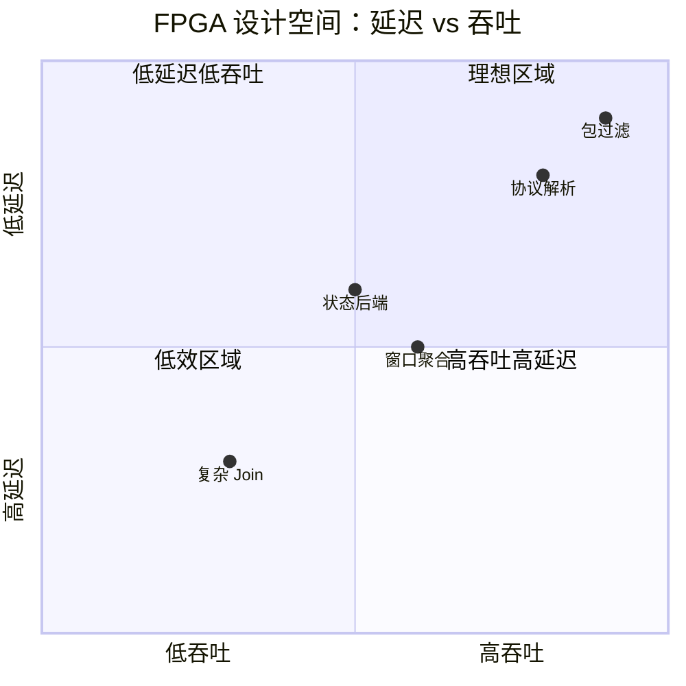

# FPGA 在 Flink 流处理中的加速应用

> **所属阶段**: Flink/ | **前置依赖**: [hardware-accelerated-streaming.md](../Knowledge/hardware-accelerated-streaming.md), [network-stack-internals.md](./10-internals/network-stack-internals.md) | **形式化等级**: L4

---

## 1. 概念定义 (Definitions)

FPGA（Field-Programmable Gate Array）以其可重构的硬件流水线、确定性的超低延迟和高能效比，成为流处理系统中网络包处理、协议解析和轻量级聚合的理想加速器。将 FPGA 与 Apache Flink 集成，可实现从网络入口到应用层的端到端加速。

**Def-F-15-06 FPGA 流处理内核 (FPGA Streaming Kernel)**

FPGA 流处理内核 $K_{fpga}$ 是在 FPGA 可编程逻辑上实现的硬件模块，用于执行特定的流处理算子。形式上：

$$
K_{fpga} = (I, O, S, C, \Phi)
$$

- $I$ 为输入接口（AXI Stream、PCIe DMA、网络 MAC）
- $O$ 为输出接口
- $S$ 为内部状态寄存器集合
- $C$ 为硬件时钟域配置
- $\Phi$ 为组合逻辑/流水线实现的转换函数，$\Phi: I \times S \to O \times S$

**Def-F-15-07 流水线深度与吞吐量 (Pipeline Depth and Throughput)**

设 FPGA 内核的数据通路被划分为 $d$ 个流水线段，每个段在一个时钟周期 $T_{clk}$ 内完成。则：

- **单记录延迟**: $L_{record} = d \cdot T_{clk}$
- **稳态吞吐量**: $TPS = \frac{1}{T_{clk}}$（记录/周期）

吞吐量与流水线深度 $d$ 无关，仅由时钟频率 $f_{clk} = 1/T_{clk}$ 决定。

**Def-F-15-08 FPGA 重配置开销 (Reconfiguration Overhead)**

FPGA 的重配置时间 $T_{reconfig}$ 是指将新的比特流（bitstream）加载到 FPGA 中以改变其功能所需的时间：

$$
T_{reconfig} = \frac{B_{bitstream}}{B_{config}} + T_{init}
$$

其中 $B_{bitstream}$ 为比特流大小，$B_{config}$ 为配置接口带宽，$T_{init}$ 为初始化延迟。对于部分重配置（PR），仅重配置特定区域，$B_{bitstream}$ 可显著减小。

**Def-F-15-09 线速处理 (Line-Rate Processing)**

设网络链路速率为 $R$（Gbps），最小数据包大小为 $L_{min}$（字节），则线速处理要求的最小包处理速率为：

$$
PKT_{line}(R, L_{min}) = \frac{R \times 10^9}{L_{min} \times 8} \quad \text{(packets/second)}
$$

FPGA 流处理内核满足线速处理的条件为：

$$
TPS_{fpga} \geq PKT_{line}(R, L_{min})
$$

**Def-F-15-10 主机-FPGA 内存一致性模型 (Host-FPGA Coherence)**

在集成架构中，主机 CPU 与 FPGA 设备可能共享统一的虚拟地址空间（如通过 CXL 或 CCIX）。一致性模型 $C_{coh}$ 定义了设备对主机内存写操作的可见性时序：

$$
C_{coh} \in \{ \text{NON_COHERENT}, \text{IO_COHERENT}, \text{FULL_COHERENT} \}
$$

Flink 与 FPGA 集成时，通常采用 `IO_COHERENT` 模型——FPGA 通过 DMA 读写主机内存，CPU 显式调用缓存刷新/失效指令同步数据。

---

## 2. 属性推导 (Properties)

**Lemma-F-15-04 流水线启动间隔与吞吐量关系**

设 FPGA 内核处理一个输入记录需要 $k$ 个时钟周期（ initiation interval ），则吞吐量上限为：

$$
TPS_{max} = \frac{f_{clk}}{k}
$$

对于完全流水线化（fully pipelined）的内核，$k = 1$，此时 $TPS_{max} = f_{clk}$。

*说明*: 该引理是 FPGA 设计中的核心约束。若内核内部存在数据依赖（如跨记录的状态更新），则 $k$ 可能大于 1，吞吐量随之下降。$\square$

**Lemma-F-15-05 部分重配置的收益边界**

设完整重配置时间为 $T_{full}$，部分重配置时间为 $T_{pr}$，重配置区域占比为 $\alpha$（$0 < \alpha < 1$）。若部分重配置的比特流大小与区域面积成正比，则：

$$
T_{pr} \approx \alpha \cdot T_{full}
$$

*说明*: 部分重配置使得 FPGA 可以在不影响其他运行中内核的情况下动态更新特定算子，非常适合需要频繁 A/B 测试特征逻辑的流处理场景。$\square$

**Lemma-F-15-06 网络到主机延迟的 FPGA 优化**

标准 Linux 网络栈处理一个数据包的延迟约为 $L_{kernel} \approx 5-20$ μs。通过 FPGA SmartNIC 进行内核旁路（Kernel Bypass）和 RDMA，延迟可降低至：

$$
L_{fpga\text{-}nic} \approx 1-3 \text{ μs}
$$

*说明*: 这种优化对于 Flink 处理高频率微批事件（如高频交易、IoT 传感器流）具有重要意义。$\square$

**Prop-F-15-02 FPGA 在过滤算子中的能效优势**

对于逐记录过滤算子（如基于正则表达式或数值范围的过滤），FPGA 的能效比通常是 CPU 的 10-50 倍，原因是：

- 避免了 CPU 的指令取指-译码-执行开销
- 数据在硬件流水线中流动，无需通用寄存器文件的频繁读写
- 可并行匹配多个过滤条件

---

## 3. 关系建立 (Relations)

### 3.1 FPGA 与 Flink 架构的集成层次

| 集成层次 | 技术方案 | 延迟级别 | 复杂度 | 适用场景 |
|---------|---------|:-------:|:------:|---------|
| **网卡层 (NIC)** | SmartNIC + Kernel Bypass | < 5 μs | 高 | 包过滤、DDoS 清洗 |
| **存储层 (Memory)** | FPGA 作为 NVMe 控制器/压缩卡 | 10-50 μs | 中 | 状态后端压缩、Checkpoint 加速 |
| **算子层 (Operator)** | Flink UDF 调用 FPGA  via JNI/OpenCL | 50-200 μs | 中 | 复杂解析、轻量级聚合 |
| **作业层 (Job)** | 独立 FPGA 预处理节点，输出到 Kafka/Flink | 1-10 ms | 低 | 协议转换、数据清洗 |

### 3.2 FPGA 加速器类型与 Flink 算子的映射



### 3.3 与 RisingWave/Arroyo 等 Rust 流数据库的对比

虽然 RisingWave 等系统也追求低延迟，但其执行仍然依赖 CPU。FPGA 加速的独特价值在于：

- **更低的确定性延迟**: CPU 调度、缓存未命中、中断等因素导致延迟波动；FPGA 流水线延迟是确定性的
- **更高的能效比**: 在边缘计算和 5G MEC 场景中，功耗预算是关键约束
- **可定制性**: 可根据特定协议（如自定义二进制协议）定制解析逻辑

---

## 4. 论证过程 (Argumentation)

### 4.1 FPGA 在 Flink 中的典型应用模式

**模式 1: Bump-in-the-Wire（串联模式）**

FPGA 网卡直接串联在网络路径上，所有流量先经过 FPGA 预处理，再进入主机 Flink 作业。适用于：

- 网络包过滤和分类
- 加密/解密卸载
- 时间戳打标和序列化

**模式 2: 旁路加速（Offload 模式）**

特定算子（如复杂正则过滤）通过 JNI 调用 FPGA 内核，数据通过 PCIe DMA 往返。适用于：

- 计算密集型但批量适中的算子
- 需要与 Flink State 交互的场景

**模式 3: 独立预处理节点**

FPGA 作为独立的边缘节点，输出预处理后的结构化数据到 Kafka/Pulsar，Flink 消费该 Topic。适用于：

- 多租户共享同一 FPGA 硬件
- FPGA 逻辑由专用团队维护，Flink 团队无需关心硬件细节

### 4.2 FPGA 集成的工程挑战

**挑战 1: 开发门槛高**

FPGA 开发通常需要 Verilog/VHDL 或 HLS（High-Level Synthesis）知识，与主流数据工程师的技能栈差距较大。

**应对**:

- 使用 Vitis HLS 或 Catapult HLS 将 C++/OpenCL 代码综合为硬件
- 建立可复用的 FPGA IP 库（过滤、解析、Join、压缩）
- 通过 Flink 插件机制封装 FPGA 调用，对上层用户透明

**挑战 2: 重配置时间长**

完整重配置可能需要数秒，在此期间 FPGA 无法处理数据。

**应对**:

- 采用部分重配置（PR）技术
- 部署双 FPGA 热备，一个处理数据时另一个加载新比特流
- 对于相对稳定的算子（如网络协议解析），减少重配置频率

**挑战 3: 调试困难**

FPGA 内部状态不可像 CPU 程序那样方便地单步调试。

**应对**:

- 集成 ILA（Integrated Logic Analyzer）进行信号捕获
- 在仿真环境（如 Vivado Simulator）中充分验证后再上板
- 建立从 FPGA 到主机的日志/指标回传通道

### 4.3 反例：不适合 FPGA 的流处理算子

某团队尝试将 Flink 的 `SessionWindow` 算子完全卸载到 FPGA。结果遇到以下问题：

- Session 窗口的 Gap 是动态可配置的，FPGA 需要频繁重配置
- 窗口触发条件依赖于复杂的业务规则（如用户超时、事件类型组合），难以用硬件逻辑表达
- 窗口状态需要与 Flink Checkpoint 机制协同，跨设备状态一致性实现复杂

最终该方案被放弃，改为仅在 FPGA 中执行底层的包解析和过滤，Session Window 保留在 Flink CPU 端执行。

---

## 5. 形式证明 / 工程论证 (Proof / Engineering Argument)

**Thm-F-15-04 FPGA 内核吞吐量的时钟频率决定定理**

对于完全流水线化的 FPGA 流处理内核（initiation interval $k=1$），其理论最大吞吐量仅由时钟频率 $f_{clk}$ 决定：

$$
TPS_{max} = f_{clk}
$$

与内核的功能复杂度（如过滤条件的数量）无关，只要功能复杂度不超出 FPGA 的 LUT/FF/BRAM 资源容量。

*证明*:

完全流水线化意味着每个时钟周期都能接受一个新的输入记录并产生一个输出结果。设时钟周期为 $T_{clk} = 1/f_{clk}$，则在稳态下，每 $T_{clk}$ 秒完成一个记录的处理。故吞吐量为 $1/T_{clk} = f_{clk}$。$\square$

---

**Thm-F-15-05 线速处理的资源约束条件**

设网络链路速率为 $R$（Gbps），最小数据包大小为 $L_{min}$（字节），FPGA 内核的时钟频率为 $f_{clk}$，每个数据包需要 $n$ 个时钟周期处理（$n \geq 1$）。则满足线速处理的资源约束为：

$$
f_{clk} \geq \frac{R \times 10^9}{8 \times L_{min} \times n}
$$

*证明*:

线速要求的最小包处理速率为 $PKT_{line} = \frac{R \times 10^9}{8 \times L_{min}}$（包/秒）。FPGA 内核的吞吐量为 $f_{clk} / n$（包/秒，因为每包需 $n$ 个周期）。要满足线速，需：

$$
\frac{f_{clk}}{n} \geq PKT_{line} = \frac{R \times 10^9}{8 \times L_{min}}
$$

整理即得结论。$\square$

---

**Thm-F-15-06 主机-FPGA 数据移动的最小有效批量**

设 PCIe 传输延迟为 $L_{pcie}$（每次 DMA 事务的固定开销），PCIe 带宽为 $B_{pcie}$，数据量为 $D$。则单次 DMA 事务的总时间为：

$$
T_{dma}(D) = L_{pcie} + \frac{D}{B_{pcie}}
$$

有效传输带宽为：

$$
B_{eff}(D) = \frac{D}{T_{dma}(D)} = \frac{D \cdot B_{pcie}}{D + L_{pcie} \cdot B_{pcie}}
$$

当 $D \gg L_{pcie} \cdot B_{pcie}$ 时，$B_{eff} \to B_{pcie}$；当 $D \to 0$ 时，$B_{eff} \to 0$。

*说明*: 该定理揭示了 Flink 向 FPGA 发送数据时存在最小有效批量。批量过小会导致 PCIe 开销主导，实际带宽远低于理论峰值。$\square$

---

## 6. 实例验证 (Examples)

### 6.1 Falcon: FPGA 线速流处理系统

Falcon 是一个基于 FPGA 的线速流处理原型系统，核心设计包括：

- **硬件模块**: 可重构的匹配-动作流水线（Match-Action Pipeline）
- **编译器**: 将类 SQL 的过滤和投影语句编译为 FPGA 比特流
- **性能**: 在 100Gbps 网络链路上实现 < 2 μs 的确定性延迟



### 6.2 OpenCL 内核示例: FPGA 过滤算子

```cpp
// Vitis HLS / OpenCL 风格的 FPGA 内核
__kernel void packet_filter(
    __global const uchar* packets_in,
    __global uchar* packets_out,
    __global int* out_counts,
    int num_packets,
    int threshold
) {
    int gid = get_global_id(0);
    if (gid >= num_packets) return;

    int offset = gid * PACKET_SIZE;
    int value = packets_in[offset + 8]; // 假设第 8 字节为字段值

    // 过滤条件
    if (value >= threshold) {
        #pragma unroll
        for (int i = 0; i < PACKET_SIZE; i++) {
            packets_out[offset + i] = packets_in[offset + i];
        }
        out_counts[gid] = 1;
    } else {
        out_counts[gid] = 0;
    }
}
```

通过 HLS 编译后，该内核可在 Xilinx Alveo 卡上以 300 MHz 运行，每个周期处理一个数据包。

### 6.3 Flink + FPGA 的 JNI 桥接

```java
/**
 * Flink RichMapFunction 调用 FPGA 过滤内核
 * 通过 JNI 与 OpenCL 运行时交互
 */
public class FPGAFilterFunction extends RichMapFunction<byte[], byte[]> {

    private transient FPGAContext fpgaContext;
    private final int threshold;

    public FPGAFilterFunction(int threshold) {
        this.threshold = threshold;
    }

    @Override
    public void open(Configuration parameters) {
        // 初始化 FPGA 设备和内核
        fpgaContext = new FPGAContext("/path/to/bitstream.xclbin");
        fpgaContext.createBuffer(MAX_BATCH_SIZE * PACKET_SIZE);
    }

    @Override
    public byte[] map(byte[] packet) {
        // 实际生产中会批量提交以提高 PCIe 效率
        return fpgaContext.processSingle(packet, threshold);
    }

    @Override
    public void close() {
        if (fpgaContext != null) {
            fpgaContext.release();
        }
    }
}
```

---

## 7. 可视化 (Visualizations)

### 7.1 FPGA 在 Flink 数据流中的位置



### 7.2 FPGA 设计空间探索



---

## 8. 引用参考 (References)
