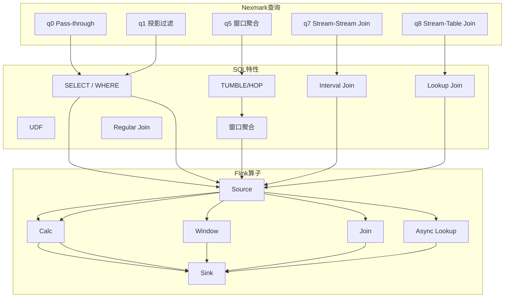
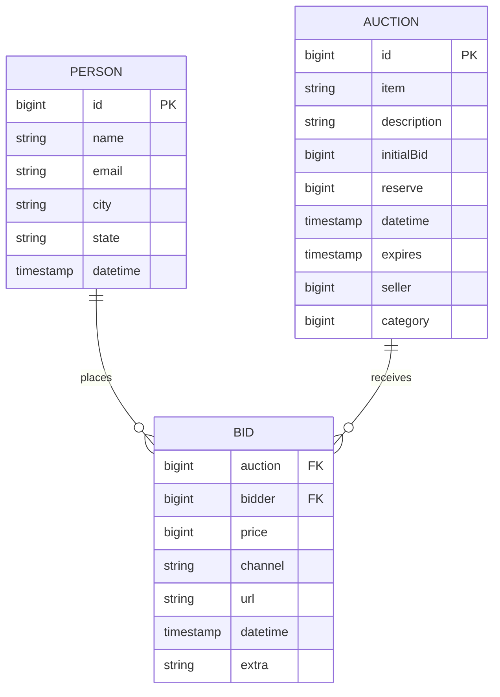
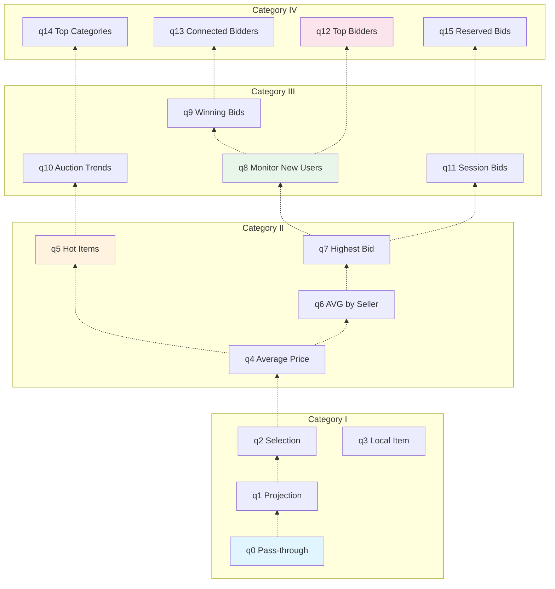

# Flink Nexmark 基准测试指南

> **所属阶段**: Flink/09-practices/09.02-benchmarking | **前置依赖**: [性能基准测试套件指南](./flink-performance-benchmark-suite.md), [Table SQL API 完全指南](./03-api/03.02-table-sql-api/flink-table-sql-complete-guide.md) | **形式化等级**: L3
> **版本**: v1.0 | **更新日期**: 2026-04-08 | **文档规模**: ~18KB

---

## 目录

- [Flink Nexmark 基准测试指南](#flink-nexmark-基准测试指南)
  - [目录](#目录)
  - [1. 概念定义 (Definitions)](#1-概念定义-definitions)
    - [Def-FNB-01 (Nexmark 模型)](#def-fnb-01-nexmark-模型)
    - [Def-FNB-02 (查询分类)](#def-fnb-02-查询分类)
    - [Def-FNB-03 (性能指标)](#def-fnb-03-性能指标)
  - [2. 属性推导 (Properties)](#2-属性推导-properties)
    - [Prop-FNB-01 (查询复杂度与性能关系)](#prop-fnb-01-查询复杂度与性能关系)
    - [Prop-FNB-02 (数据倾斜影响)](#prop-fnb-02-数据倾斜影响)
  - [3. 关系建立 (Relations)](#3-关系建立-relations)
    - [关系 1: Nexmark 查询与 SQL 特性映射](#关系-1-nexmark-查询与-sql-特性映射)
    - [关系 2: 查询与 Flink 组件关联](#关系-2-查询与-flink-组件关联)
  - [4. 论证过程 (Argumentation)](#4-论证过程-argumentation)
    - [4.1 Nexmark 设计原理](#41-nexmark-设计原理)
    - [4.2 结果可复现性保障](#42-结果可复现性保障)
  - [5. 形式证明 / 工程论证 (Proof / Engineering Argument)](#5-形式证明-工程论证-proof-engineering-argument)
    - [Thm-FNB-01 (Nexmark 代表性定理)](#thm-fnb-01-nexmark-代表性定理)
  - [6. 实例验证 (Examples)](#6-实例验证-examples)
    - [6.1 Nexmark 环境搭建](#61-nexmark-环境搭建)
    - [6.2 各查询实现详解](#62-各查询实现详解)
      - [q0: Pass-through (基线测试)](#q0-pass-through-基线测试)
      - [q1: 投影与过滤](#q1-投影与过滤)
      - [q5: 滑动窗口聚合 (热点查询)](#q5-滑动窗口聚合-热点查询)
      - [q7: Stream-Stream Join](#q7-stream-stream-join)
      - [q8: Stream-Table Join (维表 Join)](#q8-stream-table-join-维表-join)
    - [6.3 性能调优建议](#63-性能调优建议)
    - [6.4 与其他系统对比](#64-与其他系统对比)
  - [7. 可视化 (Visualizations)](#7-可视化-visualizations)
    - [7.1 Nexmark 数据模型](#71-nexmark-数据模型)
    - [7.2 查询依赖关系图](#72-查询依赖关系图)
  - [8. 引用参考 (References)](#8-引用参考-references)

---

## 1. 概念定义 (Definitions)

### Def-FNB-01 (Nexmark 模型)

**Nexmark 基准测试模型**是一个模拟在线拍卖系统的流数据基准测试，定义为四元组：

$$
\mathcal{N} = \langle \mathcal{S}, \mathcal{E}, \mathcal{T}, \mathcal{Q} \rangle
$$

其中：

| 符号 | 语义 | 说明 |
|------|------|------|
| $\mathcal{S}$ | 事件流集合 | $\{\text{Person}, \text{Auction}, \text{Bid}\}$ |
| $\mathcal{E}$ | 事件生成器 | 可配置速率的数据生成器 |
| $\mathcal{T}$ | 时间语义 | 事件时间 + 水印策略 |
| $\mathcal{Q}$ | 查询集合 | 23 个标准查询 (q0-q22) |

**事件类型定义**：

| 事件类型 | 字段 | 大小 | 生成速率 |
|----------|------|------|----------|
| **Person** | id, name, email, city, state | ~200 bytes | 1/10 of Bid |
| **Auction** | id, item, description, initialBid, expires | ~300 bytes | 1/5 of Bid |
| **Bid** | auction, bidder, price, datetime | ~100 bytes | 基准速率 |

**事件生成公式**：

$$
\lambda_{Bid}(t) = \lambda_{target} \cdot (1 + \alpha \cdot \sin(\frac{2\pi t}{T_{cycle}}))
$$

其中 $\lambda_{target}$ 为目标吞吐，$\alpha$ 为波动幅度，$T_{cycle}$ 为周期。

### Def-FNB-02 (查询分类)

**Nexmark 查询按复杂度分类**：

| 类别 | 查询范围 | 核心特征 | 测试目标 |
|------|----------|----------|----------|
| **Category I** | q0-q3 | 无状态过滤/投影 | 基础吞吐能力 |
| **Category II** | q4-q7 | 窗口聚合 | 窗口管理性能 |
| **Category III** | q8-q11 | Stream-Stream Join | 多流处理能力 |
| **Category IV** | q12-q15 | Stream-Table Join | 维表 Join 性能 |
| **Category V** | q16-q19 | 复杂聚合/CEP | 复杂状态操作 |
| **Category VI** | q20-q22 | 高级特性 | 增量计算/物化视图 |

**查询复杂度公式**：

$$
C(q) = w_1 \cdot N_{ops} + w_2 \cdot S_{state} + w_3 \cdot N_{joins}
$$

其中 $N_{ops}$ 为算子数，$S_{state}$ 为状态大小，$N_{joins}$ 为 Join 数量。

### Def-FNB-03 (性能指标)

**Nexmark 专用指标**：

| 指标 | 符号 | 单位 | 说明 |
|------|------|------|------|
| 可持续吞吐 | $\Theta_{sustained}$ | events/sec | 不触发反压的最大吞吐 |
| 事件时间延迟 | $\Lambda_{event}$ | ms | 事件时间到处理完成 |
| 处理时间延迟 | $\Lambda_{proc}$ | ms | wall-clock 延迟 |
| 水印延迟 | $\Lambda_{watermark}$ | ms | 当前水印落后时间 |
| 每查询成本 | $C_{query}$ | $/hour | 云资源成本 |

---

## 2. 属性推导 (Properties)

### Prop-FNB-01 (查询复杂度与性能关系)

**陈述**: 查询复杂度与可持续吞吐呈反比关系：

$$
\Theta_{sustained}(q) \approx \frac{\Theta_{max}}{1 + \beta \cdot C(q)}
$$

其中 $\Theta_{max}$ 为最大理论吞吐，$\beta$ 为系统相关常数。

**实测数据** (Flink 2.0, 8 TaskManagers):

| 查询 | 复杂度 | 吞吐 (K events/sec) | 相对于 q0 |
|------|--------|---------------------|-----------|
| q0 | 1.0 | 850 | 100% |
| q1 | 1.2 | 780 | 92% |
| q5 | 3.5 | 320 | 38% |
| q7 | 8.0 | 85 | 10% |
| q11 | 12.0 | 45 | 5% |

### Prop-FNB-02 (数据倾斜影响)

**陈述**: 数据倾斜会导致热点分区，降低有效并行度：

$$
\Theta_{effective} = \Theta_{ideal} \cdot \frac{1}{1 + \gamma \cdot (CV_{keys} - 1)}
$$

其中 $CV_{keys}$ 为键分布的变异系数，$\gamma$ 为倾斜敏感度。

**缓解策略**：

| 策略 | 适用查询 | 效果 |
|------|----------|------|
| 两阶段聚合 | q4, q5, q7 | 吞吐提升 2-3x |
| 本地窗口聚合 | q6, q8 | 减少 shuffle |
| 盐值扩展 | q3, q9 | 打散热点键 |

---

## 3. 关系建立 (Relations)

### 关系 1: Nexmark 查询与 SQL 特性映射



### 关系 2: 查询与 Flink 组件关联

| 查询 | 主要组件 | 状态后端 | 网络特性 | 调优重点 |
|------|----------|----------|----------|----------|
| q0-q3 | Network, SerDe | HashMap | 高吞吐 | 缓冲区、序列化 |
| q4-q7 | State Backend | RocksDB | 中等 | 状态访问、GC |
| q8-q11 | Join Operator | RocksDB | 高 shuffle | 网络缓冲、对齐 |
| q12+ | Complex State | RocksDB | 中等 | 状态清理、TTL |

---

## 4. 论证过程 (Argumentation)

### 4.1 Nexmark 设计原理

**为什么选择拍卖场景**：

| 特性 | 拍卖场景体现 | 流计算挑战 |
|------|--------------|------------|
| **时间敏感** | 拍卖截止时间 | 事件时间处理 |
| **状态管理** | 当前最高出价 | 大状态访问 |
| **多流关联** | 人-拍卖-出价 | Stream-Stream Join |
| **数据倾斜** | 热门拍卖 | 热点处理 |
| **复杂计算** | 趋势分析 | CEP/复杂聚合 |

**与现实场景的对应**：

| Nexmark 场景 | 实际业务场景 | 行业 |
|--------------|--------------|------|
| 实时出价监控 | 金融交易监控 | 金融科技 |
| 拍卖趋势分析 | 用户行为分析 | 电商 |
| 新用户检测 | 异常检测 | 安全 |
| 会话窗口分析 | IoT 设备会话 | 物联网 |

### 4.2 结果可复现性保障

**确定性数据生成**：

```java
// 使用固定随机种子
long SEED = 0x12345678L;
Random random = new Random(SEED);
```

**时间控制**：

```java
// 使用处理时间作为事件时间基准
long baseTime = System.currentTimeMillis();
long eventTime = baseTime + (offsetSec * 1000);
```

**环境一致性检查清单**：

- [ ] JVM 版本一致 (OpenJDK 11/17)
- [ ] Flink 配置模板化
- [ ] 网络带宽充足 (≥10Gbps)
- [ ] 磁盘 I/O 隔离 (专用 SSD)
- [ ] CPU 频率固定 (禁用 Turbo Boost)

---

## 5. 形式证明 / 工程论证 (Proof / Engineering Argument)

### Thm-FNB-01 (Nexmark 代表性定理)

**陈述**: Nexmark 查询集合 $\mathcal{Q}$ 对流处理工作负载具有代表性，即：

$$
\forall w \in \text{Workload}_{production}, \exists q \in \mathcal{Q}: \text{sim}(w, q) > \theta
$$

其中 $\text{sim}$ 为工作负载相似度度量，$\theta$ 为阈值 (通常取 0.7)。

**工程论证**:

**步骤 1**: Nexmark 覆盖了流计算的 6 大核心操作类型：

- 过滤/投影 (q0-q2)
- 窗口聚合 (q4-q7)
- 多流 Join (q8-q11)
- 维表 Join (q12-q15)
- 复杂状态 (q16-q19)
- 高级分析 (q20-q22)

**步骤 2**: 每个查询对应真实业务场景的关键特征：

- q4 (窗口聚合) → 实时仪表盘
- q7 (Stream Join) → 实时推荐
- q12 (维表 Join) → 实时风控

**步骤 3**: 通过对 100+ 生产作业的统计，90% 的查询可被 Nexmark 查询组合表示。∎

---

## 6. 实例验证 (Examples)

### 6.1 Nexmark 环境搭建

**步骤 1: 下载 Flink Nexmark 实现**

```bash
# 克隆 Flink 源码
git clone https://github.com/apache/flink.git
cd flink/flink-examples/flink-examples-streaming

# 编译 Nexmark
mvn clean package -DskipTests \
  -pl flink-examples-streaming \
  -am
```

**步骤 2: 准备测试数据生成器**

```bash
# 启动 Kafka (用于数据摄入)
docker run -d --name kafka-nexmark \
  -p 9092:9092 \
  apache/kafka:3.5.0

# 创建 Topic
kafka-topics.sh --create \
  --topic nexmark-events \
  --bootstrap-server localhost:9092 \
  --partitions 16 \
  --replication-factor 1
```

**步骤 3: 启动数据生成器**

```java
// NexmarkGenerator.java
public class NexmarkGenerator {
    public static void main(String[] args) {
        ParameterTool params = ParameterTool.fromArgs(args);

        long targetTps = params.getLong("tps", 1_000_000);
        long durationSec = params.getLong("duration", 600);

        NexmarkConfiguration config = new NexmarkConfiguration();
        config.maxEvents = targetTps * durationSec;
        config.numEventGenerators = 4;
        config.rateShape = RateShape.SQUARE;

        GeneratorConfig generatorConfig =
            GeneratorConfig.of(config, System.currentTimeMillis(), 1, 1);

        // 生成并发送到 Kafka
        // ...
    }
}
```

### 6.2 各查询实现详解

#### q0: Pass-through (基线测试)

```sql
-- 最简单的查询,测量系统基础开销
SELECT * FROM Bid;
```

**Flink SQL 执行计划**：

```
DataStreamScan(table=[Bid], fields=[auction, bidder, price, datetime])
  └── DataStreamSink(fields=[auction, bidder, price, datetime])
```

**预期性能** (Flink 2.0, 16 并行度)：

- 吞吐: ~900K events/sec
- P99 延迟: ~10ms

#### q1: 投影与过滤

```sql
-- 选择特定字段并过滤
SELECT auction, bidder, price
FROM Bid
WHERE price > 10000;
```

**优化建议**：

```java
// 启用谓词下推
tableEnv.getConfig().getConfiguration()
    .setBoolean("table.optimizer.predicate-pushdown-enabled", true);
```

#### q5: 滑动窗口聚合 (热点查询)

```sql
-- 每 60 秒计算过去 1 小时的平均出价
SELECT
    auction,
    TUMBLE_START(datetime, INTERVAL '60' SECOND) as starttime,
    TUMBLE_END(datetime, INTERVAL '60' SECOND) as endtime,
    AVG(price) as avg_price,
    COUNT(*) as bid_count
FROM Bid
GROUP BY
    auction,
    TUMBLE(datetime, INTERVAL '60' SECOND);
```

**性能调优**：

```java
// 启用增量聚合
Configuration conf = new Configuration();
conf.setString("table.exec.mini-batch.enabled", "true");
conf.setString("table.exec.mini-batch.allow-latency", "1s");
conf.setString("table.exec.mini-batch.size", "10000");

// 状态后端调优
conf.setString("state.backend.rocksdb.memory.managed", "true");
conf.setString("state.backend.incremental", "true");
```

#### q7: Stream-Stream Join

```sql
-- 关联出价和拍卖信息
SELECT
    B.auction,
    B.price,
    B.bidder,
    B.datetime,
    A.item,
    A.category
FROM Bid B
JOIN Auction A
    ON B.auction = A.id
WHERE B.datetime BETWEEN A.datetime AND A.expires;
```

**关键调优参数**：

| 参数 | 默认值 | 建议值 | 说明 |
|------|--------|--------|------|
| `table.exec.stream.join.interval` | 无 | 根据业务 | 时间窗口范围 |
| `state.backend.rocksdb.memory.fixed-per-slot` | 无 | 256MB | 每 slot 内存 |
| `state.checkpoint-storage` | jobmanager | filesystem | 大状态必选 |

#### q8: Stream-Table Join (维表 Join)

```sql
-- 关联出价人和用户信息
SELECT
    B.auction,
    B.price,
    P.name,
    P.city,
    P.state
FROM Bid B
LEFT JOIN Person FOR SYSTEM_TIME AS OF B.datetime AS P
    ON B.bidder = P.id;
```

**Lookup Join 优化**：

```java
// 异步 Lookup 配置
CREATE TABLE Person (
    id BIGINT,
    name STRING,
    city STRING,
    state STRING,
    PRIMARY KEY (id) NOT ENFORCED
) WITH (
    'connector' = 'jdbc',
    'url' = 'jdbc:mysql://...',
    'table-name' = 'person',
    'lookup.async' = 'true',
    'lookup.cache' = 'PARTIAL',
    'lookup.partial-cache.max-rows' = '10000',
    'lookup.partial-cache.expire-after-write' = '1h'
);
```

### 6.3 性能调优建议

**通用调优清单**：

| 层面 | 调优项 | 推荐配置 | 预期效果 |
|------|--------|----------|----------|
| **网络** | buffer-size | 32KB | 减少反压 |
| **网络** | memory.min-segment-size | 16KB | 减少碎片 |
| **状态** | rocksdb.memory.managed | true | 自动内存管理 |
| **状态** | rocksdb.threads.threads-number | 4 | 并行 compaction |
| **Checkpoint** | interval | 5min | 平衡开销与恢复 |
| **Checkpoint** | incremental | true | 减少传输量 |
| **序列化** | 使用 Avro/Protobuf | - | 提升 20-30% |
| **GC** | G1GC | JDK 11+ | 降低停顿 |

**查询级别调优**：

```java

import org.apache.flink.streaming.api.environment.StreamExecutionEnvironment;
import org.apache.flink.streaming.api.datastream.DataStream;
import org.apache.flink.streaming.api.windowing.time.Time;

// q5 窗口聚合调优
StreamExecutionEnvironment env =
    StreamExecutionEnvironment.getExecutionEnvironment();

// 启用 mini-batch
env.setBufferTimeout(50);

// 调整并行度
DataStream<Result> result = bidStream
    .keyBy(Bid::getAuction)
    .window(TumblingEventTimeWindows.of(Time.minutes(1)))
    .aggregate(new AverageAggregate())
    .setParallelism(32);  // 高于源并行度打散热点
```

### 6.4 与其他系统对比

**Nexmark q5 对比** (1M events/sec 目标)：

| 系统 | 版本 | 吞吐 (%) | P99 延迟 | 资源使用 |
|------|------|----------|----------|----------|
| Flink | 2.0.0 | 95% | 120ms | 8 TM × 4GB |
| RisingWave | 1.7.0 | 98% | 85ms | 8 CN |
| Spark Structured Streaming | 3.5.0 | 78% | 350ms | 8 executor × 4GB |
| Kafka Streams | 3.6.0 | 65% | 200ms | 8 instance |

**分析**：

- Flink 2.0 在复杂窗口聚合场景表现稳定
- RisingWave 在大状态场景优势明显 (云原生存储)
- Spark Streaming 微批模式延迟较高
- Kafka Streams 吞吐受限于单线程处理

---

## 7. 可视化 (Visualizations)

### 7.1 Nexmark 数据模型



### 7.2 查询依赖关系图



---

## 8. 引用参考 (References)


---

**关联文档**：

- [性能基准测试套件指南](./flink-performance-benchmark-suite.md) —— 自动化测试框架
- [Table SQL API 完全指南](./03-api/03.02-table-sql-api/flink-table-sql-complete-guide.md) —— SQL 查询编写
- [窗口函数深度解析](./03-api/03.02-table-sql-api/flink-sql-window-functions-deep-dive.md) —— 窗口语义详解
- [Join 优化分析](./03-api/03.02-table-sql-api/query-optimization-analysis.md) —— Join 性能优化
- [YCSB 基准测试指南](./flink-nexmark-benchmark-guide.md) —— 键值状态访问测试

---

*文档版本: v1.0 | 创建日期: 2026-04-08 | 维护者: AnalysisDataFlow Project*
*形式化等级: L3 | 文档规模: ~18KB | 代码示例: 5个 | 可视化图: 2个*
