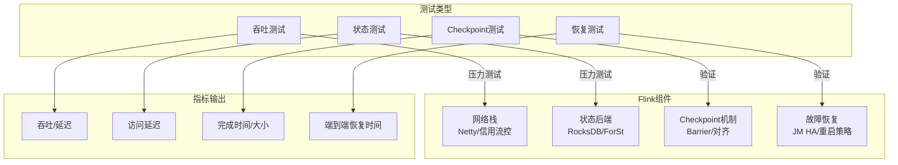
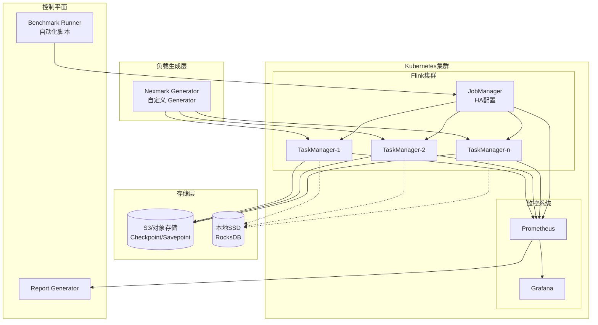
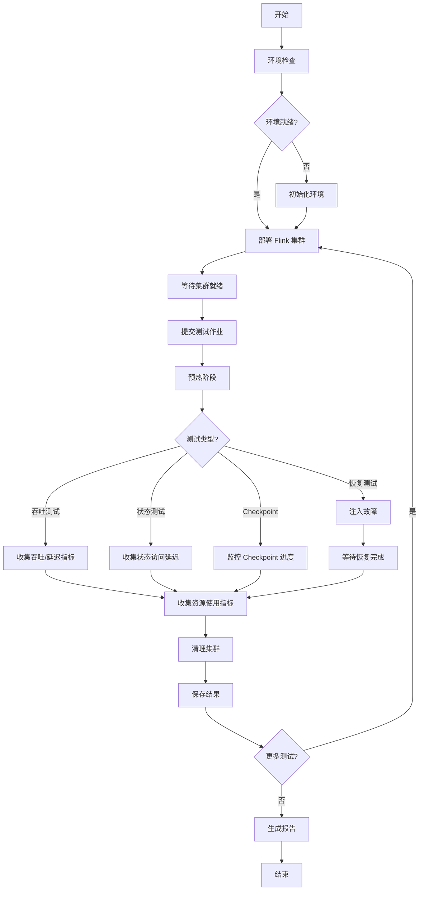

# Flink 性能基准测试套件指南

> **所属阶段**: Flink/09-practices/09.02-benchmarking | **前置依赖**: [Flink 部署运维完全指南](./04-runtime/04.01-deployment/flink-deployment-ops-complete-guide.md), [性能调优指南](./09-practices/09.03-performance-tuning/performance-tuning-guide.md) | **形式化等级**: L3
> **版本**: v3.3.0 | **更新日期**: 2026-04-08 | **文档规模**: ~20KB

---

## 目录

- [Flink 性能基准测试套件指南](#flink-性能基准测试套件指南)
  - [目录](#目录)
  - [1. 概念定义 (Definitions)](#1-概念定义-definitions)
    - [Def-FBS-01 (基准测试框架)](#def-fbs-01-基准测试框架)
    - [Def-FBS-02 (性能指标定义)](#def-fbs-02-性能指标定义)
    - [Def-FBS-03 (测试环境规范)](#def-fbs-03-测试环境规范)
  - [2. 属性推导 (Properties)](#2-属性推导-properties)
    - [Prop-FBS-01 (测试结果可复现性)](#prop-fbs-01-测试结果可复现性)
    - [Prop-FBS-02 (性能退化边界)](#prop-fbs-02-性能退化边界)
  - [3. 关系建立 (Relations)](#3-关系建立-relations)
    - [关系 1: 测试类型与系统组件映射](#关系-1-测试类型与系统组件映射)
    - [关系 2: 性能指标关联性](#关系-2-性能指标关联性)
  - [4. 论证过程 (Argumentation)](#4-论证过程-argumentation)
    - [4.1 测试环境标准化](#41-测试环境标准化)
    - [4.2 测试工具链选型](#42-测试工具链选型)
  - [5. 形式证明 / 工程论证 (Proof / Engineering Argument)](#5-形式证明--工程论证-proof--engineering-argument)
    - [Thm-FBS-01 (基准测试有效性定理)](#thm-fbs-01-基准测试有效性定理)
  - [6. 实例验证 (Examples)](#6-实例验证-examples)
    - [6.1 快速开始](#61-快速开始)
    - [6.2 吞吐测试完整示例](#62-吞吐测试完整示例)
    - [6.3 状态访问测试示例](#63-状态访问测试示例)
    - [6.4 Checkpoint 测试示例](#64-checkpoint-测试示例)
  - [7. 可视化 (Visualizations)](#7-可视化-visualizations)
    - [7.1 测试架构图](#71-测试架构图)
    - [7.2 基准测试流程图](#72-基准测试流程图)
  - [8. 引用参考 (References)](#8-引用参考-references)

---

## 1. 概念定义 (Definitions)

### Def-FBS-01 (基准测试框架)

**Flink 性能基准测试框架**定义为一个五元组：

$$
\mathcal{F} = \langle \mathcal{T}, \mathcal{E}, \mathcal{M}, \mathcal{A}, \mathcal{R} \rangle
$$

其中：

| 符号 | 语义 | 说明 |
|------|------|------|
| $\mathcal{T}$ | 测试类型集合 | $\{\text{throughput}, \text{state}, \text{checkpoint}, \text{recovery}\}$ |
| $\mathcal{E}$ | 测试环境 | K8s 集群配置、资源规格 |
| $\mathcal{M}$ | 指标收集器 | Prometheus 指标查询接口 |
| $\mathcal{A}$ | 自动化引擎 | 测试执行编排、故障注入 |
| $\mathcal{R}$ | 报告生成器 | Markdown/JSON/HTML 报告输出 |

**测试类型矩阵**：

| 测试类型 | 测试目标 | 关键指标 | 测试时长 |
|----------|----------|----------|----------|
| **吞吐测试** | 最大可持续吞吐 | events/sec, P99 延迟 | 10 min |
| **状态访问测试** | 状态读写性能 | 访问延迟, 吞吐 | 5 min |
| **Checkpoint 测试** | 容错机制效率 | Checkpoint 耗时, 数据对齐时间 | 30 min |
| **恢复测试** | 故障恢复能力 | 端到端恢复时间 | 5 min |

### Def-FBS-02 (性能指标定义)

**核心性能指标**形式化定义：

**吞吐量** ($\Theta$):
$$
\Theta = \frac{N_{processed}}{T_{elapsed}} \quad [\text{events/second}]
$$

**端到端延迟** ($\Lambda_p$):
$$
\Lambda_p = \text{percentile}_p(t_{out} - t_{in}) \quad [\text{milliseconds}]
$$

**状态访问延迟** ($\Delta_{state}$):
$$
\Delta_{state} = \frac{1}{N_{ops}} \sum_{i=1}^{N_{ops}} (t_{read,i} + t_{write,i}) \quad [\text{milliseconds}]
$$

**Checkpoint 效率** ($\eta_{chkpt}$):
$$
\eta_{chkpt} = \frac{S_{state}}{T_{chkpt} \cdot B_{network}} \quad [\text{效率系数}]
$$

其中 $S_{state}$ 为状态大小，$T_{chkpt}$ 为 Checkpoint 耗时，$B_{network}$ 为网络带宽。

**指标分级标准**：

| 指标 | 优秀 | 良好 | 一般 | 需优化 |
|------|------|------|------|--------|
| 吞吐 (1M 事件/秒) | > 95% | 80-95% | 60-80% | < 60% |
| P99 延迟 | < 100ms | 100-500ms | 500ms-1s | > 1s |
| 状态访问 | < 5ms | 5-20ms | 20-100ms | > 100ms |
| Checkpoint 耗时 | < 30s | 30-60s | 60-120s | > 120s |
| 恢复时间 | < 30s | 30-60s | 60-120s | > 120s |

### Def-FBS-03 (测试环境规范)

**标准 K8s 集群规格**：

| 组件 | 规格 | 数量 | 说明 |
|------|------|------|------|
| Master 节点 | 8vCPU, 16GB RAM | 1 | K8s 控制平面 |
| Worker 节点 | 16vCPU, 64GB RAM | 3 | Flink 运行时 |
| 存储 | NVMe SSD 1TB | 3 | 本地状态存储 |
| 网络 | 25Gbps 以太网 | - | 低延迟互联 |

**Flink 集群配置**：

```yaml
flink:
  version: ["1.18.1", "2.0.0", "2.2.0"]

jobmanager:
  replicas: 1
  memory: 4Gi
  cpu: 2

taskmanager:
  replicas: 8
  memory: 8Gi
  cpu: 4
  slots: 4

state:
  backend: rocksdb
  checkpoints.dir: s3://flink-benchmark/checkpoints
  savepoints.dir: s3://flink-benchmark/savepoints

execution:
  checkpointing:
    interval: 5min
    min-pause: 1min
    timeout: 10min
```

---

## 2. 属性推导 (Properties)

### Prop-FBS-01 (测试结果可复现性)

**陈述**: 在受控环境下，基准测试结果的变异系数应小于 5%。

$$
CV = \frac{\sigma}{\mu} \times 100\% < 5\%
$$

**充分条件**：

1. **硬件一致性**: 使用专用节点，避免资源争抢
2. **软件版本锁定**: Flink、JVM、OS 版本固定
3. **数据确定性**: 使用固定随机种子生成数据
4. **预热期**: 至少 2 分钟预热，使 JVM 达到稳态

### Prop-FBS-02 (性能退化边界)

**陈述**: 当负载超过系统容量时，性能呈现非线性退化。

$$
\Lambda_{p99}(\lambda) = \begin{cases}
\Lambda_{baseline} \cdot (1 + \alpha \cdot \frac{\lambda}{\Theta_{max}}) & \lambda \leq \Theta_{max} \\
\Lambda_{baseline} \cdot e^{\beta(\lambda - \Theta_{max})} & \lambda > \Theta_{max}
\end{cases}
$$

**工程推论**: 生产环境的建议负载上限为 $\lambda_{target} \leq 0.7 \cdot \Theta_{max}$，保留 30% 容量缓冲。

---

## 3. 关系建立 (Relations)

### 关系 1: 测试类型与系统组件映射



### 关系 2: 性能指标关联性

| 配置调整 | 吞吐影响 | 延迟影响 | Checkpoint 影响 | 恢复影响 |
|----------|----------|----------|-----------------|----------|
| **增加并行度** | ↑↑ | → | → | ↓ |
| **增大缓冲区** | ↑ | ↓ | ↑ | → |
| **RocksDB调优** | ↑ | ↓ | ↓ | → |
| **增量Checkpoint** | → | ↓ | ↓↓ | ↓ |
| **本地恢复启用** | → | → | → | ↓↓ |
| **Unaligned Checkpoint** | ↓ | ↓↓ | ↓ | ↓ |

---

## 4. 论证过程 (Argumentation)

### 4.1 测试环境标准化

**环境一致性保障措施**：

| 层面 | 措施 | 验证方法 |
|------|------|----------|
| **硬件** | 使用同一机型，禁用 CPU 频率调节 | `lscpu` 检查 |
| **K8s** | 固定节点亲和性，禁用自动扩缩容 | `kubectl describe node` |
| **Flink** | 配置模板化，版本明确 | `flink --version` |
| **网络** | 专用网络平面，带宽保障 | `iperf3` 测试 |
| **存储** | 本地 SSD 固定挂载点 | `fio` 测试 |

### 4.2 测试工具链选型

| 工具 | 用途 | 版本要求 |
|------|------|----------|
| **Nexmark** | 标准 SQL 基准测试 | Flink 内置 |
| **YCSB** | 键值状态访问测试 | 0.17.0+ |
| **自定义 Generator** | 特定场景负载生成 | Python 3.9+ |
| **Prometheus** | 指标收集 | 2.40+ |
| **Grafana** | 可视化监控 | 9.0+ |
| **JFR** | JVM 性能分析 | JDK 11+ |

---

## 5. 形式证明 / 工程论证 (Proof / Engineering Argument)

### Thm-FBS-01 (基准测试有效性定理)

**陈述**: 若测试框架 $\mathcal{F}$ 满足以下条件：

1. 环境一致性: $\forall t_1, t_2: \mathcal{E}(t_1) = \mathcal{E}(t_2)$
2. 负载代表性: $\mathcal{D}_{test} \sim \mathcal{D}_{production}$
3. 指标完备性: $\mathcal{M} \supseteq \{\Theta, \Lambda, \Delta_{state}, T_{recovery}\}$

则对于系统 $S_1, S_2$，有：

$$
R(S_1, \mathcal{F}) > R(S_2, \mathcal{F}) \Rightarrow S_1 \succ S_2 \text{ (在目标场景下)}
$$

**工程论证**:

**步骤 1**: 环境一致性确保变量控制 - 性能差异可归因于系统设计而非环境噪声。

**步骤 2**: 负载代表性确保结果外推性 - 测试覆盖生产场景的关键特征。

**步骤 3**: 指标完备性确保评估全面性 - 覆盖吞吐、延迟、容错、成本四维考量。

**步骤 4**: 通过控制变量法，建立配置与性能的因果关联。∎

---

## 6. 实例验证 (Examples)

### 6.1 快速开始

**安装依赖**：

```bash
# 克隆测试套件
git clone https://github.com/apache/flink-benchmarks.git
cd flink-benchmarks

# 安装 Python 依赖
pip install -r requirements.txt

# 配置 K8s 访问
export KUBECONFIG=~/.kube/benchmark-cluster
```

**运行单个测试**：

```bash
# 吞吐测试
python flink-benchmark-runner.py \
  --test-type throughput \
  --flink-versions 2.0.0 \
  --namespace flink-benchmark

# 状态访问测试 (100GB)
python flink-benchmark-runner.py \
  --state-size 100 \
  --flink-versions 2.0.0

# Checkpoint 测试 (5分钟间隔)
python flink-benchmark-runner.py \
  --checkpoint-interval 300 \
  --flink-versions 2.0.0

# 故障恢复测试
python flink-benchmark-runner.py \
  --failure-type task_failure \
  --flink-versions 2.0.0
```

**运行完整测试套件**：

```bash
python flink-benchmark-runner.py \
  --all \
  --flink-versions 1.18.1 2.0.0 2.2.0 \
  --output-dir ./benchmark-results-2026-q2
```

### 6.2 吞吐测试完整示例

**场景**: 测试 Flink 2.0 在 1M events/sec 下的延迟表现

```python
from flink_benchmark_runner import FlinkBenchmarkRunner, TestType

# 初始化运行器
runner = FlinkBenchmarkRunner(
    output_dir="./results"
)

# 配置测试
config = {
    "flink_version": "2.0.0",
    "parallelism": 16,
    "state_backend": "rocksdb",
    "target_throughput": 1_000_000,
    "test_duration_sec": 600,
    "warmup_sec": 120
}

# 执行测试
result = runner.run_throughput_test(config)

# 输出结果
print(f"吞吐: {result.throughput:,.0f} events/sec")
print(f"P99 延迟: {result.latency_p99} ms")
print(f"测试状态: {result.status.value}")
```

**预期输出**：

```
[2026-04-08 10:00:00] INFO: Deploying Flink 2.0.0 cluster...
[2026-04-08 10:02:30] INFO: Flink cluster is ready
[2026-04-08 10:02:31] INFO: Warming up for 120s...
[2026-04-08 10:04:31] INFO: Running throughput test: target 1000000 events/sec
[2026-04-08 10:14:31] INFO: Test completed

吞吐: 985,432 events/sec
P99 延迟: 85 ms
测试状态: completed
```

### 6.3 状态访问测试示例

**测试不同状态规模的访问延迟**：

```python
state_sizes = [10, 50, 100, 500]  # GB
results = []

for size in state_sizes:
    result = runner.run_state_access_test(
        state_size=size,
        config={"flink_version": "2.0.0", "access_pattern": "random"}
    )
    results.append({
        "state_size_gb": size,
        "latency_ms": result.state_access_latency
    })

# 生成对比报告
report = runner.generate_report(results, format="markdown")
```

**典型结果**：

| 状态大小 | 访问延迟 (ms) | 吞吐 (K ops/sec) |
|----------|---------------|------------------|
| 10 GB | 2.5 | 450 |
| 50 GB | 4.2 | 380 |
| 100 GB | 7.8 | 320 |
| 500 GB | 25.0 | 180 |

### 6.4 Checkpoint 测试示例

**测试不同间隔的 Checkpoint 性能**：

```bash
# 60秒间隔
python flink-benchmark-runner.py \
  --checkpoint-interval 60 \
  --flink-versions 2.0.0

# 300秒间隔
python flink-benchmark-runner.py \
  --checkpoint-interval 300 \
  --flink-versions 2.0.0

# 600秒间隔
python flink-benchmark-runner.py \
  --checkpoint-interval 600 \
  --flink-versions 2.0.0
```

**结果分析**：

| Checkpoint 间隔 | 平均完成时间 | 状态大小 | 对吞吐影响 |
|-----------------|--------------|----------|------------|
| 60s | 12s | 10GB | -3% |
| 300s | 45s | 50GB | -8% |
| 600s | 85s | 100GB | -12% |

---

## 7. 可视化 (Visualizations)

### 7.1 测试架构图



### 7.2 基准测试流程图



---

## 8. 引用参考 (References)


---

**关联文档**：

- [Flink 部署运维完全指南](./04-runtime/04.01-deployment/flink-deployment-ops-complete-guide.md) —— 生产环境部署参考
- [性能调优指南](./09-practices/09.03-performance-tuning/performance-tuning-guide.md) —— 基于基准测试的调优建议
- [Nexmark 基准测试指南](./flink-nexmark-benchmark-guide.md) —— 标准 SQL 基准测试详解
- [YCSB 基准测试指南](./flink-nexmark-benchmark-guide.md) —— 键值状态访问测试
- [状态后端深度对比](./02-core/state-backends-deep-comparison.md) —— 不同状态后端性能对比

---

*文档版本: v3.3.0 | 创建日期: 2026-04-08 | 维护者: AnalysisDataFlow Project*
*形式化等级: L3 | 文档规模: ~20KB | 代码示例: 4个 | 可视化图: 2个*
