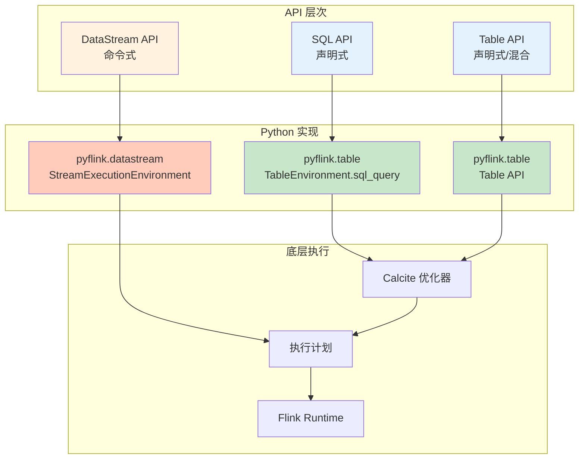
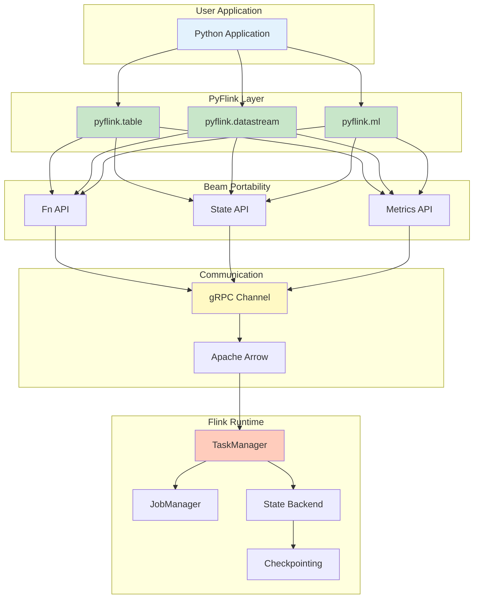
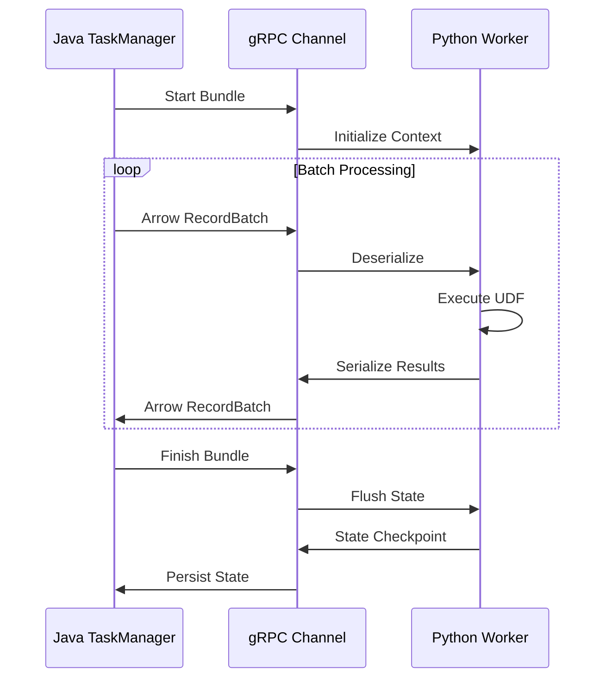
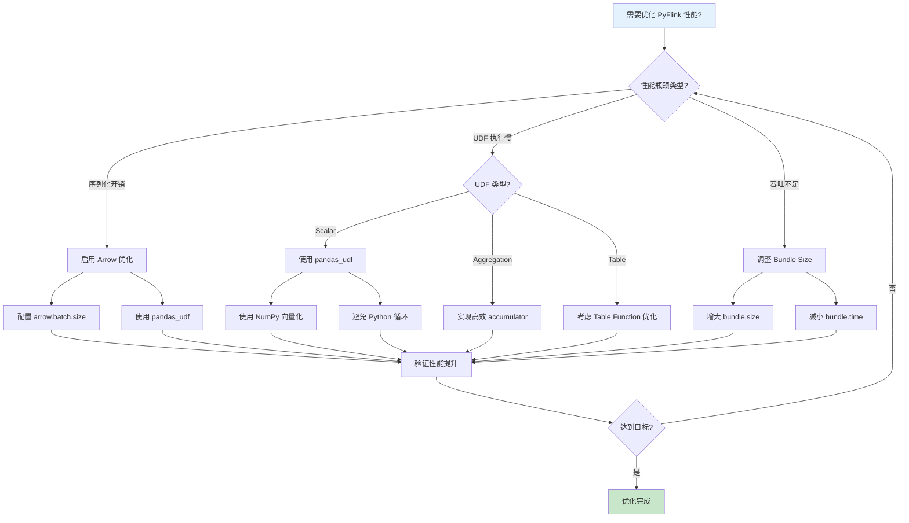

# PyFlink 深度指南：架构原理与工程实践

> **所属阶段**: Flink/ 工程实践 | **前置依赖**: [Flink/09-language-foundations/pyflink-complete-guide.md](03-api/09-language-foundations/pyflink-complete-guide.md), [Flink/02-core/checkpoint-mechanism-deep-dive.md](02-core/checkpoint-mechanism-deep-dive.md) | **形式化等级**: L3-L4
> **版本**: 2026.04 | **适用版本**: Flink 1.18+ - 2.5+ | **Python**: 3.9+

---

## 1. 概念定义 (Definitions)

### Def-F-Py-01: PyFlink 架构模型

**形式化定义**: PyFlink 架构是一个跨语言执行框架，定义为六元组：

$$
\mathcal{P}_{Flink} = (P_{vm}, J_{vm}, B_{bridge}, S_{ser}, E_{exec}, C_{coord})
$$

其中：

- $P_{vm}$: Python 虚拟机执行层，运行用户 Python 代码和 UDF
- $J_{vm}$: Java 虚拟机执行层，运行 Flink 核心引擎
- $B_{bridge}$: 双向通信桥接层 (Apache Beam Portability Framework)
- $S_{ser}$: 序列化层 (Apache Arrow + Protobuf + cloudpickle)
- $E_{exec}$: 执行环境抽象层
- $C_{coord}$: 跨语言协调器 (JobMaster ↔ Python Driver)

**架构层次图**

```
┌─────────────────────────────────────────────────────────────────────┐
│                        Application Layer                             │
│  ┌─────────────┐  ┌─────────────┐  ┌─────────────────────────────┐  │
│  │  Table API  │  │ DataStream  │  │     ML Pipeline API         │  │
│  │   (Python)  │  │   (Python)  │  │      (PyFlink ML)           │  │
│  └──────┬──────┘  └──────┬──────┘  └─────────────┬───────────────┘  │
├───────┼────────────────┼───────────────────────┼──────────────────┤
│       ▼                ▼                       ▼                    │
│  ┌─────────────────────────────────────────────────────────────┐   │
│  │              PyFlink Python API Layer                        │   │
│  │    (pyflink.table / pyflink.datastream / pyflink.ml)       │   │
│  └───────────────────────────┬─────────────────────────────────┘   │
├──────────────────────────────┼─────────────────────────────────────┤
│                              ▼                                      │
│  ┌─────────────────────────────────────────────────────────────┐   │
│  │           Apache Beam Portability Framework                 │   │
│  │  ┌─────────────┐  ┌─────────────┐  ┌─────────────────────┐  │   │
│  │  │  Fn API     │  │  State API  │  │   Metrics API       │  │   │
│  │  │ (UDF Exec)  │  │(State Ops)  │  │ (Monitoring)        │  │   │
│  │  └─────────────┘  └─────────────┘  └─────────────────────┘  │   │
│  └───────────────────────────┬─────────────────────────────────┘   │
├──────────────────────────────┼─────────────────────────────────────┤
│                              ▼                                      │
│  ┌─────────────────────────────────────────────────────────────┐   │
│  │              gRPC Communication Channel                     │   │
│  │         (Bundle Processing / Streaming Data Exchange)       │   │
│  └───────────────────────────┬─────────────────────────────────┘   │
├──────────────────────────────┼─────────────────────────────────────┤
│                              ▼                                      │
│  ┌─────────────────────────────────────────────────────────────┐   │
│  │              Flink Java Runtime Core                        │   │
│  │  ┌─────────────┐  ┌─────────────┐  ┌─────────────────────┐  │   │
│  │  │TaskManager  │  │Checkpointing│  │    Network Stack    │  │   │
│  │  │(Task Exec)  │  │   (State)   │  │  (Shuffle/Backpressure)│  │   │
│  │  └─────────────┘  └─────────────┘  └─────────────────────┘  │   │
│  └─────────────────────────────────────────────────────────────┘   │
└─────────────────────────────────────────────────────────────────────┘
```

### Def-F-Py-02: Python VM ↔ JVM 通信协议

**形式化定义**: 跨语言通信协议定义为：

$$
\mathcal{C}_{proto} = (T_{transport}, S_{serialization}, B_{batching}, F_{flow})
$$

其中：

| 组件 | 技术实现 | 功能描述 |
|------|---------|---------|
| $T_{transport}$ | gRPC over HTTP/2 | 双向流式通信通道 |
| $S_{serialization}$ | Apache Arrow (列式) | 批量数据高效序列化 |
| $B_{batching}$ | Bundle Processing | 微批次处理优化 |
| $F_{flow}$ | 流控/背压机制 | 防止内存溢出 |

**通信流程**

```
Python Driver                    Java JobManager
     │                                │
     │  1. Submit Job (JobGraph)      │
     │ ─────────────────────────────> │
     │                                │
     │  2. Deploy Tasks               │
     │ <───────────────────────────── │
     │                                │
Python Worker(s)                Java TaskManager(s)
     │                                │
     │  3. gRPC Channel Establish     │
     │ <════════════════════════════> │
     │                                │
     │  4. Arrow Data Streaming       │
     │ <════════════════════════════> │
     │     (Input Data → UDF → Output)│
     │                                │
     │  5. State Operations via State API
     │ <════════════════════════════> │
     │                                │
     │  6. Checkpoint Coordination    │
     │ <════════════════════════════> │
```

### Def-F-Py-03: UDF 执行模型

**形式化定义**: Python UDF 执行模型定义为：

$$
\mathcal{U}_{exec} = (W_{pool}, Q_{input}, Q_{output}, P_{process}, T_{thread})
$$

其中：

- $W_{pool}$: Python Worker 进程池
- $Q_{input}$: 输入数据队列 (Arrow 格式)
- $Q_{output}$: 输出数据队列 (Arrow 格式)
- $P_{process}$: UDF 处理逻辑
- $T_{thread}$: 线程管理策略

**Bundle Processing 机制**

```
┌─────────────────────────────────────────────────────────────────┐
│                     Bundle Processing Cycle                     │
├─────────────────────────────────────────────────────────────────┤
│                                                                 │
│  Java TM                    gRPC Channel              Python    │
│  ────────                   ─────────────            Worker     │
│     │                             │                      │      │
│     │  Start Bundle               │                      │      │
│     │ ─────────────────────────>  │                      │      │
│     │                             │  Initialize Context  │      │
│     │                             │ ──────────────────>  │      │
│     │                             │                      │      │
│     │  Process Element [Batch]    │                      │      │
│     │ ─────────────────────────>  │  Arrow RecordBatch   │      │
│     │  (Arrow Data)               │ ──────────────────>  │      │
│     │                             │                      │      │
│     │                             │  Execute UDF         │      │
│     │                             │  ┌──────────────┐    │      │
│     │                             │  │ Map/FlatMap  │    │      │
│     │                             │  │ Filter/Agg   │    │      │
│     │                             │  └──────────────┘    │      │
│     │                             │                      │      │
│     │                             │  Return Results      │      │
│     │  Output Elements            │ <──────────────────  │      │
│     │ <─────────────────────────  │  (Arrow Data)        │      │
│     │                             │                      │      │
│     │  Finish Bundle              │                      │      │
│     │ ─────────────────────────>  │  Flush State         │      │
│     │                             │ ──────────────────>  │      │
│     │                             │                      │      │
│     │  Checkpoint State           │                      │      │
│     │ <═════════════════════════> │  Persist State       │      │
│     │                             │                      │      │
└─────────────────────────────────────────────────────────────────┘
```

---

## 2. 属性推导 (Properties)

### Lemma-F-Py-01: PyFlink UDF 序列化开销

**引理**: PyFlink UDF 的数据序列化开销满足：

$$
T_{total} = T_{arrow\_ser} + T_{grpc\_trans} + T_{py\_exec} + T_{arrow\_deser}
$$

其中各分量近似值为：

| 操作 | 时间复杂度 | 典型延迟 (10K rows) |
|------|-----------|-------------------|
| Arrow 序列化 | $O(n)$ | 1-5 ms |
| gRPC 传输 | $O(n)$ | 2-10 ms (本地) / 10-50 ms (远程) |
| Python 执行 | 取决于 UDF | 10-1000+ ms |
| Arrow 反序列化 | $O(n)$ | 1-5 ms |

**优化方向**: Python 执行是主要瓶颈，应优先优化 UDF 代码。

### Lemma-F-Py-02: Bundle Size 与吞吐量关系

**引理**: Bundle 大小与吞吐量之间存在最优平衡点：

$$
Throughput_{optimal} = f(BundleSize) \text{ where } \frac{d(Throughput)}{d(BundleSize)} = 0
$$

**典型特征**:

| Bundle 大小 | 延迟 | 吞吐量 | 适用场景 |
|------------|------|--------|---------|
| 1-10 | 极低 | 低 | 延迟敏感型 |
| 100-1000 | 中等 | 高 | 通用场景 |
| 10000+ | 较高 | 饱和 | 批处理模式 |

### Prop-F-Py-01: Python UDF 与 Java UDF 性能对比

**命题**: 在典型流处理场景下，Python UDF 与 Java UDF 的性能关系为：

$$
Throughput_{PythonUDF} \approx 0.3 \times Throughput_{JavaUDF}
$$

**例外情况** (Python UDF 可能更快):

1. 涉及复杂数学运算且使用 NumPy/Pandas 向量化
2. 调用原生 Python ML 库 (scikit-learn, PyTorch)
3. 需要与 Python 生态深度集成

---

## 3. 关系建立 (Relations)

### Table API vs DataStream API 对比



**选型决策矩阵**

| 场景 | 推荐 API | 原因 |
|------|---------|------|
| 复杂 ETL | Table API | 优化器自动优化执行计划 |
| 复杂事件处理 | DataStream API | 细粒度控制时间/状态 |
| 实时特征工程 | Table API + Pandas UDF | 与 ML 生态集成 |
| 需要底层控制 | DataStream API | 直接操作 State/Timer |
| SQL 迁移 | Table API (SQL) | 最小化迁移成本 |

---

## 4. 论证过程 (Argumentation)

### PyFlink 适用场景分析

**优势场景**

1. **数据科学与 ML 集成**
   - 直接使用 scikit-learn、PyTorch、TensorFlow
   - Pandas DataFrame 原生支持
   - 特征工程与模型推理一体化

2. **快速原型开发**
   - Python 语法简洁，开发效率高
   - 丰富的第三方库生态
   - 与 Jupyter Notebook 集成

3. **复杂计算逻辑**
   - 字符串/文本处理 (NLP 任务)
   - 复杂数学运算 (NumPy/SciPy)
   - 自定义业务逻辑

**劣势场景**

1. **极高吞吐量要求**
   - 纯 Java UDF 性能更优
   - 跨语言序列化开销

2. **极低延迟要求**
   - Bundle 处理引入批处理延迟
   - gRPC 通信开销

---

## 5. 形式证明 / 工程论证

### 定理 Thm-F-Py-01: PyFlink Exactly-Once 语义保障

**定理**: 在配置正确的情况下，PyFlink 能够提供与 Java Flink 相同的 Exactly-Once 处理语义。

**证明概要**:

1. **状态一致性**: Python UDF 的状态通过 State API 委托给 Java State Backend
   $$
   State_{Python} \xrightarrow{State API} State_{Java} \xrightarrow{Checkpoint} PersistentStorage
   $$

2. **Checkpoint 协调**: Python Worker 参与两阶段 Checkpoint 协议
   - Phase 1: 同步快照 (停止处理)
   - Phase 2: 异步持久化 (恢复处理)

3. **数据重放**: 失败时从 Checkpoint 恢复，数据由 Source 重放
   $$
   Recovery: Checkpoint_{n} \rightarrow State_{restored} + Source_{replay}
   $$

**工程约束**: Python UDF 必须满足幂等性或状态确定性，否则可能出现重复处理。

---

## 6. 实例验证 (Examples)

### 6.1 Table API in Python

#### 基础 Table API 操作

```python
from pyflink.table import EnvironmentSettings, TableEnvironment, DataTypes
from pyflink.table.expressions import col, lit

# 创建 Table Environment env_settings = EnvironmentSettings.in_streaming_mode()
table_env = TableEnvironment.create(env_settings)

# 配置 Checkpoint table_env.get_config().get_configuration().set_string(
    "execution.checkpointing.interval", "10s"
)

# 创建 Kafka Source 表 table_env.execute_sql("""
CREATE TABLE user_events (
    user_id STRING,
    event_type STRING,
    event_time TIMESTAMP(3),
    amount DECIMAL(10, 2),
    WATERMARK FOR event_time AS event_time - INTERVAL '5' SECOND
) WITH (
    'connector' = 'kafka',
    'topic' = 'user-events',
    'properties.bootstrap.servers' = 'kafka:9092',
    'format' = 'json',
    'scan.startup.mode' = 'latest-offset'
)
""")

# 创建 MySQL Sink 表 table_env.execute_sql("""
CREATE TABLE event_stats (
    event_type STRING,
    event_count BIGINT,
    total_amount DECIMAL(18, 2),
    window_start TIMESTAMP(3),
    PRIMARY KEY (event_type, window_start) NOT ENFORCED
) WITH (
    'connector' = 'jdbc',
    'url' = 'jdbc:mysql://mysql:3306/analytics',
    'table-name' = 'event_stats',
    'username' = 'flink',
    'password' = 'flink123'
)
""")

# 定义聚合逻辑 result = table_env.from_path("user_events") \
    .window(
        Tumble.over(lit(1).hours).on(col("event_time")).alias("w")
    ) \
    .group_by(col("w"), col("event_type")) \
    .select(
        col("event_type"),
        col("user_id").count.alias("event_count"),
        col("amount").sum.alias("total_amount"),
        col("w").start.alias("window_start")
    )

# 执行写入 result.execute_insert("event_stats").wait()
```

#### 窗口操作详解

```python
from pyflink.table import Tumble, Slide, Session
from pyflink.table.expressions import col

# Tumble Window (滚动窗口)
tumble_result = table_env.from_path("events") \
    .window(Tumble.over(lit(5).minutes).on(col("event_time")).alias("w")) \
    .group_by(col("user_id"), col("w")) \
    .select(col("user_id"), col("w").start, col("w").end, col("amount").sum)

# Slide Window (滑动窗口)
slide_result = table_env.from_path("events") \
    .window(Slide.over(lit(10).minutes).every(lit(2).minutes).on(col("event_time")).alias("w")) \
    .group_by(col("user_id"), col("w")) \
    .select(col("user_id"), col("w").start, col("amount").avg)

# Session Window (会话窗口)
session_result = table_env.from_path("events") \
    .window(Session.with_gap(lit(30).minutes).on(col("event_time")).alias("w")) \
    .group_by(col("user_id"), col("w")) \
    .select(col("user_id"), col("w").start, col("w").end, col("event").count)
```

### 6.2 DataStream API in Python

#### 基础 DataStream 操作

```python
from pyflink.datastream import StreamExecutionEnvironment, TimeCharacteristic
from pyflink.datastream.functions import MapFunction, FlatMapFunction, FilterFunction
from pyflink.common.typeinfo import Types

# 创建执行环境 env = StreamExecutionEnvironment.get_execution_environment()
env.set_parallelism(4)
env.set_stream_time_characteristic(TimeCharacteristic.EventTime)

# 启用 Checkpoint env.enable_checkpointing(60000)  # 60 seconds
env.get_checkpoint_config().set_checkpointing_mode(
    CheckpointingMode.EXACTLY_ONCE
)

# 创建数据源 kafka_props = {
    'bootstrap.servers': 'kafka:9092',
    'group.id': 'pyflink-consumer'
}

# 定义数据类型 from pyflink.common.serialization import SimpleStringSchema

ds = env.add_source(
    FlinkKafkaConsumer(
        topics='input-topic',
        deserialization_schema=SimpleStringSchema(),
        properties=kafka_props
    )
)

# Map 操作 class ParseJson(MapFunction):
    def map(self, value):
        import json
        return json.loads(value)

parsed = ds.map(ParseJson(), output_type=Types.MAP(Types.STRING(), Types.STRING()))

# Filter 操作 filtered = parsed.filter(lambda x: x.get('status') == 'active')

# FlatMap 操作 class ExplodeEvents(FlatMapFunction):
    def flat_map(self, value, collector):
        events = value.get('events', [])
        for event in events:
            collector.collect({
                'user_id': value['user_id'],
                'event': event
            })

exploded = parsed.flat_map(ExplodeEvents())

# KeyBy + Window from pyflink.datastream.window import TumblingEventTimeWindows, Time

result = parsed \
    .key_by(lambda x: x['user_id']) \
    .window(TumblingEventTimeWindows.of(Time.minutes(5))) \
    .aggregate(AverageAggregate())

# Sink result.add_sink(FlinkKafkaProducer(
    topic='output-topic',
    serialization_schema=SimpleStringSchema(),
    producer_config=kafka_props
))

env.execute("Python DataStream Job")
```

#### 状态操作示例

```python
from pyflink.datastream.functions import KeyedProcessFunction
from pyflink.datastream.state import ValueStateDescriptor
from pyflink.common.typeinfo import Types

class CountWithTimeout(KeyedProcessFunction):
    def __init__(self):
        self.state = None

    def open(self, runtime_context):
        # 定义 ValueState
        state_descriptor = ValueStateDescriptor(
            "last_count",
            Types.TUPLE([Types.STRING(), Types.LONG(), Types.LONG()])
        )
        self.state = runtime_context.get_state(state_descriptor)

    def process_element(self, value, ctx):
        import time
        current = self.state.value()
        current_count = 0

        if current is None:
            # 首次访问
            current_count = 1
            # 注册定时器 (5秒后触发)
            ctx.timer_service().register_event_time_timer(
                ctx.timestamp() + 5000
            )
        else:
            current_count = current[1] + 1

        self.state.update((value['user_id'], current_count, ctx.timestamp()))

        return [(value['user_id'], current_count)]

    def on_timer(self, timestamp, ctx):
        # 定时器触发逻辑
        result = self.state.value()
        if result:
            print(f"User {result[0]} had {result[1]} events in 5 seconds")
            self.state.clear()
```

### 6.3 UDF 开发

#### 普通 Python UDF

```python
from pyflink.table import DataTypes
from pyflink.table.udf import udf

# Scalar UDF (标量函数)
@udf(result_type=DataTypes.STRING())
def hash_user_id(user_id: str) -> str:
    """对用户ID进行哈希处理"""
    import hashlib
    return hashlib.md5(user_id.encode()).hexdigest()[:8]

# 注册并使用 table_env.create_temporary_function("hash_user_id", hash_user_id)

result = table_env.sql_query("""
    SELECT
        hash_user_id(user_id) as short_id,
        event_type,
        event_time
    FROM user_events
""")

# Table API 使用 result = table_env.from_path("user_events") \
    .select(
        hash_user_id(col("user_id")).alias("short_id"),
        col("event_type"),
        col("event_time")
    )
```

#### Pandas UDF (向量化执行)

```python
from pyflink.table.udf import udf
from pyflink.table import DataTypes
import pandas as pd

# 使用 pandas_udf 装饰器启用向量化执行 @udf(result_type=DataTypes.DOUBLE(), udf_type="pandas")
def calculate_discount(prices: pd.Series,
                       categories: pd.Series,
                       user_types: pd.Series) -> pd.Series:
    """
    向量化折扣计算
    利用 Pandas 批量处理能力,比逐行处理快 10-100x
    """
    discounts = pd.Series(0.0, index=prices.index)

    # VIP 用户额外折扣
    vip_mask = user_types == 'VIP'
    discounts[vip_mask] += 0.1

    # 品类折扣
    category_discounts = {
        'electronics': 0.05,
        'clothing': 0.15,
        'food': 0.02
    }
    for cat, disc in category_discounts.items():
        cat_mask = categories == cat
        discounts[cat_mask] += disc

    # 满减折扣
    price_mask = prices > 1000
    discounts[price_mask] += 0.05

    # 折扣上限 30%
    discounts = discounts.clip(upper=0.3)

    return prices * (1 - discounts)

# 使用 Pandas UDF result = table_env.from_path("orders") \
    .select(
        col("order_id"),
        col("price"),
        calculate_discount(
            col("price"),
            col("category"),
            col("user_type")
        ).alias("discounted_price")
    )
```

#### Aggregate UDF

```python
from pyflink.table.udf import udaf, AggregateFunction
from pyflink.table import DataTypes

class WeightedAverage(AggregateFunction):
    """自定义加权平均聚合函数"""

    def create_accumulator(self):
        # 返回 (sum, count) 元组
        return (0.0, 0)

    def accumulate(self, accumulator, value, weight):
        if value is not None and weight is not None:
            return (accumulator[0] + value * weight,
                   accumulator[1] + weight)
        return accumulator

    def retract(self, accumulator, value, weight):
        if value is not None and weight is not None:
            return (accumulator[0] - value * weight,
                   accumulator[1] - weight)
        return accumulator

    def merge(self, accumulator, accumulators):
        sum_val = accumulator[0]
        sum_weight = accumulator[1]
        for acc in accumulators:
            sum_val += acc[0]
            sum_weight += acc[1]
        return (sum_val, sum_weight)

    def get_value(self, accumulator):
        if accumulator[1] == 0:
            return 0.0
        return accumulator[0] / accumulator[1]

    def get_result_type(self):
        return DataTypes.DOUBLE()

    def get_accumulator_type(self):
        return DataTypes.ROW([
            DataTypes.FIELD("sum", DataTypes.DOUBLE()),
            DataTypes.FIELD("weight", DataTypes.INT())
        ])

# 注册并使用 weighted_avg = udaf(WeightedAverage())
table_env.create_temporary_function("weighted_avg", weighted_avg)

# SQL 中使用 result = table_env.sql_query("""
    SELECT
        category,
        weighted_avg(price, quantity) as weighted_avg_price
    FROM orders
    GROUP BY category
""")
```

### 6.4 与 ML 生态集成

#### PyTorch 模型推理

```python
import torch
import torch.nn as nn
from pyflink.table.udf import udf
from pyflink.table import DataTypes
import pandas as pd

# 定义简单的神经网络模型 class RecommendationModel(nn.Module):
    def __init__(self, input_dim=10, hidden_dim=64, output_dim=5):
        super().__init__()
        self.fc1 = nn.Linear(input_dim, hidden_dim)
        self.fc2 = nn.Linear(hidden_dim, output_dim)
        self.relu = nn.ReLU()

    def forward(self, x):
        x = self.relu(self.fc1(x))
        return self.fc2(x)

# 加载预训练模型 model = RecommendationModel()
model.load_state_dict(torch.load('recommendation_model.pth'))
model.eval()

@udf(result_type=DataTypes.ARRAY(DataTypes.FLOAT()), udf_type="pandas")
def predict_scores(features: pd.Series) -> pd.Series:
    """
    使用 PyTorch 模型进行批量推理

    Args:
        features: JSON 字符串数组,每个元素是特征向量

    Returns:
        每个样本对所有商品的预测分数
    """
    import json
    import numpy as np

    # 解析特征
    feature_list = [json.loads(f) for f in features]
    feature_tensor = torch.tensor(feature_list, dtype=torch.float32)

    # 批量推理
    with torch.no_grad():
        predictions = model(feature_tensor)

    # 转换为 Python 列表
    return pd.Series(predictions.numpy().tolist())

# 使用模型推理 result = table_env.sql_query("""
    SELECT
        user_id,
        product_id,
        predict_scores(user_features) as scores
    FROM user_product_pairs
""")
```

#### TensorFlow 集成

```python
import tensorflow as tf
from pyflink.table.udf import udf
import pandas as pd

# 加载 TensorFlow 模型 model = tf.keras.models.load_model('fraud_detection_model')

@udf(result_type=DataTypes.DOUBLE(), udf_type="pandas")
def fraud_probability(features: pd.Series) -> pd.Series:
    """
    欺诈检测模型推理
    """
    import json
    import numpy as np

    # 解析输入特征
    X = np.array([json.loads(f) for f in features])

    # 模型推理
    predictions = model.predict(X, verbose=0)

    return pd.Series(predictions.flatten())

# 在流处理中使用 result = table_env.sql_query("""
    SELECT
        transaction_id,
        amount,
        fraud_probability(feature_vector) as fraud_score,
        CASE
            WHEN fraud_probability(feature_vector) > 0.8 THEN 'HIGH_RISK'
            WHEN fraud_probability(feature_vector) > 0.5 THEN 'MEDIUM_RISK'
            ELSE 'LOW_RISK'
        END as risk_level
    FROM transactions
""")
```

#### Scikit-learn 集成

```python
from sklearn.ensemble import RandomForestClassifier
import joblib
from pyflink.table.udf import udf
import pandas as pd
import numpy as np

# 加载 scikit-learn 模型 clf = joblib.load('classification_model.pkl')

@udf(result_type=DataTypes.ROW([
    DataTypes.FIELD("predicted_class", DataTypes.INT()),
    DataTypes.FIELD("confidence", DataTypes.DOUBLE())
]), udf_type="pandas")
def classify_with_confidence(features: pd.Series) -> pd.DataFrame:
    """
    使用 scikit-learn 进行分类,返回类别和置信度
    """
    import json

    # 解析特征
    X = np.array([json.loads(f) for f in features])

    # 预测
    predictions = clf.predict(X)
    probabilities = clf.predict_proba(X)
    confidences = np.max(probabilities, axis=1)

    return pd.DataFrame({
        'predicted_class': predictions,
        'confidence': confidences
    })
```

### 6.5 性能优化

#### 向量化执行优化

```python
from pyflink.table import EnvironmentSettings, TableEnvironment

# 启用向量化执行 env_settings = EnvironmentSettings.in_streaming_mode()
table_env = TableEnvironment.create(env_settings)

# 配置 Python UDF 执行优化 config = table_env.get_config().get_configuration()

# 启用 Arrow 优化 config.set_string("python.fn-execution.bundle.size", "1000")
config.set_string("python.fn-execution.bundle.time", "1000")
config.set_string("python.fn-execution.arrow.batch.size", "10000")

# 设置 Python Worker 数量 (建议 = Task slot 数量)
config.set_string("python.fn-execution.parallelism", "4")

# 内存配置 config.set_string("python.fn-execution.memory.managed", "true")
config.set_string("taskmanager.memory.task.off-heap.size", "512mb")
```

#### UDF 性能调优

```python
"""
PyFlink UDF 性能优化最佳实践
"""

# ❌ 低效写法:逐行处理 @udf(result_type=DataTypes.DOUBLE())
def slow_process(value):
    result = 0
    for i in range(len(value)):
        result += value[i] ** 2
    return result

# ✅ 高效写法:使用 NumPy 向量化 import numpy as np

@udf(result_type=DataTypes.DOUBLE(), udf_type="pandas")
def fast_process(values: pd.Series) -> pd.Series:
    # 使用 NumPy 向量化操作
    return np.sum(values ** 2, axis=1)

# ❌ 低效写法:频繁创建对象 @udf(result_type=DataTypes.STRING())
def slow_transform(data):
    result = []
    for item in data.split(','):
        result.append(item.strip().upper())
    return ','.join(result)

# ✅ 高效写法:减少中间对象 import re

# 预编译正则表达式 (在模块级别)
SPLIT_PATTERN = re.compile(r',\s*')

@udf(result_type=DataTypes.STRING(), udf_type="pandas")
def fast_transform(data: pd.Series) -> pd.Series:
    # 使用 Pandas 原生方法
    return data.str.split(',').str.join(',').str.upper()
```

### 6.6 调试技巧

#### 本地调试配置

```python
from pyflink.datastream import StreamExecutionEnvironment
from pyflink.table import StreamTableEnvironment, EnvironmentSettings

# 创建本地执行环境 (方便调试)
env = StreamExecutionEnvironment.get_execution_environment()
env.set_parallelism(1)  # 单并行度便于调试

# 启用详细日志 env.get_config().set_auto_watermark_interval(0)

# 使用内存数据快速测试 test_data = [
    ("user1", "click", 100),
    ("user2", "purchase", 200),
    ("user1", "click", 150)
]

ds = env.from_collection(
    test_data,
    type_info=Types.ROW([
        Types.STRING(),
        Types.STRING(),
        Types.INT()
    ])
)

# 打印中间结果进行调试 ds.print()

# 或者收集结果到 Python 列表 results = ds.execute_and_collect()
for result in results:
    print(f"Debug: {result}")
```

#### 日志记录与监控

```python
import logging
from pyflink.table.udf import udf

# 配置 Python Worker 日志 logging.basicConfig(
    level=logging.INFO,
    format='%(asctime)s - %(name)s - %(levelname)s - %(message)s'
)
logger = logging.getLogger('pyflink.udf')

@udf(result_type=DataTypes.STRING())
def debug_transform(value):
    """带日志的 UDF,便于排查问题"""
    logger.info(f"Processing value: {value}")

    try:
        result = complex_transformation(value)
        logger.info(f"Success: {value} -> {result}")
        return result
    except Exception as e:
        logger.error(f"Failed processing {value}: {str(e)}")
        raise

# 在 Flink UI 中查看 Metrics
# 1. 自定义 Counter from pyflink.metrics import Counter

class MonitoredMap(MapFunction):
    def __init__(self):
        self.processed_count = None
        self.error_count = None

    def open(self, runtime_context):
        # 获取或创建 metrics
        self.processed_count = runtime_context.get_metrics_group().counter("processed")
        self.error_count = runtime_context.get_metrics_group().counter("errors")

    def map(self, value):
        self.processed_count.inc()
        try:
            return transform(value)
        except Exception as e:
            self.error_count.inc()
            raise
```

#### 常见错误排查

```python
"""
PyFlink 常见问题与解决方案
"""

# 问题 1: ImportError: No module named 'xxx'
# 解决方案:确保依赖在 Python Worker 中可用

# 方式 1: 使用 requirements.txt from pyflink.table import TableEnvironment

table_env.set_python_requirements(
    requirements_file_path="/path/to/requirements.txt",
    requirements_cache_dir="/path/to/cache"
)

# 方式 2: 使用 Conda 环境 table_env.set_python_executable("/path/to/conda/env/bin/python")

# 方式 3: 打包依赖文件 table_env.add_python_archive("/path/to/site-packages.zip", "deps")

# 问题 2: Serialization Error
# 确保 UDF 中使用的对象可序列化

from typing import List
import pickle

# ❌ 错误:使用不可序列化的对象 @udf(result_type=DataTypes.STRING())
def bad_udf(value):
    # 在每次调用时创建连接,效率低且可能有线程问题
    conn = create_database_connection()
    return conn.query(value)

# ✅ 正确:在 open() 中初始化 class GoodUdf(ScalarFunction):
    def __init__(self):
        self.conn = None

    def open(self, runtime_context):
        # 在每个 Python Worker 进程中初始化一次
        self.conn = create_database_connection()

    def eval(self, value):
        return self.conn.query(value)

    def close(self):
        if self.conn:
            self.conn.close()

# 问题 3: 内存溢出 (OOM)
# 解决方案:控制 batch size 和内存使用

config = table_env.get_config().get_configuration()

# 减小 batch size config.set_string("python.fn-execution.bundle.size", "100")

# 限制 Arrow buffer 大小 config.set_string("python.fn-execution.arrow.batch.size", "1000")

# 启用背压 config.set_string("python.fn-execution.streaming.enabled", "true")
```

---

## 7. 可视化 (Visualizations)

### PyFlink 架构全景图



### UDF 执行流程



### 性能优化决策树



---

## 8. 引用参考 (References)

---

*文档版本: v1.0 | 创建日期: 2026-04-20*
