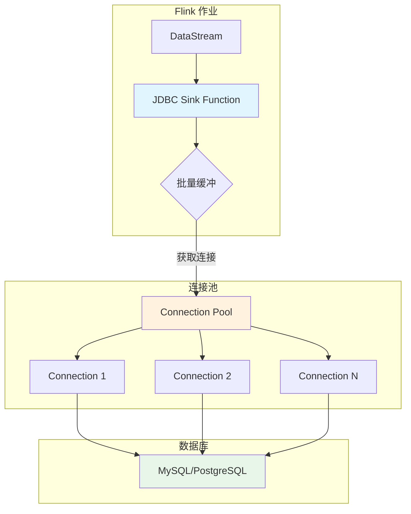
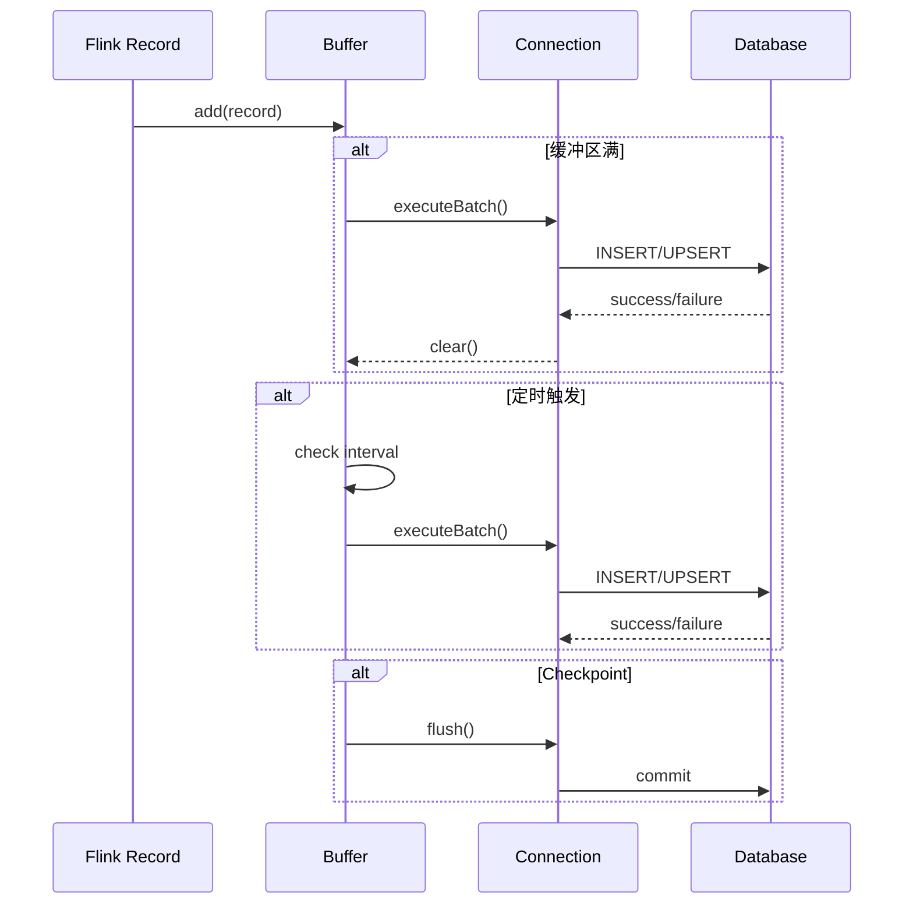
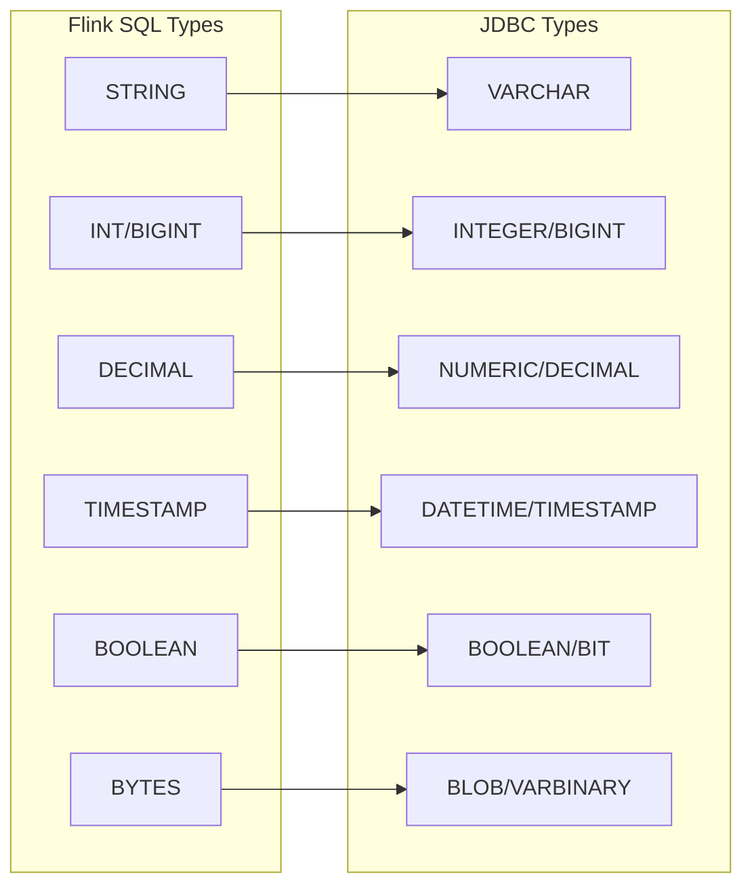

# JDBC Connector 详细指南

> 所属阶段: Flink | 前置依赖: [data-types-complete-reference.md](./data-types-complete-reference.md) | 形式化等级: L4

---

## 1. 概念定义 (Definitions)

### Def-F-JDBC-01: JDBC Source 定义

**定义**: JDBC Source 是通过 JDBC 协议从关系型数据库读取数据的连接器：

$$
\text{JDBCSource} = \langle C, Q, S, P, F \rangle
$$

其中：

- $C$: 数据库连接配置 $\langle url, user, pass, driver \rangle$
- $Q$: 查询语句 $\langle SELECT \dots FROM \dots WHERE \dots \rangle$
- $S$: 分片策略 $\{PKRange, PartitionColumn, None\}$
- $P$: 并行度配置 $\langle min, max \rangle$
- $F$: 获取大小（Fetch Size）

**读取模式**：

| 模式 | 描述 | 适用场景 |
|------|------|----------|
| **批处理** | 一次性读取完整结果集 | 离线分析、全量同步 |
| **增量 CDC** | 基于变更捕获的流式读取 | 实时同步 |
| **分区并行** | 按主键范围分片并行读取 | 大表读取 |

### Def-F-JDBC-02: JDBC Sink 定义

**定义**: JDBC Sink 是将流数据写入关系型数据库的连接器：

$$
\text{JDBCSink} = \langle C, T, W, B, E \rangle
$$

其中：

- $C$: 数据库连接配置
- $T$: 目标表
- $W$: 写入模式 $\{INSERT, REPLACE, UPDATE, UPSERT\}$
- $B$: 批量配置 $\langle batchSize, batchInterval, maxRetries \rangle$
- $E$: Exactly-Once 配置（可选 XA 事务）

**写入模式语义**：

| 模式 | SQL 语义 | 幂等性 |
|------|----------|--------|
| INSERT | `INSERT INTO` | ❌ 否 |
| REPLACE | `REPLACE INTO` / `MERGE` | ✅ 是（有主键） |
| UPDATE | `UPDATE ... WHERE` | ✅ 是 |
| UPSERT | `INSERT ... ON CONFLICT UPDATE` | ✅ 是 |

### Def-F-JDBC-03: 连接池模型

**定义**: JDBC 连接器内部维护的连接池：

$$
\text{ConnectionPool} = \langle N_{min}, N_{max}, T_{idle}, T_{wait}, Q \rangle
$$

其中：

- $N_{min}$: 最小连接数
- $N_{max}$: 最大连接数
- $T_{idle}$: 连接空闲超时
- $T_{wait}$: 获取连接等待超时
- $Q$: 连接队列

---

## 2. 属性推导 (Properties)

### Lemma-F-JDBC-01: 批量写入吞吐量边界

**引理**: JDBC Sink 的最大吞吐量受以下因素约束：

$$
T_{max} = \min\left( \frac{B_{size}}{B_{interval}}, \frac{C_{pool} \times R_{db}}{L_{network}} \right)
$$

其中：

- $B_{size}$: 批量大小
- $B_{interval}$: 批量间隔
- $C_{pool}$: 连接池大小
- $R_{db}$: 数据库写入速率
- $L_{network}$: 网络延迟

### Lemma-F-JDBC-02: 连接池无死锁

**引理**: 当 $N_{max} \geq P_{parallelism}$ 时，连接池不会发生死锁。

**证明**：

1. 每个并行子任务最多需要一个连接
2. 最大并发需求 = 并行度 $P$
3. 若 $N_{max} \geq P$，则总有可用连接
4. 无循环等待，满足死锁避免条件

### Prop-F-JDBC-01: 幂等写入条件

**命题**: 在以下条件下，JDBC Sink 可实现 Exactly-Once 语义：

1. **主键存在**: 目标表有唯一主键约束
2. **幂等语句**: 使用 UPSERT/REPLACE 语义
3. **事务支持**: 数据库支持 XA 事务（可选）

---

## 3. 关系建立 (Relations)

### 3.1 与 DataStream API 关系

```
DataStream API
    ↓
JDBC Sink Function
    ↓
JDBC Driver
    ↓
Database Server
```

### 3.2 与 Table API 关系


### 3.3 数据库方言映射

| 功能 | MySQL | PostgreSQL | Oracle | SQL Server |
|------|-------|------------|--------|------------|
| UPSERT | `INSERT ... ON DUPLICATE KEY UPDATE` | `INSERT ... ON CONFLICT UPDATE` | `MERGE INTO` | `MERGE INTO` |
| 分页 | `LIMIT n OFFSET m` | `LIMIT n OFFSET m` | `ROWNUM` / `OFFSET FETCH` | `OFFSET m ROWS FETCH NEXT n ROWS ONLY` |
| 类型映射 | `VARCHAR` | `VARCHAR` | `VARCHAR2` | `VARCHAR` |

---

## 4. 论证过程 (Argumentation)

### 4.1 分区读取策略选择

**策略对比**：

| 策略 | 优点 | 缺点 | 适用场景 |
|------|------|------|----------|
| 主键范围 | 均匀分布，无数据倾斜 | 要求主键是数值/可排序 | 大表全量读取 |
| 分区列 | 利用数据库分区 | 需要预定义分区列 | 已分区表 |
| 无分区 | 简单，无需额外配置 | 单线程，性能受限 | 小表读取 |

### 4.2 XA 事务 vs 幂等写入

| 特性 | XA 事务 | 幂等写入 |
|------|---------|----------|
| 一致性 | 强一致性 | 最终一致性 |
| 性能 | 较低（两阶段提交） | 较高 |
| 数据库要求 | 需支持 XA | 需支持 UPSERT |
| 复杂度 | 高 | 低 |
| 推荐场景 | 金融交易 | 日志同步 |

---

## 5. 形式证明 / 工程论证 (Proof / Engineering Argument)

### Thm-F-JDBC-01: Exactly-Once 正确性

**定理**: 在启用 XA 事务且数据库支持 XA 的条件下，JDBC Sink 提供 Exactly-Once 语义。

**证明概要**：

1. **预提交**: Checkpoint 时，Sink 执行 XA prepare
2. **协调**: JobManager 收集所有算子的 prepare 确认
3. **提交**: Checkpoint 完成时，协调提交所有 XA 事务
4. **回滚**: Checkpoint 失败时，回滚所有 prepared 事务

### Thm-F-JDBC-02: 批量写入原子性

**定理**: 单个批量内的写入操作要么全部成功，要么全部失败。

**证明**：

- 批量操作封装在单个数据库事务中
- 数据库事务满足 ACID 原子性
- 因此批量操作具有原子性

---

## 6. 实例验证 (Examples)

### 6.1 Maven 依赖

```xml
<dependency>
    <groupId>org.apache.flink</groupId>
    <artifactId>flink-connector-jdbc</artifactId>
    <version>3.1.2-1.17</version>
</dependency>

<!-- MySQL 驱动 -->
<dependency>
    <groupId>mysql</groupId>
    <artifactId>mysql-connector-java</artifactId>
    <version>8.0.33</version>
</dependency>

<!-- PostgreSQL 驱动 -->
<dependency>
    <groupId>org.postgresql</groupId>
    <artifactId>postgresql</artifactId>
    <version>42.6.0</version>
</dependency>
```

### 6.2 DataStream API 示例

```java
// [伪代码片段 - 不可直接运行] 仅展示核心逻辑
import org.apache.flink.connector.jdbc.JdbcConnectionOptions;
import org.apache.flink.connector.jdbc.JdbcExecutionOptions;
import org.apache.flink.connector.jdbc.JdbcSink;
import org.apache.flink.connector.jdbc.JdbcStatementBuilder;

import org.apache.flink.streaming.api.datastream.DataStream;


// JDBC Sink 配置
DataStream<Order> orderStream = ...;

orderStream.addSink(JdbcSink.sink(
    "INSERT INTO orders (id, user_id, amount, create_time) VALUES (?, ?, ?, ?) " +
    "ON CONFLICT (id) DO UPDATE SET amount = EXCLUDED.amount",
    (JdbcStatementBuilder<Order>) (ps, order) -> {
        ps.setLong(1, order.getId());
        ps.setLong(2, order.getUserId());
        ps.setBigDecimal(3, order.getAmount());
        ps.setTimestamp(4, Timestamp.from(order.getCreateTime()));
    },
    JdbcExecutionOptions.builder()
        .withBatchSize(1000)
        .withBatchIntervalMs(200)
        .withMaxRetries(3)
        .build(),
    new JdbcConnectionOptions.JdbcConnectionOptionsBuilder()
        .withUrl("jdbc:postgresql://localhost:5432/mydb")
        .withDriverName("org.postgresql.Driver")
        .withUsername("user")
        .withPassword("password")
        .build()
));
```

### 6.3 Table API / SQL 示例

```sql
-- 创建 JDBC 表
CREATE TABLE products (
    id BIGINT PRIMARY KEY,
    name STRING,
    price DECIMAL(10, 2),
    update_time TIMESTAMP
) WITH (
    'connector' = 'jdbc',
    'url' = 'jdbc:mysql://localhost:3306/mydb',
    'table-name' = 'products',
    'username' = 'user',
    'password' = 'password',
    'driver' = 'com.mysql.cj.jdbc.Driver',
    -- 批量配置
    'sink.buffer-flush.max-rows' = '1000',
    'sink.buffer-flush.interval' = '1s',
    'sink.max-retries' = '3'
);

-- 从 Kafka 读取并写入 JDBC
INSERT INTO products
SELECT
    id,
    name,
    price,
    CURRENT_TIMESTAMP AS update_time
FROM kafka_source;
```

### 6.4 JDBC Source 示例

```java
// [伪代码片段 - 不可直接运行] 仅展示核心逻辑
import org.apache.flink.connector.jdbc.JdbcInputFormat;
import org.apache.flink.api.common.typeinfo.BasicTypeInfo;
import org.apache.flink.api.java.DataSet;
import org.apache.flink.api.java.ExecutionEnvironment;

DataSet<Row> dbData = env.createInput(
    JdbcInputFormat.buildJdbcInputFormat()
        .setDrivername("com.mysql.cj.jdbc.Driver")
        .setDBUrl("jdbc:mysql://localhost/mydb")
        .setUsername("user")
        .setPassword("password")
        .setQuery("SELECT id, name, price FROM products WHERE price > ?")
        .setRowTypeInfo(new RowTypeInfo(
            BasicTypeInfo.LONG_TYPE_INFO,
            BasicTypeInfo.STRING_TYPE_INFO,
            BasicTypeInfo.BIG_DEC_TYPE_INFO
        ))
        .setParametersProvider(new Serializable[][]{
            new Serializable[]{new BigDecimal("100.00")}
        })
        .finish()
);
```

---

## 7. 可视化 (Visualizations)

### 7.1 JDBC Connector 架构图



### 7.2 批量写入流程



### 7.3 数据类型映射矩阵



---

## 8. 引用参考 (References)
