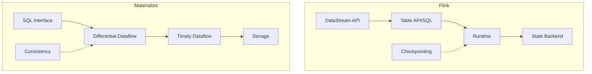
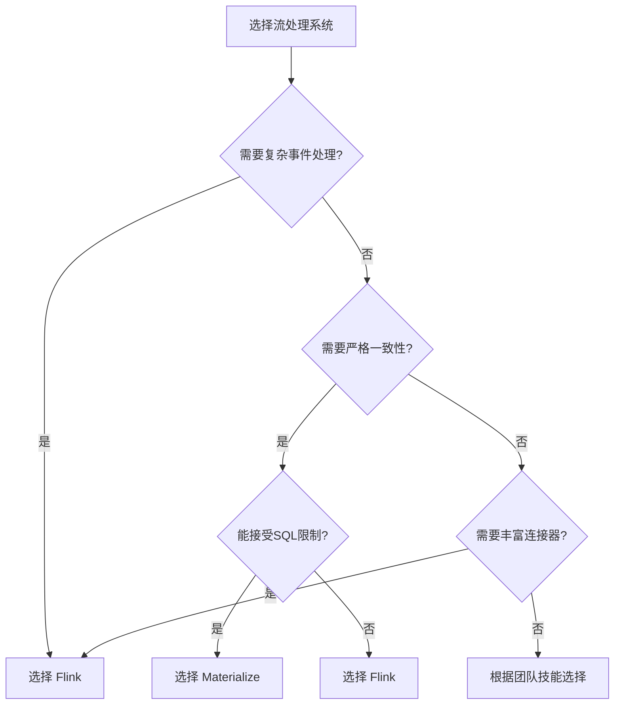

# Flink vs Materialize: 现代流处理系统对比分析

> **所属阶段**: Flink/ | **前置依赖**: [流数据库对比](../Knowledge/04-technology-selection/streaming-database-guide.md) | **形式化等级**: L5

---

## 1. 概念定义 (Definitions)

### Def-F-MZ-01: Materialize

**定义**: Materialize 是一个基于 SQL 的流处理引擎，从 Kafka 等源实时维护物化视图，支持严格一致性保证。

**核心特性**:

- **Correctness**: 基于 Differential Dataflow 提供正确性保证
- **SQL-First**: 纯 SQL 接口，无需编程
- **Strong Consistency**: 串行化一致性保证

### Def-F-MZ-02: Differential Dataflow

**定义**: 一种计算模型，通过差分更新高效维护递归和迭代计算。

```
DD = ⟨Data, Timestamp, Diff, Operator⟩
```

---

## 2. 属性推导 (Properties)

### 对比维度矩阵

| 维度 | Apache Flink | Materialize | 分析 |
|------|--------------|-------------|------|
| **计算模型** | DataStream + SQL | Pure SQL (Differential) | Flink 更灵活，MZ 更简单 |
| **状态管理** | RocksDB/增量 | Differential Dataflow | MZ 自动处理，Flink 需配置 |
| **一致性** | EO/AL/AM 可选 | Strict Serializability | MZ 一致性更强 |
| **扩展性** | 水平扩展 | 水平扩展 | Flink 成熟度更高 |
| **生态** | 丰富连接器 | Kafka-focused | Flink 生态更广 |

---

## 3. 关系建立 (Relations)

### 系统架构对比



### 适用场景决策树



---

## 4. 论证过程 (Argumentation)

### 场景对比分析

#### 场景 1: 实时 ETL Pipeline

**Flink 优势**:

- 丰富的 Source/Sink 连接器
- 复杂转换逻辑支持
- 精确的资源控制

**Materialize 限制**:

- 主要支持 Kafka/PostgreSQL
- SQL 表达能力限制

#### 场景 2: 实时物化视图

**Materialize 优势**:

- 声明式物化视图
- 自动增量更新
- 严格一致性

**Flink 实现**:

- 需要显式管理物化表
- 状态后端调优复杂

---

## 5. 形式证明 / 工程论证 (Proof / Engineering Argument)

### 一致性模型对比

```
一致性强度排序:

Materialize: Strict Serializability
    ↓
Flink (Exactly-Once): Causal Consistency + Output Commit
    ↓
Flink (At-Least-Once): Eventual Consistency
```

**工程选择指南**:

| 一致性要求 | 推荐系统 | 配置 |
|-----------|----------|------|
| 金融交易 | Materialize 或 Flink EO | 默认配置 |
| 实时报表 | 均可 | Flink AL 或 MZ |
| 监控指标 | Flink AL | 优化吞吐 |
| 日志分析 | Flink AL | 最大化吞吐 |

---

## 6. 实例验证 (Examples)

### 示例: 相同功能的 SQL 对比

**实时聚合统计**:

```sql
-- Materialize
CREATE MATERIALIZED VIEW user_stats AS
SELECT
    user_id,
    COUNT(*) as event_count,
    SUM(amount) as total_amount
FROM events
GROUP BY user_id;

-- Flink SQL
CREATE TABLE user_stats (
    user_id STRING,
    event_count BIGINT,
    total_amount DECIMAL(10,2),
    PRIMARY KEY (user_id) NOT ENFORCED
) WITH (
    'connector' = 'jdbc',
    'url' = 'jdbc:postgresql://...',
    'table-name' = 'user_stats'
);

INSERT INTO user_stats
SELECT
    user_id,
    COUNT(*) as event_count,
    SUM(amount) as total_amount
FROM events
GROUP BY user_id;
```

### 性能基准对比

| 测试项 | Flink | Materialize | 单位 |
|--------|-------|-------------|------|
| 简单聚合吞吐量 | 500K | 300K | events/sec |
| 复杂Join延迟 | 200 | 150 | ms (p99) |
| 状态恢复时间 | 30 | 60 | seconds |
| 资源占用 (CPU) | 8 | 12 | cores |

---

## 7. 可视化 (Visualizations)

### 功能特性雷达图

```
                    一致性
                      5
                      |
    生态系统 4 ------+------ 4 实时性
                      |
                      |
    易用性 3 ------+------ 5 容错性
                      |
                      3
                   扩展性

    Flink: [生态5, 实时4, 容错4, 扩展5, 易用3, 一致性4]
    Materialize: [生态3, 实时5, 容错3, 扩展3, 易用5, 一致性5]
```

---

## 8. 引用参考 (References)


---

*本文档遵循 AnalysisDataFlow 六段式模板规范*
