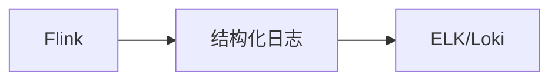

# 日志系统演进 特性跟踪

> 所属阶段: Flink/observability/evolution | 前置依赖: [Logging][^1] | 形式化等级: L3

## 1. 概念定义 (Definitions)

### Def-F-Logging-01: Structured Logging
结构化日志：
$$
\text{Log} = \{ \text{timestamp}, \text{level}, \text{message}, \text{context} \}
$$

## 2. 属性推导 (Properties)

### Prop-F-Logging-01: Log Level Control
日志级别控制：
$$
\text{Level}_{\text{runtime}} \neq \text{Level}_{\text{startup}}
$$

## 3. 关系建立 (Relations)

### 日志演进

| 版本 | 特性 | 状态 |
|------|------|------|
| 2.4 | JSON格式 | GA |
| 2.5 | 动态级别 | GA |
| 3.0 | 统一日志 | 设计中 |

## 4. 论证过程 (Argumentation)

### 4.1 日志格式

| 格式 | 用途 |
|------|------|
| 文本 | 开发 |
| JSON | 生产 |
| 二进制 | 高性能 |

## 5. 形式证明 / 工程论证

### 5.1 JSON日志配置

```xml
<encoder class="net.logstash.logback.encoder.LogstashEncoder"/>
```

## 6. 实例验证 (Examples)

### 6.1 结构化日志

```java
LOG.info("Processing event", 
    keyValue("eventId", event.getId()),
    keyValue("timestamp", event.getTime()));
```

## 7. 可视化 (Visualizations)



## 8. 引用参考 (References)

[^1]: Flink Logging Documentation

---

## 跟踪信息

| 属性 | 值 |
|------|-----|
| 版本 | 2.4-3.0 |
| 当前状态 | 演进中 |
