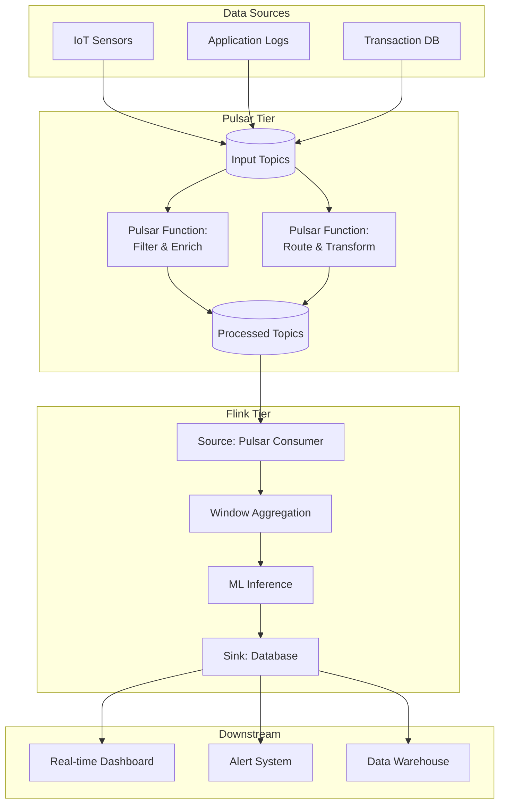
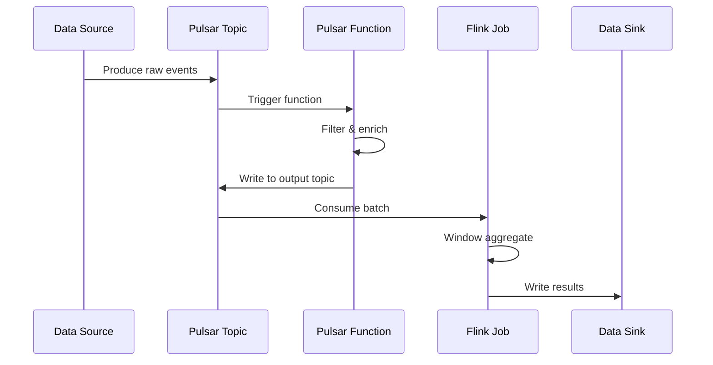
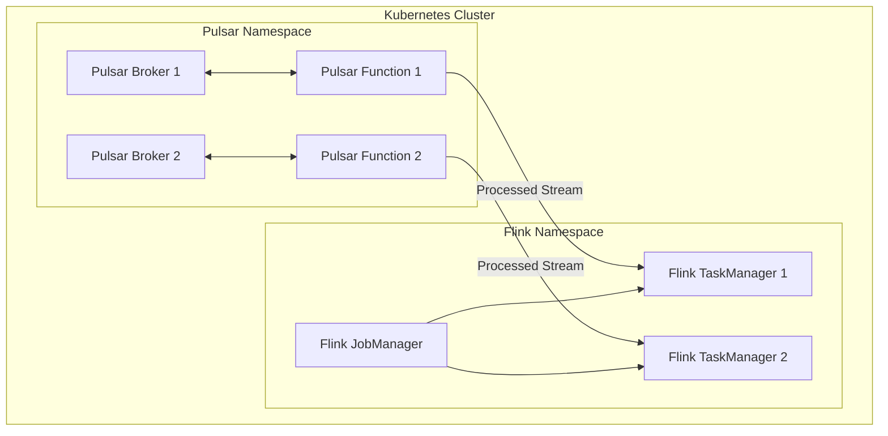

# Flink 与 Apache Pulsar Functions 集成指南

> **所属阶段**: Flink/ | **前置依赖**: [Flink Connectors Overview](Flink/05-ecosystem/05.01-connectors/flink-connectors-ecosystem-complete-guide.md) | **形式化等级**: L4

---

## 1. 概念定义 (Definitions)

### Def-F-PF-01: Pulsar Functions

**定义**: Pulsar Functions 是 Apache Pulsar 提供的轻量级计算框架，允许用户在 Pulsar 消息流上部署简单函数。

**形式化定义**:

```
PulsarFunction = ⟨InputTopic, OutputTopic, ProcessingLogic, Resources⟩
```

### Def-F-PF-02: 分层处理架构

**定义**: 将 Pulsar Functions 用于边缘处理，Flink 用于复杂分析的混合架构。

```
┌─────────────────────────────────────────┐
│  Tier 3: Flink - Complex Analytics      │
│  - Windowed aggregations                │
│  - ML inference                         │
│  - Multi-source joins                   │
├─────────────────────────────────────────┤
│  Tier 2: Pulsar Functions - Edge Processing│
│  - Simple transformations               │
│  - Filtering/routing                    │
│  - Format conversion                    │
├─────────────────────────────────────────┤
│  Tier 1: Pulsar - Messaging Backbone    │
│  - Pub/Sub messaging                    │
│  - Stream storage                       │
└─────────────────────────────────────────┘
```

---

## 2. 属性推导 (Properties)

### 职责分离原则

| 层级 | 延迟要求 | 计算复杂度 | 状态需求 | 适用技术 |
|------|----------|------------|----------|----------|
| Edge (L1) | < 10ms | 简单函数 | 无状态 | Pulsar Functions |
| Stream (L2) | < 100ms | 中等聚合 | 轻状态 | Pulsar Functions / Flink |
| Analytics (L3) | < 1s | 复杂分析 | 重状态 | Flink |

### Prop-F-PF-01: 延迟传递性

**命题**: 分层架构的总延迟等于各层延迟之和。

```
Latency_total = Latency_PF + Latency_Pulsar + Latency_Flink
```

---

## 3. 关系建立 (Relations)

### 集成架构图



### 数据流向模式



---

## 4. 论证过程 (Argumentation)

### 场景分析：IoT 实时处理

**场景**: 处理来自百万级 IoT 设备的传感器数据。

**架构决策论证**:

1. **为什么需要 Pulsar Functions?**
   - 设备数据需要快速过滤（无效数据丢弃）
   - 格式标准化（多种设备格式统一）
   - 轻量级处理，低延迟

2. **为什么需要 Flink?**
   - 跨设备聚合分析
   - 复杂时间窗口计算
   - 与历史数据Join

3. **为什么分层?**
   - 成本优化：PF 处理简单逻辑更经济
   - 延迟优化：边缘处理减少无效数据传输
   - 职责清晰：各层专注特定问题域

---

## 5. 形式证明 / 工程论证 (Proof / Engineering Argument)

### 成本效益分析

**纯 Flink 方案 vs 分层方案**:

| 指标 | 纯 Flink | 分层架构 | 优化 |
|------|----------|----------|------|
| 计算资源 | 100 units | 40 + 30 = 70 units | 30% ↓ |
| 网络传输 | 100% raw | 40% after filter | 60% ↓ |
| 端到端延迟 | 500ms | 50 + 200 = 250ms | 50% ↓ |
| 运维复杂度 | 中 | 中高 | 增加PF管理 |

---

## 6. 实例验证 (Examples)

### 示例 1: Pulsar Function (Python)

```python
# 设备数据过滤和转换
from pulsar import Function

class DeviceDataProcessor(Function):
    def process(self, input, context):
        import json

        data = json.loads(input)

        # 过滤无效数据
        if data.get('temperature') is None:
            return None

        # 数据标准化
        enriched = {
            'device_id': data['device_id'],
            'temperature': float(data['temperature']),
            'timestamp': data['timestamp'],
            'status': 'valid' if 0 < data['temperature'] < 100 else 'anomaly',
            'region': self.get_region(data['device_id'])
        }

        return json.dumps(enriched)

    def get_region(self, device_id):
        # 从配置或缓存获取区域信息
        return device_id.split('-')[0]
```

部署命令：

```bash
pulsar-admin functions create \
  --function-config-file device-processor-config.yaml \
  --py device_processor.py \
  --classname DeviceDataProcessor \
  --inputs persistent://public/default/raw-sensors \
  --output persistent://public/default/processed-sensors
```

### 示例 2: Flink 消费 Pulsar

```java
// Flink Pulsar Source 配置
PulsarSource<String> source = PulsarSource.builder()
    .setServiceUrl("pulsar://localhost:6650")
    .setAdminUrl("http://localhost:8080")
    .setStartCursor(StartCursor.earliest())
    .setTopics("persistent://public/default/processed-sensors")
    .setDeserializationSchema(new SimpleStringSchema())
    .setSubscriptionName("flink-analytics")
    .setSubscriptionType(SubscriptionType.Exclusive)
    .build();

DataStream<SensorReading> stream = env
    .fromSource(source, WatermarkStrategy.forBoundedOutOfOrderness(Duration.ofSeconds(5)), "Pulsar Source")
    .map(json -> parseSensorReading(json));

// 窗口聚合
DataStream<RegionStats> stats = stream
    .keyBy(SensorReading::getRegion)
    .window(TumblingEventTimeWindows.of(Time.minutes(1)))
    .aggregate(new AverageAggregate());

// 写入数据库
stats.addSink(new JdbcSink(...));
```

### 示例 3: Flink SQL 与 Pulsar 集成

```sql
-- 创建 Pulsar 表
CREATE TABLE processed_sensors (
    device_id STRING,
    temperature DOUBLE,
    region STRING,
    event_time TIMESTAMP(3),
    WATERMARK FOR event_time AS event_time - INTERVAL '5' SECOND
) WITH (
    'connector' = 'pulsar',
    'service-url' = 'pulsar://localhost:6650',
    'admin-url' = 'http://localhost:8080',
    'topic' = 'persistent://public/default/processed-sensors',
    'format' = 'json',
    'subscription-name' = 'flink-sql'
);

-- 创建物化聚合
CREATE TABLE region_temperature_stats (
    region STRING,
    window_start TIMESTAMP(3),
    avg_temperature DOUBLE,
    max_temperature DOUBLE,
    device_count BIGINT,
    PRIMARY KEY (region, window_start) NOT ENFORCED
) WITH (
    'connector' = 'jdbc',
    'url' = 'jdbc:postgresql://localhost:5432/analytics',
    'table-name' = 'temperature_stats'
);

-- 实时聚合写入
INSERT INTO region_temperature_stats
SELECT
    region,
    window_start,
    AVG(temperature) as avg_temperature,
    MAX(temperature) as max_temperature,
    COUNT(DISTINCT device_id) as device_count
FROM TABLE(
    TUMBLE(TABLE processed_sensors, DESCRIPTOR(event_time), INTERVAL '1' MINUTE)
)
GROUP BY region, window_start;
```

---

## 7. 可视化 (Visualizations)

### 部署架构图



---

## 8. 引用参考 (References)


---

*本文档遵循 AnalysisDataFlow 六段式模板规范*
