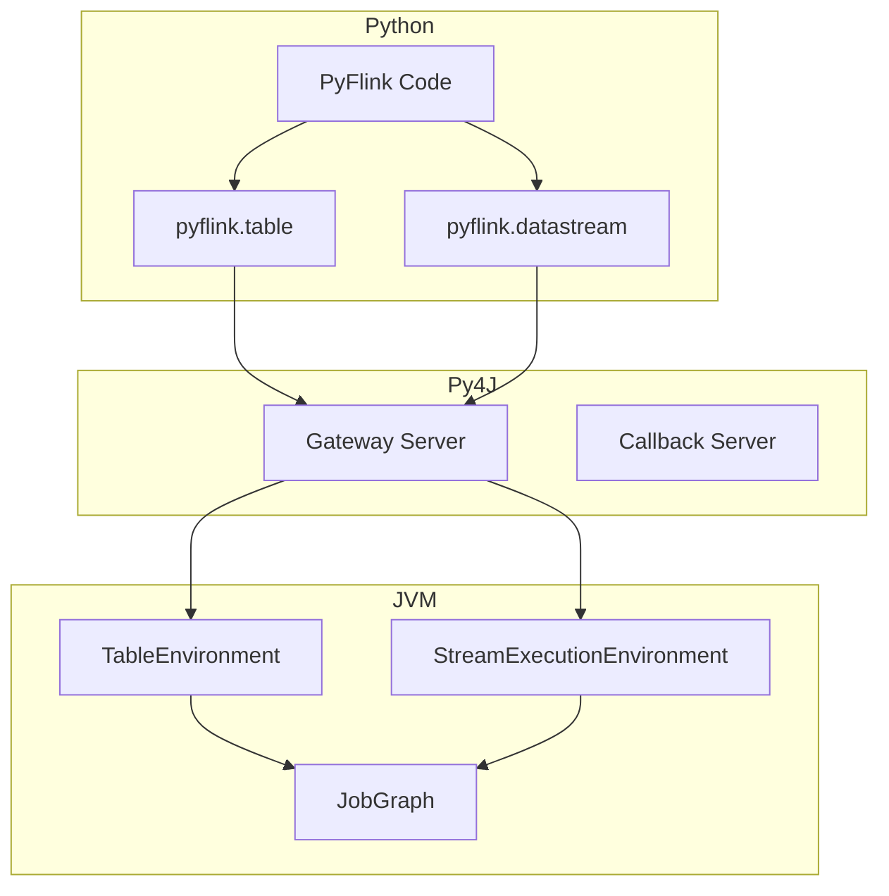
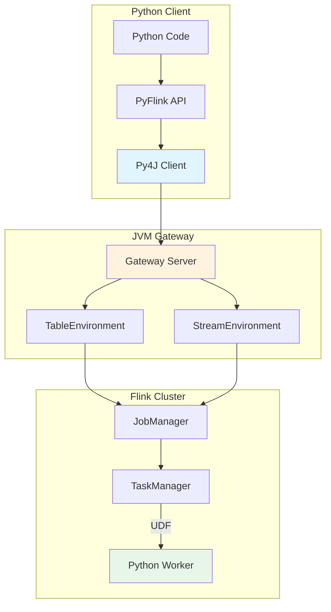
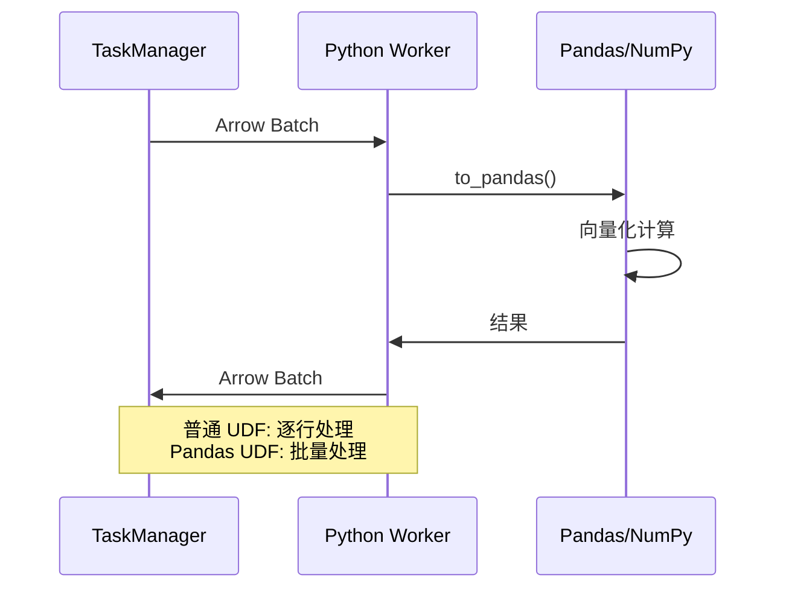
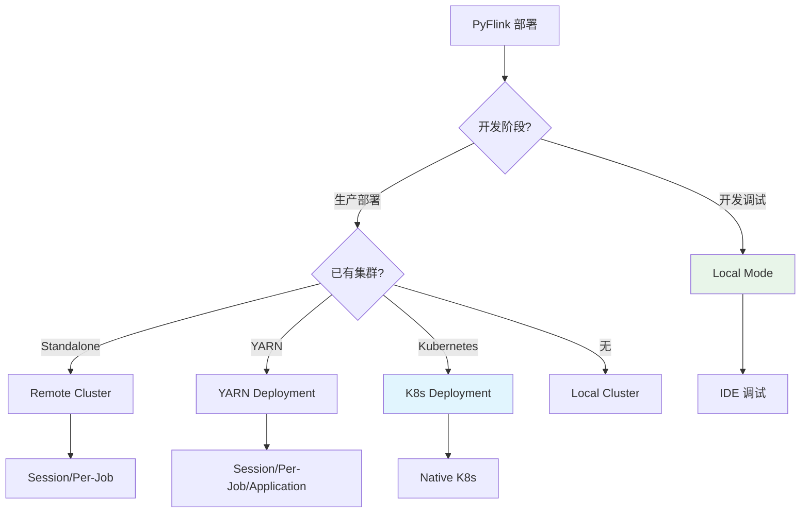

# PyFlink 深度指南

> 所属阶段: Flink | 前置依赖: [data-types-complete-reference.md](./data-types-complete-reference.md) | 形式化等级: L3

---

## 1. 概念定义 (Definitions)

### Def-F-PyFlink-01: PyFlink 架构

**定义**: PyFlink 是 Apache Flink 的 Python API，通过 Py4J 桥接实现 Python 与 JVM 的通信：

$$
\text{PyFlink} = (Python\_API, Py4J\_Bridge, JVM\_Runtime, UDF\_Engine)
$$

**架构层次**：

```
┌─────────────────────────────────────┐
│         Python Application          │
│  (Table API / DataStream API / SQL) │
├─────────────────────────────────────┤
│           Py4J Bridge               │
│    (Python ←→ JVM Gateway)          │
├─────────────────────────────────────┤
│         Flink Runtime (JVM)         │
│  (JobManager / TaskManager)         │
├─────────────────────────────────────┤
│      Python UDF Execution           │
│  (Beam Portability / Process)       │
└─────────────────────────────────────┘
```

### Def-F-PyFlink-02: Python UDF 类型

**定义**: PyFlink 支持多种 UDF 类型，按计算位置分类：

| UDF 类型 | 执行位置 | 适用场景 | 性能 |
|---------|----------|----------|------|
| **ScalarFunction** | TaskManager | 逐行转换 | 中 |
| **TableFunction** | TaskManager | 1:N 展开 | 中 |
| **AggregateFunction** | TaskManager | 聚合计算 | 中 |
| **Pandas UDF** | Python Worker | 向量化计算 | 高 |

### Def-F-PyFlink-03: 执行环境

**定义**: PyFlink 执行环境配置：

$$
\mathcal{E}_{py} = (P_{ver}, F_{ver}, V_{env}, E_{mode})
$$

其中：

- $P_{ver}$: Python 版本 (3.9-3.12)
- $F_{ver}$: Flink 版本 (1.18+)
- $V_{env}$: 虚拟环境配置
- $E_{mode}$: 执行模式 $\{local, remote, yarn, k8s\}$

---

## 2. 属性推导 (Properties)

### Lemma-F-PyFlink-01: UDF 序列化开销

**引理**: Python UDF 相比 Java UDF 有额外的序列化开销：

$$
T_{py\_udf} = T_{java\_udf} + T_{serialization} + T_{py4j}
$$

其中：

- $T_{serialization}$: Python 对象与 Flink 行格式转换
- $T_{py4j}$: Py4J 桥接通信开销

**优化策略**：

- 使用 Pandas UDF 批量处理
- 启用对象重用
- 减少 UDF 调用次数

### Lemma-F-PyFlink-02: 依赖管理边界

**引理**: PyFlink 作业依赖需满足以下条件才能正确分发：

1. **Requirements 文件**: 列出所有 pip 依赖
2. **虚拟环境打包**: 或使用 `pyflink.shaded` 方式
3. **资源文件**: 通过 `add_python_file()` 添加

### Prop-F-PyFlink-01: Pandas UDF 性能优势

**命题**: Pandas UDF 在处理批量数据时性能显著优于普通 Python UDF。

**原因**：

1. 向量化计算（避免 Python 循环）
2. 批量序列化（减少 IPC 开销）
3. Arrow 内存格式（零拷贝）

---

## 3. 关系建立 (Relations)

### 3.1 PyFlink 与 Java Flink 关系



### 3.2 UDF 执行模式对比

| 特性 | Python UDF | Pandas UDF | Java UDF |
|------|------------|------------|----------|
| 语言 | Python | Python | Java/Scala |
| 执行方式 | 每行调用 | 批量调用 | JVM 内 |
| 性能 | 较低 | 较高 | 最高 |
| 生态 | Python 全生态 | Pandas/NumPy | Java 生态 |
| 调试 | 容易 | 容易 | 较复杂 |

### 3.3 部署模式映射

| PyFlink API | 部署目标 | 适用场景 |
|-------------|----------|----------|
| `TableEnvironment` | 本地/集群 | SQL/Table 作业 |
| `StreamExecutionEnvironment` | 本地/集群 | DataStream 作业 |
| `remote()` | 远程集群 | 已有集群提交 |
| Kubernetes | K8s | 云原生部署 |

---

## 4. 论证过程 (Argumentation)

### 4.1 PyFlink vs Java Flink 选择

| 维度 | PyFlink | Java Flink |
|------|---------|------------|
| 开发效率 | ⭐⭐⭐⭐⭐ | ⭐⭐⭐ |
| 运行时性能 | ⭐⭐⭐ | ⭐⭐⭐⭐⭐ |
| 生态集成 | Python ML | Java 生态 |
| 调试体验 | ⭐⭐⭐⭐⭐ | ⭐⭐⭐ |
| 生产稳定性 | ⭐⭐⭐⭐ | ⭐⭐⭐⭐⭐ |

**推荐场景**：

- **PyFlink**: ML 集成、快速原型、数据科学团队
- **Java Flink**: 生产核心链路、极致性能要求

### 4.2 UDF 类型选择决策

```
是否需要 Python ML 库?
    ├─ 否 → Java/Scala UDF（性能最优）
    └─ 是 → 数据量?
              ├─ 小 → 普通 Python UDF
              └─ 大 → Pandas UDF（向量化）
```

---

## 5. 形式证明 / 工程论证 (Proof / Engineering Argument)

### Thm-F-PyFlink-01: Pandas UDF 吞吐量

**定理**: 在批量大小为 $N$ 时，Pandas UDF 吞吐量为普通 Python UDF 的 $O(N)$ 倍。

**工程论证**：

1. **Python UDF**: 每行调用一次，$N$ 次函数调用开销
2. **Pandas UDF**: 每批调用一次，1 次函数调用开销
3. **向量化**: Pandas 操作使用底层 C 优化
4. **序列化**: Arrow 格式减少序列化开销

### Thm-F-PyFlink-02: 依赖一致性

**定理**: 使用 `requirements.txt` + `set_python_executable()` 可保证依赖一致性。

**证明**：

1. `requirements.txt` 锁定依赖版本
2. 虚拟环境打包确保环境隔离
3. 作业提交时分发到所有 TaskManager
4. 执行时使用指定 Python 解释器

---

## 6. 实例验证 (Examples)

### 6.1 环境安装

```bash
# 创建虚拟环境
python -m venv pyflink_env
source pyflink_env/bin/activate  # Windows: pyflink_env\Scripts\activate

# 安装 PyFlink
pip install apache-flink==1.20.0

# 验证安装
python -c "from pyflink.table import TableEnvironment; print('PyFlink installed')"
```

### 6.2 Table API 示例

```python
from pyflink.table import TableEnvironment, EnvironmentSettings
from pyflink.table.expressions import col

# 创建执行环境
env_settings = EnvironmentSettings.in_streaming_mode()
t_env = TableEnvironment.create(env_settings)

# 创建源表
t_env.execute_sql("""
    CREATE TABLE user_events (
        user_id STRING,
        event_type STRING,
        event_time TIMESTAMP(3),
        amount DOUBLE,
        WATERMARK FOR event_time AS event_time - INTERVAL '5' SECOND
    ) WITH (
        'connector' = 'kafka',
        'topic' = 'user-events',
        'properties.bootstrap.servers' = 'localhost:9092',
        'format' = 'json'
    )
""")

# 创建结果表
t_env.execute_sql("""
    CREATE TABLE event_stats (
        event_type STRING PRIMARY KEY NOT ENFORCED,
        total_amount DOUBLE,
        event_count BIGINT
    ) WITH (
        'connector' = 'jdbc',
        'url' = 'jdbc:mysql://localhost:3306/analytics',
        'table-name' = 'event_stats',
        'username' = 'user',
        'password' = 'password'
    )
""")

# 定义处理逻辑
result = t_env.from_path("user_events") \
    .group_by(col("event_type")) \
    .select(
        col("event_type"),
        col("amount").sum.alias("total_amount"),
        col("user_id").count.alias("event_count")
    )

# 写入结果
result.execute_insert("event_stats").wait()
```

### 6.3 Python UDF 示例

```python
from pyflink.table import DataTypes
from pyflink.table.udf import udf
import hashlib

# 标量 UDF
@udf(result_type=DataTypes.STRING())
def hash_user_id(user_id: str) -> str:
    """为用户 ID 生成哈希值"""
    return hashlib.md5(user_id.encode()).hexdigest()[:8]

# 注册 UDF
t_env.create_temporary_function("hash_user_id", hash_user_id)

# 使用 UDF
result = t_env.from_path("user_events") \
    .select(
        col("user_id"),
        call("hash_user_id", col("user_id")).alias("user_hash"),
        col("event_type")
    )

result.execute().print()
```

### 6.4 Pandas UDF 示例

```python
from pyflink.table import DataTypes
from pyflink.table.udf import udf
import pandas as pd
import numpy as np

# Pandas 标量 UDF（向量化）
@udf(result_type=DataTypes.DOUBLE(), func_type="pandas")
def normalize_amount(amount: pd.Series) -> pd.Series:
    """标准化金额（Z-score）"""
    mean = amount.mean()
    std = amount.std()
    return (amount - mean) / std

# Pandas 表 UDF（1:N 展开）
@udf(result_type=DataTypes.ROW([
    DataTypes.FIELD("quantile", DataTypes.STRING()),
    DataTypes.FIELD("value", DataTypes.DOUBLE())
]), func_type="pandas")
def calculate_quantiles(amount: pd.Series) -> pd.DataFrame:
    """计算分位数"""
    quantiles = [0.25, 0.5, 0.75, 0.95]
    values = [amount.quantile(q) for q in quantiles]
    return pd.DataFrame({
        "quantile": [f"p{int(q*100)}" for q in quantiles],
        "value": values
    })

# 注册并使用
t_env.create_temporary_function("normalize_amount", normalize_amount)

result = t_env.from_path("user_events") \
    .select(
        col("user_id"),
        col("amount"),
        call("normalize_amount", col("amount")).alias("norm_amount")
    )
```

### 6.5 DataStream API 示例

```python
from pyflink.datastream import StreamExecutionEnvironment
from pyflink.datastream.functions import MapFunction

# 创建环境
env = StreamExecutionEnvironment.get_execution_environment()

# 添加 Kafka 连接器
env.add_jars("file:///path/to/flink-connector-kafka.jar")

# 自定义 MapFunction
class ParseEvent(MapFunction):
    def map(self, value):
        import json
        event = json.loads(value)
        return (
            event['user_id'],
            event['event_type'],
            event['timestamp']
        )

# 构建流处理作业
dstream = env \
    .add_source(...) \
    .map(ParseEvent()) \
    .filter(lambda x: x[1] == 'purchase') \
    .key_by(lambda x: x[0]) \
    .reduce(lambda a, b: (a[0], a[1], a[2] + b[2]))

# 执行
env.execute("PyFlink DataStream Job")
```

### 6.6 依赖管理示例

```text
# requirements.txt
apache-flink==1.20.0
pandas==2.0.3
numpy==1.24.3
scikit-learn==1.3.0

# 作业提交时指定依赖
from pyflink.table import TableEnvironment

t_env = TableEnvironment.create(...)

# 添加 Python 文件
t_env.add_python_file("/path/to/my_udf.py")
t_env.add_python_file("/path/to/requirements.txt")

# 或使用 conda 环境
# t_env.set_python_executable("/path/to/conda/env/bin/python")
```

---

## 7. 可视化 (Visualizations)

### 7.1 PyFlink 架构图



### 7.2 UDF 执行流程



### 7.3 部署模式决策树



---

## 8. 引用参考 (References)
